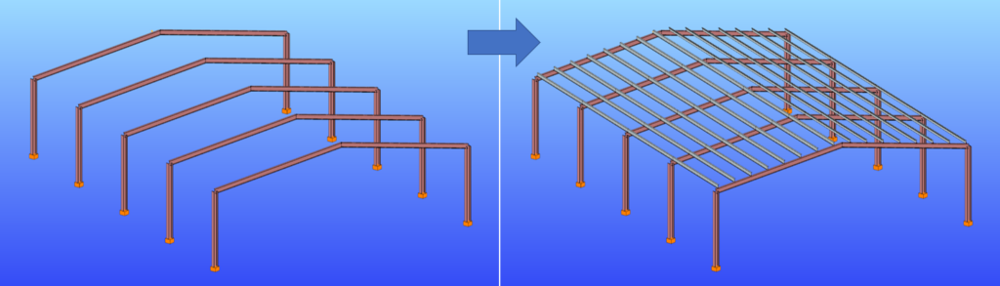
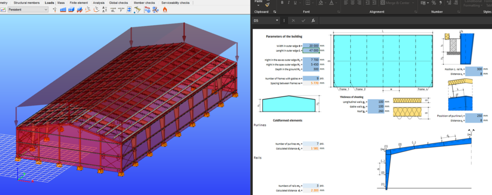
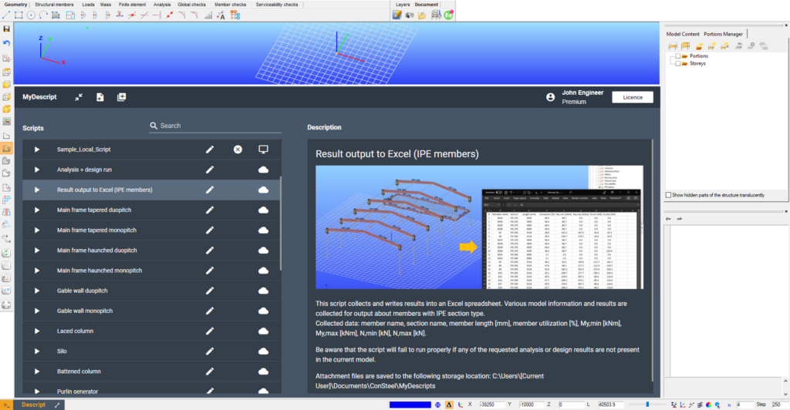

# What can Descript be used for?

<!-- /wp:heading -->

<!-- wp:paragraph -->

As most scripting languages, Descript can be used to perform a sequence of actions unattended within a software, which can be defined beforehand, thus saving time.  
Descript can be useful for parametric work, where certain parameters govern the creation or analysis of a model. Parameters in the script can be changed for different script runs in order to explore the range of possibilities, find an optimal solution, etc..

<!-- /wp:paragraph -->

<!-- wp:paragraph -->

Here are a few typical examples for the usage of Descript:

<!-- /wp:paragraph -->

<!-- wp:heading {"level":4} -->

## Structural parts

<!-- /wp:heading -->

<!-- wp:paragraph -->

While a particular structure might be unique, parts of it are frequently similar across different structures. This means that the certain structural part can be scripted and added to other models in one go.  
In this [example](https://consteelsoftware.com/script/purlin-generator/), purlins and their connection elements are added to the whole roof after setting a few initial input parameters.

<!-- /wp:paragraph -->

<!-- wp:gallery {"linkTo":"none"} -->

<!-- wp:image {"id":33173,"sizeSlug":"large","linkDestination":"none"} -->

<!-- /wp:image -->

<!-- /wp:gallery -->

<!-- wp:heading {"level":4} -->

## Entire structures

<!-- /wp:heading -->

<!-- wp:paragraph -->

In case of not too complex, regular structures, it might be useful to create a script that builds it all in one go.  
In this [example ](https://consteelsoftware.com/script/warehouse-creation-with-excel-control-type-1-tapered/)an entire warehouse building is created with a bracing system, purlins, supports and loads.

<!-- /wp:paragraph -->

<!-- wp:image {"id":33189,"sizeSlug":"large","linkDestination":"media"} -->

<!-- /wp:image -->

<!-- wp:heading {"level":4} -->

## Automated calculations, iteration

<!-- /wp:heading -->

<!-- wp:paragraph -->

Not only model building, but calculations and model modification can also be scripted. This way, iterative model modification based on results is also possible.  
In this [example ](https://consteelsoftware.com/script/section-optimization-shs/)section sizes are modified based on utilization results until all utilizations are below 100% with the smallest possible section size.

<!-- /wp:paragraph -->

<!-- wp:image {"linkDestination":"media"} -->

<!-- /wp:image -->

<!-- wp:heading {"level":4} -->

## [Script library](https://consteelsoftware.com/script/)

<!-- /wp:heading -->

<!-- wp:paragraph -->

For even more examples and scripts visit our [Script library](https://consteelsoftware.com/script/), or browse scripts from within Consteel's MyDescript interface, where you can try scripts right away:

<!-- /wp:paragraph -->

<!-- wp:image {"id":33198,"sizeSlug":"large","linkDestination":"media"} -->

<!-- /wp:image -->
