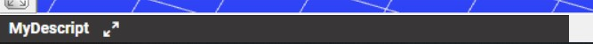

# Minimized size

After starting Consteel, the Descript panel appears on the bottom left part of the window in its minimized state.

Descript in Consteel 15

<!-- /wp:image -->

<!-- /wp:column -->

<!-- wp:column -->

<!-- wp:image {"id":44214,"sizeSlug":"full","linkDestination":"none"} -->

Descript in Consteel 16

<!-- /wp:image -->

<!-- /wp:column -->

<!-- /wp:columns -->

<!-- wp:paragraph -->

For any further action the Descript panel has to be opened up with this button: 