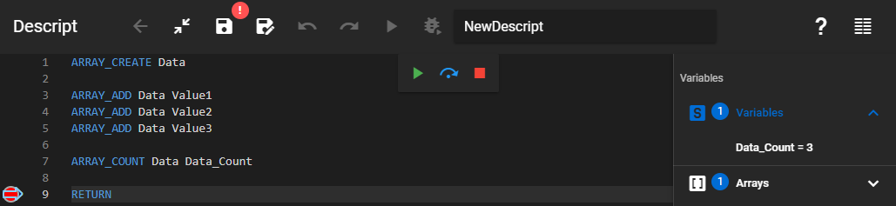

Counts the items in an array.

### Description

Counts how many items are stored in an array. The result of the counting will be saved in a variable.

### Syntax

**ARRAY_COUNT** [Array name] [Result variable]

### Command parameters

| **Command parameter**               | **Assignment** | **Value format** | **Input options** |
| ----------------------------------- | -------------- | ---------------- | ----------------- |
| [Array name](#array-name)           | Required       | String           | Local, variable   |
| [Result variable](#result-variable) | Required       | String           | Local, variable   |

#### Array name:
Name of the array.

#### Result variable:
Name of the variable that will store the result of the counting.

### Sample code

**Command only:**

```
ARRAY_COUNT Data Data_Count
```

**With added prerequisites:** (array creation and fill)

```
ARRAY_CREATE Data

ARRAY_ADD Data Value1
ARRAY_ADD Data Value2
ARRAY_ADD Data Value3

ARRAY_COUNT Data Data_Count
```

[](./img/Array_Count_v01.png)
