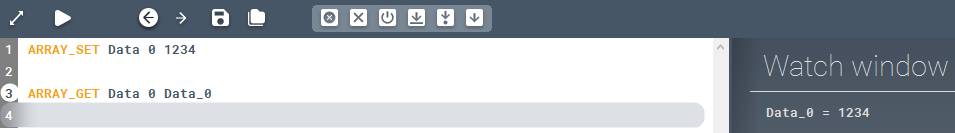

<!-- wp:paragraph -->

Gets the value of an item in an array.

<!-- /wp:paragraph -->

<!-- wp:heading {"level":3} -->

### Syntax

<!-- /wp:heading -->

<!-- wp:paragraph -->

**ARRAY_GET **

<!-- /wp:paragraph -->

<!-- wp:heading {"level":3} -->

### Command parameters

<!-- /wp:heading -->

<!-- wp:table {"className":"is-style-stripes"} -->

|                                       |                |                  |                   |
| ------------------------------------- | -------------- | ---------------- | ----------------- |
| **Command parameter**                 | **Assignment** | **Value format** | **Input options** |
| [Array name](#Array-name)             | Required       | String           | Local, variable   |
| [Item index](#Item-index)             | Required       | Integer          | Local, variable   |
| [Readout variable](#Readout-variable) | Required       | String           | Local, variable   |

<!-- /wp:table -->

<!-- wp:heading {"level":4} -->

#### Array name:

<!-- /wp:heading -->

<!-- wp:paragraph -->

Name of the array.

<!-- /wp:paragraph -->

<!-- wp:heading {"level":4} -->

#### Item index:

<!-- /wp:heading -->

<!-- wp:paragraph -->

Index number of the item to be retrieved. Indexing starts from 0, so the first item has the index number 0.

<!-- /wp:paragraph -->

<!-- wp:heading {"level":4} -->

#### Readout variable:

<!-- /wp:heading -->

<!-- wp:paragraph -->

Name of the variable that will store the retrieved value of the specified item from the array.

<!-- /wp:paragraph -->

<!-- wp:heading {"level":3} -->

### Description

<!-- /wp:heading -->

<!-- wp:paragraph -->

Gets the value of a specific item in an array. The retrieved item value will be stored in a variable with the given name. If the variable with the specified name does not exist yet, then it will be created.

<!-- /wp:paragraph -->

<!-- wp:heading {"level":3} -->

### Sample code:

<!-- /wp:heading -->

<!-- wp:heading {"level":4} -->

#### Command only:

<!-- /wp:heading -->

<!-- wp:loos-hcb/code-block -->

```
ARRAY_GET Data 0 Retrieved_Value
```

<!-- /wp:loos-hcb/code-block -->

<!-- wp:heading {"level":4} -->

#### With added prerequisites (array creation):

<!-- /wp:heading -->

<!-- wp:loos-hcb/code-block -->

```
ARRAY_SET Data 0 1234

ARRAY_GET Data 0 Data_0
```

<!-- /wp:loos-hcb/code-block -->

<!-- wp:paragraph -->

In this example first the array "Data" was created and the value of its first item (index=0) was set to 1234. After that the value of the item that has the index 0 in the array named "Data" was saved in a new variable named "Data_0" with the ARRAY_GET command. While running this code in debug mode we can check the value of the "Data_0" variable after the execution of the ARRAY_GET command, which is the value 1234, that we set previously.

<!-- /wp:paragraph -->

<!-- wp:image {"id":23428,"sizeSlug":"full","linkDestination":"none"} -->



<!-- /wp:image -->
