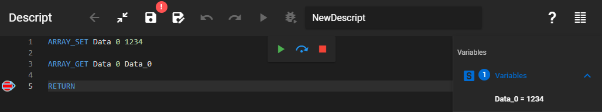

Gets the value of an item in an array.

### Description

Gets the value of a specific item in an array. The retrieved item value will be stored in a variable with the given name. If the variable with the specified name does not exist yet, then it will be created.

### Syntax

**ARRAY_GET** [Array name] [Item index] [Readout variable]

### Command parameters

| **Command parameter**                 | **Assignment** | **Value format** | **Input options** |
| ------------------------------------- | -------------- | ---------------- | ----------------- |
| [Array name](#array-name)             | Required       | String           | Local, variable   |
| [Item index](#item-index)             | Required       | Integer          | Local, variable   |
| [Readout variable](#readout-variable) | Required       | String           | Local, variable   |

#### Array name:
Name of the array.

#### Item index:
Index number of the item to be retrieved. Indexing starts from 0, so the first item has the index number 0.

#### Readout variable:
Name of the variable that will store the retrieved value of the specified item from the array.

### Sample code

**Command only:**

```
ARRAY_GET Data 0 Retrieved_Value
```

**With added prerequisites:** (array creation)

```
ARRAY_SET Data 0 1234

ARRAY_GET Data 0 Data_0
```

In this example first the array "Data" was created and the value of its first item (index=0) was set to 1234. After that the value of the item that has the index 0 in the array named "Data" was saved in a new variable named "Data_0" with the ARRAY_GET command. While running this code in debug mode we can check the value of the "Data_0" variable after the execution of the ARRAY_GET command, which is the value 1234, that we set previously.

[](./img/Array_Get_v01.png)

