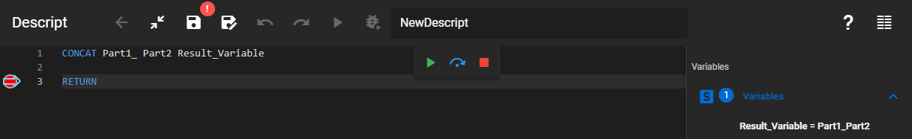
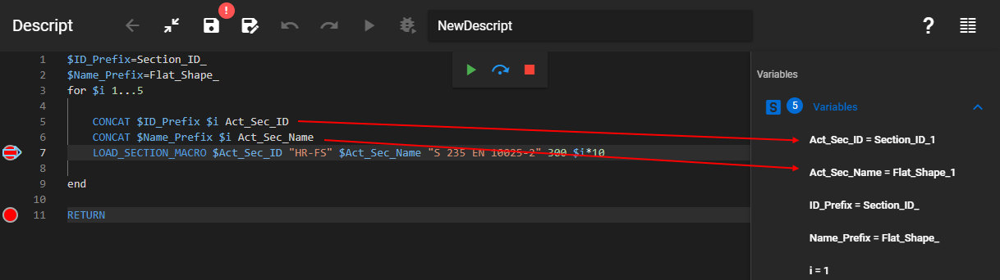

Assigns a new value to a variable by combining 2 values.

### Description

Concatenates 2 values. In other words, combines the 2 values into a new value by putting them one after the other. The result value will be assigned to the result variable with the given name.

### Syntax

**CONCAT** [Part 1] [Part 2] [Result variable]

### Command parameters

| **Command parameter**               | **Assignment** | **Value format**       | **Input options** |
| ----------------------------------- | -------------- | ---------------------- | ----------------- |
| [Part 1](#part-1)                   | Required       | String, integer, float | Local, variable   |
| [Part 2](#part-2)                   | Required       | String, integer, float | Local, variable   |
| [Result variable](#result-variable) | Required       | String                 | Local, variable   |

#### Part 1:
First part of the result value.

#### Part 2:
Second part of the result value.

#### Result variable:
Name of the result variable.

### Sample code

**Command only:**

```
CONCAT Part1_ Part2 Result_Variable
```

[](./img/Concat_Fig_01_v01.png)

**Example:**

```
$ID_Prefix=Section_ID_
$Name_Prefix=Flat_Shape_
for $i 1...5

    CONCAT $ID_Prefix $i Act_Sec_ID
    CONCAT $Name_Prefix $i Act_Sec_Name
    LOAD_SECTION_MACRO $Act_Sec_ID "HR-FS" $Act_Sec_Name "S 235 EN 10025-2" 300 $i*10

end
```

This example utilizes the CONCAT command to create unique IDs and names for 5 similar macro sections that are loaded in with a for cycle.

[](./img/Concat_Fig_02_v01.png)

The result of this example in the section list looks like this:

[](./img/wp-content-uploads-2021-08-image-46.png)
