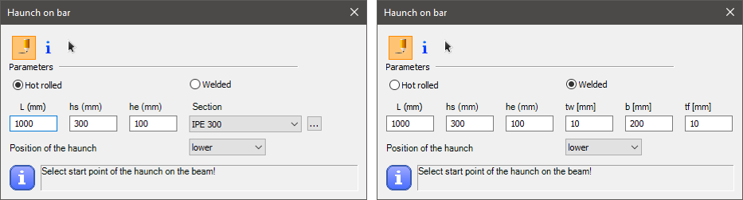
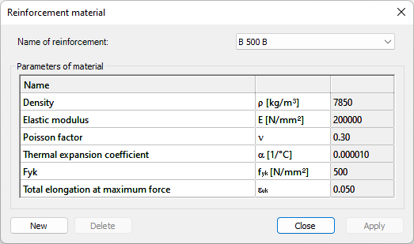
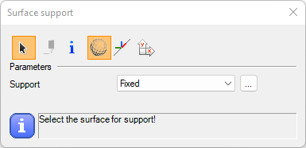
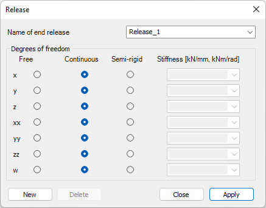
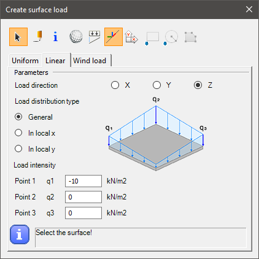

Creates an object.

### Syntax

**CREATE** [Object ID] [Object type]  
_Object parameters..._

### Command parameters

| **Command parameter**                   | **Assignment** | **Value format**                              | **Input options** |
| --------------------------------------- | -------------- | --------------------------------------------- | ----------------- |
| [Object ID](#object-id)                 | Required       | String                                        | Local, variable   |
| [Object type](#object-type)             | Required       | [Predefined strings](#objTypes)               | Local, variable   |
| [Object parameters](#object-parameters) | Required       | -                                             | -                 |

#### Object ID:

A string of characters that is used to identify the object that is being created. The string can contain letters, numbers and special characters as well.

Object ID-s have to be unique for every object across all object types (eg.: sections, members, plates, loads, etc.).

#### Object type:

The type of object to be created.

<span id="objTypes" style={{paddingTop: '80px'}}> Available object types: </span>
<div style={{paddingBottom: '20px'}}> </div>

| **Object type name**                                                                                                                     | **Object type**     |
| ---------------------------------------------------------------------------------------------------------------------------------------- | ------------------- |
| Structural members tab                                                                                                                   | -                   |
| [Structural member](#structural-member)                                                                                                  | Structural_Member   |
| [Structural Plate](#structural-plate)                                                                                                    | Structural_Plate    |
| [Haunch](#haunch)                                                                                                                        | Haunched_Member     |
| [Tapered member](#tapered-member)                                                                                                        | Tapered_Member      |
| [Steel material](#steel-material) <span style={{color:"MediumSeaGreen"}}>(since CS 17)</span>                                            | Steel               |
| [Coated steel material](#coated-steel-material) <span style={{color:"MediumSeaGreen"}}>(since CS 17)</span>                              | Coated_Steel        |
| [Concrete material](#concrete-material) <span style={{color:"MediumSeaGreen"}}>(since CS 17)</span>                                      | Concrete            |
| [Rebar material](#rebar-material) <span style={{color:"MediumSeaGreen"}}>(since CS 17)</span>                                            | Rebar               |
| [Point support](#point-support)                                                                                                          | Support_Point       |
| [Line support](#line-support)                                                                                                            | Support_Edge        |
| [Surface support](#surface-support) <span style={{color:"MediumSeaGreen"}}>(since CS 17)</span>                                          | Support_Plate       |
| [Point support type](#point-support-type) <span style={{color:"MediumSeaGreen"}}>(since CS 17)</span>                                    | Support             |
| [Release type](#release-type) <span style={{color:"MediumSeaGreen"}}>(since CS 17)</span>                                                | Release             |
| [Link](#link)                                                                                                                            | Link                |
| Loads tab                                                                                                                                | -                   |
| [Load group](#load-Group)                                                                                                                | LoadGroup           |
| [Load case](#load-Case)                                                                                                                  | LoadCase            |
| [Load combination](#load-combination)                                                                                                    | LoadCombination     |
| [Point load](#point-load)                                                                                                                | NodeForce           |
| [Line load](#line-load)                                                                                                                  | MemberForce         |
| [Surface load (uniform)](<#surface-load-(uniform)>)                                                                                      | PlateForce_Uniform  |
| [Surface load (linear)](<#surface-load-(linear)>)                                                                                        | PlateForce_Linear   |
| [Load transfer surface](#load-transfer-surface)                                                                                          | LoadTransferSurface |
| Mass tab                                                                                                                                 | -                   |
| [Mass group](#mass-group)                                                                                                                | MassGroup           |
| [Mass case](#mass-case)                                                                                                                  | MassCase            |
| [Mass combination](#mass-combination)                                                                                                    | MassCombination     |
| [Point mass](#point-mass)                                                                                                                | NodeMass            |
| Other                                                                                                                                    | -                   |
| [Portion](#portion)                                                                                                                      | Portion             |

#### Object parameters:
The available object parameters and their meaning depends on the chosen object type. [Detailed description](#detailed-description-of-object-types) of all object parameters for each individual object type can be found below.

---
## Detailed description of object types

## Structural member

This command is analogous with the beam creation dialogue in Consteel:

[](./img/wp-content-uploads-2021-09-image-11.png)

### Syntax

**CREATE** [Object ID] **Structural_Member** [Section name]  
\[x1] \[y1] \[z1]  
\[x2] \[y2] \[z2]  
Name [Object name]  
ReleaseID_A [Release start]  
ReleaseID_B [Release end]  
Eccentricity_y [Eccentricity y]  
Eccentricity_z [Eccentricity z]  
Rotation \[Rotation]  
Geomimpv [Initial bow imperfection L/y]  
Geomimpw [Initial bow imperfection L/z]  
Fe_type [FE type]  
Convergencetype [FE generation type]  
Convergence [Number of FEs]  
AverageEdgeLength_Web [FE size web]  
AverageEdgeLength_flange [FE size flange]  

### Command parameters

| **Command parameter**                                             | **Assignment** | **Value format**                        | **Input options** |
| ------------------------------------------------------------------| -------------- | --------------------------------------- | ----------------- |
| [Object ID](#Object-ID-mem)                                       | Required       | String                                  | Local, variable   |
| [Section name](#Section-name-mem)                                 | Required       | String                                  | Local, variable   |
| [x1, y1, z1](#x1,-y1,-z1-mem)                                     | Required       | Integer                                 | Local, variable   |
| [x2, y2, z2](#x2,-y2,-z2-mem)                                     | Required       | Integer                                 | Local, variable   |
| [Object name](#Object-name-mem)                                   | Optional       | String                                  | Local, variable   |
| [Release start](#Release-start-mem)                               | Optional       | String                                  | Local, variable   |
| [Release end](#Release-end-mem)                                   | Optional       | String                                  | Local, variable   |
| [Eccentricity y](#Eccentricity-y-mem)                             | Optional       | Integer                                 | Local, variable   |
| [Eccentricity z](#ccentricity-z-mem)                              | Optional       | Integer                                 | Local, variable   |
| [Rotation](#Rotation-mem)                                         | Optional       | Numerical                               | Local, variable   |
| [Initial bow imperfection L/y](#Initial-bow-imperfection-L/y-mem) | Optional       | Numerical                               | Local, variable   |
| [Initial bow imperfection L/z](#Initial-bow-imperfection-L/z-mem) | Optional       | Numerical                               | Local, variable   |
| [FE type](#FE-type-mem)                                           | Optional       | [Predefined strings](#FE-types-mem)     | Local, variable   |
| [FE generation type](#FE-generation-type-mem)                     | Optional       | [Predefined strings](#FE-gen-types-mem) | Local, variable   |
| [Number of FEs](#Number-of-FEs-mem)                               | Optional       | Integer                                 | Local, variable   |
| [FE size web](#FE-size-web-mem)                                   | Optional       | Numerical                               | Local, variable   |
| [FE size flange](#FE-size-flange-mem)                             | Optional       | Numerical                               | Local, variable   |

#### Object ID: {#Object-ID-mem}
A string of characters that is used to identify the object that is being created.

#### Section name: {#Section-name-mem}
Name of the section to be used for the member.

#### x1, y1, z1: {#x1,-y1,-z1-mem}
Coordinates of the starting point of the structural member.

#### x2, y2, z2: {#x2,-y2,-z2-mem}
Coordinates of the end point of the structural member.

#### Object name: {#Object-name-mem}
Name of the structural member.

#### Release start: {#Release-start-mem}
Release type at the starting point of the structural member. Any previously created release type name can be used.

Consteel has these release types already created by default:
- Continuous (default)
- w
- xx,yy,zz,w
- yy
- yy,zz
- yy,zz,w
- zz

#### Release end: {#Release-end-mem}
Release type at the end point of the structural member. Any previously created release type name can be used. The premade and default parameter inputs are the same as in case of the [Release start](#Release-start-mem) parameter.

#### Eccentricity y: {#Eccentricity-y-mem}
Structural member eccentricity in the local y direction.

#### Eccentricity z: {#Eccentricity-z-mem}
Structural member eccentricity in the local z direction.

#### Rotation: {#Rotation-mem}
Axial rotation of the structural member.

#### Initial bow imperfection L/y: {#Initial-bow-imperfection-L/y-mem}
Initial bow imperfection of the member in the local y direction.

#### Initial bow imperfection L/z: {#Initial-bow-imperfection-L/z-mem}
Initial bow imperfection of the member in the local z direction.

#### FE type: {#FE-type-mem}
Finite element type.

<span id="FE-types-mem" style={{paddingTop: '80px'}}>Available finite element types: </span>
<div style={{paddingBottom: '20px'}}> </div>

| **Finite element type name** | **Finite element type** |
| ---------------------------- | ----------------------- |
| 6 Degree Of Freedom beam     | 6DOFelem                |
| 7 Degree Of Freedom beam     | 7DOFelem                |
| Tension bar                  | TensionBar              |
| Shell                        | Shell                   |
| Tension bar (X Brace)        | XBrace                  |

#### FE generation type: {#FE-generation-type-mem}
Finite element generation type.

<span id="FE-gen-types-mem" style={{paddingTop: '80px'}}>Available inputs: </span>
- Automatic
- Manual

#### Number of FEs: {#Number-of-FEs-mem}
Number of finite elements. This parameter only applies if the FE type is "6DOFelem" or "7DOFelem".

#### FE size web: {#FE-size-web-mem}
Maximum edge size of shell element in the web. This parameter only applies if the FE type is "Shell".

#### FE size flange: {#FE-size-flange-mem}
Maximum edge size of shell element in the web. This parameter only applies if the FE type is "Shell".

### Sample code

**Command only:** (minimal parameters)
```
CREATE Mem_ID1 Structural_Member "HEA 200"
0 0 0
0 0 1000
```

**With section creation and all parameters:**
```
LOAD_SECTION_LIBRARY section "HEA 200"

CREATE Mem_ID1 Structural_Member "HEA 200"
0 0 0
0 0 1000
Name "Member 1"
ReleaseID_A Continuous
ReleaseID_B Continuous
Eccentricity_y 0
Eccentricity_z 0
Rotation 0
Geomimpv 0
Geomimpw 0
Fe_type 7dofelem
Convergencetype manual
Convergence 10
AverageEdgeLength_Web 10
AverageEdgeLength_flange 20
```

## Structural plate

This command is analogous with the plate creation dialogue in Consteel, with the "draw polygon" option selected:

[](./img/wp-content-uploads-2021-09-image-14.png)

### Syntax

**CREATE** \[Object ID] **Structural_Plate** \[Material name] \[Plate thickness] \[FE size] 
Name [Object name]
Group [Group ID]  
\[x1] \[y1] \[z1]  
\[x2] \[y2] \[z2]  
\[x3] \[y3] \[z3]  
_etc._

### Command parameters

| **Command parameter**                   | **Assignment** | **Value format** | **Input options** |
| --------------------------------------- | -------------- | ---------------- | ----------------- |
| [Object ID](#Object-ID-pla)             | Required       | String           | Local, variable   |
| [Material name](#Material-name-pla)     | Required       | String           | Local, variable   |
| [Plate thickness](#Plate-thickness-pla) | Required       | Numerical        | Local, variable   |
| [FE size](#FE-size-pla)                 | Optional       | Numerical        | Local, variable   |
| [Object name](#Object-name-pla)         | Optional       | String           | Local, variable   |
| [Group ID](#Group-ID-pla)               | Optional       | String           | Local, variable   |
| [x1, y1, z1](#x1,-y1,-z1-pla)           | Required       | Integer          | Local, variable   |
| [x2, y2, z2](#x2,-y2,-z2-pla)           | Required       | Integer          | Local, variable   |
| [x3, y3, z3](#x3,-y3,-z3-pla)           | Required       | Integer          | Local, variable   |

#### Object ID: {#Object-ID-pla}
A string of characters that is used to identify the object that is being created.

#### Material name: {#Material-name-pla}
Name of the material to be used.

#### Plate thickness: {#Plate-thickness-pla}
Thickness of the plate in \[mm].

#### FE size: {#FE-size-pla}
Maximum edge size of shell elements in \[mm].

#### Object name: {#Object-name-pla}
Name of the structural plate.

#### Group ID: {#Group-ID-pla}
ID of the element group.

#### x1, y1, z1: {#x1,-y1,-z1-pla}
Coordinates of 1. point of the structural plate.

#### x2, y2, z2: {#x2,-y2,-z2-pla}
Coordinates of 2. point of the structural plate.

#### x3, y3, z3: {#x3,-y3,-z3-pla}
Coordinates of 3. point of the structural plate. At least 3 points have to be defined for a plate creation. More point coordinates can be added into subsequent rows, for a polygon shape defined by more than 3 points.

### Sample code

**Minimal parameters and 3 points:**

```
CREATE Plate_ID1 Structural_Plate "C25/30 EN 1992-1-1:2010" 200
0 0 0
3000 0 0
3000 3000 0
```

**All parameters and 4 points:**

```
CREATE Plate_ID1 Structural_Plate "C25/30 EN 1992-1-1:2010" 200 400
Name "Plate 1"
Group Group_ID1
0 0 0
3000 0 0
3000 3000 0
0 3000 0
```

## Haunch

This command is analogous with the haunch creation dialogue in Consteel:



Hot rolled or welded haunch

### Syntax

#### Hot rolled haunch:

**CREATE** \[Object ID] **Haunched_Member** \[Member ID] \[Format] \[L] \[hs] \[he] \[Section name]
\[x1] \[y1] \[z1]  
\[x2] \[y2] \[z2]

#### Welded haunch:

**CREATE** \[Object ID] **Haunched_Member** \[Member ID] \[Format] \[L] \[hs] \[he] \[tw] \[b] \[tf]
\[x1] \[y1] \[z1]  
\[x2] \[y2] \[z2]


### Command parameters

| **Command parameter**             | **Assignment** | **Value format**                          | **Input options** |
| --------------------------------- | -------------- | ----------------------------------------- | ----------------- |
| [Object ID](#Object-ID-hau)       | Required       | String                                    | Local, variable   |
| [Member ID](#Member-ID-hau)    | Required       | String                                    | Local, variable   |
| [Format](#Format-hau)             | Required       | [Predefined strings](#Format-options-hau) | Local, variable   |
| [L](#L-hau)                       | Required       | Numerical                                 | Local, variable   |
| [hs](#hs-hau)                     | Required       | Numerical                                 | Local, variable   |
| [he](#he-hau)                     | Required       | Numerical                                 | Local, variable   |
| [Section name](#Section-name-hau) | Required       | String                                    | Local, variable   |
| [tw](#tw-hau)                     | Required       | Numerical                                 | Local, variable   |
| [b](#b-hau)                       | Required       | Numerical                                 | Local, variable   |
| [tf](#tf-hau)                     | Required       | Numerical                                 | Local, variable   |
| [x1, y1, z1](#x1,-y1,-z1-hau)     | Required       | Integer                                   | Local, variable   |
| [x2, y2, z2](#x2,-y2,-z2-hau)     | Required       | Integer                                   | Local, variable   |


#### Object ID: {#Object-ID-hau}
A string of characters that is used to identify the object that is being created.

#### Member ID: {#Member-ID-hau}
ID of the previously created structural member on which the haunch should be placed.

#### Format: {#Format-hau}
Alignment of the haunch.

<span id="Format-options-hau" style={{paddingTop: '80px'}}>Available input options: </span>
- Lower
- Symmetric
- Upper

#### L: {#L-hau}
Length of the haunch.

#### hs: {#hs-hau}
Start height of the haunch.

#### he: {#he-hau}
End height of the haunch.

#### Section name: {#Section-name-hau}
Name of the section to be used for the haunch. Only applicable if the haunch type is hot rolled.

#### tw: {#tw-hau}
Web thickness of the haunch. Only applicable if the haunch type is welded.

#### b: {#b-hau}
Flange width of the haunch. Only applicable if the haunch type is welded.

#### tf: {#tf-hau}
Flange thickness of the haunch. Only applicable if the haunch type is welded.

#### x1, y1, z1: {#x1,-y1,-z1-hau}
Coordinates of the starting point of the haunch.

#### x2, y2, z2: {#x2,-y2,-z2-hau}
Coordinates for setting the direction of the haunch.

### Sample code

**Command only:**

Hot rolled haunch:
```
CREATE Hau_ID1 Haunched_Member Mem_ID1 lower 2000 600 50 "IPE 300"
0 0 0
1 0 0
```

Welded haunch:
```
CREATE Hau_ID2 Haunched_Member Mem_ID2 lower 2000 600 50 6 150 10
0 2000 0
1 2000 0
```

**With section and member creation:**

Hot rolled haunch:
```
LOAD_SECTION_LIBRARY Sec_ID1 "IPE 300"

CREATE Mem_ID1 Structural_Member "IPE 300"
0 0 0
5000 0 0

CREATE Hau_ID1 Haunched_Member Mem_ID1 lower 2000 600 50 "IPE 300"
0 0 0
1 0 0
```

Welded haunch:
```
LOAD_SECTION_MACRO Sec_ID2 WLD-IH "WLD-IH (Descript)" "S 235 EN 10025-2" 150 10 300 8 150 10

CREATE Mem_ID2 Structural_Member "WLD-IH (Descript)"
0 2000 0
5000 2000 0

CREATE Hau_ID2 Haunched_Member Mem_ID2 lower 2000 600 50 6 150 10
0 2000 0
1 2000 0
```

## Tapered member

This command is analogous with the tapered member creation dialogue in Consteel:

[](./img/wp-content-uploads-2021-09-image-16.png)

### Syntax

**CREATE** \[Object ID] **Tapered_Member** \[Member ID] \[Start height] \[End height]  
Format \[Format]

### Command parameters

| **Command parameter**               | **Assignment** | **Value format**                         | **Input options** |
| ----------------------------------- | -------------- | ---------------------------------------- | ----------------- |
| [Object ID](#Object-ID-tm)          | Required       | String                                   | Local, variable   |
| [Member ID](#Member-ID-tm)          | Required       | String                                   | Local, variable   |
| [Start height](#Starting-height-tm) | Required       | Numerical                                | Local, variable   |
| [End height](#End-height-tm)        | Required       | Numerical                                | Local, variable   |
| [Format](#Format-tm)                | Optional       | [Predefined strings](#Format-options-tm) | Local, variable   |

#### Object ID: {#Object-ID-tm}
A string of characters that is used to identify the object that is being created.

#### Member ID: {#Member-ID-tm}
ID of the previously created structural member on which the tapering should be placed.

#### Starting height: {#Starting-height-tm}
Starting height of the tapered member in \[mm].

#### End height: {#End-height-tm}
End height of the tapered member in \[mm].

#### Format: {#Format-tm}
Alignment of the axis of the tapered member.

<span id="Format-options-tm" style={{paddingTop: '80px'}}>Available input options: </span>
- Bottom (default)
- Centric
- Top

### Sample code

**Command only:** (minimal parameters)

```
CREATE Tapered_ID1 Tapered_Member MemID0 400 200
```

**With added prerequisites (section and member definition) and all parameters:**

```
LOAD_SECTION_MACRO Sec_ID1 WLD-IH Descript_Section "S 235 EN 10025-2" 100 10 200 6 100 10

CREATE Mem_ID1 Structural_Member Descript_Section
0 0 0
0 0 1000

CREATE Tapered_ID1 Tapered_Member Mem_ID1 400 200
Format Centric
```

## Steel material

This command is analogous with the steel material creation dialogue in Consteel:

[](./img/wp-content-uploads-2023-08-image-5.png)

### Syntax

**CREATE** \[Object ID] **Steel** \[Name] \[ρ] \[E] \[ν] \[α] \[αfi] \[fy1] \[fy2] \[fu1] \[fu2] \[ty] \[tu]


### Command parameters

| **Command parameter**       | **Parameter description**             | **Assignment** | **Value format** | **Input options** |
| --------------------------- | ------------------------------------- | -------------- | ---------------- | ----------------- |
| [Object ID](#Object-ID-stl) | -                                     | Required       | String           | Local, variable   |
| [Name](#Name-stl)           | -                                     | Required       | String           | Local, variable   |
| ρ                           | Density                               | Required       | Numerical        | Local, variable   |
| E                           | Elastic modulus                       | Required       | Numerical        | Local, variable   |
| ν                           | Poisson factor                        | Required       | Numerical        | Local, variable   |
| α                           | Thermal expansion coefficient         | Required       | Numerical        | Local, variable   |
| αfi                         | Thermal expansion coefficient in fire | Required       | Numerical        | Local, variable   |
| fy1                         | Yield strength 1                      | Required       | Numerical        | Local, variable   |
| fy2                         | Yield strength 2                      | Required       | Numerical        | Local, variable   |
| fu1                         | Ultimate strength 1                   | Required       | Numerical        | Local, variable   |
| fu2                         | Ultimate strength 2                   | Required       | Numerical        | Local, variable   |
| ty                          | Thickness Y                           | Required       | Numerical        | Local, variable   |
| tu                          | Thickness U                           | Required       | Numerical        | Local, variable   |

#### Object ID: {#Object-ID-stl}
A string of characters that is used to identify the object that is being created.

#### Name: {#Name-stl}
Name of the material.

### Sample code
```
CREATE Steel_Mat_ID1 Steel "Custom steel name" 7850 210000 0.3 0.000012 0.000014 235 215 360 360 40 40
```

## Coated steel material

This command is analogous with the coated steel material creation dialogue in Consteel:

[](./img/wp-content-uploads-2023-08-image-6.png)

### Syntax

**CREATE** \[Object ID] **Coated_Steel** \[Name] \[ρ] \[E] \[ν] \[α] \[αfi] \[fyb] \[fu] \[tcoat]

### Command parameters

| **Command parameter**        | **Parameter description**             | **Assignment** | **Value format** | **Input options** |
| ---------------------------- | ------------------------------------- | -------------- | ---------------- | ----------------- |
| [Object ID](#Object-ID-cstl) | -                                     | Required       | String           | Local, variable   |
| [Name](#Name-cstl)           | -                                     | Required       | String           | Local, variable   |
| ρ                            | Density                               | Required       | Numerical        | Local, variable   |
| E                            | Elastic modulus                       | Required       | Numerical        | Local, variable   |
| ν                            | Poisson factor                        | Required       | Numerical        | Local, variable   |
| α                            | Thermal expansion coefficient         | Required       | Numerical        | Local, variable   |
| αfi                          | Thermal expansion coefficient in fire | Required       | Numerical        | Local, variable   |
| fyb                          | Basic yield strength                  | Required       | Numerical        | Local, variable   |
| fu                           | Ultimate strength                     | Required       | Numerical        | Local, variable   |
| tcoat                        | Coating thickness                     | Required       | Numerical        | Local, variable   |


#### Object ID: {#Object-ID-cstl}
A string of characters that is used to identify the object that is being created.

#### Name: {#Name-cstl}
Name of the material.


### Sample code
```
CREATE CSteel_Mat_ID1 Coated_Steel "Custom coated steel name" 7850 210000 0.3 0.000012 0.000014 350 420 0.02
```

## Concrete material

This command is analogous with the concrete material creation dialogue in Consteel:


### Syntax

**CREATE** \[Object ID] **Concrete** \[Name] \[ρ] \[Ecm] \[fck] \[fctk,0,05] \[fctm] \[φ(∞,t0)] \[ν] \[α] \[εc1] \[εcu1] \[η] \[εc2] \[εcu2] \[εc3] \[εcu3] \[n]


### Command parameters

| **Command parameter**                   | **Parameter description**             | **Assignment** | **Value format** | **Input options** |
| --------------------------------------- | ------------------------------------- | -------------- | ---------------- | ----------------- |
| [Object ID](#Object-ID-concr)           | -                                     | Required       | String           | Local, variable   |
| [Name](#Name-concr)                     | -                                     | Required       | String           | Local, variable   |
| ρ                                       | Density                               | Required       | Numerical        | Local, variable   |
| Ecm                                     | Secant modulus of elasticity          | Required       | Numerical        | Local, variable   |
| fck                                     | Compressive strength                  | Required       | Numerical        | Local, variable   |
| fctk,0,05                               | Characteristic tensile strength       |                |                  |                   |
| fctm                                    | Mean tensile strength                 |                |                  |                   |
| φ(∞,t0)                                 | Final value of creep coefficient      |                |                  |                   |
| ν                                       | Poisson factor                        | Required       | Numerical        | Local, variable   |
| α                                       | Thermal expansion coefficient         | Required       | Numerical        | Local, variable   |
| [Material model](#Material-model-concr) | -                                     | Required       | Numerical        | Local, variable   |
| εc1                                     | Yield strain #1                       | Required       | Numerical        | Local, variable   |
| εcu1                                    | Ultimite strain #1                    | Required       | Numerical        | Local, variable   |
| η                                       | Compression strength reduction factor | Required       | Numerical        | Local, variable   |
| εc2                                     | Yield strain #2                       | Required       | Numerical        | Local, variable   |
| εcu2                                    | Ultimite strain #2                    | Required       | Numerical        | Local, variable   |
| εc3                                     | Yield strain #3                       | Required       | Numerical        | Local, variable   |
| εcu3                                    | Ultimite strain #3                    | Required       | Numerical        | Local, variable   |
| n                                       | Exponent                              | Required       | Numerical        | Local, variable   |

#### Object ID: {#Object-ID-concr}
A string of characters that is used to identify the object that is being created.

#### Name: {#Name-concr}
Name of the material.

#### Material model: {#Material-model-concr}
Available material models:
- DiagramRectangle
- DiagramBilinear
- DiagramParabolaRect

### Sample code
```
CREATE Concrete_Mat_ID1 Concrete "Custom concrete name" 2500 31476 25 1.8 2.6 2.35 0.2 0.00001 DiagramRectangle 0.0007 0.0035 1 0.002 0.0035 0.00175 0.0035 2
```

## Rebar material

This command is analogous with the reinforcement material creation dialogue in Consteel:



### Syntax

**CREATE** \[Object ID] **Rebar** \[Name] \[ρ] \[E] \[ν] \[α] \[fyk] \[εuk]

### Command parameters

| **Command parameter**       | **Parameter description**             | **Assignment** | **Value format** | **Input options** |
| --------------------------- | ------------------------------------- | -------------- | ---------------- | ----------------- |
| [Object ID](#Object-ID-reb) | -                                     | Required       | String           | Local, variable   |
| [Name](#Name-reb)           | -                                     | Required       | String           | Local, variable   |
| ρ                           | Density                               | Required       | Numerical        | Local, variable   |
| E                           | Elastic modulus                       | Required       | Numerical        | Local, variable   |
| ν                           | Poisson factor                        | Required       | Numerical        | Local, variable   |
| α                           | Thermal expansion coefficient         | Required       | Numerical        | Local, variable   |
| fyk                         | Characteristic yield strength         | Required       | Numerical        | Local, variable   |
| εuk                         | Characteristic strain at maximum load | Required       | Numerical        | Local, variable   |

#### Object ID: {#Object-ID-reb}
A string of characters that is used to identify the object that is being created.

#### Name: {#Name-reb}
Name of the material.

### Sample code
```
CREATE Rebar_Mat_ID1 Rebar "Custom rebar name" 7850 200000 0.3 0.00001 500 0.05
```

## Point support

This command is analogous with the point support creation dialogue in Consteel:

[](./img/wp-content-uploads-2021-09-image-20.png)

### Syntax

**CREATE** \[Object ID] **Support_Point** \[Member ID] \[Support type]  
\[x] \[y] \[z]  
EccType [Eccentricity reference]

### Command parameters

| **Command parameter**                                  | **Assignment** | **Value format**                            | **Input options** |
| ------------------------------------------------------ | -------------- | ------------------------------------------- | ----------------- |
| [Object ID](#Object-ID-psup)                           | Required       | String                                      | Local, variable   |
| [Member ID](#Member-ID-psup)                           | Required       | Member name or ID                           | Local, variable   |
| [Support type](#Support-type-psup)                     | Required       | String                                      | Local, variable   |
| [x, y, z](#x,-y,-z-psup)                               | Required       | Numerical                                   | Local, variable   |
| [Eccentricity reference](#Eccentricity-reference-psup) | Optional       | [Predefined strings](#Ecctype-options-psup) | Local, variable   |

#### Object ID: {#Object-ID-psup}
A string of characters that is used to identify the object that is being created.

#### Member ID: {#Member-ID-psup}
ID of the previously created structural member to which the support will be attached. The accepted input is either a member ID or the name of the member with this syntax: "NAME: [Member name]"

#### Support type: {#Support-type-psup}
The type of support. Any previously created support type name can be used.

<span id="Ecctype-options-psup" style={{paddingTop: '80px'}}>Consteel has these support types already created by default: </span>
- Fixed
- x,y,z
- x,y,z,xx
- x,y,z,yy
- x,y,z,zz
- y,z,xx
- x,z,yy
- x,y,zz
- y,z
- x,z
- x,y
- x
- y
- z
- w

#### x, y, z: {#x,-y,-z-psup}
Coordinates of the point support.

#### Eccentricity reference: {#Eccentricity-reference-psup}
Available inputs:

| **Eccentricity reference name** | **Eccentricity reference** |
| ------------------------------- | -------------------------- |
| Reference line (0)              | EccType_C                  |
| Bottom Left (1)                 | EccType_BL                 |
| Bottom Middle (2)               | EccType_BM                 |
| Bottom Right (3)                | EccType_BR                 |
| Middle Left (4)                 | EccType_ML                 |
| Middle Middle (5)               | EccType_MM                 |
| Middle Right (6)                | EccType_MR                 |
| Top Left (7)                    | EccType_TL                 |
| Top Middle (8)                  | EccType_TM                 |
| Top Right (9)                   | EccType_TR                 |

### Sample code

**Command only:** (minimal parameters)

```
CREATE PSup_ID1 Support_Point Member_ID1 x,y,z
0 0 0
```

**With added prerequisites (section and member definition) and all parameters:**

```
LOAD_SECTION_MACRO Sec_ID1 WLD-IH "Descript Section" "S 235 EN 10025-2" 100 10 200 6 100 10

CREATE Member_ID1 Structural_member "Descript Section"
0 0 0
0 0 3000

CREATE PSup_ID1 Support_Point Member_ID1 Fixed
0 0 0
EccType EccType_TM
```

## Line support

This command is analogous with the line support creation dialogue in Consteel:

[](./img/wp-content-uploads-2021-09-image-63.png)

### Syntax

**CREATE** \[Object ID] **Support_Edge** \[Member ID] \[Support type]  
Name [Object name]  
CoordSys [Coordinate system]  
EccType [Eccentricity reference]  


### Command parameters

| **Command parameter**                                  | **Assignment** | **Value format**                                                          | **Input options** |
| ------------------------------------------------------ | -------------- | ------------------------------------------------------------------------- | ----------------- |
| [Object ID](#Object-ID-lsup)                           | Required       | String                                                                    | Local, variable   |
| [Member ID](#Member-ID-lsup)                           | Required       | Member name or ID                                                         | Local, variable   |
| [Support type](#Support-type-lsup)                     | Required       | String                                                                    | Local, variable   |
| [Object name](#Object-name-lsup)                       | Optional       | String                                                                    | Local, variable   |
| [Coordinate system](#Coordinate-system-lsup)           | Optional       | [Predefined strings](#coord-Sys-inputs-lsup)                              | Local, variable   |
| [Eccentricity reference](#Eccentricity-reference-lsup) | Optional       | [Predefined strings](#Ecctype-options-lsup)                               | Local, variable   |

#### Object ID: {#Object-ID-lsup}
A string of characters that is used to identify the object that is being created.

#### Member ID: {#Member-ID-lsup}
ID of the previously created structural member to which the support will be attached. The accepted input is either a member ID or the name of the member with this syntax: "NAME: [Member name]"

#### Support type: {#Support-type-lsup}
The type of support. Any previously created support type name can be used.

Consteel has these support types already created by default:
- Fixed
- Pinned
- y,xx

#### Object name: {#Object-name-lsup}
Name of the line support.

#### Coordinate system: {#Coordinate-system-lsup}
With this parameter it can be specified which coordinate system to use for the load definition.

<span id="coord-Sys-inputs-lsup" style={{paddingTop: '80px'}}>Available inputs: </span>
- Global (default)
- Local

#### Eccentricity reference: {#Eccentricity-reference-lsup}
<span id="Ecctype-options-lsup" style={{paddingTop: '80px'}}> Available inputs: </span>
<div style={{paddingBottom: '20px'}}> </div>

| **Eccentricity reference name** | **Eccentricity reference** |
| ------------------------------- | -------------------------- |
| Reference line (0)              | EccType_C                  |
| Bottom Left (1)                 | EccType_BL                 |
| Bottom Middle (2)               | EccType_BM                 |
| Bottom Right (3)                | EccType_BR                 |
| Middle Left (4)                 | EccType_ML                 |
| Middle Middle (5)               | EccType_MM                 |
| Middle Right (6)                | EccType_MR                 |
| Top Left (7)                    | EccType_TL                 |
| Top Middle (8)                  | EccType_TM                 |
| Top Right (9)                   | EccType_TR                 |

### Sample code

**Command only:** (minimal parameters)

```
CREATE LSup_ID1 Support_Edge Member_ID1 Fixed
```

**With added prerequisites (section and member definition) and all parameters:**

```
LOAD_SECTION_MACRO Sec_ID1 WLD-IH "WLD-IH (Descript)" "S 235 EN 10025-2" 100 10 200 6 100 10

CREATE Member_ID1 Structural_member "WLD-IH (Descript)"
0 0 0
0 0 3000

CREATE LSup_ID1 Support_Edge Member_ID1 Fixed
Name "Line support 1 (Descript)"
CoordSys Local
EccType EccType_TM
```

## Surface support

This command is analogous with the surface support creation dialogue in Consteel:



### Syntax

**CREATE** \[Object ID] **Support_Plate** \[Plate ID] \[Support type]  
Name [Object name]
CoordSys [Coordinate system]

### Command parameters

| **Command parameter**                        | **Assignment** | **Value format**                                                       | **Input options** |
| -------------------------------------------- | -------------- | -----------------------------------------------------------------------| ----------------- |
| [Object ID](#Object-ID-ssup)                 | Required       | String                                                                 | Local, variable   |
| [Plate ID](#Plate-ID-lsup)                   | Required       | Plate name or ID                                                       | Local, variable   |
| [Support type](#Support-type-ssup)           | Required       | String                                                                 | Local, variable   |
| [Object name](#Object-name-ssup)             | Optional       | String                                                                 | Local, variable   |
| [Coordinate system](#Coordinate-system-ssup) | Optional       | [Predefined strings](#coord-Sys-inputs-lsup)                           | Local, variable   |

#### Object ID: {#Object-ID-ssup}
A string of characters that is used to identify the object that is being created.

#### Plate ID: {#Plate-ID-ssup}
ID of the previously created structural plate to which the support will be attached. The accepted input is either a plate ID or the name of the plate with this syntax: "NAME: [Plate name]"

#### Support type: {#Support-type-ssup}
The type of support. Any previously created surface support type name can be used.

#### Object name: {#Object-name-ssup}
Name of the surface support.

#### Coordinate system: {#Coordinate-system-ssup}
With this parameter it can be specified which coordinate system to use for the load definition.

<span id="coord-Sys-inputs-lsup" style={{paddingTop: '80px'}}> Available inputs: </span>
- Global (default)
- Local

### Sample code

**Command only:** (minimal parameters)

```
CREATE SurfSup_ID1 Support_Plate Plate_ID1 Fixed
```

**With added prerequisites (plate creation) and all parameters:**

```
CREATE Plate_ID1 Structural_Plate "C25/30 EN 1992-1-1:2010" 200
0 0 0
3000 0 0
3000 3000 0

CREATE SurfSup_ID1 Support_Plate Plate_ID1 Fixed
Name "Surface support 1"
CoordSys Local
```

## Point support type

This command is analogous with the point support type creation dialogue in Consteel:


### Syntax

**CREATE** \[Object ID] **Support** \[Name] \[x] \[y] \[z] \[xx] \[yy] \[zz] \[w]

### Command parameters

| **Command parameter**                          | **Assignment** | **Value format**                                              | **Input options** |
| ---------------------------------------------- | -------------- | ------------------------------------------------------------- | ----------------- |
| [Object ID](#Object-ID-psuptype)               | Required       | String                                                        | Local, variable   |
| [Name](#Name-psuptype)                         | Required       | String                                                        | Local, variable   |
| [x, y, z, xx, yy, zz, w](#DOF-params-psuptype) | Required       | [Predefined strings or numerical](#Available-inputs-psuptype) | Local, variable   |

#### Object ID: {#Object-ID-psuptype}
A string of characters that is used to identify the object that is being created.

#### Name: {#Name-psuptype}
Name of the object that will be created.

#### Degree of freedom (DOF) parameters: x, y, z, xx, yy, zz, w {#DOF-params-psuptype}

| **DOF parameter** | **Parameter description**                      | **Stiffness dimension** |
| ----------------- | ---------------------------------------------- | ----------------------- |
| x                 | Translational degree of freedom in x direction | kN/mm                   |
| y                 | Translational degree of freedom in y direction | kN/mm                   |
| z                 | Translational degree of freedom in z direction | kN/mm                   |
| xx                | Rotational degree of freedom around x axis     | kNm/rad                 |
| yy                | Rotational degree of freedom around y axis     | kNm/rad                 |
| zz                | Rotational degree of freedom around z axis     | kNm/rad                 |
| w                 | Warping                                        | kNm2/(rad/m)            |

All DOF parameters work similarly. Each DOF can be fixed, free, or semi-rigid.

<span id="Available-inputs-psuptype" style={{paddingTop: '80px'}}> Available inputs: </span>
- Fix
- Free
- Numerical input (eg. 1.234)

If a numerical input is given then the corresponding DOF will be semi-rigid, and the given number will become the stiffness of that DOF. The dimension of the stiffness depends on which DOF it is applied to. The actual stiffness dimensions can be seen in the table above for every different DOF.

### Sample code
```
CREATE PSup_Type_ID1 Support "Custom support type name" Fix Free 1.234 Fix Fix Fix Fix
```

## Release type

This command is analogous with the release type creation dialogue in Consteel:



### Syntax

**CREATE** \[Object ID] **Release** \[Name] \[x] \[y] \[z] \[xx] \[yy] \[zz] \[w]

### Command parameters

| **Command parameter**                         | **Assignment** | **Value format**                                             | **Input options** |
| --------------------------------------------- | -------------- | ------------------------------------------------------------ | ----------------- |
| [Object ID](#Object-ID-reltype)               | Required       | String                                                       | Local, variable   |
| [Name](#Name-reltype)                         | Required       | String                                                       | Local, variable   |
| [x, y, z, xx, yy, zz, w](#DOF-params-reltype) | Required       | [Predefined strings or numerical](#Available-inputs-reltype) | Local, variable   |

#### Object ID: {#Object-ID-reltype}
A string of characters that is used to identify the object that is being created.

#### Name: {#Name-reltype}
Name of the object that will be created.

#### Degree of freedom (DOF) parameters: x, y, z, xx, yy, zz, w {#DOF-params-reltype}

| **DOF parameter** | **Parameter description**                      | **Stiffness dimension** |
| ----------------- | ---------------------------------------------- | ----------------------- |
| x                 | Translational degree of freedom in x direction | kN/mm                   |
| y                 | Translational degree of freedom in y direction | kN/mm                   |
| z                 | Translational degree of freedom in z direction | kN/mm                   |
| xx                | Rotational degree of freedom around x axis     | kNm/rad                 |
| yy                | Rotational degree of freedom around y axis     | kNm/rad                 |
| zz                | Rotational degree of freedom around z axis     | kNm/rad                 |
| w                 | Warping                                        | kNm2/(rad/m)            |

All DOF parameters work similarly. Each DOF can be fixed, free, or semi-rigid.

<span id="Available-inputs-reltype" style={{paddingTop: '80px'}}> Available inputs: </span>
- Fix
- Free
- Numerical input (eg. 1.234)

If a numerical input is given then the corresponding DOF will be semi-rigid, and the given number will become the stiffness of that DOF. The dimension of the stiffness depends on which DOF it is applied to. The actual stiffness dimensions can be seen in the table above for every different DOF.

### Sample code
```
CREATE Release_Type_ID1 Release "Custom release type name" Fix Free 1.234 Fix Fix Fix Fix
```

## Link

This command is analogous with the link element creation dialogue in Consteel:

[](./img/wp-content-uploads-2021-09-image-18.png)

### Syntax

**CREATE** \[Object ID] **Link**  
\[x1] \[y1] \[z1]  
\[x2] \[y2] \[z2]  
Rotation \[Rotation]  
InterfacePos [Interface position]  
ReleaseID \[Release]  
FromObjectID [From object ID] <span style={{color:"MediumSeaGreen"}}>(since CS 17)</span>  
ToObjectID [To object ID] <span style={{color:"MediumSeaGreen"}}>(since CS 17)</span>

### Command parameters

| **Command parameter**                          | **Assignment** | **Value format** | **Input options** |
| ---------------------------------------------- | -------------- | ---------------- | ----------------- |
| [Object ID](#Object-ID-link)                   | Required       | String           | Local, variable   |
| [x1, y1, z1](#x1,-y1,-z1-link)                 | Required       | Numerical        | Local, variable   |
| [x2, y2, z2](#x2,-y2,-z2-link)                 | Required       | Numerical        | Local, variable   |
| [Rotation](#Rotation-link)                     | Optional       | Numerical        | Local, variable   |
| [Interface position](#Interface-position-link) | Optional       | Numerical        | Local, variable   |
| [Release](#Release-link)                       | Optional       | String           | Local, variable   |
| [From object ID](#From-object-ID-link)         | Optional       | Object ID        | Local, variable   |
| [To object ID](#To-object-ID-link)             | Optional       | Object ID        | Local, variable   |

#### Object ID: {#Object-ID-link}
A string of characters that is used to identify the object that is being created.

#### x1, y1, z1: {#x1,-y1,-z1-link}
Coordinates of 1. point of the link.

#### x2, y2, z2: {#x2,-y2,-z2-link}
Coordinates of 2. point of the link.

#### Rotation: {#Rotation-link}
Axial rotation of the local coordinate system of the link in degrees. Default: 0.

#### Interface position: {#Interface-position-link}
The position of the interface, or release along the length of the link. Acceptable inputs are decimal fraction numbers from 0 to 1. Default: 0.

#### Release: {#Release-link}
The type of release at the interface position. Any previously created release type name can be used.

Consteel has these release types already created by default:
- Continuous (default)
- w
- xx,yy,zz,w
- yy
- yy,zz
- yy,zz,w
- zz

#### From object ID: {#From-object-ID-link}
The ID of an object that the start point of the link is connecting to. This parameter accepts an ID of the following object types: structural member, structural plate.

#### To object ID: {#To-object-ID-link}
The ID of an object that the end point of the link is connecting to. This parameter accepts an ID of the following object types: structural member, structural plate.

### Sample code

**Command only:** (minimal parameters)

```
Create Link_ID1 Link
1000 0 0
1000 0 600
```

**With added prerequisites (section and member definition) and all parameters:**

```
LOAD_SECTION_MACRO Sec_ID1 WLD-IH "Descript Section" "S 235 EN 10025-2" 100 10 200 6 100 10

CREATE Member_ID1 Structural_member "Descript Section"
1000 0 0
5000 0 0

CREATE Member_ID2 Structural_member "Descript Section"
1000 0 600
5000 0 600

CREATE Link_ID1 Link
1000 0 0
1000 0 600
Rotation 20
InterfacePos 0.5
ReleaseID yy
FromObjectID Member_ID1
ToObjectID Member_ID2
```

## Load group

This command is analogous with the load group creation button in Consteel:

[](./img/wp-content-uploads-2021-09-image-40.png)

### Syntax

**CREATE** \[Object ID] **LoadGroup**  
Name [Object name]  
LoadGroupType [Load group type]  
Factor_0 [Factor 0]  
Factor_1 [Factor 1]  
Factor_2 [Factor 2]  
Factor_3 [Factor 3]  

### Command parameters

| **Command parameter**                  | **Assignment** | **Value format**                           | **Input options** |
| -------------------------------------- | -------------- | ------------------------------------------ | ----------------- |
| [Object ID](#Object-ID-lg)             | Required       | String                                     | Local, variable   |
| [Object name](#Object-name-lg)         | Required       | String                                     | Local, variable   |
| [Load group type](#Load-group-type-lg) | Required       | [Predefined strings](#load-group-types-lg) | Local, variable   |
| [Factors 0-3](#Factors-0-3-lg)         | Optional       | Numerical                                  | Local, variable   |

#### Object ID: {#Object-ID-lg}
A string of characters that is used to identify the object that is being created.

#### Object name: {#Object-name-lg}
Name of the load group.

#### Load group type: {#Load-group-type-lg}
Type of the load group.

<span id="load-group-types-lg" style={{paddingTop: '80px'}}> Available load group types: </span>
<div style={{paddingBottom: '20px'}}> </div>

| **Load group type name**            | **Load group type** |
| ----------------------------------- | ------------------- |
| EN standard                         | -                   |
| EN, Permanent                       | LGType_EN_P         |
| EN, Variable (Transient)            | LGType_EN_T         |
| EN, Meteorological                  | LGType_EN_M         |
| EN, Wind                            | LGType_EN_W         |
| EN, Snow                            | LGType_EN_S         |
| EN, Crane                           | LGType_EN_C         |
| EN, Accidental                      | LGType_EN_A         |
| EN, Accidental snow                 | LGType_EN_AS        |
| EN, Seismic (Earthquake)            | LGType_EN_E         |
| AISC standard                       | -                   |
| AISC, Dead load                     | LGType_AISC_D       |
| AISC, Fluid load                    | LGType_AISC_F       |
| AISC, Live load                     | LGType_AISC_L       |
| AISC, Roof live load                | LGType_AISC_Lr      |
| AISC, Rain load                     | LGType_AISC_R       |
| AISC, Snow load                     | LGType_AISC_S       |
| AISC, Weight of ice                 | LGType_AISC_DI      |
| AISC, Wind load                     | LGType_AISC_W       |
| AISC, Wind on ice                   | LGType_AISC_Wi      |
| AISC,Wind load for SLS              | LGType_AISC_Wa      |
| AISC, Flood load                    | LGType_AISC_Fa      |
| AISC, Load from extraordinary event | LGType_AISC_Ak      |

#### Factors 0-3: {#Factors-0-3-lg}
Safety and combination factors attached to the load group.
- Factor 0: safety factor (γG or γQ)
- Factor 1: combination factor (Ψ0)
- Factor 2: factor for frequent load level (Ψ1)
- Factor 3: factor for quasi permanent load level (Ψ2)

### Sample code

**EN Permanent load group:** (minimal parameters)

```
CREATE LG_ID1 LoadGroup
Name "Permanent (Descript)"
LoadGroupType LGType_EN_P
```

**EN Variable load group:** (all parameters)

```
CREATE LG_ID1 LoadGroup
Name "Variable (Descript)"
LoadGroupType LGType_EN_T
Factor_0 1.35
Factor_1 1
Factor_2 0.9
Factor_3 0
```

## Load case

This command is analogous with the load case creation button in Consteel:

[](./img/wp-content-uploads-2021-09-image-41.png)

### Syntax

**CREATE** \[Object ID] **LoadCase**  
Name [Object name]  
LoadGroupID [Load group ID]  
CanBeFavourable [Can be favourable]  
NotMainInTransientCmb [Not main in variable combination]  
NotMainInAccidentalCmb [Not main in accidental combination]  

### Command parameters

| **Command parameter**                                                           | **Assignment** | **Value format** | **Input options** |
| ------------------------------------------------------------------------------- | -------------- | ---------------- | ----------------- |
| [Object ID](#Object-ID-lcase)                                                   | Required       | String           | Local, variable   |
| [Object name](#Object-name-lcase)                                               | Optional       | String           | Local, variable   |
| [Load group ID](#Load-group-ID-lcase)                                           | Optional       | String           | Local, variable   |
| [Can be favourable](#Can-be-favourable-lcase)                                   | Optional       | Boolean          | Local, variable   |
| [Not main in variable combination](#Not-main-in-variable-combination-lcase)     | Optional       | Boolean          | Local, variable   |
| [Not main in accidental combination](#Not-main-in-accidental-combination-lcase) | Optional       | Boolean          | Local, variable   |

#### Object ID: {#Object-ID-lcase}
A string of characters that is used to identify the object that is being created.

#### Object name: {#Object-name-lcase}
Name of the load case. If not specified, the default name is: LoadCase.

#### Load group ID: {#Load-group-ID-lcase}
ID of the load group that will contain the created load case. If not specified, then the load case will be created within the default permanent load group.

#### Can be favourable: {#Can-be-favourable-lcase}
Boolean parameter that controls if the load case can be favourable in a combination or not. Accepted inputs: "0" or "1". If not specified the default value is "0".
- 0 → turned off, load can not be favorable
- 1 → turned on, load can be favorable

#### Not main in variable combination: {#Not-main-in-variable-combination-lcase}
Boolean parameter that controls if the load case can be main in permanent and variable combinations or not. Accepted inputs: "0" or "1". If not specified the default value is "0".
- 0 → turned off, load can not be main
- 1 → turned on, load can be main

#### Not main in accidental combination: {#Not-main-in-accidental-combination-lcase}
Boolean parameter that controls if the load case can be main in accidental combinations or not. Accepted inputs: "0" or "1". If not specified the default value is "0".
- 0 → turned off, load can not be main
- 1 → turned on, load can be main

### Sample code

**Command only:** (minimal parameters)

```
CREATE LCaseID01 LoadCase
```

**With load group creation and all parameters:**

```
CREATE LG_ID1 LoadGroup
Name "Permanent (Descript)"
LoadGroupType LGType_EN_P

CREATE LCase_ID1 LoadCase
Name "Load case 1 (Descript)"
LoadGroupID LG_ID1
CanBeFavourable 0
NotMainInTransientCmb 0
NotMainInAccidentalCmb 0
```

## Load combination

This command is analogous with the load combination creation button in Consteel:

[](./img/wp-content-uploads-2021-09-image-42.png)

### Syntax

**CREATE** \[Object ID] **LoadCombination**  
Name [Object name]  
Type  [Combination type]  
[Load case ID 1] [Load case combination factor 1]  
[Load case ID 2] [Load case combination factor 2]  
_etc._

### Command parameters

| **Command parameter**                                                 | **Assignment** | **Value format**                               | **Input options** |
| --------------------------------------------------------------------- | -------------- | ---------------------------------------------- | ----------------- |
| [Object ID](#Object-ID-lcomb)                                         | Required       | String                                         | Local, variable   |
| [Object name](#Object-name-lcomb)                                     | Optional       | String                                         | Local, variable   |
| [Combination type](#Combination-type-lcomb)                           | Optional       | [Predefined strings](#combination-types-lcomb) | Local, variable   |
| [Load case IDs](#Load-case-IDs-lcomb)                                 | Optional       | Load case name or ID                           | Local, variable   |
| [Load case combination factors](#Load-case-combination-factors-lcomb) | Optional       | Numerical                                      | Local, variable   |

#### Object ID: {#Object-ID-lcomb}
A string of characters that is used to identify the object that is being created.

#### Object name: {#Object-name-lcomb}
Name of the load combination. If not specified, the default name is: Load combination1.

#### Combination type: {#Combination-type-lcomb}
Type of the combination.

<span id="combination-types-lcomb" style={{paddingTop: '80px'}}> Available combination types: </span>

- ULS (default) <span style={{color:"Chocolate"}}>(until CS 16)</span>
- SLS <span style={{color:"Chocolate"}}>(until CS 16)</span>
- ULS_STR_PersistentOrTransient <span style={{color:"MediumSeaGreen"}}>(since CS 17)</span>
- ULS_GEO_PersistentOrTransient <span style={{color:"MediumSeaGreen"}}>(since CS 17)</span>
- ULS_EQU_PersistentOrTransient <span style={{color:"MediumSeaGreen"}}>(since CS 17)</span>
- ULS_Accidental <span style={{color:"MediumSeaGreen"}}>(since CS 17)</span>
- ULS_Seismic <span style={{color:"MediumSeaGreen"}}>(since CS 17)</span>
- ULS_Other (default) <span style={{color:"MediumSeaGreen"}}>(since CS 17)</span>
- SLS_Cheracteristic_GQ <span style={{color:"MediumSeaGreen"}}>(since CS 17)</span>
- SLS_Frequent_GQ <span style={{color:"MediumSeaGreen"}}>(since CS 17)</span>
- SLS_QuasiPermanent_GQ <span style={{color:"MediumSeaGreen"}}>(since CS 17)</span>
- SLS_Cheracteristic_Q <span style={{color:"MediumSeaGreen"}}>(since CS 17)</span>
- SLS_Frequent_Q <span style={{color:"MediumSeaGreen"}}>(since CS 17)</span>
- SLS_QuasiPermanent_Q <span style={{color:"MediumSeaGreen"}}>(since CS 17)</span>
- SLS_Seismic <span style={{color:"MediumSeaGreen"}}>(since CS 17)</span>
- SLS_Other <span style={{color:"MediumSeaGreen"}}>(since CS 17)</span>

#### Load case IDs: {#Load-case-IDs-lcomb}
ID of load cases for which combination factors will be specified. The accepted input is either a load case ID or the name of a load case with this syntax: "NAME: [Load case name]"

#### Load case combination factors: {#Load-case-combination-factors-lcomb}
Combination factors assigned to load cases in the same row.

### Sample code

**Command only:** (minimal parameters)

```
CREATE LComb_ID1 LoadCombination
"NAME: Loadcase" 1
```

**With getting load case ID and all parameters:**

```
FILTER LCase_IDs
Objecttypes Loadcase

ARRAY_GET LCase_IDs 0 LCase_ID1

CREATE LComb_ID1 LoadCombination
Name "Load combination (Descript)"
Type ULS
$LCase_ID1 1
```

## Point load

This command is analogous with the point load creation dialogue in Consteel:

[](./img/wp-content-uploads-2021-09-image-43.png)

### Syntax

**CREATE** \[Object ID] **NodeForce** \[Load case ID] \[Member ID] \[Coordinate system] 
\[x] \[y] \[z]  
\[Fx] \[Fy] \[Fz]  
\[Mx] \[My] \[Mz]  
EccType [Eccentricity reference]

### Command parameters

| **Command parameter**                                   | **Assignment** | **Value format**                                                          | **Input options** |  
| ------------------------------------------------------- | -------------- | ------------------------------------------------------------------------- | ----------------- |  
| [Object ID](#Object-ID-pload)                           | Required       | String                                                                    | Local, variable   |  
| [Load case ID](#Load-case-ID-pload)                     | Required       | Load case name or ID                                                      | Local, variable   |  
| [Member ID](#Member-ID-pload)                           | Required       | Member name or ID                                                         | Local, variable   |  
| [Coordinate system](#Coordinate-system-pload)           | Optional       | Predefined string                                                         | Local, variable   |  
| [x, y, z](#x,-y,-z-pload)                               | Required       | Numerical                                                                 | Local, variable   |  
| [Fx, Fy, Fz](#Fx,-Fy,-Fz-pload)                         | Required       | Numerical                                                                 | Local, variable   |  
| [Mx, My, Mz](#Mx,-My,-Mz-pload)                         | Required       | Numerical                                                                 | Local, variable   |  
| [Eccentricity reference](#Eccentricity-reference-pload) | Optional       | [Predefined strings](#Ecctype-options-pload)                              | Local, variable   |  

#### Object ID: {#Object-ID-pload}
A string of characters that is used to identify the object that is being created.

#### Load case ID: {#Load-case-pload}
ID of the load case that will contain the load. The accepted input is either a load case ID or the name of a load case with this syntax: "NAME: [Load case name]"

#### Member ID: {#Member-ID-pload}
ID of the member to which the load will be attached. The accepted input is either a member ID or the name of the member with this syntax: "NAME: [Member name]"

#### Coordinate system: {#Coordinate-system-pload}
With this parameter it can be specified which coordinate system to use for the load definition. If unspecified the default is the global coordinate system. If specified, the only accepted input is: "local".

#### x, y, z: {#x,-y,-z-pload}
Coordinates of the application point of the load.

Alternatively the location of the point load can be defined relatively along the length of the member it is attached to. For this definition use the following syntax replacing the x, y, z coordinates: "Rel ", where the Relative position parameter can be any number between 0 and 1. For example:
```
CREATE PLoad_ID1 NodeForce "NAME: Loadcase" Mem_ID1
Rel 0.6
0 100 -100
0 0 0
```

#### Fx, Fy, Fz: {#Fx,-Fy,-Fz-pload}
Force components of the point load.

#### Mx, My, Mz: {#Mx,-My,-Mz-pload}
Moment components of the point load.

#### Eccentricity reference: {#Eccentricity-reference-pload}
<span id="analTypes" style={{paddingTop: '80px'}}> Available inputs: </span>
<div style={{paddingBottom: '20px'}}> </div>

| **Eccentricity reference name** | **Eccentricity reference** |
| ------------------------------- | -------------------------- |
| Reference line (0)              | EccType_C                  |
| Bottom Left (1)                 | EccType_BL                 |
| Bottom Middle (2)               | EccType_BM                 |
| Bottom Right (3)                | EccType_BR                 |
| Middle Left (4)                 | EccType_ML                 |
| Middle Middle (5)               | EccType_MM                 |
| Middle Right (6)                | EccType_MR                 |
| Top Left (7)                    | EccType_TL                 |
| Top Middle (8)                  | EccType_TM                 |
| Top Right (9)                   | EccType_TR                 |

### Sample code

**Command only:** (minimal parameters)

```
CREATE PLoad_ID1 NodeForce "NAME: Loadcase" Mem_ID1
0 0 3000
0 100 -100
0 0 0
```

**With section, load group, load case, member creation and all parameters:**

Note that in this example the load is given in the member's local coordinate system.
```
LOAD_SECTION_LIBRARY Sec_ID1 "HEA 200"

CREATE LG_ID1 LoadGroup
Name "Permanent (Descript)"
LoadGroupType LGType_EN_P

CREATE LCase_ID1 LoadCase
Name "Load case 1 (Descript)"
LoadGroupID LG_ID1

CREATE Mem_ID1 Structural_member "HEA 200"
0 0 0
0 0 3000

CREATE PLoad_ID1 NodeForce LCase_ID1 Mem_ID1 local
0 0 3000
-100 0 0
0 0 0
EccType EccType_TM
```

## Line load

This command is analogous with the line load creation dialogue in Consteel:

[](./img/wp-content-uploads-2021-09-image-44.png)

### Syntax

**CREATE** \[Object ID] **MemberForce** [Load case ID] [Member ID] [Coordinate system]  
[Reference point 1] [Reference point 2]  
[Distance 1] [Distance 2]  
\[Fx1] \[Fy1] \[Fz1]  
\[Fx2] \[Fy2] \[Fz2]  
EccType [Eccentricity reference]  

### Command parameters

| **Command parameter**                                   | **Assignment** | **Value format**                              | **Input options** |
| ------------------------------------------------------- | -------------- | --------------------------------------------- | ----------------- |
| [Object ID](#Object-ID-lload)                           | Required       | String                                        | Local, variable   |
| [Load case ID](#Load-case-ID-lload)                     | Required       | Load case name or ID                          | Local, variable   |
| [Member ID](#Member-ID-lload)                           | Required       | Member name or ID                             | Local, variable   |
| [Coordinate system](#Coordinate-system-lload)           | Optional       | Predefined string                             | Local, variable   |
| [Reference point 1](#Reference-point-1-lload)           | Required       | Numerical                                     | Local, variable   |
| [Reference point 2](#Reference-point-2-lload)           | Required       | Numerical                                     | Local, variable   |
| [Distance 1](#Distance-1-lload)                         | Required       | Numerical                                     | Local, variable   |
| [Distance 2](#Distance-2-lload)                         | Required       | Numerical                                     | Local, variable   |
| [Fx1, Fy1, Fz1](#Fx1,-Fy1,-Fz1-lload)                   | Required       | Numerical                                     | Local, variable   |
| [Fx2, Fy2, Fz2](#Fx2,-Fy2,-Fz2-lload)                   | Required       | Numerical                                     | Local, variable   |
| [Eccentricity reference](#Eccentricity-reference-lload) | Optional       | [Predefined strings](#Ecctype-options-lload)  | Local, variable   |

#### Object ID: {#Object-ID-lload}
A string of characters that is used to identify the object that is being created.

#### Load case ID: {#Load-case-ID-lload}
ID of the load case that will contain the load. The accepted input is either a load case ID or the name of a load case with this syntax: "NAME: [Load case name]"

#### Member ID: {#Member-ID-lload}
ID of the member to which the load will be attached. The accepted input is either a member ID or the name of the member with this syntax: "NAME: [Member name]"

#### Coordinate system: {#Coordinate-system-lload}
With this parameter it can be specified which coordinate system to use for the load definition. If unspecified the default is the global coordinate system. If specified, the only accepted input is: "local".

#### Reference point 1: {#Reference-point-1-lload}
Parameter that controls the starting location of the line load.

Available inputs:
- 0 → from end A
- 1 → from end B

#### Reference point 2: {#Reference-point-2-lload}
Parameter that controls the end location of the line load.

Available inputs:
- 0 → from end A
- 1 → from end B
- 2 → Relative

#### Distance 1: {#Distance-1-lload}
Distance of the start of the line load from the member end set by the Reference point 1 parameter.

#### Distance 2: {#Distance-2-lload}
Distance of the end of the line load from the member end set by the Reference point 2 parameter. If Reference point 2 = 2 (Relative), then the length of the line load is measured from the starting point.

#### Fx1, Fy1, Fz1: {#Fx1,-Fy1,-Fz1-lload}
Force components at the starting point of the line load.

#### Fx2, Fy2, Fz2: {#Fx2,-Fy2,-Fz2-lload}
Force components at the end point of the line load.

#### Eccentricity reference: {#Eccentricity-reference-lload}

<span id="Ecctype-options-lload" style={{paddingTop: '80px'}}> Available inputs: </span>
<div style={{paddingBottom: '20px'}}> </div>

| **Eccentricity reference name** | **Eccentricity reference** |
| ------------------------------- | -------------------------- |
| Reference line (0)              | EccType_C                  |
| Bottom Left (1)                 | EccType_BL                 |
| Bottom Middle (2)               | EccType_BM                 |
| Bottom Right (3)                | EccType_BR                 |
| Middle Left (4)                 | EccType_ML                 |
| Middle Middle (5)               | EccType_MM                 |
| Middle Right (6)                | EccType_MR                 |
| Top Left (7)                    | EccType_TL                 |
| Top Middle (8)                  | EccType_TM                 |
| Top Right (9)                   | EccType_TR                 |

### Sample code

**Command only:** (minimal parameters)

```
CREATE LLoad_ID1 MemberForce LCase_ID1 Mem_ID1
0 1
0 0
0 0 -10
0 0 -10
```

**With section, load group, load case, member creation and all parameters:**

```
LOAD_SECTION_LIBRARY Sec_ID1 "IPE 200"

CREATE LG_ID1 LoadGroup
Name "Permanent (Descript)"
LoadGroupType LGType_EN_P

CREATE LCase_ID1 LoadCase
Name "Load case 1 (Descript)"
LoadGroupID LG_ID1

CREATE Mem_ID1 Structural_member "IPE 200"
0 0 0
3000 0 0

CREATE LLoad_ID1 MemberForce LCase_ID1 Mem_ID1 local
0 1
200 400
0 0 -10
0 0 -12
EccType EccType_TM
```

[](./img/wp-content-uploads-2022-01-image.png)

## Surface load (uniform)

This command is analogous with the surface load creation dialogue with the uniform tab chosen in Consteel:

[](./img/wp-content-uploads-2021-09-image-55.png)

### Syntax

**CREATE** **PlateForce_Uniform** \[Load case ID] \[Surface ID] \[Coordinate system]  
\[Fx] \[Fy] \[Fz]  
\[x1] \[y1] \[z1]  
\[x2] \[y2] \[z2]  
\[x3] \[y3] \[z3]  
_etc._

### Command parameters

| **Command parameter**                         | **Assignment** | **Value format**                              | **Input options** |
| --------------------------------------------- | -------------- | --------------------------------------------- | ----------------- |
| [Object ID](#Object-ID-sload)                 | Required       | String                                        | Local, variable   |
| [Load case ID](#Load-case-ID-sload)           | Required       | Load case name or ID                          | Local, variable   |
| [Surface ID](#Surface-ID-sload)               | Required       | Member name or ID                             | Local, variable   |
| [Coordinate system](#Coordinate-system-sload) | Optional       | Predefined string                             | Local, variable   |
| [Fx, Fy, Fz](#Fx,-Fy,-Fz-sload)               | Required       | Numerical                                     | Local, variable   |
| [xi, yi, zi](#xi,-yi,-zi-sload)               | Optional       | Numerical                                     | Local, variable   |

#### Object ID: {#Object-ID-sload}
A string of characters that is used to identify the object that is being created.

#### Load case ID: {#Load-case-ID-sload}
ID of the load case that will contain the load. The accepted input is either a load case ID or the name of a load case with this syntax: "NAME: [Load case name]"

#### Surface ID: {#Surface-ID-sload}
ID of the Surface to which the load will be attached. The accepted input is either a surface ID or the name of the surface with this syntax: "NAME: [Surface name]"

#### Coordinate system: {#Coordinate-system-sload}
With this parameter it can be specified which coordinate system to use for the load definition. If unspecified the default is the global coordinate system. If specified, the only accepted input is: "local".

#### Fx, Fy, Fz: {#Fx,-Fy,-Fz-sload}
Force components of the uniform surface load.

#### xi, yi, zi: {#xi,-yi,-zi-sload}
Coordinates of the corner points of the area where the surface load will be applied on the selected surface. If none is given, then the load will be applied on the entire surface. Otherwise at least 3 corner points have to be given.

### Sample code

**Command only:** (minimal parameters)

```
CREATE SLoad_ID1 PlateForce_Uniform LCase_ID1 PlateID1
0 0 -10
```

**With load group, load case, plate creation and all parameters:**

```
CREATE LG_ID1 LoadGroup
Name "Permanent (Descript)"
LoadGroupType LGType_EN_P

CREATE LCase_ID1 LoadCase
Name "Load case 1 (Descript)"
LoadGroupID LG_ID1

CREATE Plate_ID1 Structural_Plate "C25/30 EN 1992-1-1:2010" 200
0 0 0
3000 0 0
3000 3000 0
0 3000 0

CREATE SLoad_ID1 PlateForce_Uniform LCase_ID1 Plate_ID1 local
0 0 -10
0 0 0
2000 0 0
2000 3000 0
0 3000 0
```

[](./img/wp-content-uploads-2021-10-image-6.png)

## Surface load (linear)

This command is analogous with the surface load creation dialogue with the linear tab chosen in Consteel:



### Syntax

**CREATE** \[Object ID] **PlateForce_Linear** \[Load case ID] \[Surface ID] \[Coordinate system]  
LoadDirection [Load direction]  
DistributionType [Distribution type]  
\[q1x] \[q1y] \[q1z] \[q1]  
\[q2x] \[q2y] \[q2z] \[q2]  
\[q3x] \[q3y] \[q3z] \[q3]  
\[x1] \[y1] \[z1]  
\[x2] \[y2] \[z2]  
\[x3] \[y3] \[z3]  
_etc._

### Command parameters

| **Command parameter**                          | **Assignment** | **Value format**                                                          | **Input options** |
| ---------------------------------------------- | -------------- | ------------------------------------------------------------------------  | ----------------- |
| [Object ID](#Object-ID-sloadl)                 | Required       | String                                                                    | Local, variable   |
| [Load case ID](#Load-case-ID-sloadl)           | Required       | Load case name or ID                                                      | Local, variable   |
| [Surface ID](#Surface-ID-sloadl)               | Required       | Member name or ID                                                         | Local, variable   |
| [Coordinate system](#Coordinate-system-sloadl) | Optional       | Predefined string                                                         | Local, variable   |
| [Load direction](#Load-direction-sloadl)       | Required       | [Predefined strings](#load-directions-sloadl)                             | Local, variable   |
| [Distribution type](#Distribution-type-sloadl) | Required       | [Predefined strings](#distribution-types-sloadl)                          | Local, variable   |
| [qix, qiy, qiz](#qix,-qiy,-qiz-sloadl)         | Required       | Numerical                                                                 | Local, variable   |
| [q1, q2, q3](#q1,-q2,-q3-sloadl)               | Required       | Numerical                                                                 | Local, variable   |
| [xi, yi, zi](#xi,-yi,-zi-sloadl)               | Optional       | Numerical                                                                 | Local, variable   |

#### Object ID: {#Object-ID-sloadl}
A string of characters that is used to identify the object that is being created.

#### Load case ID: {#Load-case-ID-sloadl}
ID of the load case that will contain the load. The accepted input is either a load case ID or the name of a load case with this syntax: "NAME: [Load case name]"

#### Surface ID: {#Surface-ID-sloadl}
ID of the Surface to which the load will be attached. The accepted input is either a surface ID or the name of the surface with this syntax: "NAME: [Surface name]"

#### Coordinate system: {#Coordinate-system-sloadl}
With this parameter it can be specified which coordinate system to use for the load definition. If unspecified the default is the global coordinate system. If specified, the only accepted input is: "local".

#### Load direction: {#Load-direction-sloadl}
Direction of the surface load. Only 1 load direction can be chosen for 1 CREATE PlateForce_Linear command. The load direction is defined in the given coordinate system (local or global).

<span id="load-directions-sloadl" style={{paddingTop: '80px'}}> Available load directions: </span>
- x
- y
- z

#### Distribution type: {#Distribution-type-sloadl}
Type of the load distribution.

<span id="distribution-types-sloadl" style={{paddingTop: '80px'}}> Available distribution types: </span>
- General → In this case the slope of the linear distribution is in a general direction, therefore 3 intensity points have to be defined (q1, q2, q3)
- x → In this case the slope of the linear distribution is parallel with the local x direction, therefore 2 intensity points have to be defined (q1, q2)
- y → In this case the slope of the linear distribution is parallel with the local y direction, therefore 2 intensity points have to be defined (q1, q2)

#### qix, qiy, qiz: {#qix,-qiy,-qiz-sloadl}
Coordinates for the load intensity points.

#### q1, q2, q3: {#q1,-q2,-q3-sloadl}
Load intensities at the given points.

#### xi, yi, zi: {#xi,-yi,-zi-sloadl}
Coordinates of the corner points of the area where the surface load will be applied on the selected surface. If none is given, then the load will be applied on the entire surface. Otherwise at least 3 corner points have to be given.

### Sample code

**Command only:** (minimal parameters, general distribution)

```
CREATE PF_ID1 PlateForce_Linear LC01 SPID1
LoadDirection z
DistributionType General
3000 0 0 0
3000 3000 0 -10
0 3000 0 -20
```

**With load group, load case, plate creation and all parameters:**

```
CREATE SP_ID1 Structural_Plate "S 235 EN 10025-2" 16 50
0 0 0
3000 0 0
3000 3000 0
0 3000 0

CREATE LG_01 LoadGroup
Name "Descript Load Group"
LoadGroupType "LGType_EN_P"

CREATE LC_01 LoadCase
Name "Descript Load Case"
LoadGroupID LG_01

CREATE PF_ID1 PlateForce_Linear LC_01 SP_ID1 local
LoadDirection z
DistributionType x
0 0 0 -20
3000 0 0 -10
0 0 0
3000 0 0
2000 3000 0
0 3000 0
```

[](./img/wp-content-uploads-2021-10-image-7.png)

## Load transfer surface

This command is analogous with the load transfer surface creation dialogue in Consteel, with the "draw polygon" option:

[](./img/wp-content-uploads-2021-09-image-48.png)

### Syntax

**CREATE** \[Object ID] **LoadTransferSurface** \[Object name]  
\[x1] \[y1] \[z1]  
\[x2] \[y2] \[z2]  
\[x3] \[y3] \[z3]  
_etc._

### Command parameters

| **Command parameter**           | **Assignment** | **Value format** | **Input options** |
| ------------------------------- | -------------- | ---------------- | ----------------- |
| [Object ID](#Object-ID-lts)     | Required       | String           | Local, variable   |
| [Object name](#Object-name-lts) | Required       | String           | Local, variable   |
| [xi, yi, zi](#xi,-yi,-zi-lts)   | Required       | Numerical        | Local, variable   |

#### Object ID: {#Object-ID-lts}
A string of characters that is used to identify the object that is being created.

#### Object name: {#Object-name-lts}
Name of the load transfer surface.

#### xi, yi, zi: {#xi,-yi,-zi-lts}
Coordinates of the corner points of the area where the load transfer surface will be. At least 3 corner points have to be given.

### Sample code
```
CREATE LTS_ID1 LoadTransferSurface "LTS 1"
0 0 0
3000 0 0
3000 3000 0
0 3000 0
```

## Mass group

This command is analogous with the mass group creation button in Consteel:

[](./img/wp-content-uploads-2021-09-image-49.png)

### Syntax

**CREATE** \[Object ID] **MassGroup**  
Name [Object name]  
MassGroupType [Mass group type]  

### Command parameters

| **Command parameter**                  | **Assignment** | **Value format**                           | **Input options** |
| -------------------------------------- | -------------- | ------------------------------------------ | ----------------- |
| [Object ID](#Object-ID-mg)             | Required       | String                                     | Local, variable   |
| [Object name](#Object-name-mg)         | Optional       | String                                     | Local, variable   |
| [Mass group type](#Mass-group-type-mg) | Required       | [Predefined strings](#mass-group-types-mg) | Local, variable   |

#### Object ID: {#Object-ID-mg}
A string of characters that is used to identify the object that is being created.

#### Object name: {#Object-name-mg}
Name of the mass group.

#### Mass group type: {#Mass-group-type-mg}
Type of the mass group.

<span id="mass-group-types-mg" style={{paddingTop: '80px'}}> Available mass group types: </span>
<div style={{paddingBottom: '20px'}}> </div>

| **Mass group type name** | **Mass group type** |
| ------------------------ | ------------------- |
| Permanent                | MGType_EN_P         |
| Variable                 | MGType_EN_T         |
| Snow                     | MGType_EN_S         |

### Sample code
```
CREATE MG_ID1 MassGroup
Name "Mass group (Descript)"
MassGroupType MGType_EN_P
```

## Mass case

This command is analogous with the mass case creation button in Consteel:

[](./img/wp-content-uploads-2021-09-image-51.png)

### Syntax

**CREATE** \[Object ID] **MassCase**  
Name [Object name]  
MassGroupID [Mass group ID]  
SeismicDirection [Seismic direction]  
FreeVibrationDirection [Free vibration direction]  

### Command parameters

| **Command parameter**                                       | **Assignment** | **Value format**                                             | **Input options** |
| ----------------------------------------------------------- | -------------- | ------------------------------------------------------------ | ----------------- |
| [Object ID](#Object-ID-mcase)                               | Required       | String                                                       | Local, variable   |
| [Object name](#Object-name-mcase)                           | Optional       | String                                                       | Local, variable   |
| [Mass group ID](#Mass-group-ID-mcase)                       | Required       | Mass group name or ID                                        | Local, variable   |
| [Seismic direction](#Seismic-direction-mcase)               | Optional       | [Predefined strings](#Seismic-direction-inputs-mcase)        | Local, variable   |
| [Free vibration direction](#Free-vibration-direction-mcase) | Optional       | [Predefined strings](#Free-vibration-direction-inputs-mcase) | Local, variable   |

#### Object ID: {#Object-ID-mcase}
A string of characters that is used to identify the object that is being created.

#### Object name: {#Object-name-mcase}
Name of the mass case. If not specified the default name is: "MassCase".

#### Mass group ID: {#Mass-group-ID-mcase}
ID of the mass group that will contain the created mass case. The accepted input is either a mass group ID or the name of a mass group with this syntax: "NAME: [Mass group name]"

#### Seismic direction: {#Seismic-direction-mcase}
Controls the consideration of "z" direction in seismic analysis.

<span id="Seismic-direction-inputs-mcase" style={{paddingTop: '80px'}}> Available inputs: </span>
- 0 (default)
- z

#### Free vibration direction: {#Free-vibration-direction-mcase}
Controls the consideration of masses in directions for free vibration analysis.

<span id="Free-vibration-direction-inputs-mcase" style={{paddingTop: '80px'}}> Available inputs: </span>
- x
- y
- z
- x,y
- x,z
- y,z
- x,y,z (default)

### Sample code

**Command only:** (minimal parameters)

```
CREATE MC_ID1 MassCase
MassGroupID MG_ID1
```

**With mass group creation and all parameters:**

```
CREATE MG_ID1 MassGroup
Name "Mass group (Descript)"
MassGroupType MGType_EN_P

CREATE MC_ID1 MassCase
Name "Mass case (Descript)"
MassGroupID MG_ID1
SeismicDirection 0
FreeVibrationDirection x,y,z
```

## Mass combination

This command is analogous with the mass combination creation button in Consteel:

[](./img/wp-content-uploads-2021-09-image-52.png)

### Syntax

**CREATE** \[Object ID] **MassCombination**  
Name [Object name]  
[Mass case ID 1] [Mass case combination factor 1]  
[Mass case ID 2] [Mass case combination factor 2]  
_etc._

### Command parameters

| **Command parameter**                                                 | **Assignment** | **Value format**     | **Input options** |
| --------------------------------------------------------------------- | -------------- | -------------------- | ----------------- |
| [Object ID](#Object-ID-mcomb)                                         | Required       | String               | Local, variable   |
| [Object name](#Object-name-mcomb)                                     | Optional       | String               | Local, variable   |
| [Mass case IDs](#Mass-case-IDs-mcomb)                                 | Optional       | Mass case name or ID | Local, variable   |
| [Mass case combination factors](#Mass-case-combination-factors-mcomb) | Optional       | Numerical            | Local, variable   |

#### Object ID: {#Object-ID-mcomb}
A string of characters that is used to identify the object that is being created.

#### Object name: {#Object-name-mcomb}
Name of the mass combination. If not specified, the default name is: Load combination1.

#### Mass case IDs: {#Mass-case-IDs-mcomb}
ID of mass cases for which combination factors will be specified. The accepted input is either a mass case ID or the name of a mass case with this syntax: "NAME: [Mass case name]"

#### Mass case combination factors: {#Mass-case-combination-factors-mcomb}
Combination factors assigned to mass cases in the same row.

### Sample code

**Command only:** (minimal parameters)

```
CREATE MComb_ID1 MassCombination
"NAME: Mass case" 1
```

**With mass group, mass case creation and all parameters:**

```
CREATE MG_ID1 MassGroup
Name "Mass group (Descript)"
MassGroupType MGType_EN_P

CREATE MC_ID1 MassCase
MassGroupID MG_ID1

CREATE MComb_ID1 MassCombination
Name "Mass combination (Descript)"
MC_ID1 1
```

## Point mass

This command is analogous with the node mass creation dialogue in Consteel:

[](./img/wp-content-uploads-2022-01-image-1.png)

### Syntax

**CREATE** \[Object ID] **NodeMass** \[Mass case ID] \[Member ID]  
\[x] \[y] \[z]  
\[Mass]

### Command parameters

| **Command parameter**               | **Assignment** | **Value format**     | **Input options** |
| ----------------------------------- | -------------- | -------------------- | ----------------- |
| [Object ID](#Object-ID-pmass)       | Required       | String               | Local, variable   |
| [Mass case ID](#Mass-case-ID-pmass) | Required       | Mass case name or ID | Local, variable   |
| [Member ID](#Member-ID-pmass)       | Required       | Member name or ID    | Local, variable   |
| [x, y, z](#x,-y,-z-pmass)           | Required       | Numerical            | Local, variable   |
| [Mass](#Mass-pmass)                 | Required       | Numerical            | Local, variable   |

#### Object ID: {#Object-ID-pmass}
A string of characters that is used to identify the object that is being created.

#### Mass case ID: {#Mass-case-ID-pmass}
ID of the mass case that will contain the mass. The accepted input is either a mass case ID or the name of a mass case with this syntax: "NAME: [Mass case name]"

#### Member ID: {#Member-ID-pmass}
ID of the member to which the load will be attached. The accepted input is either a member ID or the name of the member with this syntax: "NAME: [Member name]"

#### x, y, z: {#x,-y,-z-pmass}
Coordinates of the application point of the mass.

#### Mass: {#Mass-pmass}
Mass in \[kg].

### Sample code

**Command only:** (minimal parameters)

```
CREATE PMass_ID1 NodeMass MC_ID1 Mem_ID1
0 0 3000
1000
```

**With mass group, mass case, member creation and all parameters:**

```
LOAD_SECTION_LIBRARY section "HEA 200"

CREATE MG_ID1 MassGroup
Name "Mass group (Descript)"
MassGroupType MGType_EN_P

CREATE MC_ID1 MassCase
Name "Mass case (Descript)"
MassGroupID MG_ID1
SeismicDirection 0
FreeVibrationDirection x,y,z

CREATE Mem_ID1 Structural_Member "HEA 200"
0 0 0
0 0 3000

CREATE PMass_ID1 NodeMass MC_ID1 Mem_ID1
0 0 3000
1000
```

[](./img/wp-content-uploads-2022-01-image-4.png)

## Portion

This command is analogous with the portion creation button in Consteel:


### Syntax

**CREATE** \[Object ID] **Portion** \[Object name] \[Content array]

### Command parameters

| **Command parameter**               | **Assignment** | **Value format** | **Input options** |
| ----------------------------------- | -------------- | ---------------- | ----------------- |
| [Object ID](#Object-ID-por)         | Required       | String           | Local, variable   |
| [Object name](#Object-name-por)     | Required       | String           | Local, variable   |
| [Content array](#Content-array-por) | Required       | Object ID(s)     | Array             |

#### Object ID: {#Object-ID-por}
A string of characters that is used to identify the object that is being created.

#### Object name: {#Object-name-por}
Name of the portion.

#### Content array: {#Content-array-por}
The name of the array that contains the IDs of the objects that will be part of the created portion. This array substitutes the manual object selection that is necessary before the portion creation in Consteel. The object IDs have to be collected and put into an array before the execution of this command.

### Sample code

**Command only:**

```
CREATE Portion_ID1 portion "Portion 1 (Descript)" ObjIDs_to_portion
```

**With object and array creation:**

```
LOAD_SECTION_LIBRARY Sec_ID1 "HEA 200"

CREATE Mem_ID1 Structural_Member "HEA 200"
0 0 0
0 0 1000
Name "Structural Member 1"

CREATE Mem_ID2 Structural_Member "HEA 200"
0 0 1000
0 1000 1000
Name "Structural Member 2"

CREATE Mem_ID3 Structural_Member "HEA 200"
0 0 1000
0 1000 0
Name "Structural Member 3"

ARRAY_CREATE ObjIDs_to_portion
ARRAY_SET ObjIDs_to_portion 0 Mem_ID1
ARRAY_SET ObjIDs_to_portion 1 Mem_ID2

CREATE Portion_ID1 portion "Portion 1 (Descript)" ObjIDs_to_portion
```
