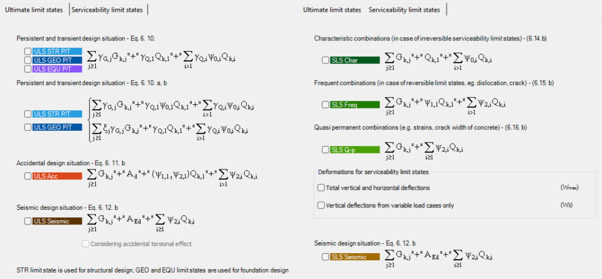

<!-- wp:paragraph -->

Generates multiple objects.

<!-- /wp:paragraph -->

<!-- wp:heading {"level":3} -->

### Syntax

<!-- /wp:heading -->

<!-- wp:paragraph -->

**GENERATE **  
Attribute1  
Attribute2  
Attribute3  
_etc._

<!-- /wp:paragraph -->

<!-- wp:heading {"level":3} -->

### Description

<!-- /wp:heading -->

<!-- wp:paragraph -->

Generates multiple objects.

<!-- /wp:paragraph -->

<!-- wp:heading {"level":3} -->

### Object types

<!-- /wp:heading -->

<!-- wp:paragraph -->

Available object types:

<!-- /wp:paragraph -->

<!-- wp:table {"className":"is-style-stripes"} -->

|                                      |                  |
| ------------------------------------ | ---------------- |
| **Object type**                      | **Description**  |
| [Loadcombination](#Load-combination) | Load combination |

<!-- /wp:table -->

<!-- wp:heading {"level":3} -->

### Sample code:

<!-- /wp:heading -->

<!-- wp:loos-hcb/code-block -->

```
GENERATE LC_IDs_Array LoadCombination
CombinationTypes ULS_PersTrans_CaseA_STR
```

<!-- /wp:loos-hcb/code-block -->

<!-- wp:heading {"level":1} -->

# Detailed description of object types

<!-- /wp:heading -->

<!-- wp:heading {"textAlign":"left"} -->

## Load combination

<!-- /wp:heading -->

<!-- wp:paragraph -->

Generates load combinations.

<!-- /wp:paragraph -->

<!-- wp:paragraph -->

The command is analogous with this button in Consteel:

<!-- /wp:paragraph -->

<!-- wp:image {"id":26012,"sizeSlug":"full","linkDestination":"media"} -->

[](./img/wp-content-uploads-2021-10-image-8.png)

<!-- /wp:image -->

<!-- wp:heading {"level":3} -->

### Syntax

<!-- /wp:heading -->

<!-- wp:paragraph -->

**GENERATE ** **LoadCombination ** _etc._  
CombinationType  
DeflectionTypeSLS

<!-- /wp:paragraph -->

<!-- wp:heading {"level":3} -->

### Command parameters

<!-- /wp:heading -->

<!-- wp:table {"className":"is-style-stripes"} -->

|                                       |                |                                              |                   |
| ------------------------------------- | -------------- | -------------------------------------------- | ----------------- |
| **Command parameter**                 | **Assignment** | **Value format**                             | **Input options** |
| [Array name](#Array-name)             | Required       | String                                       | Local, variable   |
| [Load cases](#Load-cases)             | Optional       | String                                       | Local, variable   |
| [Combination type](#Combination-type) | Optional       | [Predefined strings](#Combination-type-name) | Local, variable   |
| [Deflection type](#Deflection-type)   | Optional       | [Predefined strings](#Deflection-type-name)  |                   |

<!-- /wp:table -->

<!-- wp:heading {"level":4} -->

#### Array name:

<!-- /wp:heading -->

<!-- wp:paragraph -->

Name of the array that will store the IDs of the generated load combinations.

<!-- /wp:paragraph -->

<!-- wp:heading {"level":4} -->

#### Load cases:

<!-- /wp:heading -->

<!-- wp:paragraph -->

IDs of the load cases that will be included in the load combination generation.

<!-- /wp:paragraph -->

<!-- wp:paragraph -->

The definition of the included load cases is optional. If no load case IDs are given here, then all of the existing load cases are going to be included.

<!-- /wp:paragraph -->

<!-- wp:heading {"level":4} -->

#### Combination type:

<!-- /wp:heading -->

<!-- wp:paragraph -->

Type of the combinations to be generated. One ore more combination types can be included int the CombinationType row within one GENERATE/LoadCombination command.

<!-- /wp:paragraph -->

<!-- wp:paragraph -->

Available combination types:

<!-- /wp:paragraph -->

<!-- wp:table {"className":"is-style-stripes"} -->

|                                                                   |                                                                                                                                                                  |
| ----------------------------------------------------------------- | ---------------------------------------------------------------------------------------------------------------------------------------------------------------- |
| **Combination type name**                                         | **Combination type**                                                                                                                                             |
| ULS Persistent or transient a) (EC 1990-2005 6.4.3.2 6.10)        | ULS*PersTrans_CaseA *(until CS 15)\_\_ _ULS_PersTrans_CaseA_STR _(since CS 16)_ ULS_PersTrans_CaseA_GEO _(since CS 16)_ ULS_PersTrans_CaseA_EQU _(since CS 16)\_ |
| ULS Persistent or transient b) (EC 1990-2005 6.4.3.2 6.10a 6.10b) | ULS*PersTrans_CaseB *(until CS 15)_ ULS_PersTrans_CaseB_STR _(since CS 16)_ ULS_PersTrans_CaseB_GEO _(since CS 16)\_                                             |
| ULS Accidental (EC 1990-2005 6.4.3.3 6.11b)                       | ULS_Accidental                                                                                                                                                   |
| ULS Seismic (EC 1990-2005 6.4.3.4 6.12b)                          | ULS_Seismic                                                                                                                                                      |
| SLS Characteristic (EC 1990-2005 6.5.3 6.14a)                     | SLS_Characteristic                                                                                                                                               |
| SLS Frequent (EC 1990-2005 6.5.3 6.15a)                           | SLS_Frequent                                                                                                                                                     |
| SLS Quasi-static (EC 1990-2005 6.5.3 6.16a)                       | SLS_QuasiPermanent                                                                                                                                               |

<!-- /wp:table -->

<!-- wp:paragraph -->

The options of this parameter are analogous with these options in Consteel:

<!-- /wp:paragraph -->

<!-- wp:image {"id":43767,"sizeSlug":"large","linkDestination":"media"} -->

[](https://consteelsoftware.com/wp-content/uploads/2021/11/Kepernyokep-2022-11-30-150738.png)

<!-- /wp:image -->

<!-- wp:paragraph -->

The assignment of the combination type is optional. Default: ULS_PersTrans_CaseA_STR.

<!-- /wp:paragraph -->

<!-- wp:heading {"level":4} -->

#### Deflection type:

<!-- /wp:heading -->

<!-- wp:paragraph -->

Controls the deflection type in case of SLS combinations.

<!-- /wp:paragraph -->

<!-- wp:paragraph -->

Available deflection types:

<!-- /wp:paragraph -->

<!-- wp:table {"className":"is-style-stripes"} -->

|                                                    |                      |
| -------------------------------------------------- | -------------------- |
| **Deflection type name**                           | **Deflection type**  |
| Total vertical and horizontal deflections          | VerticalHorizontal   |
| Vertical deflections from variable load cases only | VerticalFromVariable |

<!-- /wp:table -->

<!-- wp:paragraph -->

The options of this parameter are analogous with these options in Consteel:

<!-- /wp:paragraph -->

<!-- wp:image {"id":23827,"sizeSlug":"full","linkDestination":"media"} -->

[](./img/wp-content-uploads-2021-08-image-75.png)

<!-- /wp:image -->

<!-- wp:paragraph -->

One or both deflection types can be included in one row after the "DeflectionTypeSLS" within one GENERATE/LoadCombination command.

<!-- /wp:paragraph -->

<!-- wp:paragraph -->

The assignment of the deflection type is optional. Default: VerticalHorizontal.

<!-- /wp:paragraph -->

<!-- wp:heading {"level":3} -->

### Sample code:

<!-- /wp:heading -->

<!-- wp:heading {"level":4} -->

#### Command only:

<!-- /wp:heading -->

<!-- wp:loos-hcb/code-block -->

```
GENERATE LC_IDs_Array LoadCombination
CombinationTypes ULS_PersTrans_CaseA_STR SLS_Characteristic
DeflectionTypeSLS VerticalHorizontal
```

<!-- /wp:loos-hcb/code-block -->

<!-- wp:heading {"level":4} -->

#### With added prerequisites (Load group and load case generation):

<!-- /wp:heading -->

<!-- wp:loos-hcb/code-block -->

```
//Load Groups
CREATE LoadGroupID1 LoadGroup
Name "Persistent Descript"
LoadGroupType LGType_EN_P

CREATE LoadGroupID2 LoadGroup
Name "Variable Descript"
LoadGroupType LGType_EN_T

CREATE LoadGroupID3 LoadGroup
Name "Wind Descript"
LoadGroupType LGType_EN_W

//Load Cases
CREATE LoadCaseID11 LoadCase
Name "Persistent 1"
LoadGroupID LoadGroupID1

CREATE LoadCaseID21 LoadCase
Name "Variable 1"
LoadGroupID LoadGroupID2

CREATE LoadCaseID22 LoadCase
Name "Variable 2"
LoadGroupID LoadGroupID2

CREATE LoadCaseID31 LoadCase
Name "Wind 1"
LoadGroupID LoadGroupID3

//Load combination generation
GENERATE LC_IDs_Array LoadCombination
CombinationTypes ULS_PersTrans_CaseA_STR SLS_Characteristic
DeflectionTypeSLS VerticalHorizontal
```

<!-- /wp:loos-hcb/code-block -->
