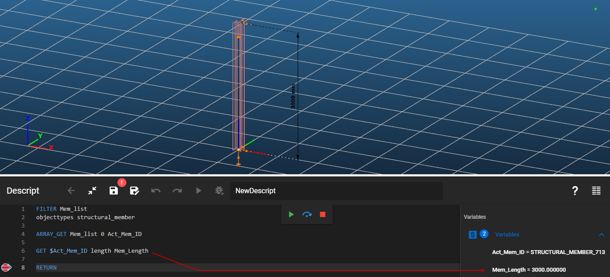

Gets an attribute value of an object.

### Syntax

**GET** \[Object ID] \[Object attribute] \[Output variable]

### Command parameters

| **Command parameter**                 | **Assignment** | **Value format**                         | **Input options** |
| ------------------------------------- | -------------- | ---------------------------------------- | ----------------- |
| [Object ID](#object-ID)               | Required       | String                                   | Local, variable   |
| [Object attribute](#object-attribute) | Required       | Predefined strings                       | Local, variable   |
| [Output variable](#output-variable)   | Required       | String                                   | Local, variable   |

#### Object ID:
The ID of the object.

Object IDs from the following object types are accepted:

- Structural members tab:
  - [Section](#section)
  - [Structural member](#structural-member)
  - [Structural plate](#structural-plate)
  - [Haunched member](#haunched-member) <span style={{color:"MediumSeaGreen"}}>(since CS 17)</span>
  - [Tapered member](#tapered-member) <span style={{color:"MediumSeaGreen"}}>(since CS 17)</span>
  - [Steel material](#steel-material)
  - [Coated steel material](#coated-steel-material)
  - [Concrete material](#conctrete-material)
  - [Rebar material](#rebar-material) <span style={{color:"MediumSeaGreen"}}>(since CS 17)</span>
  - [Point support](#point-support) <span style={{color:"MediumSeaGreen"}}>(since CS 17)</span>
  - [Line support](#line-support) <span style={{color:"MediumSeaGreen"}}>(since CS 17)</span>
  - [Surface support](#surface-support) <span style={{color:"MediumSeaGreen"}}>(since CS 17)</span>
  - [Support type](#support-type) <span style={{color:"MediumSeaGreen"}}>(since CS 17)</span>
  - [Release type](#release-type) <span style={{color:"MediumSeaGreen"}}>(since CS 17)</span>
  - [Link ](#link)<span style={{color:"MediumSeaGreen"}}>(since CS 17)</span>
- Loads tab:
  - [Load group](#load-group) <span style={{color:"MediumSeaGreen"}}>(since CS 17)</span>
  - [Load case](#load-case)
  - [Load combination](#load-combination) <span style={{color:"MediumSeaGreen"}}>(since CS 17)</span>
  - [Point load](#point-load) <span style={{color:"MediumSeaGreen"}}>(since CS 17)</span>
  - [Line load](#line-load) <span style={{color:"MediumSeaGreen"}}>(since CS 17)</span>
  - [Surface load](#surface-load) <span style={{color:"MediumSeaGreen"}}>(since CS 17)</span>
  - [Load transfer surface](#Load-transfer-surface) <span style={{color:"MediumSeaGreen"}}>(since CS 17)</span>
- Mass tab:
  - [Mass group](#mass-group) <span style={{color:"MediumSeaGreen"}}>(since CS 17)</span>
  - [Mass case](#mass-case) <span style={{color:"MediumSeaGreen"}}>(since CS 17)</span>
  - [Mass combination](#mass-combination) <span style={{color:"MediumSeaGreen"}}>(since CS 17)</span>
  - [Point mass](#point-mass) <span style={{color:"MediumSeaGreen"}}>(since CS 17)</span>
- Other:
  - [Portion ](#portion)<span style={{color:"MediumSeaGreen"}}>(since CS 17)</span>

#### Object attribute:
The requested object attribute. The available selection of object attributes depends on the object type, which is automatically determined based on the given object ID. The available object attributes can be found at the [detailed description of object](#detailed-description-of-object-types) types below.

In case we have an object ID, and don't know the type of the object it identifies, the type can also be queried with the _Object_Type_ attribute for every accepted object type.

Further information about object attributes can be found at the [CREATE](/docs/descript/command-reference/create/) and [SET](/docs/descript/command-reference/set/) commands.

#### Output variable:
The name of the variable that will store the retrieved value of the specified attribute.

### Sample code

**Command only:**

```
GET $Sec_ID0 Name Section_Name
```

**Member length with getting member ID:**

```
FILTER Mem_list
objecttypes structural_member

ARRAY_GET Mem_list 0 Act_Mem_ID

GET $Act_Mem_ID length Mem_Length
```

[](./img/Get_v01.png)

---
## Detailed description of object types

## Section

Available object attributes:

| **Object attribute name**                                                 | **Object attribute** (type this into Descript)         |
| ------------------------------------------------------------------------- | ------------------------------------------------------ |
| Name                                                                      | Name                                                   |
| Object type <span style={{color:"MediumSeaGreen"}}>(since CS 17)</span>   | Object_Type                                            |
| Material                                                                  | MaterialID                                             |
| Cross section area (A)                                                    | CrossSectionArea                                       |
| Perimeter                                                                 | Perimeter                                              |
| Angle of principal axis (α) \[rad]                                        | AngleOfMainAxis                                        |
| Centre of gravity Y (vs, section edit system translated to c.o.g.)        | CentreOfGravityInY                                     |
| Centre of gravity Z (ws, section edit system translated to c.o.g.)        | CentreOfGravityInZ                                     |
| Moment of inertia Y (IY, section edit system translated to c.o.g.)        | MomentOfInertiaY                                       |
| Moment of inertia Z (IZ, section edit system translated to c.o.g.)        | MomentofInertiaZ                                       |
| Moment of inertia YZ (IYZ, section edit system translated to c.o.g.)      | MomentOfInertiaYZ                                      |
| Moment of inertia y (Iy, principal axis system)                           | MomentOfInertiaV                                       |
| Moment of inertia z (Iz, principal axis system)                           | MomentOfInertiaW                                       |
| Inertia radius Y (iY, section edit system translated to c.o.g.)           | InertiaRadiusY                                         |
| Inertia radius Z (iZ, section edit system translated to c.o.g.)           | InertiaRadiusZ                                         |
| Inertia radius y (iy, principal axis system)                              | InertiaRadiusV                                         |
| Inertia radius z (iz, principal axis system)                              | InertiaRadiusW                                         |
| Section modulus Y minimum (W1Y, section edit system translated to c.o.g.) | MinimumSectionModulusY                                 |
| Section modulus Z minimum (W1Z, section edit system translated to c.o.g.) | MinimumSectionModulusZ                                 |
| Section modulus y minimum (W1y, section edit system translated to c.o.g.) | MinimumSectionModulusV                                 |
| Section modulus z minimum (W1z, section edit system translated to c.o.g.) | MinimumSectionModulusW                                 |
| Section modulus Y maximum (W2Y, section edit system translated to c.o.g.) | MaximumSectionModulusY                                 |
| Section modulus Z maximum (W2Z, section edit system translated to c.o.g.) | MaximumSectionModulusZ                                 |
| Section modulus y maximum (W2y, section edit system translated to c.o.g.) | MaximumSectionModulusV                                 |
| Section modulus z maximum (W2z, section edit system translated to c.o.g.) | MaximumSectionModulusW                                 |
| Shear centre Y (y0, section edit system translated to c.o.g.)             | ShearCentreY                                           |
| Shear centre Z (z0, section edit system translated to c.o.g.)             | ShearCentreZ                                           |
| Shear centre y (y0, principal axis system)                                | ShearCentreV                                           |
| Shear centre z (z0, principal axis system)                                | ShearCentreW                                           |
| Warping static moment                                                     | WarpingStaticMoment                                    |
| St. Venant torsional constant (It)                                        | TorsionalConstantX                                     |
| Warping constant (Iw)                                                     | WarpingConstant                                        |
| Shear area y (AsY)                                                        | ShearAreaY                                             |
| Shear area z (AsZ)                                                        | ShearAreaZ                                             |
| Ratio of shear area and total area Y (ρY)                                 | RhoY                                                   |
| Ratio of shear area and total area Z (ρZ)                                 | RhoZ                                                   |
| Static moment y (Y0, section edit system translated to c.o.g.)            | StaticMomentY                                          |
| Static moment z (Z0, section edit system translated to c.o.g.)            | StaticMomentZ                                          |
| Static moment y (Sy, principal axis system)                               | StaticMomentV                                          |
| Static moment z (Sz, principal axis system)                               | StaticMomentW                                          |
| Width of embed rectangle Y (section edit system)                          | WidthY                                                 |
| Height of embed rectangle Z (section edit system)                         | WidthZ                                                 |
| Type                                                                      | Type                                                   |
| Section group                                                             | GroupName                                              |
| Comment                                                                   | Comment                                                |
| Origin                                                                    | Origin                                                 |
| Parameters                                                                | Parameters                                             |

Explanation for the section Type, GroupName , Source and Parameters attributes:

[](./img/wp-content-uploads-2021-09-image-60.png)

### Sample code

**All available attributes + object creation:**
```
LOAD_SECTION_LIBRARY Sec_ID1 "HEA 200"

GET Sec_ID1 Name Name
GET Sec_ID1 Object_Type Object_Type                //(since CS 17)
GET Sec_ID1 MaterialID MaterialID
GET Sec_ID1 CrossSectionArea CrossSectionArea
GET Sec_ID1 Perimeter Perimeter
GET Sec_ID1 AngleOfMainAxis AngleOfMainAxis
GET Sec_ID1 CentreOfGravityInY CentreOfGravityInY
GET Sec_ID1 CentreOfGravityInZ CentreOfGravityInZ
GET Sec_ID1 MomentOfInertiaY MomentOfInertiaY
GET Sec_ID1 MomentofInertiaZ MomentofInertiaZ
GET Sec_ID1 MomentOfInertiaYZ MomentOfInertiaYZ
GET Sec_ID1 MomentOfInertiaV MomentOfInertiaV
GET Sec_ID1 MomentOfInertiaW MomentOfInertiaW
GET Sec_ID1 InertiaRadiusy InertiaRadiusY
GET Sec_ID1 InertiaRadiusz InertiaRadiusZ
GET Sec_ID1 InertiaRadiusv InertiaRadiusV
GET Sec_ID1 InertiaRadiusw InertiaRadiusW
GET Sec_ID1 MinimumSectionModulusY MinimumSectionModulusY
GET Sec_ID1 MinimumSectionModulusZ MinimumSectionModulusZ
GET Sec_ID1 MinimumSectionModulusV MinimumSectionModulusV
GET Sec_ID1 MinimumSectionModulusW MinimumSectionModulusW
GET Sec_ID1 MaximumSectionModulusY MaximumSectionModulusY
GET Sec_ID1 MaximumSectionModulusZ MaximumSectionModulusZ
GET Sec_ID1 MaximumSectionModulusV MaximumSectionModulusV
GET Sec_ID1 MaximumSectionModulusW MaximumSectionModulusW
GET Sec_ID1 ShearCentreY ShearCentreY
GET Sec_ID1 ShearCentreZ ShearCentreZ
GET Sec_ID1 ShearCentreV ShearCentreV
GET Sec_ID1 ShearCentreW ShearCentreW
GET Sec_ID1 TorsionalConstantX TorsionalConstantX
GET Sec_ID1 WarpingConstant WarpingConstant
GET Sec_ID1 ShearAreaY ShearAreaY
GET Sec_ID1 ShearAreaZ ShearAreaZ
GET Sec_ID1 RhoY RhoY
GET Sec_ID1 RhoZ RhoZ
GET Sec_ID1 StaticMomentY StaticMomentY
GET Sec_ID1 StaticMomentZ StaticMomentZ
GET Sec_ID1 StaticMomentV StaticMomentV
GET Sec_ID1 StaticMomentW StaticMomentW
GET Sec_ID1 WarpingStaticMoment WarpingStaticMoment
GET Sec_ID1 WidthY WidthY
GET Sec_ID1 WidthZ WidthZ
GET Sec_ID1 Type Type
GET Sec_ID1 GroupName GroupName
GET Sec_ID1 Comment Comment
GET Sec_ID1 Origin Origin
GET Sec_ID1 Parameters Parameters
```

## Structural member

Available object attributes:

| **Object attribute name**         | **Object attribute** (type this into Descript) |
| --------------------------------- | ---------------------------------------------- |
| Name                              | Name                                           |
| Object type <span style={{color:"MediumSeaGreen"}}>(since CS 17)</span>       | Object_Type                                    |
| Material ID                       | MaterialID                                     |
| Section ID                        | SectionID                                      |
| Length                            | Length                                         |
| Release start point               | ReleaseID_A                                    |
| Release end point                 | ReleaseID_B                                    |
| Eccentricity - y                  | Eccentricity_y                                 |
| Eccentricity - z                  | Eccentricity_z                                 |
| Axial rotation                    | Rotation                                       |
| Initial bow imperfection L/y      | GeomImpV                                       |
| Initial bow imperfection L/z      | GeomImpW                                       |
| Finite element type               | Fe_Type                                        |
| Finite element generation type    | ConvergenceType                                |
| Number of finite elements         | Convergence                                    |
| Finite element size of the web    | AverageEdgeLength_Web                          |
| Finite element size of the flange | AverageEdgeLength_Flange                       |
| Type of the constraint elements   | ShellDOFConstraint                             |
| Line ID                           | Edge                                           |

### Sample code

**All available attributes + object creation:**
```
LOAD_SECTION_LIBRARY Sec_ID1 "HEA 200"

CREATE Mem_ID1 Structural_Member "HEA 200"
0 0 0
0 0 3000

GET Mem_ID1 Name Name
GET Mem_ID1 Object_Type Object_Type                //(since CS 17)
GET Mem_ID1 MaterialID MaterialID
GET Mem_ID1 SectionID SectionID
GET Mem_ID1 Length Length
GET Mem_ID1 Release_A Release_A
GET Mem_ID1 Release_B Release_B
GET Mem_ID1 Eccentricity_y Eccentricity_y
GET Mem_ID1 Eccentricity_z Eccentricity_z
GET Mem_ID1 Rotation Rotation
GET Mem_ID1 GeomImpV GeomImpV
GET Mem_ID1 GeomImpW GeomImpW
GET Mem_ID1 Fe_Type Fe_Type
GET Mem_ID1 ConvergenceType ConvergenceType
GET Mem_ID1 Convergence Convergence
GET Mem_ID1 AverageEdgeLength_Web AverageEdgeLength_Web
GET Mem_ID1 AverageEdgeLength_Flange AverageEdgeLength_Flange
GET Mem_ID1 ShellDOFConstraint ShellDOFConstraint
GET Mem_ID1 Edge Edge
```

## Structural plate

Available object attributes:

| **Object attribute name**   | **Object attribute** (type this into Descript) |
| --------------------------- | ---------------------------------------------- |
| Name                        | Name                                           |
| Object type <span style={{color:"MediumSeaGreen"}}>(since CS 17)</span> | Object_Type                                    |
| Material ID                 | MaterialID                                     |
| Thickness                   | Thickness                                      |
| Finite element size         | AverageEdgeLength                              |

### Sample code

**All available attributes + object creation:**
```
CREATE SPID1 Structural_Plate "C25/30 EN 1992-1-1:2010" 200 50
0 0 0
3000 0 0
3000 3000 0
0 3000 0

GET SPID1 Name Name
GET SPID1 Object_Type Object_Type                //(since CS 17)
GET SPID1 MaterialID MaterialID
GET SPID1 Thickness Thickness
GET SPID1 AverageEdgeLength AverageEdgeLength
```

## Haunched member

Available object attributes:

| **Object attribute name**          | **Object attribute** (type this into Descript) |
| ---------------------------------- | ---------------------------------------------- |
| Name                               | Name                                           |
| Object type <span style={{color:"MediumSeaGreen"}}>(since CS 17)</span>        | Object_Type                                    |
| Member ID                          | OnMemberID                                     |
| Start height                       | Hstart                                         |
| End height                         | Hend                                           |
| Section type                       | SecType                                        |
| Section ID                         | SectionID                                      |
| Web thickness                      | Tw                                             |
| Flange thickness                   | Tf                                             |
| Flange width                       | B                                              |
| Length                             | L                                              |
| Haunch position                    | Type                                           |
| Start position along member length | StartX                                         |

### Sample code

**All available attributes + object creation:**
```
LOAD_SECTION_library Sec_ID1 "HEA 200"

CREATE Mem_ID1 Structural_Member "HEA 200"
0 0 0
0 0 3000

CREATE Hau_ID1 Haunched_Member Mem_ID1 lower 2000 600 50 "HEA 200"
0 0 0
1 0 0

GET Hau_ID1 Name Name
GET Hau_ID1 Object_Type Object_Type                //(since CS 17)
GET Hau_ID1 OnMemberID OnMemberID
GET Hau_ID1 Hstart Hstart
GET Hau_ID1 Hend Hend
GET Hau_ID1 SecType SecType
GET Hau_ID1 SectionID SectionID
GET Hau_ID1 Tw Tw
GET Hau_ID1 Tf Tf
GET Hau_ID1 B B
GET Hau_ID1 L L
GET Hau_ID1 Type Type
GET Hau_ID1 StartX StartX
```

## Tapered member

Available object attributes:

| **Object attribute name**   | **Object attribute** (type this into Descript) |
| --------------------------- | ---------------------------------------------- |
| Name                        | Name                                           |
| Object type <span style={{color:"MediumSeaGreen"}}>(since CS 17)</span> | Object_Type                                    |
| Member ID                   | OnMemberID                                     |
| Start height                | Hstart                                         |
| End height                  | Hend                                           |
| Beam eccentricity           | Format                                         |

### Sample code

**All available attributes + object creation:**
```
LOAD_SECTION_MACRO Sec_ID1 WLD-IH Descript_Section "S 235 EN 10025-2" 100 10 200 6 100 10

CREATE Mem_ID1 Structural_Member Descript_Section
0 0 0
0 0 3000

CREATE Tapered_ID1 Tapered_Member Mem_ID1 400 200
Format Centric

GET Tapered_ID1 Name Name
GET Tapered_ID1 Object_Type Object_Type                //(since CS 17)
GET Tapered_ID1 OnMemberID OnMemberID
GET Tapered_ID1 Hstart Hstart
GET Tapered_ID1 Hend Hend
GET Tapered_ID1 Format Format
```

## Steel material

Available object attributes:

| **Object attribute name**             | **Object attribute** (type this into Descript) |
| ------------------------------------- | ---------------------------------------------- |
| Name                                  | Name                                           |
| Object type <span style={{color:"MediumSeaGreen"}}>(since CS 17)</span>           | Object_Type                                    |
| Density                               | Density                                        |
| Elastic modulus                       | Elasticity                                     |
| Poisson factor                        | Poisson                                        |
| Thermal expansion coefficient         | Thermal                                        |
| Thermal expansion coefficient in fire | ThermalFi                                      |
| Yield strength 1                      | Fy1                                            |
| Yield strength 2                      | Fy2                                            |
| Ultimate strength 1                   | Fu1                                            |
| Ultimate strength 2                   | Fu2                                            |
| Thickness Y                           | ThicknessY                                     |
| Thickness U                           | ThicknessU                                     |

### Sample code

**All available attributes + object creation:**
```
CREATE Steel_Mat_ID1 Steel "Custom steel name" 7850 210000 0.3 0.000012 0.000014 235 215 360 360 40 40

GET Steel_Mat_ID1 Name Name
GET Steel_Mat_ID1 Object_Type Object_Type                //(since CS 17)
GET Steel_Mat_ID1 Density Density
GET Steel_Mat_ID1 Elasticity Elasticity
GET Steel_Mat_ID1 Poisson Poisson
GET Steel_Mat_ID1 Thermal Thermal
GET Steel_Mat_ID1 ThermalFi ThermalFi
GET Steel_Mat_ID1 Fy1 Fy1
GET Steel_Mat_ID1 Fy2 Fy2
GET Steel_Mat_ID1 Fu1 Fu1
GET Steel_Mat_ID1 Fu2 Fu2
GET Steel_Mat_ID1 ThicknessY ThicknessY
GET Steel_Mat_ID1 ThicknessU ThicknessU
```

## Coated steel material

Available object attributes:

| **Object attribute name**             | **Object attribute** (type this into Descript) |
| ------------------------------------- | ---------------------------------------------- |
| Name                                  | Name                                           |
| Object type <span style={{color:"MediumSeaGreen"}}>(since CS 17)</span>           | Object_Type                                    |
| Density                               | Density                                        |
| Elastic modulus                       | Elasticity                                     |
| Poisson factor                        | Poisson                                        |
| Thermal expansion coefficient         | Thermal                                        |
| Thermal expansion coefficient in fire | ThermalFi                                      |
| Basic yield strength                  | Fyb                                            |
| Ultimate strength                     | Fu                                             |
| Coating thickness                     | CoatingThickness                               |

### Sample code

**All available attributes + object creation:**
```
CREATE CSteel_Mat_ID1 Coated_Steel "Custom coated steel name" 7850 210000 0.3 0.000012 0.000014 350 420 0.02

GET CSteel_Mat_ID1 Name Name
GET CSteel_Mat_ID1 Object_Type Object_Type                //(since CS 17)
GET CSteel_Mat_ID1 Density Density
GET CSteel_Mat_ID1 Elasticity Elasticity
GET CSteel_Mat_ID1 Poisson Poisson
GET CSteel_Mat_ID1 Thermal Thermal
GET CSteel_Mat_ID1 ThermalFi ThermalFi
GET CSteel_Mat_ID1 Fyb Fyb
GET CSteel_Mat_ID1 Fu Fu
GET CSteel_Mat_ID1 CoatingThickness CoatingThickness
```

## Conctrete material

Available object attributes:

| **Object attribute name**             | **Object attribute** (type this into Descript) |
| ------------------------------------- | ---------------------------------------------- |
| Name                                  | Name                                           |
| Object type <span style={{color:"MediumSeaGreen"}}>(since CS 17)</span>           | Object_Type                                    |
| Density                               | Density                                        |
| Secant modulus of elasticity          | Elasticity                                     |
| Compressive strength                  | Fck                                            |
| Characteristic tensile strength       | Fctk                                           |
| Mean tensile strength <span style={{color:"MediumSeaGreen"}}>(since CS 17)</span> | Fctm                                           |
| Final value of creep coefficient      | Creep                                          |
| Poisson factor                        | Poisson                                        |
| Thermal expansion coefficient         | Thermal                                        |
| Material model <span style={{color:"MediumSeaGreen"}}>(since CS 17)</span>        | ModelType                                      |
| Yield strain #1                       | EpsC0                                          |
| Ultimite strain #1                    | EpsCu0                                         |
| Compression strength reduction factor | Eta                                            |
| Yield strain #2                       | EpsC1                                          |
| Ultimite strain #2                    | EpsCu1                                         |
| Yield strain #3                       | EpsC2                                          |
| Ultimite strain #3                    | EpsCu2                                         |
| Exponent                              | Exp                                            |

### Sample code

**All available attributes + object creation:**
```
CREATE Concrete_Mat_ID1 Concrete "Custom concrete name" 2500 31476 25 1.8 2.6 2.35 0.2 0.00001 DiagramRectangle 0.0007 0.0035 1 0.002 0.0035 0.00175 0.0035 2

GET Concrete_Mat_ID1 Name Name
GET Concrete_Mat_ID1 Object_Type Object_Type                //(since CS 17)
GET Concrete_Mat_ID1 Density Density
GET Concrete_Mat_ID1 Elasticity Elasticity
GET Concrete_Mat_ID1 Fck Fck
GET Concrete_Mat_ID1 Fctk Fctk
GET Concrete_Mat_ID1 Fctm Fctm                       //(since CS 17)
GET Concrete_Mat_ID1 Creep Creep
GET Concrete_Mat_ID1 Poisson Poisson
GET Concrete_Mat_ID1 Thermal Thermal
GET Concrete_Mat_ID1 ModelType ModelType             //(since CS 17)
GET Concrete_Mat_ID1 EpsC0 EpsC0
GET Concrete_Mat_ID1 EpsCu0 EpsCu0
GET Concrete_Mat_ID1 Eta Eta
GET Concrete_Mat_ID1 EpsC1 EpsC1
GET Concrete_Mat_ID1 EpsCu1 EpsCu1
GET Concrete_Mat_ID1 EpsC2 EpsC2
GET Concrete_Mat_ID1 EpsCu2 EpsCu2
GET Concrete_Mat_ID1 Exp Exp
```

## Rebar material

Available object attributes:

| **Object attribute name**             | **Object attribute** (type this into Descript) |
| ------------------------------------- | ---------------------------------------------- |
| Name                                  | Name                                           |
| Object type <span style={{color:"MediumSeaGreen"}}>(since CS 17)</span>           | Object_Type                                    |
| Density                               | Density                                        |
| Elastic modulus                       | Elasticity                                     |
| Poisson factor                        | Poisson                                        |
| Thermal expansion coefficient         | Thermal                                        |
| Characteristic yield strength         | Fyk                                            |
| Characteristic strain at maximum load | EpsSu                                          |

### Sample code

**All available attributes + object creation:**
```
CREATE Rebar_Mat_ID1 Rebar "Custom rebar name" 7850 200000 0.3 0.00001 500 0.05

GET Rebar_Mat_ID1 Name Name
GET Rebar_Mat_ID1 Object_Type Object_Type                //(since CS 17)
GET Rebar_Mat_ID1 Density Density
GET Rebar_Mat_ID1 Elasticity Elasticity
GET Rebar_Mat_ID1 Poisson Poisson
GET Rebar_Mat_ID1 Thermal Thermal
GET Rebar_Mat_ID1 Fyk Fyk
GET Rebar_Mat_ID1 EpsSu EpsSu
```

## Point support

Available object attributes:

| **Object attribute name**   | **Object attribute** (type this into Descript) |
| --------------------------- | ---------------------------------------------- |
| Name                        | Name                                           |
| Object type <span style={{color:"MediumSeaGreen"}}>(since CS 17)</span> | Object_Type                                    |
| Support type                | SupportID                                      |
| Eccentricity reference      | EccType                                        |
| Eccentricity - y            | EccY                                           |
| Eccentricity - z            | EccZ                                           |
| Structural ID               | StructuralID                                   |
| Coordinate system           | DirType                                        |

### Sample code

**All available attributes + object creation:**
```
LOAD_SECTION_MACRO Sec_ID1 WLD-IH "Descript Section" "S 235 EN 10025-2" 100 10 200 6 100 10

CREATE Member_ID1 Structural_member "Descript Section"
0 0 0
0 0 3000

CREATE PSup_ID1 Support_Point Member_ID1 Fixed
0 0 0
EccType EccType_TM

SET PSup_ID1 EccY 21
SET PSup_ID1 EccZ 33

GET PSup_ID1 Name Name
GET PSup_ID1 Object_Type Object_Type                //(since CS 17)
GET PSup_ID1 SupportID SupportID
GET PSup_ID1 EccType EccType
GET PSup_ID1 EccY EccY
GET PSup_ID1 EccZ EccZ
GET PSup_ID1 StructuralID StructuralID
GET PSup_ID1 DirType DirType
```

## Line support

Available object attributes:

| **Object attribute name**   | **Object attribute** (type this into Descript) |
| --------------------------- | ---------------------------------------------- |
| Name                        | Name                                           |
| Object type <span style={{color:"MediumSeaGreen"}}>(since CS 17)</span> | Object_Type                                    |
| Support type                | SupportID                                      |
| Eccentricity reference      | EccType                                        |
| Eccentricity - y            | EccY                                           |
| Eccentricity - z            | EccZ                                           |
| Structural ID               | StructuralID                                   |
| Coordinate system           | DirType                                        |

### Sample code

**All available attributes + object creation:**
```
LOAD_SECTION_MACRO Sec_ID1 WLD-IH "WLD-IH (Descript)" "S 235 EN 10025-2" 100 10 200 6 100 10

CREATE Member_ID1 Structural_member "WLD-IH (Descript)"
0 0 0
0 0 3000

CREATE LSup_ID1 Support_Edge Member_ID1 Fixed
Name "Line support 1 (Descript)"
CoordSys Local
EccType EccType_TM

GET LSup_ID1 Name Name
GET LSup_ID1 Object_Type Object_Type                //(since CS 17)
GET LSup_ID1 SupportID SupportID
GET LSup_ID1 EccType EccType
GET LSup_ID1 EccY EccY
GET LSup_ID1 EccZ EccZ
GET LSup_ID1 StructuralID StructuralID
GET LSup_ID1 DirType DirType
```

## Surface support

Available object attributes:

| **Object attribute name**   | **Object attribute** (type this into Descript) |
| --------------------------- | ---------------------------------------------- |
| Name                        | Name                                           |
| Object type <span style={{color:"MediumSeaGreen"}}>(since CS 17)</span> | Object_Type                                    |
| Support type                | SupportID                                      |
| Plate ID                    | PlateID                                        |
| Coordinate system           | DirType                                        |

### Sample code

**All available attributes + object creation:**

A new surface support type with the name "Fixed" have to be created manually before runnnig this code.

```
CREATE Plate_ID1 Structural_Plate "C25/30 EN 1992-1-1:2010" 200
0 0 0
3000 0 0
3000 3000 0

CREATE SurfSup_ID1 Support_Plate Plate_ID1 Fixed
Name "Surface support 1"
CoordSys Local

GET SurfSup_ID1 Name Name
GET SurfSup_ID1 Object_Type Object_Type                //(since CS 17)
GET SurfSup_ID1 SupportID SupportID
GET SurfSup_ID1 PlateID PlateID
GET SurfSup_ID1 DirType DirType
```

## Support type

Available object attributes:

| **Object attribute name**                      | **Object attribute** (type this into Descript) |
| ---------------------------------------------- | ---------------------------------------------- |
| Name                                           | Name                                           |
| Object type <span style={{color:"MediumSeaGreen"}}>(since CS 17)</span>                    | Object_Type                                    |
| Dimension (Point, Line, Surface)               | Dimension                                      |
| Translational degree of freedom in x direction | x                                              |
| Translational degree of freedom in y direction | y                                              |
| Translational degree of freedom in z direction | z                                              |
| Rotational degree of freedom around x axis     | xx                                             |
| Rotational degree of freedom around y axis     | yy                                             |
| Rotational degree of freedom around z axis     | zz                                             |
| Warping                                        | w                                              |

### Sample code

**All available attributes + object creation:**
```
CREATE PSup_Type_ID1 Support "Custom support type name" Free 1234 2345 Fix Fix Fix Fix

GET PSup_Type_ID1 Name Name
GET PSup_Type_ID1 Object_Type Object_Type                //(since CS 17)
GET PSup_Type_ID1 Dimension Dimension
GET PSup_Type_ID1 x x
GET PSup_Type_ID1 y y
GET PSup_Type_ID1 z z
GET PSup_Type_ID1 xx xx
GET PSup_Type_ID1 yy yy
GET PSup_Type_ID1 zz zz
GET PSup_Type_ID1 w w
```

## Release type

Available object attributes:

| **Object attribute name**                      | **Object attribute** (type this into Descript) |
| ---------------------------------------------- | ---------------------------------------------- |
| Name                                           | Name                                           |
| Object type <span style={{color:"MediumSeaGreen"}}>(since CS 17)</span>                    | Object_Type                                    |
| Translational degree of freedom in x direction | x                                              |
| Translational degree of freedom in y direction | y                                              |
| Translational degree of freedom in z direction | z                                              |
| Rotational degree of freedom around x axis     | xx                                             |
| Rotational degree of freedom around y axis     | yy                                             |
| Rotational degree of freedom around z axis     | zz                                             |
| Warping                                        | w                                              |

### Sample code

**All available attributes + object creation:**
```
CREATE Release_Type_ID1 Release "Custom release type name" Free 1234 2345 Fix Fix Fix Fix

GET Release_Type_ID1 Name Name
GET Release_Type_ID1 Object_Type Object_Type                //(since CS 17)
GET Release_Type_ID1 x x
GET Release_Type_ID1 y y
GET Release_Type_ID1 z z
GET Release_Type_ID1 xx xx
GET Release_Type_ID1 yy yy
GET Release_Type_ID1 zz zz
GET Release_Type_ID1 w w
```

## Link

Available object attributes:

| **Object attribute name**   | **Object attribute** (type this into Descript) |
| --------------------------- | ---------------------------------------------- |
| Name                        | Name                                           |
| Object type <span style={{color:"MediumSeaGreen"}}>(since CS 17)</span> | Object_Type                                    |
| Release ID                  | ReleaseID                                      |
| Position of connection      | InterfacePos                                   |
| Rotation                    | Rotation                                       |

### Sample code

**All available attributes + object creation:**
```
LOAD_SECTION_MACRO Sec_ID1 WLD-IH "Descript Section" "S 235 EN 10025-2" 100 10 200 6 100 10

CREATE Member_ID1 Structural_member "Descript Section"
1000 0 0
5000 0 0

CREATE Member_ID2 Structural_member "Descript Section"
1000 0 600
5000 0 600

CREATE Link_ID1 Link
1000 0 0
1000 0 600
Rotation 20
InterfacePos 0.5
ReleaseID yy

GET Link_ID1 Name Name
GET Link_ID1 Object_Type Object_Type                //(since CS 17)
GET Link_ID1 ReleaseID ReleaseID
GET Link_ID1 InterfacePos InterfacePos
GET Link_ID1 Rotation Rotation
```

## Load group

Available object attributes:

| **Object attribute name**            | **Object attribute** (type this into Descript) |
| ------------------------------------ | ---------------------------------------------- |
| Name                                 | Name                                           |
| Object type <span style={{color:"MediumSeaGreen"}}>(since CS 17)</span>          | Object_Type                                    |
| Load group type                      | LoadGroupType                                  |
| Safety factor                        | Factor_0                                       |
| Combination factor                   | Factor_1                                       |
| Factor of frequent load level        | Factor_2                                       |
| Factor of quasi-permanent load level | Factor_3                                       |

### Sample code

**All available attributes + object creation:**
```
CREATE LG_ID1 LoadGroup
Name "Variable (Descript)"
LoadGroupType LGType_EN_P
Factor_0 1.35
Factor_1 1
Factor_2 0.9
Factor_3 0

GET LG_ID1 Name Name
GET LG_ID1 Object_Type Object_Type                //(since CS 17)
GET LG_ID1 LoadGroupType LoadGroupType
GET LG_ID1 Factor_0 Factor_0
GET LG_ID1 Factor_1 Factor_1
GET LG_ID1 Factor_2 Factor_2
GET LG_ID1 Factor_3 Factor_3
```

## Load case

Available object attributes:

| **Object attribute name**                                | **Object attribute** (type this into Descript) |
| -------------------------------------------------------- | ---------------------------------------------- |
| Name                                                     | Name                                           |
| Object type <span style={{color:"MediumSeaGreen"}}>(since CS 17)</span>                              | Object_Type                                    |
| Load group ID                                            | LoadGroupID                                    |
| Convert loads to mass                                    | ConvertToMass                                  |
| Can be favourable in the combination                     | CanBeFavourable                                |
| Can't be the main in persistent or transient combination | NotMainInTransientCmb                          |
| Can't be the main in accidental combination              | NotMainInAccidentalCmb                         |
| Calculation of loadcase                                  | Calculate                                      |

### Sample code

**All available attributes + object creation:**
```
CREATE LG_ID1 LoadGroup
Name "Variable (Descript)"
LoadGroupType LGType_EN_P

CREATE LCase_ID1 LoadCase
Name "Load case 1 (Descript)"
LoadGroupID LG_ID1

GET LCase_ID1 Name Name
GET LCase_ID1 Object_Type Object_Type                //(since CS 17)
GET LCase_ID1 LoadGroupID LoadGroupID
GET LCase_ID1 ConvertToMass ConvertToMass
GET LCase_ID1 CanBeFavourable CanBeFavourable
GET LCase_ID1 NotMainInTransientCmb NotMainInTransientCmb
GET LCase_ID1 NotMainInAccidentalCmb NotMainInAccidentalCmb
GET LCase_ID1 Calculate Calculate
```

## Load combination

Available object attributes:

| **Object attribute name**   | **Object attribute** (type this into Descript) |
| --------------------------- | ---------------------------------------------- |
| Name                        | Name                                           |
| Object type <span style={{color:"MediumSeaGreen"}}>(since CS 17)</span> | Object_Type                                    |
| Combination type            | Type                                           |

### Sample code

**All available attributes + object creation:**
```
CREATE LG_ID1 LoadGroup
Name "Permanent (Descript)"
LoadGroupType LGType_EN_P

CREATE LCase_ID1 LoadCase
Name "Load case 1 (Descript)"
LoadGroupID LG_ID1

CREATE LComb_ID1 LoadCombination
Name "Load combination (Descript)"
Type ULS_Accidental
LCase_ID1 1

GET LComb_ID1 Name Name
GET LComb_ID1 Object_Type Object_Type                //(since CS 17)
GET LComb_ID1 Type Type
```

## Point load

Available object attributes:

| **Object attribute name**                 | **Object attribute** (type this into Descript) |
| ----------------------------------------- | ---------------------------------------------- |
| Name                                      | Name                                           |
| Object type <span style={{color:"MediumSeaGreen"}}>(since CS 17)</span>               | Object_Type                                    |
| ID of the load bearing structural element | ForceOnID                                      |
| Load case ID                              | LoadCaseID                                     |
| Coordinate system                         | DirType                                        |
| Force in x direction                      | X                                              |
| Force in y direction                      | Y                                              |
| Force in z direction                      | Z                                              |
| Moment around x axis                      | MX                                             |
| Moment around y axis                      | MY                                             |
| Moment around z axis                      | MZ                                             |
| Multiplication factor                     | MulFac                                         |
| Eccentricity reference                    | EccType                                        |
| Eccentricity - y                          | EccY                                           |
| Eccentricity - z                          | EccZ                                           |

### Sample code

**All available attributes + object creation:**
```
LOAD_SECTION_LIBRARY Sec_ID1 "HEA 200"

CREATE LG_ID1 LoadGroup
Name "Permanent (Descript)"
LoadGroupType LGType_EN_P

CREATE LCase_ID1 LoadCase
Name "Load case 1 (Descript)"
LoadGroupID LG_ID1

CREATE Mem_ID1 Structural_member "HEA 200"
0 0 0
0 0 3000

CREATE PLoad_ID1 NodeForce LCase_ID1 Mem_ID1 local
0 0 3000
-100 0 0
0 0 0
EccType EccType_TM

GET PLoad_ID1 Name Name
GET PLoad_ID1 Object_Type Object_Type                //(since CS 17)
GET PLoad_ID1 ForceOnID ForceOnID
GET PLoad_ID1 LoadCaseID LoadCaseID
GET PLoad_ID1 DirType DirType
GET PLoad_ID1 x x
GET PLoad_ID1 y y
GET PLoad_ID1 z z
GET PLoad_ID1 Mx Mx
GET PLoad_ID1 My My
GET PLoad_ID1 Mz Mz
GET PLoad_ID1 MulFac MulFac
GET PLoad_ID1 EccType EccType
GET PLoad_ID1 EccY EccY
GET PLoad_ID1 EccZ EccZ
```

## Line load

Available object attributes:

| **Object attribute name**                 | **Object attribute** (type this into Descript) |
| ----------------------------------------- | ---------------------------------------------- |
| Name                                      | Name                                           |
| Object type <span style={{color:"MediumSeaGreen"}}>(since CS 17)</span>               | Object_Type                                    |
| ID of the load bearing structural element | ForceOnID                                      |
| Load case ID                              | LoadCaseID                                     |
| Coordinate system                         | DirType                                        |
| X force component at reference point 1    | X1                                             |
| Y force component at reference point 1    | Y1                                             |
| Z force component at reference point 1    | Z1                                             |
| X force component at reference point 2    | X2                                             |
| Y force component at reference point 2    | Y2                                             |
| Z force component at reference point 2    | Z2                                             |
| Multiplication factor                     | MulFac                                         |
| Reference point 1                         | End1                                           |
| Reference point 2                         | End2                                           |
| Distance 1                                | Pos1                                           |
| Distance 2                                | Pos2                                           |
| Eccentricity reference                    | EccType                                        |
| Eccentricity - y                          | EccY                                           |
| Eccentricity - z                          | EccZ                                           |

### Sample code

**All available attributes + object creation:**
```
LOAD_SECTION_LIBRARY Sec_ID1 "IPE 200"

CREATE LG_ID1 LoadGroup
Name "Permanent (Descript)"
LoadGroupType LGType_EN_P

CREATE LCase_ID1 LoadCase
Name "Load case 1 (Descript)"
LoadGroupID LG_ID1

CREATE Mem_ID1 Structural_member "IPE 200"
0 0 0
3000 0 0

CREATE LLoad_ID1 MemberForce LCase_ID1 Mem_ID1 local
0 1
200 400
0 0 -10
0 0 -12
EccType EccType_TM

GET LLoad_ID1 Name Name
GET LLoad_ID1 Object_Type Object_Type                //(since CS 17)
GET LLoad_ID1 ForceOnID ForceOnID
GET LLoad_ID1 LoadCaseID LoadCaseID
GET LLoad_ID1 DirType DirType
GET LLoad_ID1 X1 X1
GET LLoad_ID1 Y1 Y1
GET LLoad_ID1 Z1 Z1
GET LLoad_ID1 X2 X2
GET LLoad_ID1 Y2 Y2
GET LLoad_ID1 Z2 Z2
GET LLoad_ID1 MulFac MulFac
GET LLoad_ID1 End1 End1
GET LLoad_ID1 End2 End2
GET LLoad_ID1 Pos1 Pos1
GET LLoad_ID1 Pos2 Pos2
GET LLoad_ID1 EccType EccType
GET LLoad_ID1 EccY EccY
GET LLoad_ID1 EccZ EccZ
```

## Surface load

A surface load can be of 2 different types: uniform or linearly distributed. Some attributes only apply for one of the load distribution types.

Available object attributes:

| **Object attribute name**                   | **Object attribute** (type this into Descript) |
| ------------------------------------------- | ---------------------------------------------- |
| Name                                        | Name                                           |
| Object type <span style={{color:"MediumSeaGreen"}}>(since CS 17)</span>                 | Object_Type                                    |
| Load case ID                                | LoadCaseID                                     |
| X force component _(uniform distr.)_        | X                                              |
| Y force component _(uniform distr.)_        | Y                                              |
| Z force component _(uniform distr.)_        | Z                                              |
| Multiplication factor                       | MulFac                                         |
| Load direction _(linear distr.)_            | LoadDir                                        |
| Coordinate system _(linear distr.)_         | DirType                                        |
| Load intensity at point 1 _(linear distr.)_ | LoadValue_1                                    |
| Load intensity at point 2 _(linear distr.)_ | LoadValue_2                                    |
| Load intensity at point 3 _(linear distr.)_ | LoadValue_3                                    |

### Sample code

**All available attributes + object creation:**
```
CREATE LG_ID1 LoadGroup
Name "Variable (Descript)"
LoadGroupType LGType_EN_P

CREATE LCase_ID1 LoadCase
Name "Load case 1 (Descript)"
LoadGroupID LG_ID1

CREATE Plate_ID1 Structural_Plate "C25/30 EN 1992-1-1:2010" 200
0 0 0+1000
3000 0 0
3000 3000 0
0 3000 0+1000

CREATE Plate_ID2 Structural_Plate "C25/30 EN 1992-1-1:2010" 200
0-5000 0 0+1000
3000-5000 0 0
3000-5000 3000 0
0-5000 3000 0+1000

CREATE SLoadUni_ID1 PlateForce_Uniform LCase_ID1 Plate_ID1 Global
0 0 -10
0 0 0+1000
2000 0 0+(1000/3)
2000 3000 0+(1000/3)
0 3000 0+1000

CREATE SLoadLin_ID2 PlateForce_Linear LCase_ID1 Plate_ID2 Local
LoadDirection z
DistributionType x
0-5000 0 0+1000 -20
3000-5000 0 0 -10
0-5000 0 0+1000
3000-5000 0 0
2000-5000 3000 0+(1000/3)
0-5000 3000 0+1000

// Uniform
GET SLoadUni_ID1 Name Name
GET SLoadUni_ID1 Object_Type Object_Type                //(since CS 17)
GET SLoadUni_ID1 ForceOnID ForceOnID_Uni
GET SLoadUni_ID1 LoadCaseID LoadCaseID
GET SLoadUni_ID1 x x
GET SLoadUni_ID1 y y
GET SLoadUni_ID1 z z
GET SLoadUni_ID1 MulFac MulFac
GET SLoadUni_ID1 DirType DirType_Uni

// Linear
GET SLoadLin_ID2 ForceOnID ForceOnID_Lin
GET SLoadLin_ID2 LoadDir LoadDir
GET SLoadLin_ID2 DirType DirType_Lin
GET SLoadLin_ID2 LoadValue_1 LoadValue_1
GET SLoadLin_ID2 LoadValue_2 LoadValue_2
GET SLoadLin_ID2 LoadValue_3 LoadValue_3
```

## Load transfer surface

Available object attributes:

| **Object attribute name**   | **Object attribute** (type this into Descript) |
| --------------------------- | ---------------------------------------------- |
| Name                        | Name                                           |
| Object type <span style={{color:"MediumSeaGreen"}}>(since CS 17)</span> | Object_Type                                    |
| Member selection type       | BeamDefType                                    |
| Beam IDs                    | BeamIDs                                        |
| Distribution method         | DistribMethod                                  |
| Load eccentricity z         | LoadEccZ                                       |

### Sample code

**All available attributes + object creation:**
```
CREATE LTS_ID1 LoadTransferSurface "LTS 1"
0 0 0
3000 0 0
3000 3000 0
0 3000 0

LOAD_SECTION_MACRO Sec_ID2 WLD-IH "WLD-IH (Descript)" "S 355 EN 10025-2" 100 10 200 6 100 10

CREATE Mem_ID1 Structural_Member "WLD-IH (Descript)"
0 0 0
0 3000 0

CREATE Mem_ID2 Structural_Member "WLD-IH (Descript)"
0-3000 0 0
0-3000 3000 0

SET LTS_ID1 DistribMethod DisMethodStructPoint
SET LTS_ID1 LoadEccZ 123

GET LTS_ID1 Name Name
GET LTS_ID1 Object_Type Object_Type                //(since CS 17)
GET LTS_ID1 BeamDefType BeamDefType
GET LTS_ID1 BeamIDs BeamIDs
GET LTS_ID1 DistribMethod DistribMethod
GET LTS_ID1 LoadEccZ LoadEccZ
```

## Mass group

Available object attributes:

| **Object attribute name**   | **Object attribute** (type this into Descript) |
| --------------------------- | ---------------------------------------------- |
| Name                        | Name                                           |
| Object type <span style={{color:"MediumSeaGreen"}}>(since CS 17)</span> | Object_Type                                    |
| Mass group type             | MassGroupType                                  |

### Sample code

**All available attributes + object creation:**
```
CREATE MG_ID1 MassGroup
Name "Mass group 1 (Descript)"
MassGroupType MGType_EN_P

GET MG_ID1 Name Name
GET MG_ID1 Object_Type Object_Type                //(since CS 17)
GET MG_ID1 MassGroupType MassGroupType
```

## Mass case

Available object attributes:

| **Object attribute name**                       | **Object attribute** (type this into Descript) |
| ----------------------------------------------- | ---------------------------------------------- |
| Name                                            | Name                                           |
| Object type <span style={{color:"MediumSeaGreen"}}>(since CS 17)</span>                     | Object_Type                                    |
| Mass group ID                                   | MassGroupID                                    |
| Considered direction in seismic analysis        | SeismicDirection                               |
| Considered direction in free vibration analysis | FreeVibrationDirection                         |

### Sample code

**All available attributes + object creation:**
```
CREATE MG_ID1 MassGroup
Name "Mass group 1 (Descript)"
MassGroupType MGType_EN_P

CREATE MC_ID1 MassCase
Name "Mass case (Descript)"
MassGroupID MG_ID1
SeismicDirection 0
FreeVibrationDirection x,y,z

GET MC_ID1 Name Name
GET MC_ID1 Object_Type Object_Type                //(since CS 17)
GET MC_ID1 MassGroupID MassGroupID
GET MC_ID1 SeismicDirection SeismicDirection
GET MC_ID1 FreeVibrationDirection FreeVibrationDirection
```

## Mass combination

Available object attributes:

| **Object attribute name**   | **Object attribute** (type this into Descript) |
| --------------------------- | ---------------------------------------------- |
| Name                        | Name                                           |
| Object type <span style={{color:"MediumSeaGreen"}}>(since CS 17)</span> | Object_Type                                    |

### Sample code

**All available attributes + object creation:**
```
CREATE MG_ID1 MassGroup
Name "Mass group 1 (Descript)"
MassGroupType MGType_EN_P

CREATE MC_ID1 MassCase
Name "Mass case (Descript)"
MassGroupID MG_ID1

CREATE MComb_ID1 MassCombination
Name "Mass combination (Descript)"
MC_ID1 1

GET MComb_ID1 Name Name
GET MComb_ID1 Object_Type Object_Type                //(since CS 17)
```

## Point mass

Available object attributes:

| **Object attribute name**   | **Object attribute** (type this into Descript) |
| --------------------------- | ---------------------------------------------- |
| Name                        | Name                                           |
| Object type <span style={{color:"MediumSeaGreen"}}>(since CS 17)</span> | Object_Type                                    |
| Mass case ID                | MassCaseID                                     |
| ID of load bearing object   | MassOnID                                       |
| Mass value                  | ValueX                                         |
| Multiplication factor       | MulFac                                         |

### Sample code

**All available attributes + object creation:**
```
CREATE MG_ID1 MassGroup
Name "Mass group 1 (Descript)"
MassGroupType MGType_EN_P

CREATE MC_ID1 MassCase
Name "Mass case (Descript)"
MassGroupID MG_ID1

LOAD_SECTION_LIBRARY section "HEA 200"

CREATE Mem_ID1 Structural_Member "HEA 200"
0 0 0
0 0 3000

CREATE PMass_ID1 NodeMass MC_ID1 Mem_ID1
0 0 3000
1000

GET PMass_ID1 Name Name
GET PMass_ID1 Object_Type Object_Type                //(since CS 17)
GET PMass_ID1 MassCaseID MassCaseID
GET PMass_ID1 MassOnID MassOnID
GET PMass_ID1 ValueX ValueX
GET PMass_ID1 MulFac MulFac
```

## Portion

Available object attributes:

| **Object attribute name**                 | **Object attribute** (type this into Descript) |
| ----------------------------------------- | ---------------------------------------------- |
| Name                                      | Name                                           |
| Object type <span style={{color:"MediumSeaGreen"}}>(since CS 17)</span>               | Object_Type                                    |
| Portion type (Portion, storey, 2DPortion) | Type                                           |
| Items                                     | Items                                          |

### Sample code

**All available attributes + object creation:**
```
LOAD_SECTION_LIBRARY Sec_ID1 "HEA 200"

CREATE Mem_ID1 Structural_Member "HEA 200"
0 0 0
0 0 1000
Name "Structural Member 1"

CREATE Mem_ID2 Structural_Member "HEA 200"
0 0 1000
0 1000 1000
Name "Structural Member 2"

CREATE Mem_ID3 Structural_Member "HEA 200"
0 0 1000
0 1000 0
Name "Structural Member 2"

ARRAY_CREATE ObjIDs_to_portion
ARRAY_ADD ObjIDs_to_portion Mem_ID1
ARRAY_ADD ObjIDs_to_portion Mem_ID2

CREATE Portion_ID1 portion "Portion 1 (Descript)" ObjIDs_to_portion

GET Portion_ID1 Name Name
GET Portion_ID1 Object_Type Object_Type                //(since CS 17)
GET Portion_ID1 Type Type
GET Portion_ID1 Items Items
```
