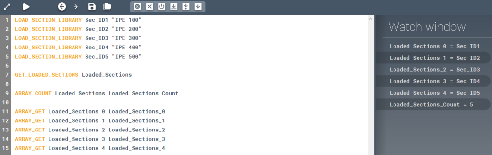

<!-- wp:paragraph -->

Saves all section IDs into an array.

<!-- /wp:paragraph -->

<!-- wp:heading {"level":3} -->

### Syntax

<!-- /wp:heading -->

<!-- wp:paragraph -->

**GET_LOADED_SECTIONS **

<!-- /wp:paragraph -->

<!-- wp:heading {"level":3} -->

### Command parameters

<!-- /wp:heading -->

<!-- wp:table {"className":"is-style-stripes"} -->

|                               |                |                  |                   |
| ----------------------------- | -------------- | ---------------- | ----------------- |
| **Command parameter**         | **Assignment** | **Value format** | **Input options** |
| [Result array](#Result-array) | Required       | String           | Local, variable   |

<!-- /wp:table -->

<!-- wp:heading {"level":4} -->

#### Result array:

<!-- /wp:heading -->

<!-- wp:paragraph -->

Name of the array that will store the result.

<!-- /wp:paragraph -->

<!-- wp:heading {"level":3} -->

### Description

<!-- /wp:heading -->

<!-- wp:paragraph -->

Retrieves the identification strings for all of the sections currently loaded into the section list of the model file and stores them in an array.

<!-- /wp:paragraph -->

<!-- wp:heading {"level":3} -->

### Sample code:

<!-- /wp:heading -->

<!-- wp:heading {"level":4} -->

#### Command only:

<!-- /wp:heading -->

<!-- wp:loos-hcb/code-block -->

```
GET_LOADED_SECTIONS Loaded_Sections
```

<!-- /wp:loos-hcb/code-block -->

<!-- wp:heading {"level":4} -->

#### With added prerequisites (section loading) and checking result array content:

<!-- /wp:heading -->

<!-- wp:loos-hcb/code-block -->

```
LOAD_SECTION_LIBRARY Sec_ID1 "IPE 100"
LOAD_SECTION_LIBRARY Sec_ID2 "IPE 200"
LOAD_SECTION_LIBRARY Sec_ID3 "IPE 300"
LOAD_SECTION_LIBRARY Sec_ID4 "IPE 400"
LOAD_SECTION_LIBRARY Sec_ID5 "IPE 500"

GET_LOADED_SECTIONS Loaded_Sections

ARRAY_COUNT Loaded_Sections Loaded_Sections_Count

ARRAY_GET Loaded_Sections 0 Loaded_Sections_0
ARRAY_GET Loaded_Sections 1 Loaded_Sections_1
ARRAY_GET Loaded_Sections 2 Loaded_Sections_2
ARRAY_GET Loaded_Sections 3 Loaded_Sections_3
ARRAY_GET Loaded_Sections 4 Loaded_Sections_4
```

<!-- /wp:loos-hcb/code-block -->

<!-- wp:image {"id":25152,"sizeSlug":"large","linkDestination":"media"} -->

[](https://consteelsoftware.com/wp-content/uploads/2021/09/image-53.png)

<!-- /wp:image -->
