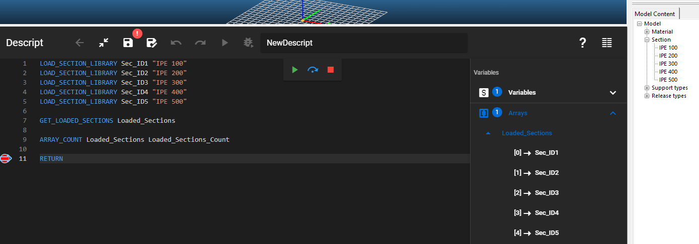

Saves all section IDs into an array.

### Description
Retrieves the identification strings for all of the sections currently loaded into the section list of the model file and stores them in an array.

### Syntax

**GET_LOADED_SECTIONS** [Result array]

### Command parameters

| **Command parameter**         | **Assignment** | **Value format** | **Input options** |
| ----------------------------- | -------------- | ---------------- | ----------------- |
| [Result array](#result-array) | Required       | String           | Local, variable   |

#### Result array:
Name of the array that will store the result.

### Sample code

**Command only:**

```
GET_LOADED_SECTIONS Loaded_Sections
```

**With added prerequisites (section loading) and checking result array content:**

```
LOAD_SECTION_LIBRARY Sec_ID1 "IPE 100"
LOAD_SECTION_LIBRARY Sec_ID2 "IPE 200"
LOAD_SECTION_LIBRARY Sec_ID3 "IPE 300"
LOAD_SECTION_LIBRARY Sec_ID4 "IPE 400"
LOAD_SECTION_LIBRARY Sec_ID5 "IPE 500"

GET_LOADED_SECTIONS Loaded_Sections

ARRAY_COUNT Loaded_Sections Loaded_Sections_Count
```

[](./img/Get_Loaded_Sections_v01.png)
