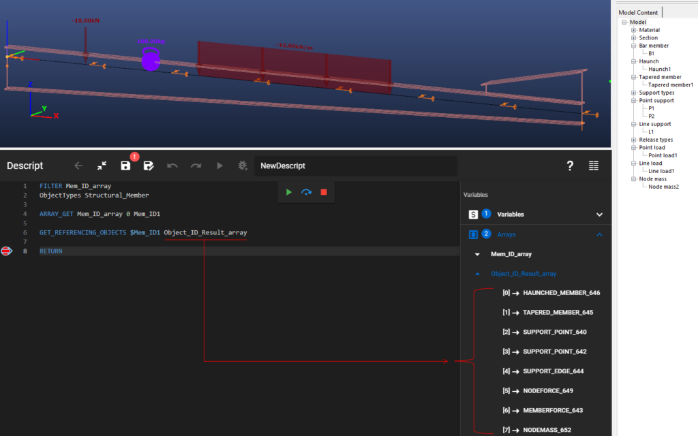
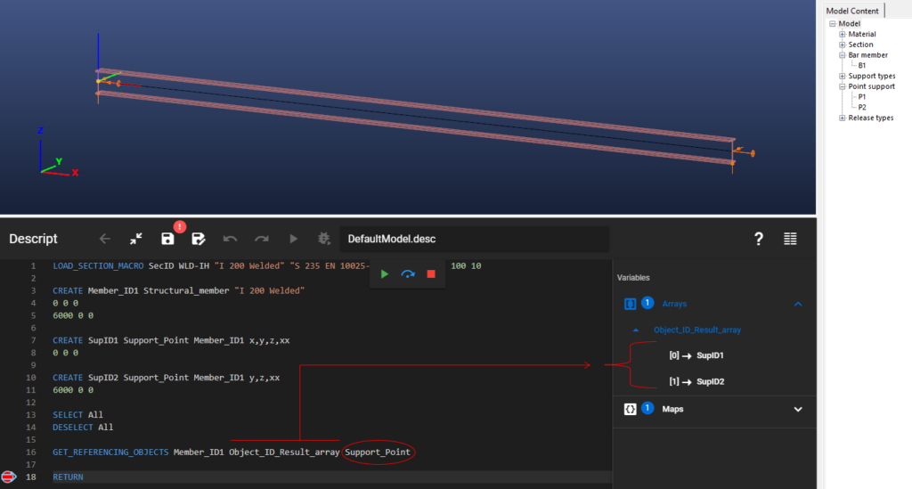
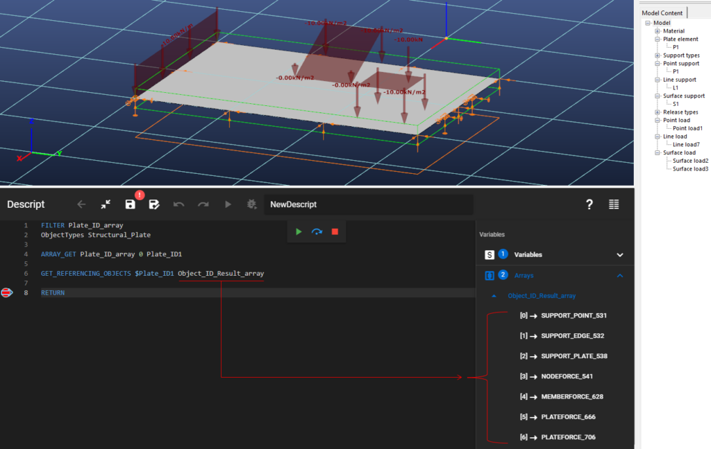

Gets the IDs of objects referencing the input object. <span style={{color:"MediumSeaGreen"}}>(since CS 17)</span>

### Description

In Consteel, if one object is "attached to" another object (eg. a support to a beam), the attached object (the support) is referencing the other object (the beam) it is attached to. In other words, in the definition of the attached object a reference to the database ID of the other object is present. With this command, we can query the list of objects that are referencing an object that we specified with the "Input object ID" parameter.

This command is a tool that reveals object releations, and lets us perform instructions like: "only delete those support points that are attached to this beam", or "only modify those loads that are on this structural plate" in a scripted form.
### Syntax

**GET_REFERENCING_OBJECTS** [Input object ID] [Output array name] [Output object type]

### Command parameters

| **Command parameter**                     | **Assignment** | **Value format**                              | **Input options** |
| ----------------------------------------- | -------------- | --------------------------------------------- | ----------------- |
| [Input object ID](#input-object-ID)       | Required       | String                                        | Local, variable   |
| [Output array name](#output-array-name)   | Required       | String                                        | Local, variable   |
| [Output object type](#output-object-type) | Optional       | [Predefined strings](#Available-object-types) | Local, variable   |

#### Input object ID:
ID of the inspected object.

Avaible input object types:
- Structural member
- Structural Plate

#### Output array name:
Name of the array that will contain the IDs of the objects referencing the input object.

#### Output object type:

The type of the output objects can be restricted with this optional parameter. If defined, only those referencing objects will be listed in the output array that has the type given by this parameter.

<span id="Available-object-types" style={{paddingTop: '80px'}}> Available object types: </span>
<div style={{paddingBottom: '20px'}}> </div>

| **Object type name**                        | **Object type** |
| ------------------------------------------- | --------------- |
| Haunch                                      | Haunched_Member |
| Tapered member                              | Tapered_Member  |
| Point support                               | Support_Point   |
| Line support                                | Support_Edge    |
| Surface support                             | Support_Plate   |
| Point load                                  | NodeForce       |
| Line load                                   | MemberForce     |
| Surface load                                | PlateForce      |
| Point mass                                  | NodeMass        |
| All types (default if parameter left empty) | All_Types       |

### Sample code

#### Command only:
```
GET_REFERENCING_OBJECTS Member_ID1 Object_ID_Result_array
```

**Example 1:** (structural member)

In this example a structural member was previously modeled with various types of objects put on it. The commad will give back the IDs of all of these objects.

```
FILTER Mem_ID_array
ObjectTypes Structural_Member

ARRAY_GET Mem_ID_array 0 Mem_ID1

GET_REFERENCING_OBJECTS $Mem_ID1 Object_ID_Result_array All_Types

RETURN
```

[](https://www.consteelsoftware.com/wp-content/uploads/2023/08/image-2.png)


**Example 2:** (structural member, support point only)

In this example a structural member and its 2 point supports were created by code. The commad will give back the IDs of all the point supports on the member.

```
LOAD_SECTION_MACRO SecID WLD-IH "I 200 Welded" "S 235 EN 10025-2" 100 10 200 6 100 10

CREATE Member_ID1 Structural_member "I 200 Welded"
0 0 0
6000 0 0

CREATE SupID1 Support_Point Member_ID1 x,y,z,xx
0 0 0

CREATE SupID2 Support_Point Member_ID1 y,z,xx
6000 0 0

SELECT All
DESELECT All

GET_REFERENCING_OBJECTS Member_ID1 Object_ID_Result_array Support_Point

RETURN
```

[](https://www.consteelsoftware.com/wp-content/uploads/2023/08/image-3.png)

**Example 3:** (structural plate)

In this example a structural plate was previously modeled with various types of objects put on it. The commad will give back the IDs of all of these objects.

```
FILTER Plate_ID_array
ObjectTypes Structural_Plate

ARRAY_GET Plate_ID_array 0 Plate_ID1

GET_REFERENCING_OBJECTS $Plate_ID1 Object_ID_Result_array

RETURN
```


