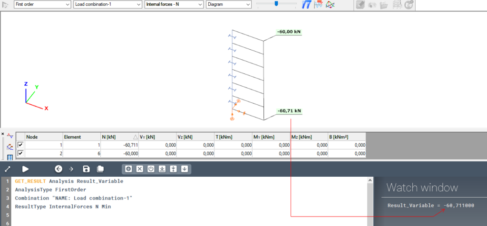
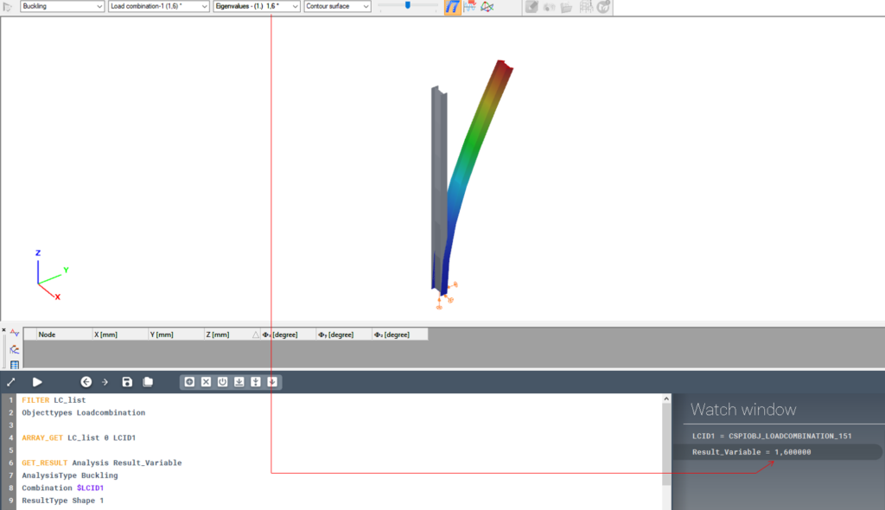
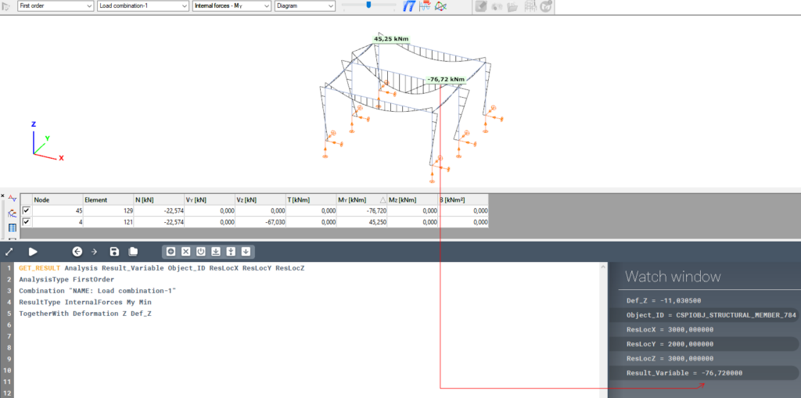
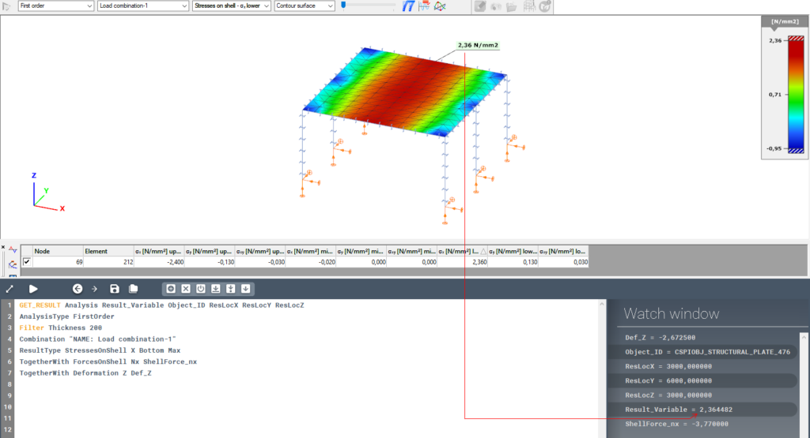
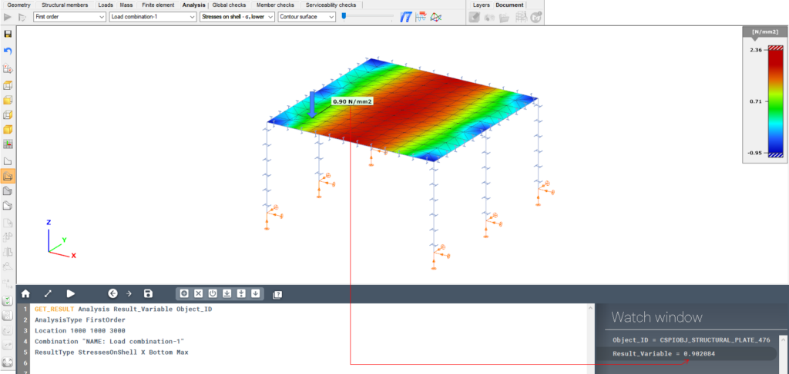
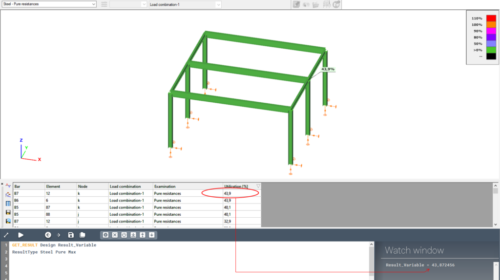
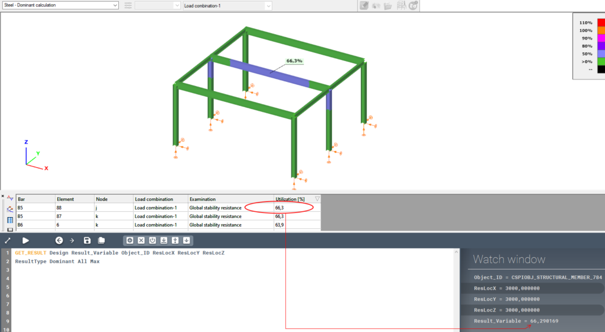
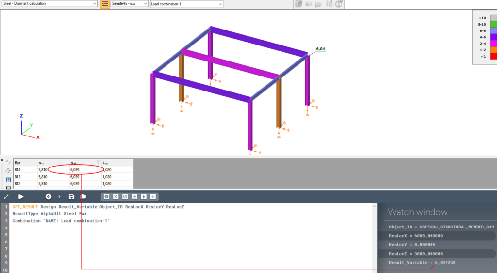

Queries results from an analysis or design run.

### Description
Queries results from an analysis or design run. The syntax, attributes and parameters of the GET_RESULT command differs significantly depending on the calculation type, therefore both calculation types are described in detail separately in the [Detailed description of calculation](#detailed-description-of-calculation-types) types chapter below.

The result searching algorithm is the following:

1. All objects that can have the requested result type are filtered based on the parameters given in the Filter attribute line. The algorithm will search for results within the remaining objects. This step is optional. If there are no filters given, then all objects will be considered.
2. Within the filtered objects, results are queried based on parameters given in the Location attribute line.
3. At this point we have as many result values, as many objects have the requested result type, and fit the filtering conditions. From these result values the minimal or the maximal will be chosen based on the value of the Object select parameter. This will become the output for the Main result.

### Syntax

**GET_RESULT** [Calculation type] [Main result]  
_Command attributes..._

### Main command parameters

#### Calculation type:

Available calculation types:
- [Analysis](#analysis)
- [Design](#design)

#### Main result:
Variable that will contain the main result.

---
## Detailed description of calculation types

## Analysis

### Syntax

**GET_RESULT Analysis** [Main result] [Object ID] \[x] \[y] \[z]  
AnalysisType [Analysis type]  
ResultType [Result category] [Result type] [Plate layer] [Dynamic direction] [Object select]  
Combination [Combination ID]  
Filter [Filter type 1] [Filter value 1] [Filter type 2] [Filter value 2] _etc._  
Location [Location type] [Location value]  
TogetherWith [Supplementary result category] [Supplementary result type] [Plate layer] [Dynamic direction] [Supplementary result]  

### Command attributes

Code lines directly after the GET_RESULT command can set certain attributes. The "AnalysisType", "ResultType" and "Combination" lines are always necessary, while the other ones are optional.

Available command attributes:

| **Command attribute**            | **Inclusion** | **Description**                |
| -------------------------------- | ------------- | ------------------------------ |
| AnalysisType                     | Required      | Controls analysis type         |
| ResultType                       | Required      | Controls result type           |
| Combination                      | Required      | Selects combination            |
| [Filter](#Filter-an)             | Optional      | Filters results                |
| [Loacation](#Location-an)        | Optional      | Defines location of results    |
| [TogetherWith](#TogetherWith-an) | Optional      | Requests supplementary results |

#### Filter: {#Filter-an}
Results can be filtered based on certain attributes. Multiple filters can be used for one GET_RESULT command with having multiple filter type-value pairs listed one after another in the Filter attribute line. In case of multiple filters the result will be queried from the intersection set of all filters.

#### Location: {#Location-an}
A location can be specified from where results should be queried within an object.

#### TogetherWith: {#TogetherWith-an}
With the TogetherWith attribute supplementary results can be queried. Multiple TogetherWith attribute lines can be added to one GET_RESULT command.

### Command parameters

| **Command parameter**                                              | **Assignment** | **Value format**                                | **Input options** |
| ------------------------------------------------------------------ | -------------- | ----------------------------------------------- | ----------------- |
| [Main result](#Main-result-an)                                     | Required       | String                                          | Local, variable   |
| [Object ID](#Object-ID-an)                                         | Optional       | String                                          | Local, variable   |
| [x, y, z](#x,-y,-z-an)                                             | Optional       | Strings                                         | Local, variable   |
| [Analysis type](#Analysis-type-an)                                 | Required       | [Predefined strings](#analysis-types)           | Local, variable   |
| [Result category](#Result-category-an)                             | Required       | [Predefined strings](#result-categories-an)     | Local, variable   |
| [Result type](#Result-type-an)                                     | Required       | [Predefined strings](#result-types-an)          | Local, variable   |
| [Plate layer](#Plate-layer-an)                                     | Optional       | [Predefined strings](#plate-layer-inputs)       | Local, variable   |
| [Dynamic direction](#Dynamic-direction-an)                         | Optional       | [Predefined strings](#dynamic-direction-inputs) | Local, variable   |
| [Object select](#Object-select-an)                                 | Required       | [Predefined strings](#object-select-an)         | Local, variable   |
| [Combination ID](#Combination-ID-an)                               | Required       | Load or mass combination name or ID             | Local, variable   |
| [Filter types](#Filter-types-an)                                   | Optional       | [Predefined strings](#filter-types-an)          | Local, variable   |
| [Filter values](#Filter-values-an)                                 | Optional       | String                                          | Local, variable   |
| [Location type](#Location-type-an)                                 | Optional       | [Predefined strings](#location-types-an)        | Local, variable   |
| [Location value](#Location-value-an)                               | Optional       | String                                          | Local, variable   |
| [Supplementary result category](#Supplementary-result-category-an) | Optional       | Predefined strings                              | Local, variable   |
| [Supplementary result type](#Supplementary-result-type-an)         | Optional       | Predefined strings                              | Local, variable   |
| [Supplementary result](#Supplementary-result-an)                   | Optional       | String                                          | Local, variable   |

#### Main result: {#Main-result-an}
Variable that will contain the main result.

#### Object ID: {#Object-ID-an}
Variable that will contain the ID of the object where the queried result originates from.

The assignment of this parameter is optional.

#### x, y, z: {#x,-y,-z-an}
3 variables that will contain the global coordinates of the queried result's location.

The assignment of these parameters is optional.

#### Analysis type: {#Analysis-type-an}
Type of the analysis.

<span id="analysis-types" style={{paddingTop: '80px'}}> Available analysis types: </span>
- FirstOrder
- SecondOrder
- Buckling
- Dynamics - in this case the ResultType attribute gets extended with a parameter
  - : Dir1, Dir2, Z

#### Result category: {#Result-category-an}
<span id="result-categories-an" style={{paddingTop: '80px'}}> Available result categories: </span>
- Deformation
- InternalForces
- ForcesOnShell
- StressesOnShell - in this case the ResultType attribute gets extended with a parameter
  - : Top, Middle, Bottom
- Reactions
- Shape
- PlasticHinge

#### Result type: {#Result-type-an}
<span id="result-types-an" style={{paddingTop: '80px'}}> Available result types: </span>
- Deformation: X, Y, Z, Rx, Ry, Rz, W
- InternalForces: N, Vy, Vz, T, My, Mz, B
- ForcesOnShell: Mx, My, Mxy, Nx, Ny, Nxy, Qxz, Qyz, QRz
- StressesOnShell: X, Y, XY, 1, 2, HMH
- Reactions: Fx, Fy, Fz, Mx, My, Mz
- Shape: positive integer
- PlasticHinge: positive integer

#### Plate layer: {#Plate-layer-an}
Only active if Result category = StressesOnShell.

<span id="plate-layer-inputs" style={{paddingTop: '80px'}}> Available inputs: </span>
- Top
- Middle
- Bottom

#### Dynamic direction: {#Dynamic-direction-an}
Only active if Analysis type = Dynamics.

<span id="dynamic-direction-inputs" style={{paddingTop: '80px'}}> Available inputs: </span>
- Dir1
- Dir2
- Z

#### Object select: {#Object-select-an}
In case there are multiple objects to query results from, with this parameter it can be defined if the result should come from the object that has the maximal or minimal result value.

<span id="object-select-an" style={{paddingTop: '80px'}}> Available inputs: </span>
- Min
- Max

#### Combination ID: {#Combination-ID-an}
Load or mass combination ID based on which the result is queried. The accepted input is either a single mass or load combination ID or the name of the combination with this syntax: "NAME: [Combination name]"

#### Filter types: {#Filter-types-an}
<span id="filter-types-an" style={{paddingTop: '80px'}}> Available filter types: </span>
- ID
- SectionType
- Material
- Name
- Thickness
- GroupName
- GroupID

#### Filter values: {#Filter-values-an}
Filter values paired to their filter types.

#### Location type: {#Location-type-an}
<span id="location-types-an" style={{paddingTop: '80px'}}> Available location types: </span>
- Min/Max: location of minimal/maximal result within an object. In this case the Location value parameter has to stay undefined
- EndA/EndB: result location measured from one end of the object. In this case the Location value parameter has to be set to a distance in milimeters.
- Ratio: result location at a certain length ratio of the object. In this case the Location value parameter has to be set to a ratio number between 0 and 1.
- Point: result location is at a certain global coordinate. In this case the Location value parameter has to be set to some x,y,z coordinates.

If not specified the defult location type is "Max".

#### Location value: {#Location-value-an}
Value paired to the Location type.

#### Supplementary result category: {#Supplementary-result-category-an}
The same categories apply here as in case of the [Result category](#Result-category-an) parameter.

#### Supplementary result type: {#Supplementary-result-type-an}
The same types apply here as in case of the [Result type ](#Result-type-an)parameter.

#### Supplementary result: {#Supplementary-result-an}
Variable that will conatin the supplementary result.

### Sample code

**Example 1:** (Normal force)

```
GET_RESULT Analysis Result_Variable
AnalysisType FirstOrder
Combination "NAME: Load combination-1"
ResultType InternalForces N Min
```

[](https://consteelsoftware.com/wp-content/uploads/2021/09/image-38.png)

**Example 2:** (αcr - elastic critical factor, with getting load combination ID)

```
FILTER LC_list
Objecttypes Loadcombination

ARRAY_GET LC_list 0 LCID1

GET_RESULT Analysis Result_Variable
AnalysisType Buckling
Combination $LCID1
ResultType Shape 1
```

[](https://consteelsoftware.com/wp-content/uploads/2021/09/image-39.png)

**Example 3:** (Maximum negative bending moment + deflection)

This query gets the maximal negative bending moment from the model. Additionally the coordinates of the result's location are stored in the ResLocX, ResLocY and ResLocZ variables. The ID of the object that provided the result is stored in the Object_ID variable. Moreover the deformation in the "z" global direction is also queried at the same location as the main result, and stored in the Def_Z variable.

```
GET_RESULT Analysis Result_Variable Object_ID ResLocX ResLocY ResLocZ
AnalysisType FirstOrder
Combination "NAME: Load combination-1"
ResultType InternalForces My Min
TogetherWith Deformation Z Def_Z
```

[](https://consteelsoftware.com/wp-content/uploads/2021/10/image-2.png)

**Example 4:** (Shell stress + filter)

This query gets the maximal positive stress in the local "x" direction from the bottom layer of all plates in the model that have a 200 mm thickness. Additionally the coordinates of the result's location are stored in the ResLocX, ResLocY and ResLocZ variables. The ID of the object that provided the result is stored in the Object_ID variable. Moreover the "nx" distributed internal force and deformation in the "z" direction are also queried at the same location as the main result, and stored in the ShellForce_nx and Def_Z variables.

```
GET_RESULT Analysis Result_Variable Object_ID ResLocX ResLocY ResLocZ
AnalysisType FirstOrder
Filter Thickness 200
Combination "NAME: Load combination-1"
ResultType StressesOnShell X Bottom Max
TogetherWith ForcesOnShell Nx ShellForce_nx
TogetherWith Deformation Z Def_Z
```

[](https://consteelsoftware.com/wp-content/uploads/2021/10/image-3.png)

**Example 5:** (Shell stress at specific location given by coordinates)

This query gets the stress value at the location given by the coordinates (1000, 1000, 3000) in the local "x" direction from the bottom layer of the plate.

```
GET_RESULT Analysis Result_Variable Object_ID
AnalysisType FirstOrder
Location 1000 1000 3000
Combination "NAME: Load combination-1"
ResultType StressesOnShell X Bottom Max
```

[](https://consteelsoftware.com/wp-content/uploads/2022/01/image-5.png)

## Design

### Syntax

**GET_RESULT Design** [Main result] [Object ID] \[x] \[y] \[z] [Result combination ID]  
ResultType [Result category] [Result type] [Object select]  
Combination [Combination ID]  
Filter [Filter type 1] [Filter value 1] [Filter type 2] [Filter value 2] etc.  
Location [Location type] [Location value]  
TogetherWith [Supplementary result category] [Supplementary result type] [Supplementary result]  

### Command attributes

Code lines directly after the GET_RESULT command can set certain attributes. The "ResultType" line is always necessary, while the other ones are optional.

Available command attributes:

| **Command attribute**            | **Inclusion** | **Description**                |
| -------------------------------- | ------------- | ------------------------------ |
| ResultType                       | Required      | Controls result type           |
| Combination                      | Optional      | Selects combination            |
| [Filter](#Filter-de)             | Optional      | Filters results                |
| [Loacation](#Location-de)        | Optional      | Defines location of results    |
| [TogetherWith](#TogetherWith-de) | Optional      | Requests supplementary results |

#### Filter: {#Filter-de}
Results can be filtered based on certain attributes. Multiple filters can be used for one GET_RESULT command with having multiple filter type-value pairs listed one after another in the Filter attribute line. In case of multiple filters the result will be queried from the intersection set of all filters.

#### Location: {#Location-de}
A location can be specified from where results should be queried within an object.

#### TogetherWith: {#TogetherWith-de}
With the TogetherWith attribute supplementary results can be queried. Multiple TogetherWith attribute lines can be added to one GET_RESULT command.

### Command parameters

| **Command parameter**                                              | **Assignment** | **Value format**                               | **Input options** |
| ------------------------------------------------------------------ | -------------- | ---------------------------------------------- | ----------------- |
| [Main result](#Main-result-de)                                     | Required       | String                                         | Local, variable   |
| [Object ID](#Object-ID-de)                                         | Optional       | String                                         | Local, variable   |
| [x, y, z](#x,-y,-z-de)                                             | Optional       | Strings                                        | Local, variable   |
| [Result combination ID](#Result-combination-ID-de)                 | Optional       | String                                         | Local, variable   |
| [Result category](#Result-category-de)                             | Required       | [Predefined strings](#result-categories-de)    | Local, variable   |
| [Result type](#Result-type-de)                                     | Required       | [Predefined strings](#result-types-de)         | Local, variable   |
| [Object select](#Object-select-de)                                 | Optional       | [Predefined strings](#Object-select-inputs-de) | Local, variable   |
| [Combination ID](#Combination-ID-de)                               | Optional       | Load combination name or ID                    | Local, variable   |
| [Filter types](#Filter-types-de)                                   | Optional       | [Predefined strings](#filter-types-de)         | Local, variable   |
| [Filter values](#Filter-values-de)                                 | Optional       | String                                         | Local, variable   |
| [Location type](#Location-type-de)                                 | Optional       | [Predefined strings](#location-types-de)       | Local, variable   |
| [Location value](#Location-value-de)                               | Optional       | String                                         | Local, variable   |
| [Supplementary result category](#Supplementary-result-category-de) | Optional       | Predefined strings                             | Local, variable   |
| [Supplementary result type](#Supplementary-result-type-de)         | Optional       | Predefined strings                             | Local, variable   |
| [Supplementary result](#Supplementary-result-de)                   | Optional       | String                                         | Local, variable   |

#### Main result: {#Main-result-de}
Variable that will contain the main result.

#### Object ID: {#Object-ID-de}
Variable that will contain the ID of the object where the queried result originates from.

The assignment of this parameter is optional.

#### x, y, z: {#x,-y,-z-de}
3 variables that will contain the global coordinates of the queried result's location.

The assignment of these parameters is optional.

#### Result combination ID: {#Result-combination-ID-de}
Variable that will contain the ID of the load combination that produced the queried result. The assigment of this parameter is optional.

#### Result category: {#Result-category-de}
<span id="result-categories-de" style={{paddingTop: '80px'}}> Available result categories: </span>
- Dominant
- Steel
- ConcBeam
- ConCol
- CompCol
- AlphaUlt

#### Result type: {#Result-type-de}
<span id="result-types-de" style={{paddingTop: '80px'}}> Available result types: </span>
- Dominant: All, Steel, Concrete, CompositeColumn
- Steel: General, Pure, Plastic, Conservative, Stability, Stablelength
- ConcBeam: Mrd, Vrdc, Vrd, VrdTrd, VrdTrdc, Asl
- ConCol: NrdMrd, VzrdVyrd
- CompCol: Pure, LocalBuckling, Interaction
- AlphaUlt: Steel

#### Object select: {#Object-select-de}
In case there are multiple objects to query results from, with this parameter it can be defined if the result should come from the object that has the maximal or minimal result value.

<span id="Object-select-inputs-de" style={{paddingTop: '80px'}}> Available inputs: </span>
- Min
- Max

#### Combination ID: {#Combination-ID-de}
Only required if Result category=AlphaUlt.

Load combination ID based on which the result is queried. The accepted input is either a single load combination ID or the name of the combination with this syntax: "NAME: [Load combination name]"

#### Filter types: {#Filter-types-de}
<span id="filter-types-de" style={{paddingTop: '80px'}}> Available filter types: </span>
- ID
- SectionType
- Material
- Name
- Thickness
- GroupName
- GroupID

#### Filter values: {#Filter-values-de}
Filter values paired to their filter types.

#### Location type: {#Location-type-de}
<span id="location-types-de" style={{paddingTop: '80px'}}> Available location types: </span>
- Min/Max: location of minimal/maximal result within an object. In this case the Location value parameter has to stay undefined
- EndA/EndB: result location measured from one end of the object. In this case the Location value parameter has to be set to a distance in milimeters.
- Ratio: result location at a certain length ratio of the object. In this case the Location value parameter has to be set to a ratio number between 0 and 1.
- Point: result location is at a certain global coordinate. In this case the Location value parameter has to be set to some x,y,z coordinates.

If not specified the defult location type is "Max".

#### Location value: {#Location-value-de}
Value paired to the Location type.

#### Supplementary result category: {#Supplementary-result-category-de}
The same categories apply here as in case of the [Result category](#Result-category-de) parameter.

#### Supplementary result type: {#Supplementary-result-type-de}
The same types apply here as in case of the [Result type ](#Result-type-de)parameter.

#### Supplementary result: {#Supplementary-result-de}
Variable that will conatin the supplementary result.

### Sample code

**Example 1:** (Steel pure resistance utilization)
```
GET_RESULT Design Result_Variable
ResultType Steel Pure Max
```

[](https://consteelsoftware.com/wp-content/uploads/2021/09/image-36.png)

**Example 2:** (Steel dominant utilization)

```
GET_RESULT Design Result_Variable Object_ID ResLocX ResLocY ResLocZ
ResultType Dominant All Max
```

[](https://consteelsoftware.com/wp-content/uploads/2021/09/image-31.png)

**Example 3:** (αult)

```
GET_RESULT Design Result_Variable Object_ID ResLocX ResLocY ResLocZ
ResultType AlphaUlt Steel Max
Combination "NAME: Load combination-1"
```

[](https://consteelsoftware.com/wp-content/uploads/2021/09/image-32.png)
