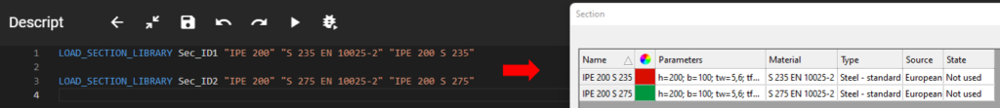

<!-- wp:paragraph -->

Loads a section into the section list from the standard section library.

<!-- /wp:paragraph -->

<!-- wp:heading {"level":3} -->

### Syntax

<!-- /wp:heading -->

<!-- wp:paragraph -->

**LOAD_SECTION_LIBRARY **

<!-- /wp:paragraph -->

<!-- wp:heading {"level":3} -->

### Command parameters

<!-- /wp:heading -->

<!-- wp:table {"className":"is-style-stripes"} -->

|                                 |                |                                                |                   |
| ------------------------------- | -------------- | ---------------------------------------------- | ----------------- |
| **Command parameter**           | **Assignment** | **Value format**                               | **Input options** |
| [Object ID](#Oject-ID)          | Required       | String                                         | Local, variable   |
| [Section name](#Section-name)   | Required       | [Predefined strings](#library-names)           | Local, variable   |
| [Material name](#Material-name) | Optional       | [Predefined strings](#material-names)          | Local, variable   |
| [New name](#New-name)           | Optional       | String                                         | Local, variable   |
| [Section bank](#Section-bank)   | Optional       | [Predefined strings](#Available-section-banks) | Local, variable   |

<!-- /wp:table -->

<!-- wp:heading {"level":4} -->

#### Object ID:

<!-- /wp:heading -->

<!-- wp:paragraph -->

A string of characters that is used to identify the object that is being created. The string can contain letters, numbers and special characters as well. Can be defined locally as a string of characters between apostrophes or as a variable that contains the string.

<!-- /wp:paragraph -->

<!-- wp:paragraph -->

For example:

<!-- /wp:paragraph -->

<!-- wp:paragraph -->

LOAD_SECTION_LIBRARY **“Section ID 1”**

<!-- /wp:paragraph -->

<!-- wp:paragraph -->

or

LOAD_SECTION_LIBRARY **\$Section_ID**

<!-- /wp:paragraph -->

<!-- wp:paragraph -->

Object ID-s have to be unique for every object across all object types (eg.: sections, members, plates, loads, etc.).

<!-- /wp:paragraph -->

<!-- wp:heading {"level":4} -->

#### Section name:

<!-- /wp:heading -->

<!-- wp:paragraph -->

Name of the standard library section. The input has to be an exact match with the library name of the section.

<!-- /wp:paragraph -->

<!-- wp:paragraph -->

For example:

<!-- /wp:paragraph -->

<!-- wp:paragraph -->

LOAD_SECTION_LIBRARY **"IPE 80"**

<!-- /wp:paragraph -->

<!-- wp:paragraph -->

The section names can be viewed in Consteel at the highlighted area of the section library dialogue after the selection of a section type.

<!-- /wp:paragraph -->

<!-- wp:image {"id":23051,"sizeSlug":"full","linkDestination":"media"} -->

[](./img/wp-content-uploads-2021-08-image.png)

<!-- /wp:image -->

<!-- wp:heading {"level":4} -->

#### Material name:

<!-- /wp:heading -->

<!-- wp:paragraph -->

Name of the material to be used for the section. String of characters between apostrophes. Exact match is necessary with the Consteel material names.

<!-- /wp:paragraph -->

<!-- wp:paragraph -->

For example:

<!-- /wp:paragraph -->

<!-- wp:paragraph -->

LOAD_SECTION_LIBRARY **"S 235 EN 10025-2"**

<!-- /wp:paragraph -->

<!-- wp:paragraph -->

The material names can be viewed in Consteel at the highlighted area of the material dialogue name dropdown.

<!-- /wp:paragraph -->

<!-- wp:image {"id":23057,"sizeSlug":"full","linkDestination":"media"} -->

[](./img/wp-content-uploads-2021-08-image-1.png)

<!-- /wp:image -->

<!-- wp:paragraph -->

The assignment of this parameter is optional. Default value: "S 235 EN 10025-2"

<!-- /wp:paragraph -->

<!-- wp:heading {"level":4} -->

#### New name:

<!-- /wp:heading -->

<!-- wp:paragraph -->

This optional parameter can be used to give a different name for the section, then its section library name, which is the default. This is typically most useful, if there is a need to load in a specific section with multiple different materials into the same model. In this case, normally a section would load in with the same exact name, but two sections can't have identical names once loaded in. To solve this, as of the time of writing (CS16 build 2119), if this is attempted in Consteel's graphical user interface, the consecutively loaded same sections with different materials get an "\*" at the end of their names:

<!-- /wp:paragraph -->

<!-- wp:image {"id":43985,"sizeSlug":"full","linkDestination":"media"} -->

[](./img/wp-content-uploads-2022-12-image-11.png)

<!-- /wp:image -->

<!-- wp:paragraph -->

Attempting the same in Descript without a different New name added, will result the consecutive section(s) to not load in:

<!-- /wp:paragraph -->

<!-- wp:image {"id":43992,"sizeSlug":"large","linkDestination":"media"} -->

[](https://consteelsoftware.com/wp-content/uploads/2022/12/image-12.png)

<!-- /wp:image -->

<!-- wp:paragraph -->

This issue is solved with the New name parameter in Descript:

<!-- /wp:paragraph -->

<!-- wp:image {"id":43999,"sizeSlug":"large","linkDestination":"media"} -->

[](https://consteelsoftware.com/wp-content/uploads/2022/12/image-13.png)

<!-- /wp:image -->

<!-- wp:loos-hcb/code-block -->

```
LOAD_SECTION_LIBRARY Sec_ID1 "IPE 200" "S 235 EN 10025-2" "IPE 200 S 235"

LOAD_SECTION_LIBRARY Sec_ID2 "IPE 200" "S 275 EN 10025-2" "IPE 200 S 275"
```

<!-- /wp:loos-hcb/code-block -->

<!-- wp:heading {"level":4} -->

#### Section bank:

<!-- /wp:heading -->

<!-- wp:paragraph -->

_(since CS 17 build 3303)_

<!-- /wp:paragraph -->

<!-- wp:paragraph -->

Name of the section bank. With this optional parameter a section bank can be specified from where a section will be loaded. This is necessary in some cases where a section name exists in more then one section banks.

<!-- /wp:paragraph -->

<!-- wp:paragraph -->

Available section banks in Consteel 17 build 3303:

<!-- /wp:paragraph -->

<!-- wp:list -->

- <!-- wp:list-item -->
- European
- <!-- /wp:list-item -->
-
- <!-- wp:list-item -->
- American (imperial)
- <!-- /wp:list-item -->
-
- <!-- wp:list-item -->
- American
- <!-- /wp:list-item -->
-
- <!-- wp:list-item -->
- Ayrshire
- <!-- /wp:list-item -->
-
- <!-- wp:list-item -->
- Brausa
- <!-- /wp:list-item -->
-
- <!-- wp:list-item -->
- British
- <!-- /wp:list-item -->
-
- <!-- wp:list-item -->
- Chinese
- <!-- /wp:list-item -->
-
- <!-- wp:list-item -->
- Continental Steel
- <!-- /wp:list-item -->
-
- <!-- wp:list-item -->
- Lindab
- <!-- /wp:list-item -->
-
- <!-- wp:list-item -->
- Russian
- <!-- /wp:list-item -->
-
- <!-- wp:list-item -->
- SBE
- <!-- /wp:list-item -->
-
- <!-- wp:list-item -->
- Swedsteel
- <!-- /wp:list-item -->

<!-- /wp:list -->

<!-- wp:paragraph -->

For example the section “Z 100/2.0” exists in the Lindab and also in the Swedsteel section banks. With this parameter the section can be loaded from a the desired section bank:

<!-- /wp:paragraph -->

<!-- wp:loos-hcb/code-block -->

```
LOAD_SECTION_LIBRARY Sec_ID1 "Z 100/2.0" "S350GD+Z EN10346" "Z 100/2.0"           // Loads first found: Lindab
LOAD_SECTION_LIBRARY Sec_ID1 "Z 100/2.0" "S350GD+Z EN10346" "Z 100/2.0" Lindab    // Loads Lindab
LOAD_SECTION_LIBRARY Sec_ID1 "Z 100/2.0" "S350GD+Z EN10346" "Z 100/2.0" Swedsteel // Loads Swedsteel
```

<!-- /wp:loos-hcb/code-block -->

<!-- wp:heading {"level":3} -->

### Description

<!-- /wp:heading -->

<!-- wp:paragraph -->

Sections have to be loaded into the current model file to be able to be used in the model. Initially in a new model file the section list is empty. There are several ways to load in, or create a section: library section, macro section, user drawn section. In this case the library section option is used. The command is analogous with the highlighted "From library..." button at the section administration dialogue in Consteel.

<!-- /wp:paragraph -->

<!-- wp:image {"id":23063,"sizeSlug":"full","linkDestination":"media"} -->

[](./img/wp-content-uploads-2021-08-image-2.png)

<!-- /wp:image -->

<!-- wp:heading {"level":3} -->

### Sample code:

<!-- /wp:heading -->

<!-- wp:heading {"level":4} -->

#### Minimal parameters:

<!-- /wp:heading -->

<!-- wp:loos-hcb/code-block -->

```
LOAD_SECTION_LIBRARY Sec_ID1 "IPE 300"
```

<!-- /wp:loos-hcb/code-block -->

<!-- wp:heading {"level":4} -->

#### All parameters:

<!-- /wp:heading -->

<!-- wp:loos-hcb/code-block -->

```
LOAD_SECTION_LIBRARY Sec_ID1 "IPE 300" "S 235 EN 10025-2" "IPE 300 S 235" European
```

<!-- /wp:loos-hcb/code-block -->
