Loads a stiffened macro section into the section list. <span style={{color:"MediumSeaGreen"}}>(since CS 17)</span>

## Description

Sections have to be loaded into the current model file to be able to be used in the model. Initially in a new model file the section list is empty. There are several ways to load in, or create a section: library section, macro section, user drawn section. This command loads in cold-formed macro sections with optional stiffeners.

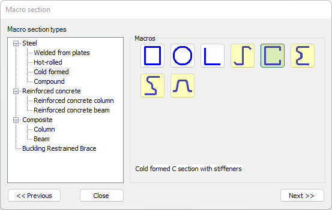

Macro sections that can not have stiffeners can be loaded in with the [LOAD_SECTION_MACRO](#/docs/descript/command-reference/load_section_macro/) command.

## Syntax

**LOAD_SECTION_MACRO_STIFFENED** [Object ID] [Macro type] [Section name] [Material name] Size parameters... [Forming method] [Thickness tolerance]   
S1 [Stiffener type] Stiffener parameters...  
S2 [Stiffener type] Stiffener parameters...  
...

## Command parameters

| **Command parameter**                       | **Assignment** | **Value format**                        | **Input options** |
| ------------------------------------------- | -------------- | --------------------------------------- | ----------------- |
| [Object ID](#object-id)                     | Required       | String                                  | Local, variable   |
| [Macro type](#macro-type)                   | Required       | [Predefined strings](#Macro-type-table) | Local, variable   |
| [Section name](#section-name)               | Required       | String                                  | Local, variable   |
| [Material name](#material-name)             | Required       | [Predefined strings](#material-names)   | Local, variable   |
| [Size parameters](#size-parameters)         | Required       | Numerical                               | Local, variable   |
| [Forming method](#forming-method)           | Optional       | [Predefined strings](#Valid-inputs-fm)  | Local, variable   |
| [Thickness tolerance](#thickness-tolerance) | Optional       | [Predefined strings](#Valid-inputs-tt)  | Local, variable   |

#### Object ID:
A string of characters that is used to identify the object that is being created. The string can contain letters, numbers and special characters as well. It can be defined as a variable that contains the string or directly as a string of characters between apostrophes.

For example:

LOAD_SECTION_MACRO_STIFFENED **\$Section_ID** [Macro type] [Section name] [Material name] \[parameter1] \[parameter2] _etc._

or

LOAD_SECTION_MACRO_STIFFENED **“Section ID 1”** [Macro type] [Section name] [Material name] \[parameter1] \[parameter2] _etc._

Object ID-s have to be unique for every object across all object types (eg.: sections, members, plates, loads, etc.).

#### Macro type:
Type of macro to be used.

<span id="Macro-type-table" style={{paddingTop: '80px'}}> Available macro types: </span>
<div style={{paddingBottom: '20px'}}> </div>

| **Macro type name**                     | **Macro type** |
| --------------------------------------- | -------------- |
| [Cold-formed C](#cold-formed-c)         | CF-C           |
| [Cold-formed Z](#cold-formed-z)         | CF-Z           |
| [Cold-formed Sigma](#cold-formed-sigma) | CF-SIGMA       |
| [Cold-formed Zeta](#cold-formed-zeta)   | CF-ZETA        |
| [Cold-formed Omega](#cold-formed-omega) | CF-OMEGA       |

#### Section name:
Name of the section that will appear in the section list in Consteel. String of characters between apostrophes.

#### Material name:
Name of the material to be used for the section. String of characters between apostrophes. Exact match is necessary with the Consteel material names.

For example:

LOAD_SECTION_MACRO_STIFFENED [Object ID] [Macro type] [Section name] **"S350GD+Z EN10346"** \[parameter1] \[parameter2] _etc._

<span id="material-names" style={{paddingTop: '80px'}}> The material names can be viewed in Consteel at the highlighted area of the material dialogue name dropdown. </span>

[](./img/wp-content-uploads-2023-08-image-12.png)

#### Size parameters:
Section parameters like height, breadth, thickness, etc.. The quantity and meaning of the parameters depend on the macro type.

#### Forming method:
<span id="Valid-inputs-fm" style={{paddingTop: '80px'}}> Valid inputs: </span>
- Cold rolled (default)
- Press broken
- Other cold formed

#### Thickness tolerance:
<span id="Valid-inputs-tt" style={{paddingTop: '80px'}}> Valid inputs: </span>
- Normal (default)
- Special

## Stiffener definition

To add a stiffener to the section, the stiffener data have to be defined in a row immediately after the LOAD_SECTION_MACRO_STIFFENED command. The available stiffener positions and their types depend on the macro type. Each additional row defines 1 stiffener.

### Syntax

[Stiffener position] [Stiffener type] [Stiffener shape] [Parameter 1] [Parameter 2] ...

### Stiffener position

Defines into which position the stiffener will be added. The available stiffener positions depend on the macro type.

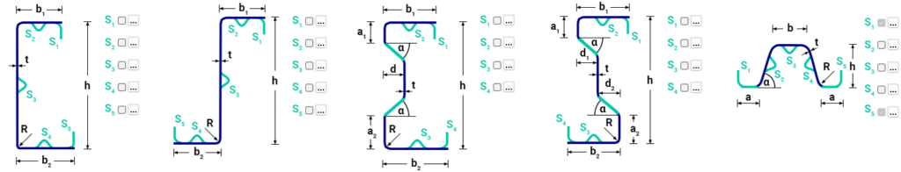

Valid inputs:
- S1
- S2
- S3
- S4
- S5

### Stiffener types

Available stiffener types:

| **Stiffener type name** | **Stiffener type** (type this into Descript) |
| ----------------------- | -------------------------------------------- |
| Edge stiffener          | Edge_Stiffener                               |
| Flange stiffener        | Flange_Stiffener                             |
| Web stiffener           | Web_Stiffener                                |

Web_Stiffener

#### Edge stiffener (single folded):

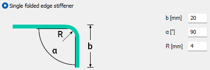

[Stiffener position] **Edge_Stiffener** \[b] \[alpha] \[R]

Parameters:
- b: stiffener length \[mm]
- alpha: fold angle \[°]
- R: rounding radius \[mm]

Sample code:
```
S1 Edge_Stiffener 30 120 4
```

#### Edge stiffener (double folded):

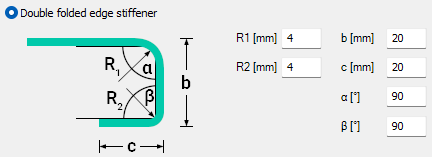

[Stiffener position] **Edge_Stiffener** \[b] \[alpha] \[R1] \[c] \[beta] \[R2]

Parameters:
- b: 1st fold length \[mm]
- alpha: 1st fold angle \[°]
- R1: 1st rounding radius \[mm]
- c: 2nd fold length \[mm]
- beta: 2ndfold angle \[°]
- R2: 2nd rounding radius \[mm]

Sample code:
```
S5 Edge_Stiffener 20 90 4 20 90 4
```

#### Flange stiffener (Triangular):

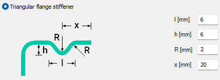

[Stiffener position] **Flange Stiffener** **Triangular** \[l] \[h] \[R] \[x]

Parameters:
- l: length \[mm]
- h: height \[mm]
- R: rounding radius \[mm]
- x: distance from flange end \[mm]

Sample code:
```
S2 Flange_Stiffener Triangular 6 6 2 20
```

#### Flange stiffener (Rounded):

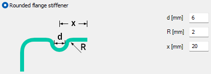

[Stiffener position] **Flange Stiffener** **Rounded** \[d] \[R] \[x]

Parameters:
- d: diameter \[mm]
- R: rounding radius \[mm]
- x: distance from flange end \[mm]

Sample code:
```
S4 Flange_Stiffener Rounded 6 2 20
```

#### Web stiffener (Triangular):

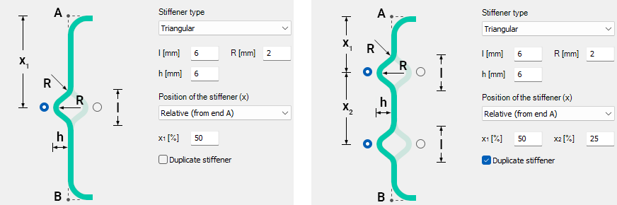

[Stiffener position] **Web Stiffener** **Triangular** \[l] \[h] \[R] \[Position] \[x1] \[Side 1] \[x2] \[Side 2]

Parameters:
- l: length \[mm]
- h: height \[mm]
- R: rounding radius \[mm]
- Position: Valid inputs: FromA, FromB, RelFromA
- x1: 1st distance from flange end \[mm] or \[%]
- Side 1: 1st stiffener side. Valid inputs: Left, Right
- x2: 2nd distance from flange end \[mm] or \[%] (optional parameter)
- Side 2: 2nd stiffener side. Valid inputs: Left, Right (optional parameter)

The presence of the _x2_ and _Side 2_ parameters tell descript that we want a duplicated web stiffener. Therefore these parameters need to be either both present or both missing.

Sample code:
```
S3 Web_Stiffener Triangular 6 6 2 RelFromA 50 Left             // Single

S3 Web_Stiffener Triangular 6 6 2 RelFromA 25 Left 50 Left     // Duplicated
```

#### Web stiffener (Rounded):

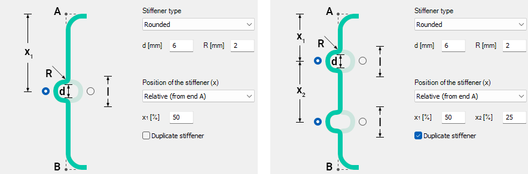

[Stiffener position] **Web Stiffener** **Rounded** \[d] \[R] \[Position] \[x1] \[Side 1] \[x2] \[Side 2]

Parameters:
- d: diameter \[mm]
- R: rounding radius \[mm]
- Position: Valid inputs: FromA, FromB, RelFromA
- x1: 1st distance from flange end \[mm] or \[%]
- Side 1: 1st stiffener side. Valid inputs: Left, Right
- x2: 2nd distance from flange end \[mm] or \[%] (optional parameter)
- Side 2: 2nd stiffener side. Valid inputs: Left, Right (optional parameter)

The presence of the _x2_ and _Side 2_ parameters tell descript that we want a duplicated web stiffener. Therefore these parameters need to be either both present or both missing.

Sample code:
```
S3 Web_Stiffener Rounded 6 2 FromA 50 Left              // Single

S3 Web_Stiffener Rounded 6 2 FromA 50 Left 51 Right     // Duplicated
```

#### Web stiffener (Trapezoidal):

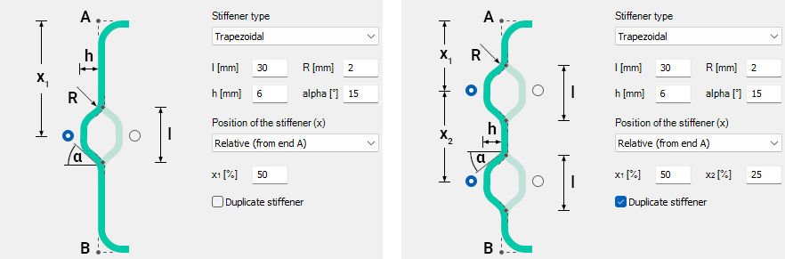

[Stiffener position] **Web \_Stiffener** **Trapezoidal** \[l] \[h] \[alpha] \[R] \[Position] \[x1] \[Side 1] \[x2] \[Side 2]

Parameters:
- l: length \[mm]
- h: height \[mm]
- alpha: fold angle \[°]
- R: rounding radius \[mm]
- Position: Valid inputs: FromA, FromB, RelFromA
- x1: 1st distance from flange end \[mm] or \[%]
- Side 1: 1st stiffener side. Valid inputs: Left, Right
- x2: 2nd distance from flange end \[mm] or \[%] (optional parameter)
- Side 2: 2nd stiffener side. Valid inputs: Left, Right (optional parameter)

The presence of the _x2_ and _Side 2_ parameters tell descript that we want a duplicated web stiffener. Therefore these parameters need to be either both present or both missing.

Sample code:
```
S2 Web_Stiffener Trapezoidal 20 6 15 2 FromA 50 Right              // Single

S2 Web_Stiffener Trapezoidal 20 6 15 2 FromA 50 Right 50 Right     // Duplicated
```

---
## Detailed description of macro types

### Cold-formed C

#### Macro type:

CF-C

#### Parameters:

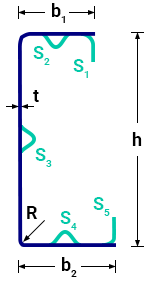

| Notation | Definition         |
| -------- | ------------------ |
| h        | Section height     |
| b1       | Upper flange width |
| b2       | Lower flange width |
| t        | Thickness          |
| R        | Rounding radius    |

Parameter notations substituted into the command syntax:

LOAD_SECTION_MACRO_STIFFENED [Object ID] CF-C [Section name] [Material name] \[h] \[b1] \[b2] \[t] \[R]

#### Stiffeners:
Available stiffener positions and types:
- S1: Edge stiffener
- S2: Flange stiffener
- S3: Web stiffener
- S4: Flange stiffener
- S5: Edge stiffener

#### Sample code:

**Simplest form:** (minimal parameters, no stiffeners)
```
LOAD_SECTION_MACRO_STIFFENED Sec_ID1 CF-C "CF C (Descript)" "S350GD+Z EN10346" 150 90 90 2 4
```

**All parameters and stiffeners:**
```
LOAD_SECTION_MACRO_STIFFENED Sec_ID1 CF-C "CF C (Descript)" "S350GD+Z EN10346" 150 90 90 2 4 "Press broken" Special
S1 Edge_Stiffener 30 120 4
S2 Flange_Stiffener Triangular 6 6 2 20
S3 Web_Stiffener Triangular 6 6 2 RelFromA 25 Left 50 Left
S4 Flange_Stiffener Rounded 6 2 20
S5 Edge_Stiffener 20 90 4 20 90 4
```

### Cold-formed Z

#### Macro type:

CF-Z

#### Parameters:

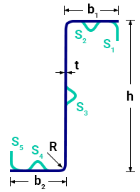

| Notation | Definition         |
| -------- | ------------------ |
| h        | Section height     |
| b1       | Upper flange width |
| b2       | Lower flange width |
| t        | Thickness          |
| R        | Rounding radius    |

Parameter notations substituted into the command syntax:

LOAD_SECTION_MACRO_STIFFENED [Object ID] CF-Z [Section name] [Material name] \[h] \[b1] \[b2] \[t] \[R]

#### Stiffeners:
Available stiffener positions and types:
- S1: Edge stiffener
- S2: Flange stiffener
- S3: Web stiffener
- S4: Flange stiffener
- S5: Edge stiffener

#### Sample code:

**Simplest form:** (minimal parameters, no stiffeners)
```
LOAD_SECTION_MACRO_STIFFENED Sec_ID1 CF-Z "CF Z (Descript)" "S350GD+Z EN10346" 150 90 90 2 4
```

**All parameters and stiffeners:**
```
LOAD_SECTION_MACRO_STIFFENED Sec_ID1 CF-Z "CF Z (Descript)" "S350GD+Z EN10346" 150 90 90 2 4 "Press broken" Special
S1 Edge_Stiffener 30 120 4
S2 Flange_Stiffener Triangular 6 6 2 20
S3 Web_Stiffener Rounded 6 2 FromA 50 Left 51 Right
S4 Flange_Stiffener Rounded 6 2 20
S5 Edge_Stiffener 20 90 4 20 90 4
```

### Cold-formed Sigma

#### Macro type:

CF-SIGMA

#### Parameters:

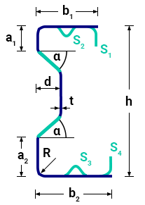

| Notation | Definition         |
| -------- | ------------------ |
| h        | Section height     |
| b1       | Upper flange width |
| b2       | Lower flange width |
| t        | Thickness          |
| R        | Rounding radius    |
| a1       | Web top height     |
| a2       | Web bottom height  |
| alpha    | Folding angle      |
| d        | Web distance       |

Parameter notations substituted into the command syntax:

LOAD_SECTION_MACRO_STIFFENED [Object ID] CF-SIGMA [Section name] [Material name] \[h] \[b1] \[b2] \[t] \[R] \[a1] \[a2] \[alpha] \[d]

#### Stiffeners:
Available stiffener positions and types:
- S1: Edge stiffener
- S2: Flange stiffener
- S3: Flange stiffener
- S4: Edge stiffener

#### Sample code:

**Simplest form:** (minimal parameters, no stiffeners)
```
LOAD_SECTION_MACRO_STIFFENED Sec_ID1 CF-SIGMA "CF SIGMA (Descript)" "S350GD+Z EN10346" 150 90 90 2 4 40 40 50 20
```

**All parameters and stiffeners:**
```
LOAD_SECTION_MACRO_STIFFENED Sec_ID1 CF-SIGMA "CF SIGMA (Descript)" "S350GD+Z EN10346" 150 90 90 2 4 40 40 50 20 "Press broken" Special
S1 Edge_Stiffener 30 120 4
S2 Flange_Stiffener Triangular 6 6 2 20
S3 Flange_Stiffener Rounded 6 2 20
S4 Edge_Stiffener 20 90 4 20 90 4
```

### Cold-formed Zeta

#### Macro type:

CF-SIGMA

#### Parameters:

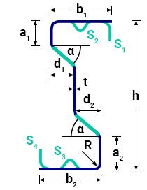

| Notation | Definition         |
| -------- | ------------------ |
| h        | Section height     |
| b1       | Upper flange width |
| b2       | Lower flange width |
| t        | Thickness          |
| R        | Rounding radius    |
| a1       | Web top height     |
| a2       | Web bottom height  |
| alpha    | Folding angle      |
| d1       | Web distance 1     |
| d2       | Web distance 2     |

Parameter notations substituted into the command syntax:

LOAD_SECTION_MACRO_STIFFENED  [Object ID] CF-ZETA [Section name] [Material name] \[h] \[b1] \[b2] \[t] \[R] \[a1] \[a2] \[alpha] \[d1] \[d2]

#### Stiffeners:
Available stiffener positions and types:
- S1: Edge stiffener
- S2: Flange stiffener
- S3: Flange stiffener
- S4: Edge stiffener

#### Sample code:

**Simplest form:** (minimal parameters, no stiffeners)
```
LOAD_SECTION_MACRO_STIFFENED Sec_ID1 CF-ZETA "CF ZETA (Descript)" "S350GD+Z EN10346" 150 90 90 2 4 40 40 50 20 20
```

**All parameters and stiffeners:**
```
LOAD_SECTION_MACRO_STIFFENED Sec_ID1 CF-ZETA "CF ZETA (Descript)" "S350GD+Z EN10346" 150 90 90 2 4 40 40 50 20 20 "Press broken" Special
S1 Edge_Stiffener 30 120 4
S2 Flange_Stiffener Triangular 6 6 2 20
S3 Flange_Stiffener Rounded 6 2 20
S4 Edge_Stiffener 20 90 4 20 90 4
```

### Cold-formed Omega

#### Macro type:

CF-OMEGA

#### Parameters:

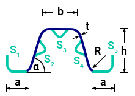

| Notation | Definition      |
| -------- | --------------- |
| h        | Section height  |
| b        | Flange width    |
| a        | Lip size        |
| t        | Thickness       |
| R        | Rounding radius |
| alpha    | Folding angle   |

Parameter notations substituted into the command syntax:

LOAD_SECTION_MACRO_STIFFENED [Object ID] CF-OMEGA [Section name] [Material name] \[h] \[b] \[a] \[t] \[R] \[alpha]

#### Stiffeners:
Available stiffener positions and types:
- S1: Edge stiffener
- S2: Web stiffener
- S3: Web stiffener (can not be duplicated, only single)
- S4: Web stiffener
- S5: Edge stiffener

#### Sample code:

**Simplest form:** (minimal parameters, no stiffeners)
```
LOAD_SECTION_MACRO_STIFFENED Sec_ID1 CF-OMEGA "CF OMEGA (Descript)" "S350GD+Z EN10346" 150 120 40 2.5 4 60
```

**All parameters and stiffeners:**
```
LOAD_SECTION_MACRO_STIFFENED Sec_ID1 CF-OMEGA "CF OMEGA (Descript)" "S350GD+Z EN10346" 150 120 40 2.5 4 60 "Press broken" Special
S1 Edge_Stiffener 30 120 4
S2 Web_Stiffener Trapezoidal 20 6 15 2 FromA 50 Right 50 Right
S3 Web_Stiffener Rounded 6 2 Right
S4 Web_Stiffener Trapezoidal 20 6 15 2 FromA 50 Right 50 Right
S5 Edge_Stiffener 30 120 4
```
