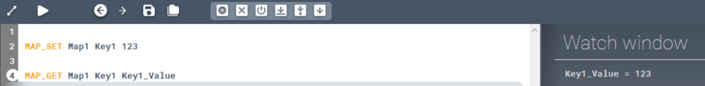

Gets the value paired to a key from a map.

### Description

Gets the value paired to a key within a map and stores it in a variable.

### Syntax

**MAP_GET** [Map name] \[Key] [Output variable]  

### Command parameters

| **Command parameter**               | **Assignment** | **Value format** | **Input options** |
| ----------------------------------- | -------------- | ---------------- | ----------------- |
| [Map name](#map-name)               | Required       | String           | Local, variable   |
| [Key](#key)                         | Required       | String           | Local, variable   |
| [Output variable](#output-variable) | Required       | String           | Local, variable   |

#### Map name:
Name of the map.

#### Key:
The string acting as the key.

#### Output variable:
Name of the variable that will contain the output. The output is the value paired to the key.

### Sample code

**Command only:**

```
MAP_GET Map1 Key1 Key1_Value
```

**Command + key creation:**

```
MAP_SET Map1 Key1 123

MAP_GET Map1 Key1 Key1_Value
```


