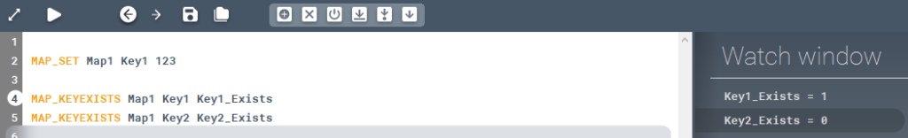

Checks whether a key exists in a map or not.

### Description

Checks whether a key exists in a map or not. If the the specified key exists in the given map, then the output is "1" otherwise it is "0".

### Syntax

**MAP_KEYEXISTS** [Map name] \[Key] [Output variable]

### Command parameters

| **Command parameter**               | **Assignment** | **Value format** | **Input options** |
| ----------------------------------- | -------------- | ---------------- | ----------------- |
| [Map name](#map-name)               | Required       | String           | Local, variable   |
| [Key](#key)                         | Required       | String           | Local, variable   |
| [Output variable](#output-variable) | Required       | String           | Local, variable   |

#### Map name:
Name of the map.

#### Key:
The string acting as the key.

#### Output variable:
Name of the variable that will contain the output. Output values: "1" or "0".

### Sample code

**Command only:**

```
MAP_KEYEXISTS Map1 Key1 Key1_Exists
```

**Command + key creation + checking:**

```
MAP_SET Map1 Key1 123

MAP_KEYEXISTS Map1 Key1 Key1_Exists
MAP_KEYEXISTS Map1 Key2 Key2_Exists
```

