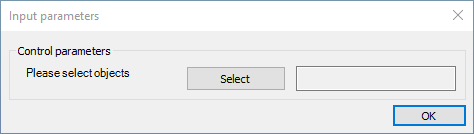
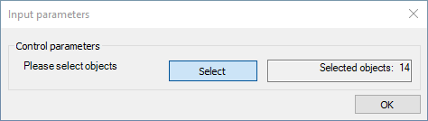

Selects objects in the model.

### Description

With the SELECT command, objects can be selected from the model. There are several different selection methods available through the _Selection type_ parameter.

### Syntax

**SELECT** [Selection type] Selection parameters...

### Selection types

Available selection types:

| **Selection type**                   | **Description**                                    |
| ------------------------------------ | -------------------------------------------------- |
| [All](#select-all)                   | Selects all objects in the model                   |
| [Invert](#select-invert)             | Inverts the selection                              |
| [By_ID](#select-by_id)               | Selection by object ID                             |
| [By_Type](#select-by_type)           | Selection by object type                           |
| [By_Attribute](#select-by_attribute) | Selection by object type and attribute(s)          |
| [By_User](#select-by_user)           | Manual selection by the user during the script run |

### Command parameters

#### Selection type:
The available selection parameters and their meaning depends on the chosen selection type. [Detailed description](#detailed-description-of-selection-types) of all selection parameters for each individual selection type can be found below.

### Sample code
```
SELECT All
```

---
## Detailed description of selection types

## SELECT All

Selects all previously created objects in the model.

### Syntax

**SELECT All**

### Sample code

**Command only:**

```
SELECT All
```

**With added prerequisites:** (object creation)

```
LOAD_SECTION_LIBRARY Sec_ID1 "HEA 200"

CREATE Mem_ID1 Structural_member "HEA 200"
0 0 0
0 0 3000

SELECT All
```

## SELECT Invert

Inverts the selection. In other words, selects model objects that were unselected, and deselects model objects that were selected previously.

### Syntax

**SELECT Invert**

### Sample code

**Command only:**
```
SELECT Invert
```

**With added prerequisites:** (object creation and selection)

```
LOAD_SECTION_LIBRARY Sec_ID1 "HEA 200"

CREATE Mem_ID1 Structural_member "HEA 200"
0 0 0
0 0 3000

CREATE Mem_ID2 Structural_member "HEA 200"
1000 0 0
1000 0 3000

SELECT BY_ID Mem_ID1

SELECT Invert
```

## SELECT By_ID

Selects specific objects in the model by ID.

### Syntax

**SELECT By_ID** \[ID1] \[ID2] \[ID3] _etc._

### Command parameters

| **Command parameter** | **Assignment** | **Value format** | **Input options** |
| --------------------- | -------------- | ---------------- | ----------------- |
| [IDs](#ids)           | Required       | String           | Local, variable   |

#### IDs:
Exact identification strings of the objects chosen for selection. Multiple IDs can be given within one SELECT BY_ID command. IDs need to be separated by spaces.

### Sample code

**Command only:**

```
SELECT BY_ID ID1
```

**With added prerequisites (object creation) and multiple objects:**

```
LOAD_SECTION_LIBRARY Sec_ID1 "HEA 200"

CREATE Mem_ID1 Structural_member "HEA 200"
0 0 0
0 0 3000

CREATE Mem_ID2 Structural_member "HEA 200"
1000 0 0
1000 0 3000

SELECT BY_ID Mem_ID1 Mem_ID2
```

## SELECT By_Type

Selects specific objects in the model by type. All objects within the given object type will be selected.

### Syntax

**SELECT By_Type** [Object type]

### Command parameters

| **Command parameter**               | **Assignment** | **Value format**                            | **Input options** |
| ----------------------------------- | -------------- | ------------------------------------------- | ----------------- |
| [Object type](#Object-type-By_Type) | Required       | [Predefined strings](#object-types-By_Type) | Local, variable   |

#### Object type: {#Object-type-By_Type}
The type of objects to be selected. Only 1 object type can be given within one SELECT By_Type command.

<span id="object-types-By_Type" style={{paddingTop: '80px'}}> Available object types: </span>
<div style={{paddingBottom: '20px'}}> </div>

| **Object type name**            | **Object type**           |
| ------------------------------- | ------------------------- |
| Geometry tab                    | -                         |
| Point                           | Point                     |
| Line                            | Line                      |
| Arc                             | CircleArc                 |
| Two-dimensional figure          | Polygon                   |
| Dimension line                  | Dimension_Line            |
| Dimension radius and diameter   | Dimension_Radius          |
| Dimension arc                   | Dimension_Arc             |
| Dimension angle                 | Dimension_Angle           |
| Dimension height                | Dimension_Height          |
| Dimension textbox               | Dimension_Textbox         |
| Structural members tab          | -                         |
| Member                          | Structural_Member         |
| Plate                           | Structural_Plate          |
| Diaphragm                       | Structural_Diaphragm      |
| Rigid body                      | Structural_RigidBody      |
| Haunch                          | Haunched_Member           |
| Tapered member                  | Tapered_Member            |
| Concrete beam reinforcement     | Concrete_Beam_Place       |
| Concrete column reinforcement   | Concrete_Column_Place     |
| Point support                   | Support_Point             |
| Line support                    | Support_Edge              |
| Surface support                 | Support_Plate             |
| Shear field                     | ShearField                |
| Link                            | Link                      |
| Smart link                      | SmartLink                 |
| Purlin line                     | PurlinLine_Place          |
| Purlin overlap and support zone | PurlinJoint_Place         |
| Rectangular cutout              | Hole_Rec                  |
| Circular cutout                 | Hole_Circ                 |
| Hexagonal cutout                | Hole_Hex                  |
| Perpendicular plate stiffener   | Stiffener_PlatePerp       |
| Parallel plate stiffener        | Stiffener_PlatePar        |
| Perpendicular section stiffener | Stiffener_Section         |
| Placed joint                    | Joint_Place               |
| Loads tab                       | -                         |
| Point load                      | NodeForce                 |
| Line load                       | MemberForce               |
| Line wind load                  | LineWindForce             |
| Surface load                    | PlateForce                |
| Load transfer surface           | LoadTransferSurface       |
| Line temperature load           | MemberThermal             |
| Surface temperature load        | PlateThermal              |
| Prescribed displacement         | PresDisp                  |
| Change in length                | Elongation                |
| Tension force                   | Pretension                |
| Influence line                  | MovingLoadPath            |
| Influence graph                 | InfluGraph                |
| Wind surface                    | WindSurface               |
| Snow surface                    | SnowSurface               |
| Surface wind load               | SurfWindForce             |
| Surface snow load               | SurfSnowForce             |
| Fire load                       | MemberFireEffect          |
| Mass tab                        | -                         |
| Node mass                       | NodeMass                  |
| Finite element tab              | -                         |
| Constraint                      | Structural_Constraint     |
| Stiffener warping support       | Stiffener_Warping_Support |
| Other                           | -                         |
| Section plane                   | Result_Plane              |

More information about object types can be found at the [CREATE ](/docs/descript/command-reference/create/)command.

### Sample code

**Command only:**

```
SELECT By_Type Structural_Member
```

**With added prerequisites:** (object creation)

```
LOAD_SECTION_LIBRARY Sec_ID1 "HEA 200"

CREATE Mem_ID1 Structural_member "HEA 200"
0 0 0
0 0 3000

CREATE Sup_ID1 Support_Point Mem_ID1 Fixed
0 0 0

SELECT By_Type Structural_Member
```

## SELECT By_Attribute

Selects specific objects in the model by type and all given object attributes.

### Syntax

**SELECT By_Attribute** [Object type]  
[Object attribute 1] [Attribute value 1]  
[Object attribute 2] [Attribute value 2]  
[Object attribute 3] [Attribute value 3]  
_etc._

### Command parameters

| **Command parameter**                                | **Assignment** | **Value format**                                 | **Input options** |
| ---------------------------------------------------- | -------------- | ------------------------------------------------ | ----------------- |
| [Object type](#Object-type-By_Attribute)             | Required       | [Predefined strings](#object-types-By_Attribute) | Local, variable   |
| [Object attributes](#Object-attributes-By_Attribute) | Required       | Predefined strings                               | Local, variable   |
| [Attribute values](#Attribute-values-By_Attribute)   | Required       | String                                           | Local, variable   |

#### Object type: {#Object-type-By_Attribute}
The type of objects to be selected. Only 1 object type can be given within one SELECT By_Attribute command.

<span id="object-types-By_Attribute" style={{paddingTop: '80px'}}> Available object types: </span>
<div style={{paddingBottom: '20px'}}> </div>

| **Object type name**            | **Object type**           |
| ------------------------------- | ------------------------- |
| Geometry tab                    | -                         |
| Point                           | Point                     |
| Line                            | Line                      |
| Arc                             | CircleArc                 |
| Two-dimensional figure          | Polygon                   |
| Dimension line                  | Dimension_Line            |
| Dimension radius and diameter   | Dimension_Radius          |
| Dimension arc                   | Dimension_Arc             |
| Dimension angle                 | Dimension_Angle           |
| Dimension height                | Dimension_Height          |
| Dimension textbox               | Dimension_Textbox         |
| Structural members tab          | -                         |
| Member                          | Structural_Member         |
| Plate                           | Structural_Plate          |
| Diaphragm                       | Structural_Diaphragm      |
| Rigid body                      | Structural_RigidBody      |
| Haunch                          | Haunched_Member           |
| Tapered member                  | Tapered_Member            |
| Concrete beam reinforcement     | Concrete_Beam_Place       |
| Concrete column reinforcement   | Concrete_Column_Place     |
| Point support                   | Support_Point             |
| Line support                    | Support_Edge              |
| Surface support                 | Support_Plate             |
| Shear field                     | ShearField                |
| Link                            | Link                      |
| Smart link                      | SmartLink                 |
| Purlin line                     | PurlinLine_Place          |
| Purlin overlap and support zone | PurlinJoint_Place         |
| Rectangular cutout              | Hole_Rec                  |
| Circular cutout                 | Hole_Circ                 |
| Hexagonal cutout                | Hole_Hex                  |
| Perpendicular plate stiffener   | Stiffener_PlatePerp       |
| Parallel plate stiffener        | Stiffener_PlatePar        |
| Perpendicular section stiffener | Stiffener_Section         |
| Placed joint                    | Joint_Place               |
| Loads tab                       | -                         |
| Point load                      | NodeForce                 |
| Line load                       | MemberForce               |
| Line wind load                  | LineWindForce             |
| Surface load                    | PlateForce                |
| Load transfer surface           | LoadTransferSurface       |
| Line temperature load           | MemberThermal             |
| Surface temperature load        | PlateThermal              |
| Prescribed displacement         | PresDisp                  |
| Change in length                | Elongation                |
| Tension force                   | Pretension                |
| Influence line                  | MovingLoadPath            |
| Influence graph                 | InfluGraph                |
| Wind surface                    | WindSurface               |
| Snow surface                    | SnowSurface               |
| Surface wind load               | SurfWindForce             |
| Surface snow load               | SurfSnowForce             |
| Fire load                       | MemberFireEffect          |
| Mass tab                        | -                         |
| Node mass                       | NodeMass                  |
| Finite element tab              | -                         |
| Constraint                      | Structural_Constraint     |
| Stiffener warping support       | Stiffener_Warping_Support |
| Other                           | -                         |
| Section plane                   | Result_Plane              |

More information about object types can be found at the [CREATE ](/docs/descript/command-reference/create/)command.

#### Object attributes: {#Object-attributes-By_Attribute}
The object attributes by which the selection will be restricted within the given object type. An arbitrary number of object attributes can be given for one SELECT By_Attribute command. The final selection will contain only those objects for which all the given attribute values are true.

The list of available object attributes depends on the object type. The full list of object attributes can be found at the [CREATE ](/docs/descript/command-reference/create/)command for each object type.

#### Attribute values: {#Attribute-values-By_Attribute}
The actual value of the given attribute.

### Sample code

**Command only:**

Selects all structural members that have the name "B1":
```
SELECT By_Attribute Structural_Member
Name B1
```

Selects all structural members that have 7 DOF finite element type:
```
SELECT By_Attribute Structural_Member
FE_Type 7DOFelem
```

Selects all structural members that have 300 set as their initial bow imperfection L/z value:
```
SELECT By_Attribute Structural_Member
GeomImpW 300
```

Selects all points at the (0, 0, 0) global coordinate location:
```
SELECT By_Attribute Point
X 0
Y 0
Z 0
```

**With added prerequisites:** (object creation)

```
LOAD_SECTION_LIBRARY Sec_ID1 "HEA 200"

CREATE Mem_ID1 Structural_member "HEA 200"
0 0 0
0 0 3000
GeomimpW 300

CREATE Mem_ID2 Structural_Member "HEA 200"
3000 0 0
3000 0 3000
GeomimpW 500

SELECT By_Attribute Point
X 0
Y 0
Z 0

SELECT By_Attribute Structural_Member
GeomImpW 300
```

## SELECT By_User

Requests manual selection from the user during the script run.

With this command the user can manually select objects during the script run. A window will pop up which requests the user to select objects from the model.



The steps of the selection are the following:
- Click on the select button on the dialogue window
- Select objects in the model
- End the selection with a right click  
  The window after this step should look like this:

&nbsp; &nbsp; &nbsp; 

- Click on OK

### Syntax

**SELECT By_User** [Object type]  

### Command parameters

| **Command parameter**               | **Assignment** | **Value format**                            | **Input options** |
| ----------------------------------- | -------------- | ------------------------------------------- | ----------------- |
| [Object type](#Object-type-By_User) | Optional       | [Predefined strings](#object-types-By_Type) | Local, variable   |

#### Object type: {#Object-type-By_User}
The type of selectable objects can be restricted with this optional parameter. Only 1 object type can be given.

<span id="object-types-By_Type" style={{paddingTop: '80px'}}> Available object types: same ones as in case of the By_Type selection. </span>

### Sample code

**Command only:**

```
SELECT By_User
```

**With added prerequisites:** (object creation)

```
LOAD_SECTION_LIBRARY Sec_ID1 "HEA 200"

CREATE MemID1 Structural_member "HEA 200"
0 0 0
0 0 3000

SELECT By_User Structural_Member
```
