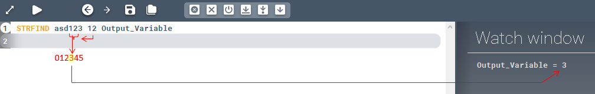

<!-- wp:paragraph -->

Finds a string within another string.

<!-- /wp:paragraph -->

<!-- wp:heading {"level":3} -->

### Syntax

<!-- /wp:heading -->

<!-- wp:paragraph -->

**STRFIND **

<!-- /wp:paragraph -->

<!-- wp:heading {"level":3} -->

### Command parameters

<!-- /wp:heading -->

<!-- wp:table {"className":"is-style-stripes"} -->

|                                       |                |                  |                   |
| ------------------------------------- | -------------- | ---------------- | ----------------- |
| **Command parameter**                 | **Assignment** | **Value format** | **Input options** |
| [String to search](#String-to-search) | Required       | String           | Local, variable   |
| [String to find](#String-to-find)     | Required       | String           | Local, variable   |
| [Output variable](#Output-variable)   | Required       | String           | Local, variable   |

<!-- /wp:table -->

<!-- wp:heading {"level":4} -->

#### String to search:

<!-- /wp:heading -->

<!-- wp:paragraph -->

The string that will be searched.

<!-- /wp:paragraph -->

<!-- wp:heading {"level":4} -->

#### String to find:

<!-- /wp:heading -->

<!-- wp:paragraph -->

The string that will be searched for within the first string.

<!-- /wp:paragraph -->

<!-- wp:heading {"level":4} -->

#### Output variable:

<!-- /wp:heading -->

<!-- wp:paragraph -->

The variable that will store the output.

<!-- /wp:paragraph -->

<!-- wp:heading {"level":3} -->

### Description

<!-- /wp:heading -->

<!-- wp:paragraph -->

Finds a string within another string. If the String to find exists within the String to search, then the character number of the first find (starting from 0) will be stored in the output variable. If the String to find does not exists within the String to search then the output value will be "-1".

<!-- /wp:paragraph -->

<!-- wp:heading {"level":3} -->

### Sample code:

<!-- /wp:heading -->

<!-- wp:loos-hcb/code-block -->

```
STRFIND asd123 12 Output_Variable
```

<!-- /wp:loos-hcb/code-block -->

<!-- wp:image {"id":23804,"sizeSlug":"full","linkDestination":"none"} -->



<!-- /wp:image -->
