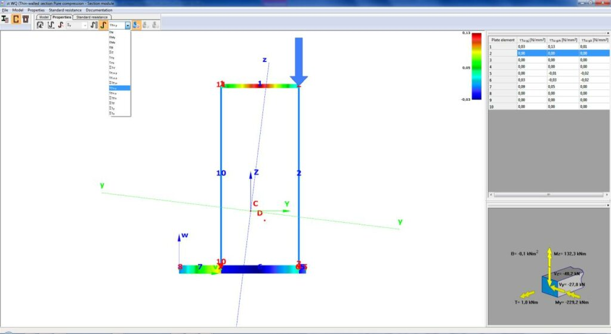

# Section modelling

**Section module** can be launched with the  command on the **Structural members** tab.

<!-- /wp:paragraph -->

<!-- wp:paragraph -->

New sections can be loaded or created with **Section administration** command  on the **Structural members** tab. For more information about section administration see **[Section administration](../5_0_structural-modeling/5_1_section-administration.md)**

<!-- /wp:paragraph -->
### The EPS Model

<!-- /wp:heading -->

<!-- wp:image {"align":"center","id":8465,"sizeSlug":"large","linkDestination":"media"} -->

<!-- /wp:image -->

<!-- wp:paragraph {"align":"justify"} -->

The _**Elastic Plate Segment (EPS)**_ model is a thin-walled simplification of the usual steel profiles from welded, hot-rolled or cold-formed sections. The model is very easy and fast to calculate and has accurate results for thin-walled sections compared with the GSS model, which can be used and run for the same section side by side. The model yields the same general, torsional, and shear properties and stresses and moreover, it calculates the static moments and sectional classes according to the EuroCode. The EPS model is also very suitable for the evaluation of all of the standard design formulas in a very sophisticated way. In the case of Class 4 profile, the effective cross-section is automatically generated based on the proper sectional forces, and the standard procedures can be evaluated on this effective section. In ConSteel version 13, it is new that the program automatically takes into account the effect of distortional buckling when calculating the effective cross-sections of cold-formed thin-wall sections.

<!-- /wp:paragraph -->

<!-- wp:columns {"verticalAlignment":"center","align":"wide"} -->

<!-- wp:column {"verticalAlignment":"center"} -->

<!-- wp:image {"align":"center","id":8471,"width":195,"height":372,"sizeSlug":"large","linkDestination":"media"} -->

<!-- /wp:image -->

<!-- /wp:column -->

<!-- wp:column {"verticalAlignment":"center"} -->

<!-- wp:image {"align":"center","id":8477,"sizeSlug":"large","linkDestination":"media"} -->

<!-- /wp:image -->

<!-- /wp:column -->

<!-- wp:column {"verticalAlignment":"center"} -->

<!-- wp:image {"align":"center","id":8483,"sizeSlug":"large","linkDestination":"media"} -->

<!-- /wp:image -->

<!-- /wp:column -->

<!-- /wp:columns -->

<!-- wp:image {"id":8495,"sizeSlug":"large","linkDestination":"media"} -->

<!-- /wp:image -->

<!-- wp:spacer -->

<!-- /wp:spacer -->

<!-- wp:heading {"level":3} -->

### The GSS (General Solid Section) model

<!-- /wp:heading -->

<!-- wp:image {"id":8509,"sizeSlug":"large","linkDestination":"media"} -->

<!-- /wp:image -->

<!-- wp:columns -->

<!-- wp:column {"width":"66.66%"} -->

<!-- wp:paragraph {"align":"justify"} -->

The _**General Solid Section (GSS)**_ was created in order to model any kind of cross-sections as accurate as possible. The model dissolves the section with arbitrary shapes into triangle elements and calculates the sectional properties by the finite element method. The section can be assembled with any number of different materials and the automatic finite element mesh generates separate triangles for the certain materials controlling the mesh size according to the elastic properties of the material. Beyond the usual properties (sectional area, second moment of inertia, etc.) the GSS model precisely calculates the torsional and shear properties like St. Venant and warping moment of inertia, shear areas, and factors, etc., and these accurate properties are used in the global analysis. The elastic normal, torsional, and shear stresses can be also calculated on this model using a spectacular colored view.

<!-- /wp:paragraph -->

<!-- /wp:column -->

<!-- wp:column {"width":"33.33%"} -->

<!-- wp:image {"id":8502,"sizeSlug":"large","linkDestination":"media"} -->

<!-- /wp:image -->

<!-- /wp:column -->

<!-- /wp:columns -->
