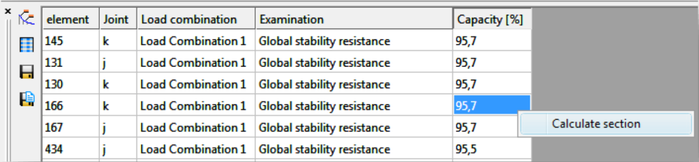
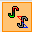
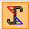
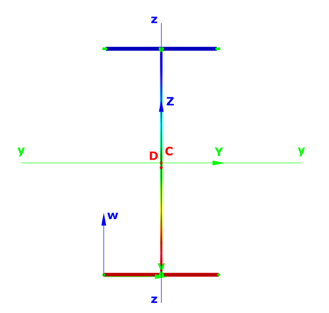
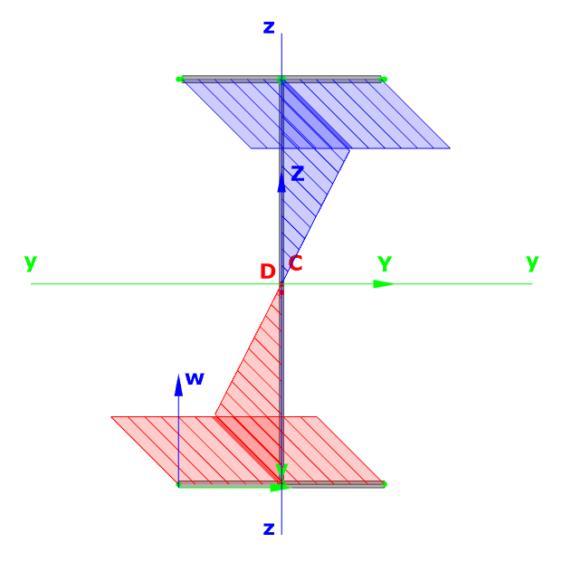
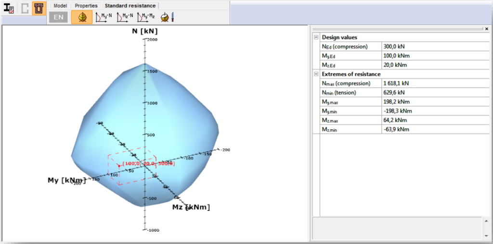

# Section module

### Geometrical calculations

<!-- /wp:heading -->

<!-- wp:paragraph {"align":"justify"} -->

There are three coordinate systems in Section module: main axis system (y,z), section edit system (v,w) and the section edit system moved to the center (C) of the section (Y,Z). The point D is the center of rotation. The section properties can be viewed according to these coordinate systems.

<!-- /wp:paragraph -->

<!-- wp:spacer -->

<!-- /wp:spacer -->

<!-- wp:heading {"level":3} -->

### Loads

<!-- /wp:heading -->

<!-- wp:paragraph {"align":"justify"} -->

If the section module is opened from the model, then all the load combination from the model are automatically imported into the section model. The relevant is chosen but any other can be selected and checked. It is also possible to add load combinations manually by clicking on the _**New** **load combination**_ icon .

<!-- /wp:paragraph -->

<!-- wp:image {"id":6623,"sizeSlug":"large","linkDestination":"media"} -->

<!-- /wp:image -->

<!-- wp:spacer {"height":"50px","editorskit":{"devices":false,"desktop":true,"tablet":true,"mobile":true,"loggedin":true,"loggedout":true,"acf_visibility":"","acf_field":"","acf_condition":"","acf_value":"","migrated":false,"unit_test":false},"editorskit_typography":{"name":"","family":"","weight":""},"extUtilities":[]} -->

<!-- /wp:spacer -->

<!-- wp:paragraph -->

**csSection** can be launched from the model if the **Analysis** or **Global check** tab is chosen and a first- or second-order analysis or standard design has been run. There are two ways to open **csSection** directly for a selected section.

<!-- /wp:paragraph -->

<!-- wp:columns -->

<!-- wp:column -->

<!-- wp:paragraph {"align":"justify"} -->

One possible way is to select **Calculate section** from the pop-up menu that appears by right-clicking over the section to be analyzed.

<!-- /wp:paragraph -->

<!-- wp:image {"align":"center","id":6629,"width":299,"height":224,"sizeSlug":"large","linkDestination":"media"} -->

<!-- /wp:image -->

<!-- /wp:column -->

<!-- wp:column -->

<!-- wp:paragraph {"align":"justify"} -->

The second way is to select the **Calculate section** option from the pop-up menu that appears by right-clicking on the row of the element in the result table.

<!-- /wp:paragraph -->

<!-- wp:image {"align":"center","id":6635,"sizeSlug":"large","linkDestination":"media"} -->

<!-- /wp:image -->

<!-- /wp:column -->

<!-- /wp:columns -->

<!-- wp:spacer -->

<!-- /wp:spacer -->

<!-- wp:heading {"level":3} -->

### Stresses

<!-- /wp:heading -->

<!-- wp:paragraph {"align":"justify"} -->

Stresses can be checked by selecting the **Properties **tab and clicking on the **Stresses **icon . Stresses can be viewed both in the EPS and the GSS model. Stresses can be represented in two ways:

<!-- /wp:paragraph -->

<!-- wp:list -->

-  by colored figure
-  by 3D diagram (only from version 15)

<!-- /wp:list -->

<!-- wp:columns -->

<!-- wp:column -->

<!-- wp:image {"id":22549,"sizeSlug":"large","linkDestination":"none"} -->

_Colored figure_

<!-- /wp:image -->

<!-- /wp:column -->

<!-- wp:column -->

<!-- wp:image {"id":22555,"sizeSlug":"large","linkDestination":"none"} -->

_3D diagram_

<!-- /wp:image -->

<!-- /wp:column -->

<!-- /wp:columns -->

<!-- wp:paragraph -->

The following stresses are calculated by **csSection**:

<!-- /wp:paragraph -->

<!-- wp:table {"hasFixedLayout":true,"align":"center","className":"is-style-stripes"} -->

| Stress symbol | Stress name                                        |
| ------------- | -------------------------------------------------- |
| σN            | Normal stress due to axial force                   |
| σMy           | Normal stress due strong axis bending              |
| σMz           | Normal stress due to weak axis bending             |
| σB            | Normal stress due to bimoment                      |
| Σσ            | Resultant normal stress                            |
| τVy           | Shear stress due to strong axis shear force        |
| τVz           | Shear stress due to weak axis shear force          |
| ΣτV           | Resultant shear stress due to shear forces         |
| τTsv.y        | Strong axis shear stress due to St. Venant torsion |
| τTsv.z        | Weak axis shear stress due to St. Venant torsion   |
| Σ τTsv        | Resultant shear stress due to St. Venant torsion   |
| τTω.y         | Strong axis shear stress due to warping torsion    |
| τTω.z         | Weak axis shear stress due to warping torsion      |
| Σ τTω         | Resultant shear stress due to warping torsion      |
| Σ τT          | Resultant shear stress due to torsion              |
| Σ τy          | Strong axis resultant shear stress                 |
| Σ τz          | Weak axis resultant shear stress                   |
|               |                                                    |

<!-- /wp:table -->

<!-- wp:spacer -->

<!-- /wp:spacer -->

<!-- wp:heading {"level":3} -->

### Effective cross section

<!-- /wp:heading -->

<!-- wp:paragraph {"align":"justify"} -->

If the first icon is clicked and EPS model is selected, then effective section takes into consideration.

<!-- /wp:paragraph -->

<!-- wp:image {"align":"center","id":6710,"width":233,"height":233,"sizeSlug":"large","linkDestination":"media"} -->

<!-- /wp:image -->

<!-- wp:spacer -->

<!-- /wp:spacer -->

<!-- wp:heading {"level":3} -->

### Standard resistance calculations

<!-- /wp:heading -->

<!-- wp:image {"align":"center","id":6719,"width":346,"height":66,"sizeSlug":"large","linkDestination":"media"} -->

<!-- /wp:image -->

<!-- wp:paragraph {"align":"justify"} -->

For the given loading case the module determines the necessary and possible checks, performs all the standard calculations, and evaluates the dominant case.

<!-- /wp:paragraph -->

<!-- wp:heading {"level":4} -->

#### Steel cross sections

<!-- /wp:heading -->

<!-- wp:paragraph {"align":"justify"} -->

The standard design procedures performed on the **EPS** model cover the major part of steel design methods in the Eurocode (the whole EN 1993-1-1 and parts of EN 1993-1-5) including the calculations of general elastic resistance, examination of pure cases, plastic and conservative interaction resistances of certain section types, web buckling analysis.

<!-- /wp:paragraph -->

<!-- wp:paragraph -->

The following design checks are calculated by **csSection**:

<!-- /wp:paragraph -->

<!-- wp:image {"align":"center","id":22309,"width":626,"height":1849,"sizeSlug":"full","linkDestination":"media"} -->

<!-- /wp:image -->

<!-- wp:spacer -->

<!-- /wp:spacer -->

<!-- wp:heading {"level":4} -->

#### Resistance of composite and reinforced concrete cross sections

<!-- /wp:heading -->

<!-- wp:paragraph {"align":"justify"} -->

In case of reinforced concrete section, the **CSSECTION** module can perform just the resistance surface of the section. It is also possible to view the resistance line along three different axes and the arbitrary section.

<!-- /wp:paragraph -->

<!-- wp:image {"align":"center","id":6726,"width":682,"height":338,"sizeSlug":"large","linkDestination":"media"} -->

<!-- /wp:image -->

<!-- wp:paragraph -->

For the composite sections the resistance surface and the part of the EC 4 are performed.

<!-- /wp:paragraph -->

<!-- wp:paragraph -->

The following design checks are calculated by **CSSECTION** for the composite sections:

<!-- /wp:paragraph -->

<!-- wp:image {"align":"center","id":22316,"width":552,"height":473,"sizeSlug":"full","linkDestination":"media"} -->

<!-- /wp:image -->

<!-- wp:heading {"level":4} -->

#### Results

<!-- /wp:heading -->

<!-- wp:paragraph {"align":"justify"} -->

There is a short summary about the calculations on the right and the name of the dominant case, formula and load combination can be found there.

<!-- /wp:paragraph -->

<!-- wp:image {"align":"center","id":6734,"width":438,"height":561,"sizeSlug":"large","linkDestination":"media"} -->

