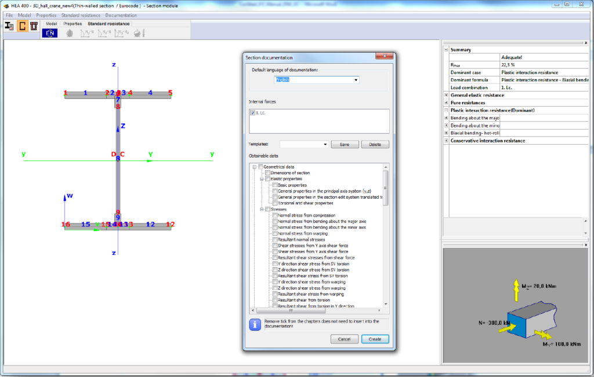

# Documentation

Each analyzed cross-section can be separately documented in detail for both section design including the shape parameters, geometrical, mechanical, and design results, and the generated documents can be attached to the main documentation of the global structure.

<!-- /wp:paragraph -->

<!-- wp:paragraph {"align":"justify"} -->

After clicking the Documentation option on the menu bar, the way for creating documentation is the same as in Consteel main module (see **_[CHAPTER 14 DOCUMENTATION](../13_0_documentation-2/13_1_the-document-tab.md)_** for more detailed instructions).

<!-- /wp:paragraph -->

<!-- wp:image {"align":"center","id":6742,"width":714,"height":453,"sizeSlug":"large","linkDestination":"media"} -->

<!-- /wp:image -->
