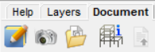
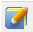
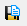
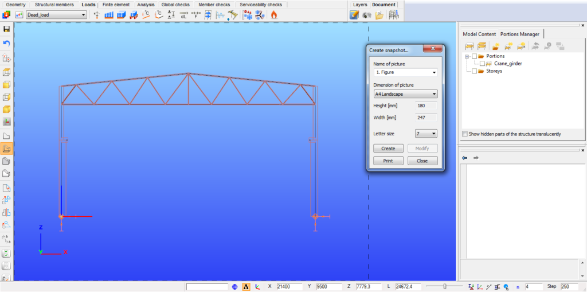

# The Document tab

**Consteel 17**

<!-- /wp:paragraph -->

<!-- wp:image {"id":71708,"width":"151px","height":"auto","sizeSlug":"full","linkDestination":"none"} -->

<!-- /wp:image -->

<!-- wp:paragraph -->

**Consteel 16**

<!-- /wp:paragraph -->

<!-- wp:image {"align":"left","id":9612,"sizeSlug":"large","linkDestination":"media"} -->

<!-- /wp:image -->

<!-- wp:paragraph -->

<!-- /wp:paragraph -->

<!-- wp:paragraph -->

<!-- /wp:paragraph -->

<!-- wp:heading {"level":3} -->

### Create document

<!-- /wp:heading -->

<!-- wp:image {"align":"right","id":22333,"width":468,"height":352,"sizeSlug":"full","linkDestination":"media"} -->

<!-- /wp:image -->

<!-- wp:paragraph {"align":"justify"} -->

All commands related to the documentation are placed in the Document tab. The documentation can be generated if the first command  is clicked. The documentation wizard guides you through the documentation generating process. In the first window, the name of the documentation can be set. The name appears on every page of the documentation. Other fields like the name of the project, the name of the engineers, and the date of the creation can also be set but would appear only on the front page.

<!-- /wp:paragraph -->

<!-- wp:paragraph -->

The header and the footer pictures of the document can be customized so your own company logo can be added. In order to do so, the default header and footer images need to be replaced. These files can be found in the software’s installation directory; the default path is the following: C:\\Program Files\\ConSteelversion\\Pic. The “Header_pic.png” and the “Footer_pic.png” need to be replaced by your own images.

<!-- /wp:paragraph -->

<!-- wp:image {"align":"right","id":22345,"width":259,"height":429,"sizeSlug":"full","linkDestination":"media"} -->

<!-- /wp:image -->

<!-- wp:image {"align":"right","id":22339,"width":194,"height":145,"sizeSlug":"full","linkDestination":"media"} -->

<!-- /wp:image -->

<!-- wp:paragraph -->

The second step is to choose which of the analysis results need to be included in the documentation. Any of the analysis results can be chosen if had been calculated previously.

<!-- /wp:paragraph -->

<!-- wp:paragraph {"align":"justify"} -->

The third window of the wizard includes the name of the chapters which can be added to or can be removed from the documentation.

<!-- /wp:paragraph -->

<!-- wp:paragraph {"align":"justify"} -->

To document the ULS design, a utilization limit can be set at the bottom of the dialog. Structural elements whose utilization is at least the specified utilization value are included in the document. The utilization limit value can be specified separately for the summary and for the detailed documentation.

<!-- /wp:paragraph -->

<!-- wp:paragraph {"align":"justify"} -->

Documentation templates can be created with the **Save** button. Most used documentation structures can be saved as templates. Based on the templates, documentation can be created with one click.

<!-- /wp:paragraph -->

<!-- wp:paragraph {"align":"justify"} -->

If you click on the **Create** button the program will generate the documentation.

<!-- /wp:paragraph -->

<!-- wp:spacer -->

<!-- /wp:spacer -->

<!-- wp:heading {"level":4} -->

#### Documentation module

<!-- /wp:heading -->

<!-- wp:image {"align":"right","id":9646,"width":290,"height":270,"sizeSlug":"large","linkDestination":"media"} -->

<!-- /wp:image -->

<!-- wp:paragraph {"align":"justify"} -->

After creating the documentation it will be opened in a new window. At the top right of the window, the chapters can be seen. The chapters can be moved up or down by the drag-and-drop function. It is also possible to delete content from the document by clicking the third icon (#2).

<!-- /wp:paragraph -->

<!-- wp:paragraph {"align":"justify"} -->

Text can be inserted anywhere in the document if you click on the fourth icon (#3) and type in the desired text into the window. It is also possible to insert headings by clicking on the fifth icon (#4). You can also insert page breaks anywhere in the document using the sixth icon (#5). The last three icons can be used for the following purposes: Edit heading and increase or decrease the level of heading.

<!-- /wp:paragraph -->

<!-- wp:paragraph {"align":"justify"} -->

The last two icons on the right are different if you click on a chapter or in a paragraph. If you click on a chapter then the icons are as described above. If a paragraph is clicked where there is a table the last icon  can be used to delete any column from the table. If you click on a paragraph that contains text then the last two icons on the right can be used to edit the paragraph content and the alignment.

<!-- /wp:paragraph -->

<!-- wp:columns -->

<!-- wp:column -->

<!-- wp:paragraph -->

With the first two icons (#1) the fitting of the pages can be set. Pages can be fit with width () or with height().

<!-- /wp:paragraph -->

<!-- /wp:column -->

<!-- wp:column -->

<!-- wp:image {"align":"center","id":9653,"sizeSlug":"large","linkDestination":"media"} -->

<!-- /wp:image -->

<!-- /wp:column -->

<!-- /wp:columns -->

<!-- wp:columns -->

<!-- wp:column -->

<!-- wp:paragraph {"align":"justify"} -->

By clicking the **Pictures** tab the image handling icons can be seen. Any of the taken _[snapshots](#creating-snapshots)_ can be inserted into the documentation or can be deleted. The image will be inserted below the selected paragraph.

<!-- /wp:paragraph -->

<!-- /wp:column -->

<!-- wp:column -->

<!-- wp:image {"align":"center","id":9659,"sizeSlug":"large","linkDestination":"media"} -->

<!-- /wp:image -->

<!-- /wp:column -->

<!-- /wp:columns -->

<!-- wp:paragraph -->

The third tab is the **Tables**. There are a lot of possibilities in _ConSteel_ where tables can be saved. Anywhere in the analysis and design process where the  icon appears in a table, that table can be saved. These saved tables can be inserted into the documentation or can be deleted from the model database. The table will be inserted below the selected paragraph.

<!-- /wp:paragraph -->

<!-- wp:paragraph -->

The last tab is the **Appendices**. If any joint or section documentation had been generated previously, these can be found here and can be added to the end of the documentation. The appendices can also be deleted from the database.

<!-- /wp:paragraph -->

<!-- wp:image {"align":"left","id":21417,"width":76,"height":81,"sizeSlug":"full","linkDestination":"none"} -->

<!-- /wp:image -->

<!-- wp:paragraph -->

It should be bear in mind that the documentation needs to be regenerated to be up to date after any changes have been made to the model. If there are snapshots in the documentation these snapshots should be taken again and need to be added to the documentation.

<!-- /wp:paragraph -->

<!-- wp:spacer {"height":"25px"} -->

<!-- /wp:spacer -->

<!-- wp:heading {"level":3} -->

### Creating snapshots

<!-- /wp:heading -->

<!-- wp:image {"align":"right","id":22388,"width":133,"height":227,"sizeSlug":"full","linkDestination":"media"} -->

<!-- /wp:image -->

<!-- wp:paragraph -->

The second command on the Document tab can be used to take a snapshot of the model. The snapshots can be easily added to the desired part of the documentation (see chapter _[Documentation module](#documentation-module)_ for detailed information).

<!-- /wp:paragraph -->

<!-- wp:paragraph -->

The size of the snapshot can be set and a dashed rectangle shows which part of the model would appear on the picture. The model can be moved or rotated to fit into the dashed rectangle.

<!-- /wp:paragraph -->

<!-- wp:paragraph -->

With the **Print** button, the actual view of the model can be printed directly from the dialog.

<!-- /wp:paragraph -->

<!-- wp:image {"align":"center","id":9674,"sizeSlug":"large","linkDestination":"media"} -->

<!-- /wp:image -->

<!-- wp:heading {"level":3} -->

### Snapshot manager

<!-- /wp:heading -->

<!-- wp:columns -->

<!-- wp:column -->

<!-- wp:paragraph {"align":"justify"} -->

The third icon on the documentation tab is the **Snapshot manager**  where the taken snapshots can be exported to a file or can be deleted from the model (except if the picture was inserted into the documentation) in order to reduce model file size. Multiple selected pictures can be saved and deleted at the same time. The name of the images can also be edited by double clicking the name of the image.

<!-- /wp:paragraph -->

<!-- /wp:column -->

<!-- wp:column -->

<!-- wp:image {"align":"center","id":9681,"sizeSlug":"large","linkDestination":"media"} -->

<!-- /wp:image -->

<!-- /wp:column -->

<!-- /wp:columns -->

<!-- wp:heading {"level":3} -->

### Import log

<!-- /wp:heading -->

<!-- wp:paragraph -->

Starting from **Consteel 17**, the **Import log** is implemented. It contains all the objects with their attributes, and it is highlighted if some characteristics are set as default or if any problems occurred during the import process.

<!-- /wp:paragraph -->

<!-- wp:heading {"level":3} -->

### Model information

<!-- /wp:heading -->

<!-- wp:columns -->

<!-- wp:column -->

<!-- wp:paragraph {"align":"justify"} -->

By using the fourth icon  on the Document tab the model information can be viewed or can be exported to a file. The model information window shows the most important features of the model like the Number of bars, Number of supports, Total weight of the structure, etc. The mass, surface, and length can be viewed for each section in the model. The model information can be shown based on the full model or on the current view.

<!-- /wp:paragraph -->

<!-- /wp:column -->

<!-- wp:column -->

<!-- wp:image {"align":"center","id":9688,"sizeSlug":"large","linkDestination":"media"} -->

<!-- /wp:image -->

<!-- /wp:column -->

<!-- /wp:columns -->
