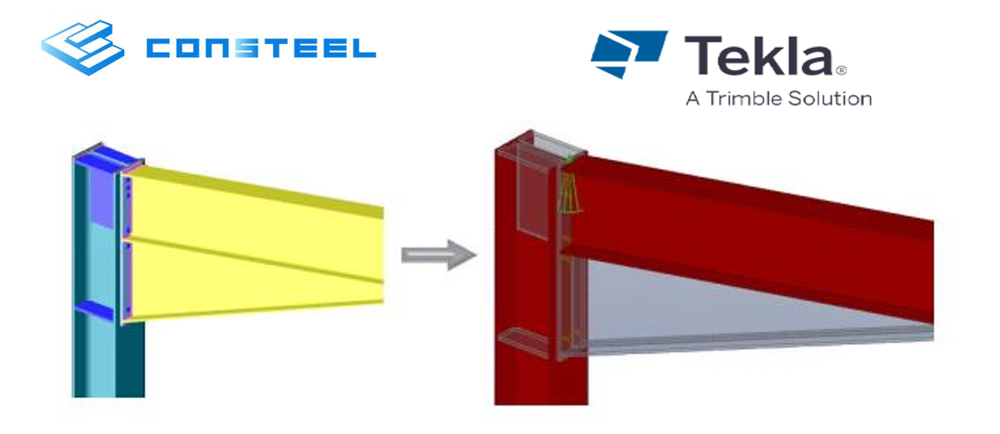

# Joint export

All joints can be exported to _TEKLA Structures_ steel detailing software. See chapter [File handling](../2_0_file-handling/2_9_exporting-model-data-from-dlubal-rstab-in-xlsx-format.md) for more detailed information.

<!-- wp:paragraph -->

<!-- /wp:paragraph -->
