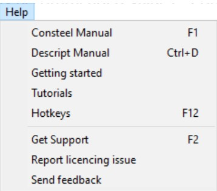
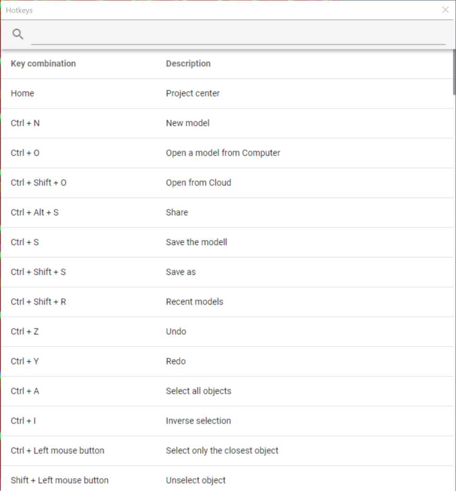

# Hot keys

The hot keys can significantly speed up the modeling work. _ConSteel_ provides the following pre-defined hot keys:

<!-- /wp:paragraph -->

<!-- wp:paragraph {"fontSize":"medium"} -->

**Consteel 16**

<!-- /wp:paragraph -->

<!-- wp:list -->

- **Home: Project Center**
- **CTRL+N: new model**
- **CTRL+O : open a model from computer**
- **Ctrl + Shift + O: Open from Cloud**
- **Ctrl + Alt + S: Share**
- **CTRL+S: save the model**
- **Ctrl+Shift+S: Save as**
- **Ctrl + Shift + R: Recent models**
- **CTRL+Z: undo**
- **CTRL+Y: redo**
- **CTRL+A: select all objects**
- **CTRL+I: inverse selection**
- **CRTL + left mouse button: select only the closest object**
- **SHIFT+left mouse button: unselect object**
- **ESC: unselect all or terminate (or abort) the last action**
- **Delete: delete selected objects**
- **Ctrl + 0: fit view**
- **CTRL+1: switch to XY view**
- **CTRL+2: switch to XZ view**
- **CTRL+3: switch to YZ view**
- **CTRL+4: switch to XYZ view**
- **CTRL+5: switches the view perpendicular to the UCS**
- **CTRL+C: copy the selected cell contents from the editable tables**
- **CTRL+V: past the copied cell contents**
- **Middle mouse button: move model**
- **ALT+left mouse button: rotate model**
- **ALT+right mouse button: zooming model**
- **↑: move model up**
- **↓: move model down**
- **→: move model right**
- **←: move model left**
- **mouse wheel: zoom in/out**
- **+: zoom in**
- **-: zoom out**
- **SHIFT+ALT+left mouse button: zoom with a window**
- **Insert: place relative origo**
- **X: manual definition of X coordinate value**
- **Y: manual definition of Y coordinate value**
- **Z: manual definition of Z coordinate value**
- **A: manual definition of alpha polar coordinate value**
- **B: manual definition of beta polar coordinate value**
- **L: manual definition of a length from the previous point in a defined direction**
- **Q: switch between the global and last defined user coordinate system**
- **Ctrl + L: Licence**
- **Ctrl + H: Model history**
- **Ctrl + D: Descript Manual**
- **Ctrl + E: open Move point or edge function**
- **Ctrl + T: open Translation function**
- **Ctrl + R: open Rotate function**
- **Ctrl + J: open Consteel Joint**
- **Ctrl + P: Select by property**
- **Shift + A: Section administrator**
- **Shift + S: Section modul**
- **K: Load combination sets**
- **Alt + C: Object color by section**
- **Alt + P: Create snapshot**
- **F1: Consteel Manual**
- **F2: Get Support**
- **F3: Diagnostics**
- **F4: Options**
- **F5: Analysis parameters**
- **F6: Run analysis**
- **F7: Global check parameters**
- **F8: Run Global checks**
- **F9: Serviceability limit state check settings**
- **F10: open Document editor**
- **F11: Layers**
- **F12: Hotkeys**
- **Shift+1: Line view**
- **Shift+2: Wireframe view**
- **Shift+3: Hidden line view**
- **Shift+4: Solid view**
- **Shift + F1: Geometry tab**
- **Shift + F2: Structural members tab**
- **Shift + F3: Loads tab**
- **Shift + F4: Mass tab**
- **Shift + F5: Finite element tab**
- **Shift + F6: Analysis tab**
- **Shift + F7: Global checks tab**
- **Shift + F8: Member checks tab**
- **Shift + F9: Serviceability checks tab**
- **Shift + F10: Help tab**
- **Shift + F11: Layers tab**
- **Shift + F12: Documents tab**
- **Tab: Switch to next tab**
- **Ctrl+Tab: Switch to previous tab**
- **Alt + D: open Descript**

<!-- wp:paragraph -->

**Documentation module**

- **Ctrl + O: Open**
- **Ctrl +N: New**
- **Ctrl + P: Print**
- **Ctrl + E: Export**
- **Ctrl + H: Hide/show panel**
- **Ctrl + S: Settings**
- **Home: First page**
- **End: Last page**
- **Page up: One page up**
- **Page down: One page down**

<!-- wp:paragraph -->

Hot keys appear in the tooltips and hints of the functions. It is also possible to search the desired key combination in the **_Hot keys_** window, which is accessible from the **_Help menu_**.

<!-- /wp:paragraph -->

<!-- wp:image {"align":"center","id":44380,"width":254,"height":223,"sizeSlug":"full","linkDestination":"none"} -->

<!-- /wp:image -->

<!-- wp:image {"align":"center","id":44387,"width":486,"height":523,"sizeSlug":"large","linkDestination":"none"} -->

<!-- /wp:image -->

<!-- wp:paragraph {"fontSize":"medium"} -->

**Consteel 15**

<!-- /wp:paragraph -->

<!-- wp:list -->

- **CTRL+N: new model**
- **CTRL+O: open a model**
- **CTRL+S: save the model**
- **CTRL+Z: undo**
- **CTRL+Y: redo**
- **CTRL+A: select all** **objects**
- **CTRL+I: inverse selection**
- **CTRL+1: switch to XY view**
- **CTRL+2: switch to XZ view**
- **CTRL+3: switch to YZ view**
- **CTRL+4: switch to XYZ view**
- **CTRL+5: switches the view perpendicular to the UCS**
- **CTRL+C: copy the selected cell contents from the editable tables**
- **CTRL+V: paste the copied cell contents**
- **ESC: unselect all or terminate (or abort) the last action**
- **Delete: delete selected objects**
- **F1: open Help system**
- **F3: runs analysis with the actual settings**
- **X: manual definition of X coordinate value**
- **Y: manual definition of Y coordinate value**
- **Z: manual definition of Z coordinate value**
- **a: manual definition of alpha polar coordinate value**
- **b: manual definition of beta polar coordinate value**
- **L: manual definition of a length from the previous point in a defined direction**
- **R: switch between the global and last defined user coordinate system**
- **Middle mouse button: move model**
- **ALT+left mouse button: rotate model**
- **ALT+right mouse button: zooming model**
- **↑: move model up**
- **↓: move model down**
- **→: move model right**
- **←: move model left**
- **mouse wheel: zoom in/out**
- **+: zoom in**
- **-: zoom out**
- **SHIFT+left mouse button: unselect** **object**
- **SHIFT+ALT+left mouse button: zoom with a window**