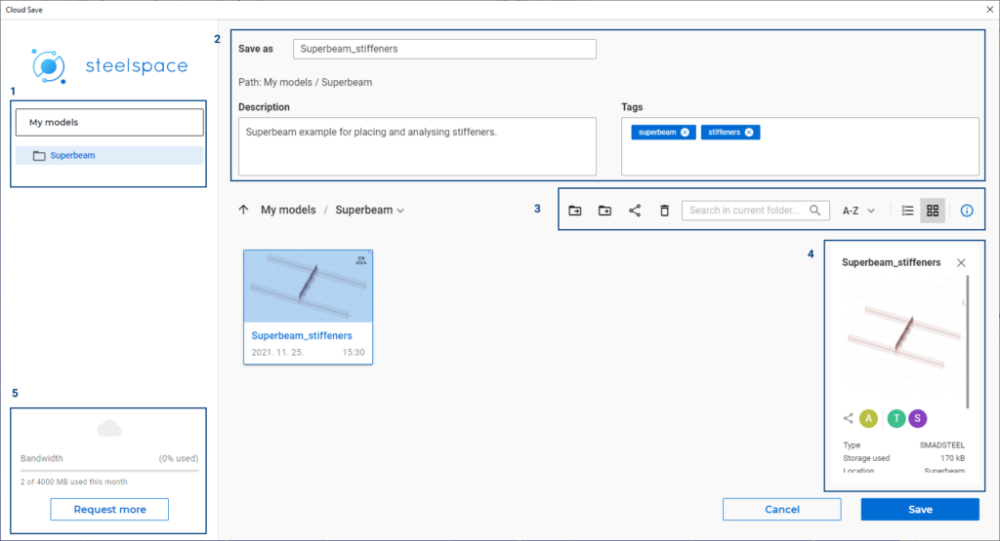
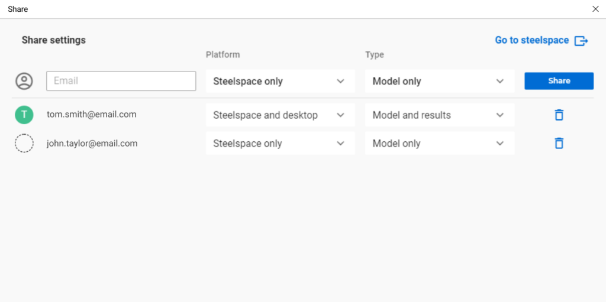

# Cloud save and sharing models'

Cloud model save, open and share are new features available from version 15. Your cloud-saved models will accumulate in your personal cloud storage provided by the Steelspace platform. You can quickly view, access, open, or share them directly from Consteel. Your cloud-saved models are always synchronized into the following folder of your local device: C:\\Users(username)\\AppData\\Local\\ConSteel\\CloudModels. The model synchronization costs data bandwidth from your monthly limit. Model synchronization is done during the events of first cloud-save, model sharing, and closing the model, all the other actions are saving the model only to the local device in order not to increase the data traffic within your bandwidth limit. If any synchronization problem happens (the models on the local device and in the cloud are not identical and it is not clear which is the right one) you can choose which model version to continue with.

<!-- /wp:paragraph -->

<!-- wp:heading {"level":3} -->

### Saving to the Cloud

<!-- /wp:heading -->

<!-- wp:paragraph -->

Choosing the Cloud option when saving a model will open your cloud storage.

<!-- /wp:paragraph -->

<!-- wp:paragraph -->

Your folder tree can be seen on the left side **(1)**.

<!-- /wp:paragraph -->

<!-- wp:paragraph -->

To save a model, you can type your model name. Additional descriptions and tags can be added to the model **(2)**.

<!-- /wp:paragraph -->

<!-- wp:paragraph -->

You can execute additional actions to your saved models or to your storage. These are from left to right: "Move", "Create new folder", "Share model", "Delete", "Search", "Sort by name or date", "List or card view", and switch model information on or off **(3)**.

<!-- /wp:paragraph -->

<!-- wp:paragraph -->

If the model information is switched on, a panel will be seen on the right side regarding the information of the selected model **(4)**.

<!-- /wp:paragraph -->

<!-- wp:paragraph -->

Saving a model to the cloud costs data bandwidth. Your monthly limit is set by your membership level and can be seen in the left bottom corner **(5)**.

<!-- /wp:paragraph -->

<!-- wp:image {"align":"center","id":28251,"width":720,"height":390,"sizeSlug":"large","linkDestination":"none"} -->

Cloud save dialog

<!-- /wp:image -->

<!-- wp:html -->

https://www.youtube.com/watch?v=8UHqT7wl5dI

<!-- /wp:html -->

<!-- wp:heading {"level":3} -->

### Open cloud models

<!-- /wp:heading -->

<!-- wp:paragraph -->

From the File menu or Project Center click on the "Open from Cloud" command and you can access your models from your cloud storage. Select the model you would like to view then click on the Open button. For more information, read the section about [how to open model files](https://consteelsoftware.com/manual/general-description/installing-and-running-the-software/#cloudopen).

<!-- /wp:paragraph -->

<!-- wp:heading {"level":3} -->

### Sharing models

<!-- /wp:heading -->

<!-- wp:paragraph -->

You can share models saved to the cloud with others. Users who have registered a Consteel account on our website can also view these models in their cloud storage. If someone doesn't have a Consteel account yet, a dashed-lined circle will appear next to their email addresses.

<!-- /wp:paragraph -->

<!-- wp:paragraph -->

You can edit on which **platform** you want to share your model. Steelspace only means that the shared model can be accessed on the web browser-based Steelspace platform only. Steelspace is under development at the moment. Steelspace and desktop means that the shared model can be accessed on Steelspace and in Consteel.

<!-- /wp:paragraph -->

<!-- wp:paragraph -->

You can edit also which sharing **type** should be available for the model. _Model only_ means that you share only your model file without results. _Model and results_ means that you share your model and the results regarding your model as well.

<!-- /wp:paragraph -->

<!-- wp:paragraph -->

When you would like to stop sharing a model with someone, just click on the trash bin icon on the right side in line with that user.

<!-- /wp:paragraph -->

<!-- wp:image {"align":"center","id":28245,"width":768,"height":383,"sizeSlug":"large","linkDestination":"none"} -->

Share settings

<!-- /wp:image -->
