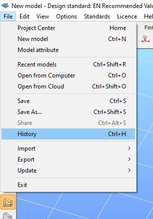
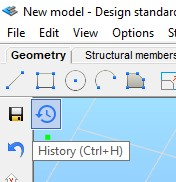
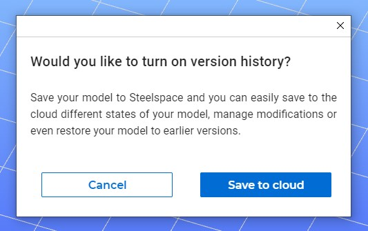
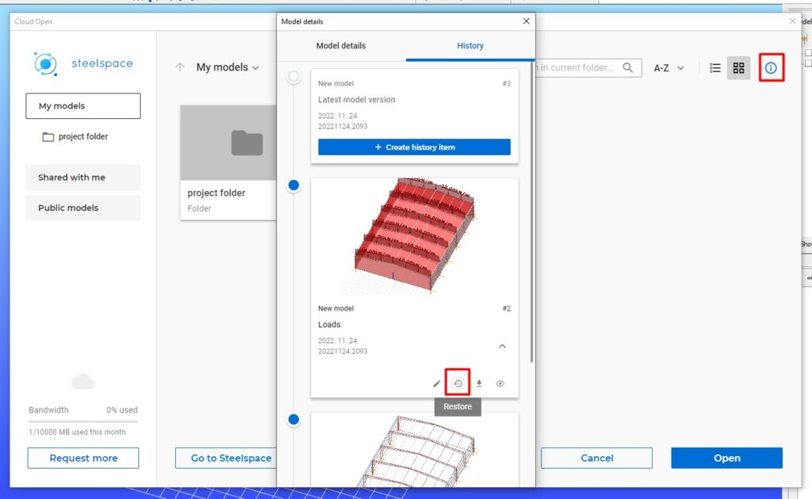
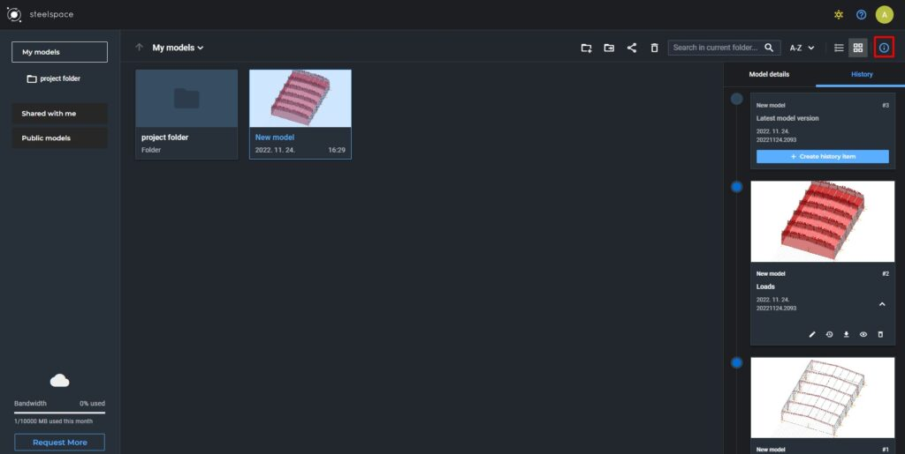
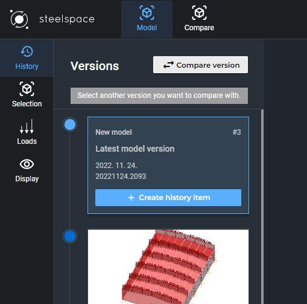
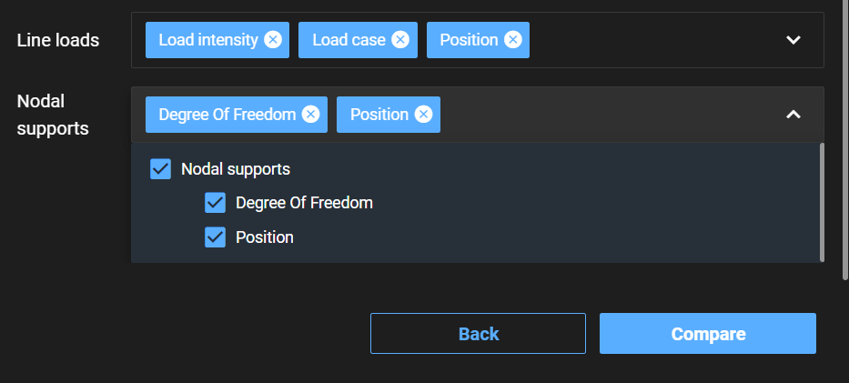
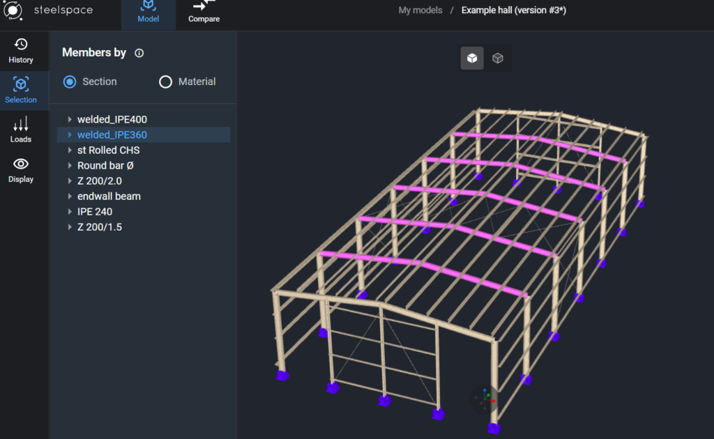
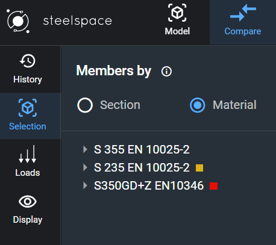
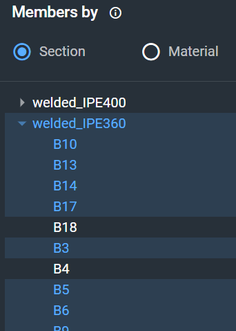

# History (model versioning) and comparing versions

In Consteel 16, you can create, view, download, edit and restore previous versions of your models as a new cloud-based service supported by Steelspace. An online connection is required to use the History function as it only works with cloud-saved models. All versioning-related actions cost bandwidth therefore using this service is only limited by the monthly storage limit of your Consteel Community Membership. **So don’t forget to save your model regularly as creating a history item and saving to the cloud are not the same!** The purpose of the History function is to preserve different states of a model that can be important for future modifications or model review.

<!-- /wp:paragraph -->

<!-- wp:heading {"level":3} -->

### **Model history in Consteel**

<!-- /wp:heading -->

<!-- wp:heading {"level":4} -->

#### **Creating a history item**

<!-- /wp:heading -->

<!-- wp:paragraph -->

You can find the feature as an icon when hovering the Save icon or in the File menu or by clicking the Ctrl + H keyboard shortcut combination.

<!-- /wp:paragraph -->

<!-- wp:columns -->

<!-- wp:column -->

<!-- wp:image {"align":"center","id":44033,"sizeSlug":"full","linkDestination":"none"} -->

History command within the File menu

<!-- /wp:image -->

<!-- /wp:column -->

<!-- wp:column -->

<!-- wp:image {"align":"center","id":44040,"width":255,"height":264,"sizeSlug":"full","linkDestination":"none"} -->

Hover with the cursor above the Save icon to reveal the History icon

<!-- /wp:image -->

<!-- /wp:column -->

<!-- /wp:columns -->

<!-- wp:paragraph -->

When you start the function for a model for the first time the software will ask you whether you would like to turn on model versioning and you can first save your model as a cloud model and then create your first history item of your model.

<!-- /wp:paragraph -->

<!-- wp:image {"align":"center","id":44047,"sizeSlug":"full","linkDestination":"none"} -->

_Pop up notice when History is used for the first time_

<!-- /wp:image -->

<!-- wp:paragraph -->

You can name the history item and add a description of the version if it’s needed. The name of the model will not be changed to the History record name.

<!-- /wp:paragraph -->

<!-- wp:image {"align":"center","id":44054,"width":313,"height":557,"sizeSlug":"full","linkDestination":"none"} -->

_Creating new history item with name and description_

<!-- /wp:image -->

<!-- wp:paragraph -->

The history item also includes the name of the model, the number of the history version, the date when it was created, the build number of the Consteel version in which the model was created, and a snapshot of your model screen.

<!-- /wp:paragraph -->

<!-- wp:paragraph -->

To create another history item just click on the „+ Create history item” button. The latest model version will be always at the top of the timeline.

<!-- /wp:paragraph -->

<!-- wp:image {"align":"center","id":44061,"width":385,"height":690,"sizeSlug":"full","linkDestination":"none"} -->

_Click the „+ Create history item” button to create a new one_

<!-- /wp:image -->

<!-- wp:heading {"level":4} -->

#### **Downloading a version of a model**

<!-- /wp:heading -->

<!-- wp:paragraph -->

When you open the History function click on the Download icon at the desired model history item and it will download it to your computer.

<!-- /wp:paragraph -->

<!-- wp:heading {"level":4} -->

#### **Editing a history item**

<!-- /wp:heading -->

<!-- wp:paragraph -->

When you open the History function click on the Edit icon at the desired model history item and you can edit the name and the description field of the selected history item.

<!-- /wp:paragraph -->

<!-- wp:heading {"level":4} -->

#### **Viewing a version of a model**

<!-- /wp:heading -->

<!-- wp:paragraph -->

When you open the History function and click on the View icon at the desired model history item it will open the desired model version in Steelspace.

<!-- /wp:paragraph -->

<!-- wp:heading {"level":4} -->

#### **Restore a previous version of a model**

<!-- /wp:heading -->

<!-- wp:paragraph -->

The restore function is limited to cloud services not to cause conflict in an already opened model. In Consteel, first, you have to start Consteel again and click on the „Open from Cloud” button in the Project Center or in the File/Open from Cloud command to view your models in the cloud. Select the desired model and then click on the i icon on the right side of the screen and click on the „History” tab to access the version history of that model. Choose the history version you like and click on the Restore icon.

<!-- /wp:paragraph -->

<!-- wp:image {"align":"center","id":44068,"width":834,"height":513,"sizeSlug":"large","linkDestination":"none"} -->

_The Restore icon can be only found when you open a file from the cloud_

<!-- /wp:image -->

<!-- wp:paragraph -->

A warning message will appear not to restore a version by accident. After restoring, the selected version will be the latest state of that model.

<!-- /wp:paragraph -->

<!-- wp:image {"align":"center","id":44075,"sizeSlug":"full","linkDestination":"none"} -->

_Warning message about restoring to an earlier version_

<!-- /wp:image -->

<!-- wp:spacer {"height":"36px"} -->

<!-- /wp:spacer -->

<!-- wp:heading {"level":3} -->

### **Model history in Steelspace**

<!-- /wp:heading -->

<!-- wp:paragraph -->

As you can see the History function is fully integrated into Steelspace. You just need to log in to Steelspace at steelspace.io and you can access your models' version history even when you don’t open Consteel.

<!-- /wp:paragraph -->

<!-- wp:heading {"level":4} -->

#### **Creating a history item**

<!-- /wp:heading -->

<!-- wp:paragraph -->

You can only create a history item if the latest cloud saved state is not identical to the last history item state.

<!-- /wp:paragraph -->

<!-- wp:paragraph -->

Select the desired model in the Document selector screen and then click on the „i” icon on the right side of the screen and click on the „History” tab to access the version history of that model.

<!-- /wp:paragraph -->

<!-- wp:image {"align":"center","id":44083,"width":829,"height":417,"sizeSlug":"large","linkDestination":"none"} -->

_Click on the „i” icon on the right side of the screen to access the version history of a model_

<!-- /wp:image -->

<!-- wp:paragraph -->

If you opened your model, click on the History tab on the right side of the Model viewer screen.

<!-- /wp:paragraph -->

<!-- wp:paragraph -->

To create the latest history item just click on the „+ Create history item” button on the first card in the timeline.

<!-- /wp:paragraph -->

<!-- wp:paragraph -->

Starting from **Consteel 17**, the Model Version History was upgraded. All team members can save new versions to the model history according to their permission levels. Information regarding the person who created the model version, along with the date and exact time of saving, will appear underneath the name of the history.

<!-- /wp:paragraph -->

<!-- wp:image {"align":"center","id":44093,"width":800,"height":401,"sizeSlug":"large","linkDestination":"none"} -->

_Click on the History tab on the right side in the Model viewer screen to access the version history of a model_

<!-- /wp:image -->

<!-- wp:heading {"level":4} -->

#### **Downloading a version of a model**

<!-- /wp:heading -->

<!-- wp:paragraph -->

Click on the Download icon at the desired model history item in the Document selector or in the Model viewer and it will download it to your computer with the name of the history item.

<!-- /wp:paragraph -->

<!-- wp:heading {"level":4} -->

#### **Editing a history item**

<!-- /wp:heading -->

<!-- wp:paragraph -->

Click on the Edit icon at the desired model history item in the Document selector or in the Model viewer and it you can edit the name and the description field of the selected history item.

<!-- /wp:paragraph -->

<!-- wp:heading {"level":4} -->

#### **Viewing a version of a model**

<!-- /wp:heading -->

<!-- wp:paragraph -->

In the Document selector just click twice on the card of the model or click on the View icon at the desired model history item and it will open the model version in the Model viewer.

<!-- /wp:paragraph -->

<!-- wp:heading {"level":4} -->

#### **Restore a previous version of a model**

<!-- /wp:heading -->

<!-- wp:paragraph -->

Choose the history version you like and click on the Restore icon. A warning message will appear not to restore a version by accident. After restoring, the selected version will be the latest state of that model. You can also do it in the Model viewer.

<!-- /wp:paragraph -->

<!-- wp:heading {"level":4} -->

#### **Deleting a history item**

<!-- /wp:heading -->

<!-- wp:paragraph -->

Click on the Delete icon at the desired model history item in the Document selector or in the Model viewer and it will delete the selected history item permanently. A warning message will appear not to delete a version by accident.

<!-- /wp:paragraph -->

<!-- wp:heading {"level":3} -->

### **Compare model versions**

<!-- /wp:heading -->

<!-- wp:paragraph -->

As an addition to the model history function, we have introduced the compare feature, which allows comparing two versions of the same model. Comparing takes place in Steelspace where you can select easily which versions would you like to compare.

<!-- /wp:paragraph -->

<!-- wp:paragraph -->

When opening a model in Steelspace you can find the „Compare version” button at the top within the History tab. Clicking the button will start the compare feature and the opened model version becomes automatically one of the selected versions, a hint will appear and you just have to select another version to compare with.

<!-- /wp:paragraph -->

<!-- wp:image {"align":"center","id":44101,"width":402,"height":397,"sizeSlug":"full","linkDestination":"none"} -->

_When starting the compare function, a hint will appear under the Compare version button_

<!-- /wp:image -->

<!-- wp:paragraph -->

After clicking, a dialog will appear where you can change what model versions you would like to compare then hit the compare button.

<!-- /wp:paragraph -->

<!-- wp:image {"align":"center","id":44108,"width":894,"height":452,"sizeSlug":"large","linkDestination":"none"} -->

_Dialog for selecting which versions to compare_

<!-- /wp:image -->

<!-- wp:paragraph -->

Starting from the new version, criteria for comparison can be set. Users can select, with the help of dropdown menus, the objects to display status changes on, and the selected objects will be colored in the following manner:

<!-- /wp:paragraph -->

<!-- wp:paragraph -->

\- Green for the objects that have been added to the model

<!-- /wp:paragraph -->

<!-- wp:paragraph -->

\- Red for objects that are deleted

<!-- /wp:paragraph -->

<!-- wp:paragraph -->

\- Yellow for the changed objects.

<!-- /wp:paragraph -->

<!-- wp:paragraph -->

Additionally, more detailed selection can be performed on all the selected objects with the following checkboxes. Here, users can set the criteria after which the comparison has to be done.

<!-- /wp:paragraph -->

<!-- wp:image {"align":"center","id":75975,"width":"748px","height":"auto","sizeSlug":"full","linkDestination":"none"} -->

<!-- /wp:image -->

<!-- wp:image {"align":"center","id":75985,"width":"748px","height":"auto","sizeSlug":"full","linkDestination":"none"} -->

<!-- /wp:image -->

<!-- wp:paragraph -->

The screen will switch from the Model screen to the Compare screen where a slider will appear. Using the slider you can change which model version you would like to inspect. Within the History tab, light blue and yellow dots are showing which versions are being compared.

<!-- /wp:paragraph -->

<!-- wp:image {"align":"center","id":44116,"width":858,"height":430,"sizeSlug":"large","linkDestination":"none"} -->

_Using the slider you can change which model version you would like to inspect_

<!-- /wp:image -->

<!-- wp:paragraph -->

You can start a new comparison by clicking on the New compare button at the top of the History tab.

<!-- /wp:paragraph -->

<!-- wp:paragraph -->

If you switch back to the Model screen, your comparison will be lost and you will need to start a new one.

<!-- /wp:paragraph -->

<!-- wp:heading {"level":3} -->

### **Selection**

<!-- /wp:heading -->

<!-- wp:paragraph -->

To enhance understanding of the model, users can select objects based on their sections or materials. Selected objects will blink with a magenta color. Selection is made by clicking on the name of the section or material. Users can use the dropdown arrows to select members by their names, and selecting multiple sections is possible.

<!-- /wp:paragraph -->

<!-- wp:image {"align":"center","id":75995,"width":"670px","height":"auto","sizeSlug":"large","linkDestination":"none"} -->

<!-- /wp:image -->

<!-- wp:image {"align":"right","id":76005,"width":"340px","height":"auto","sizeSlug":"full","linkDestination":"none"} -->

<!-- /wp:image -->

<!-- wp:image {"align":"center","id":76015,"width":"271px","height":"auto","sizeSlug":"full","linkDestination":"none"} -->

<!-- /wp:image -->

<!-- wp:heading {"level":3} -->

### **Loads**

<!-- /wp:heading -->

<!-- wp:paragraph -->

The next button in the taskbar is the Loads button. It helps users identify the load groups and the load cases applied within each load group on the structure.

<!-- /wp:paragraph -->

<!-- wp:image {"id":76025,"width":"300px","height":"auto","sizeSlug":"full","linkDestination":"none"} -->

<!-- /wp:image -->

<!-- wp:heading {"level":3} -->

### **Display**

<!-- /wp:heading -->

<!-- wp:paragraph -->

In the Display section, Steelspace offers users various visibility options. Users can adjust the dimensions of Loads, Supports, and Labels using sliders.

<!-- /wp:paragraph -->

<!-- wp:paragraph -->

Additionally, the Clip Plane checkbox allows users to gain a better perspective of the model by using a clip plane from the X, Y, or Z direction. The position of the clip plane can be adjusted with sliders. Furthermore, multiple clip planes can be applied simultaneously to the model.

<!-- /wp:paragraph -->

<!-- wp:image {"id":76035,"width":"345px","height":"auto","sizeSlug":"full","linkDestination":"none"} -->

<!-- /wp:image -->
