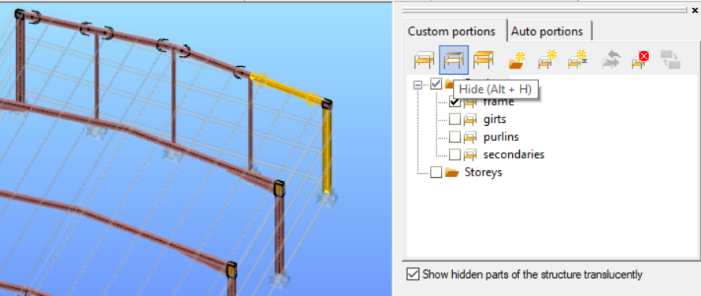

# Model views

<!-- wp:paragraph -->

The model viewing functions can be found on the left side bar.

<!-- /wp:paragraph -->

<!-- wp:image {"id":7682,"width":"243px","height":"279px","sizeSlug":"full","linkDestination":"media"} -->

<!-- /wp:image -->

<!-- wp:paragraph -->

In addition to the standard model view options (top view, front view, side view, axonometric view, perpendicular to UCS view), four display options for the objects are available:

<!-- /wp:paragraph -->

<!-- wp:list -->

- <!-- wp:list-item -->
- **line view** : the simplest model view. The members are represented by single lines, the surfaces by 2D figures without thickness, and the supports also by lines only. Recommended using in the model building phase, since the clear visualization of the member snap points makes the modeling more easier.
- <!-- /wp:list-item -->

<!-- /wp:list -->

<!-- wp:columns -->

<!-- wp:column -->

<!-- wp:image {"align":"center","id":7694,"width":434,"height":306,"sizeSlug":"full","linkDestination":"media"} -->

<!-- /wp:image -->

<!-- /wp:column -->

<!-- wp:column -->

<!-- wp:image {"align":"center","id":7700,"width":546,"height":284,"sizeSlug":"full","linkDestination":"media"} -->

<!-- /wp:image -->

<!-- /wp:column -->

<!-- /wp:columns -->

<!-- wp:list -->

- <!-- wp:list-item -->
- **wireframe view** : in the wireframe view the lines of the cross-sections and plate thickness appear. The supports are represented by lines only.
- <!-- /wp:list-item -->

<!-- /wp:list -->

<!-- wp:columns -->

<!-- wp:column -->

<!-- wp:image {"align":"center","id":7712,"width":462,"height":312,"sizeSlug":"full","linkDestination":"media"} -->

<!-- /wp:image -->

<!-- /wp:column -->

<!-- wp:column -->

<!-- wp:image {"align":"center","id":7718,"width":534,"height":284,"sizeSlug":"full","linkDestination":"media"} -->

<!-- /wp:image -->

<!-- /wp:column -->

<!-- /wp:columns -->

<!-- wp:list -->

- <!-- wp:list-item -->
- **hidden line view** : the cross-sections and plates appear in a solid form without shading and sparkling effects; the supports are represented by solid objects.
- <!-- /wp:list-item -->

<!-- /wp:list -->

<!-- wp:columns -->

<!-- wp:column -->

<!-- wp:image {"align":"center","id":7730,"width":410,"height":290,"sizeSlug":"full","linkDestination":"media"} -->

<!-- /wp:image -->

<!-- /wp:column -->

<!-- wp:column -->

<!-- wp:image {"align":"center","id":7736,"width":547,"height":290,"sizeSlug":"full","linkDestination":"media"} -->

<!-- /wp:image -->

<!-- /wp:column -->

<!-- /wp:columns -->

<!-- wp:list -->

- <!-- wp:list-item -->
- **solid view** : the cross-sections and plates appear in a solid form with shading and sparkling effects, the supports as well.
- <!-- /wp:list-item -->

<!-- /wp:list -->

<!-- wp:columns -->

<!-- wp:column -->

<!-- wp:image {"align":"center","id":7748,"width":402,"height":280,"sizeSlug":"full","linkDestination":"media"} -->

<!-- /wp:image -->

<!-- /wp:column -->

<!-- wp:column -->

<!-- wp:image {"align":"center","id":7754,"width":535,"height":287,"sizeSlug":"full","linkDestination":"media"} -->

<!-- /wp:image -->

<!-- /wp:column -->

<!-- /wp:columns -->

<!-- wp:paragraph -->

When the model tends to be more and more complicated and you only want to see part of the model then the **Submodel** **view **should be applied. To do this select the required objects in the model and click on the **Submodel view** icon in the **[_Portions Manager_](/manual/model-view/portions-manager/)** window, which can be found on the **_[Side panel](/manual/how-to-open-consteel/the-main-window/#side-panel)_** at the right side of the Consteel main window. See the pictures below:

<!-- /wp:paragraph -->

<!-- wp:columns -->

<!-- wp:column {"width":"70%"} -->

<!-- wp:image {"id":7772,"width":"597px","height":"419px","sizeSlug":"full","linkDestination":"media"} -->

<!-- /wp:image -->

<!-- /wp:column -->

<!-- wp:column {"width":"40%"} -->

<!-- wp:image {"id":7766,"width":"310px","height":"404px","sizeSlug":"full","linkDestination":"media"} -->

<!-- /wp:image -->

<!-- /wp:column -->

<!-- /wp:columns -->

<!-- wp:paragraph -->

After activating the Submodel view only the selected parts of the model are visible on every tabs:

<!-- /wp:paragraph -->

<!-- wp:image {"align":"center","id":7760,"width":446,"height":358,"sizeSlug":"full","linkDestination":"media"} -->

<!-- /wp:image -->

<!-- wp:paragraph -->

If the _**Show hidden parts of the structure translucently**_ checkbox is checked at the bottom of the Portions Manager, then the other model parts are also visible with faint grey lines:

<!-- /wp:paragraph -->

<!-- wp:image {"align":"center","id":7778,"width":488,"height":312,"sizeSlug":"full","linkDestination":"media"} -->

<!-- /wp:image -->

<!-- wp:paragraph -->

From **Consteel 17**, initiate the Hide function (Alt+H). Select the elements slated for concealment and engage the hide icon or Alt+H for implementation.

<!-- /wp:paragraph -->

<!-- wp:image {"align":"center","id":72043,"width":"452px","height":"auto","sizeSlug":"full","linkDestination":"none"} -->

<!-- /wp:image -->

<!-- wp:paragraph -->

To let the whole model visible again click the _**Full view**_ command button on the **Portions Manager** window:

<!-- /wp:paragraph -->

<!-- wp:image {"align":"center","id":7676,"width":271,"height":148,"sizeSlug":"full","linkDestination":"media"} -->

<!-- /wp:image -->
