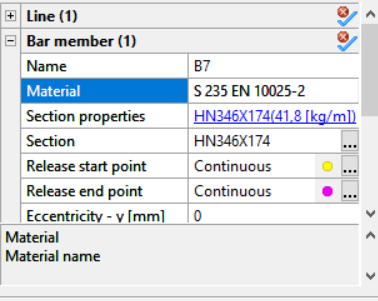
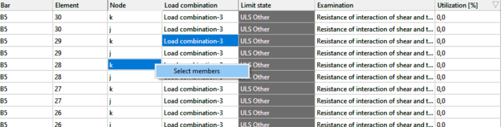

# Selection

Objects can be selected in the graphical window, in the object tree, or by the additional selection options. As a general rule, only the visible objects can be selected graphically, accordingly, the result of the same selection on different tabs or model views may be different. A selected object can be unselected by clicking on it while pressing the SHIFT button. The ESC button always unselects all objects.

<!-- /wp:paragraph -->

<!-- wp:paragraph -->

The basic selection modes and their operation are the followings:

<!-- /wp:paragraph -->

<!-- wp:list -->

- <!-- wp:list-item -->

- **simple graphical selection**: click on the object on the graphical window by the left mouse button. All objects whose graphic symbol intersects the imaginary line perpendicular to the plane of the image at the clicked point are selected. It means, that you do not have to click exactly on the contour line of an element but between them. The item will be selected also in this case. Items currently being covered by other objects (that are closer to the viewer) are also selected.

- <!-- /wp:list-item -->

-

* <!-- wp:list-item -->

* **window selection**: holding down the left button and moving the mouse will create a window with dashed lines. The selection will be completed when the mouse button is released. When drawing the window from left to right, only those members are selected that are within the window with their full size (inclusion window selection). When drawing from right to left all objects touched by the selection window are selected no matter how small part is found in the rectangle (section and inclusion window selection).

* <!-- /wp:list-item -->

*

- <!-- wp:list-item -->

- **Ctrl+ right click selection**: holding down the Ctrl key and right-clicking, the closest member to the arrowhead will be selected.

- <!-- /wp:list-item -->

-

* <!-- wp:list-item -->

* **selection by property**: this option can be reached on the left **Side bar** or by a right mouse button click on the graphical window. The selection can be made by choosing the required object type at the top of the Select by property window and narrow down the selection by specifying different properties. After setting the required properties there are several different ways to finish the selection:

  <!-- wp:list -->

  - <!-- wp:list-item -->

  - On the lower-left corner, three options are available

    <!-- wp:list -->

    - <!-- wp:list-item -->
    - _Accurate selection_ = only objects that match the currently set parameters will be selected,
    - <!-- /wp:list-item -->
    -
    - <!-- wp:list-item -->
    - _Add to selection_ = objects that match the currently set parameters will be selected and added to the already selected set of objects,
    - <!-- /wp:list-item -->
    -
    - <!-- wp:list-item -->
    - _Delete from selection_ = objects that match the currently set parameters will be unselected and removed from the already selected set of objects.
    - <!-- /wp:list-item -->

    <!-- /wp:list -->

  - <!-- /wp:list-item -->

  -

  * <!-- wp:list-item -->

  * With the action button the following operations can be made:

    <!-- wp:list -->

    - <!-- wp:list-item -->
    - **Close**: closes the window and does not change the selection,
    - <!-- /wp:list-item -->
    -
    - <!-- wp:list-item -->
    - **Apply**: makes the selection according to the currently set parameters and let the window open,
    - <!-- /wp:list-item -->
    -
    - <!-- wp:list-item -->
    - **OK**: makes the selection according to the currently set parameters and closes the window.
    - <!-- /wp:list-item -->

    <!-- /wp:list -->

  * <!-- /wp:list-item -->

  <!-- /wp:list -->

* <!-- /wp:list-item -->

<!-- /wp:list -->

<!-- wp:columns -->

<!-- wp:column {"width":"33.34%"} -->

<!-- wp:image {"align":"center","id":7791,"width":129,"height":177,"sizeSlug":"full","linkDestination":"media"} -->

<!-- /wp:image -->

<!-- /wp:column -->

<!-- wp:column {"width":"33.34%"} -->

<!-- wp:image {"align":"center","id":7797,"width":204,"height":138,"sizeSlug":"full","linkDestination":"media"} -->

<!-- /wp:image -->

<!-- /wp:column -->

<!-- wp:column {"width":"33.33%"} -->

<!-- wp:image {"align":"center","id":11155,"width":254,"height":366,"sizeSlug":"full","linkDestination":"media"} -->

<!-- /wp:image -->

<!-- /wp:column -->

<!-- /wp:columns -->

<!-- wp:list -->

- <!-- wp:list-item -->
- **object tree selection**: select objects by clicking on elements of the **_Model Content window_**.
- <!-- /wp:list-item -->

<!-- /wp:list -->

<!-- wp:image {"align":"center","id":7785,"width":486,"height":400,"sizeSlug":"full","linkDestination":"media"} -->

<!-- /wp:image -->

<!-- wp:paragraph -->

Clicking the object names in the object tree while holding down the Ctrl or Shift key results in multiple objects selection. To unselect any of the selected objects: hold down the Ctrl key and click on the object name again in the object tree.

<!-- /wp:paragraph -->

<!-- wp:list -->

- <!-- wp:list-item {"className":"opselection"} -->
- **Object Properties selection- **starting from Consteel 17. After selecting a member, users can view its object properties on the bottom right side of the main window. Other objects in the model with the same properties can be selected by double-clicking on the property name in the Object properties panel.
- <!-- /wp:list-item -->

<!-- /wp:list -->

<!-- wp:image {"id":73741,"width":"331px","height":"auto","sizeSlug":"full","linkDestination":"none"} -->

<!-- /wp:image -->

<!-- wp:list -->

- <!-- wp:list-item {"className":"drselection"} -->
- **Design results selection-**from Consteel 17 users can select members from the design result tables based on their properties, such as utilization.
- <!-- /wp:list-item -->

<!-- /wp:list -->

<!-- wp:paragraph -->

Design results table:

<!-- /wp:paragraph -->

<!-- wp:image {"id":73751,"width":"664px","height":"auto","sizeSlug":"large","linkDestination":"none"} -->

<!-- /wp:image -->

<!-- wp:paragraph -->

By right-clicking on any cell and ‘Select members’ users can select the corresponding member. If multiple cells are selected, and the elements belong to different members, multiple members will be selected.

<!-- /wp:paragraph -->

<!-- wp:paragraph -->

No matter which property is selected (users can choose cells from any column), pressing the 'Select Members' button will result in the entire member being selected, which includes the selected finite element or node characterized by the entire row.

<!-- /wp:paragraph -->

<!-- wp:image {"id":73761,"width":"668px","height":"auto","sizeSlug":"large","linkDestination":"none"} -->

<!-- /wp:image -->

<!-- wp:paragraph -->

Please note that in the Global Checks tab, the members are color-coded to indicate their Utilization. To view the selected members, navigate away from the Global Checks tab and go to one of the first four tabs: Geometry, Structural Members, Loads, or Mass.

<!-- /wp:paragraph -->

<!-- wp:paragraph -->

The additional generalized selection options (select all, unselect all, inverse selection) can be found on the left **_[Side bar](/manual/how-to-open-consteel/the-main-window/#side-bar)_**, they can be reached by a right mouse button click on the graphical window (see [picture ](#right-click)above), or with **_[Hot keys](/manual/how-to-open-consteel/hotkeys/)_**.

<!-- /wp:paragraph -->
