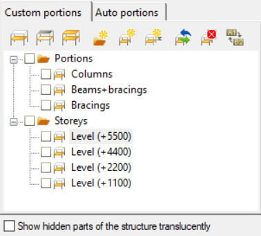
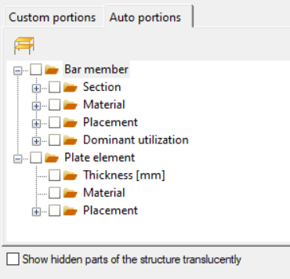
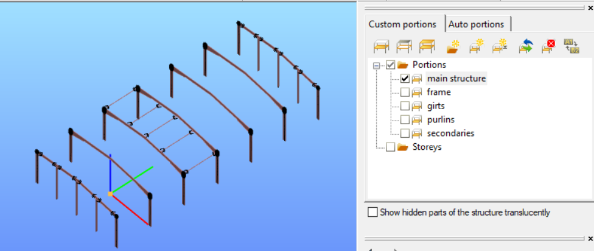
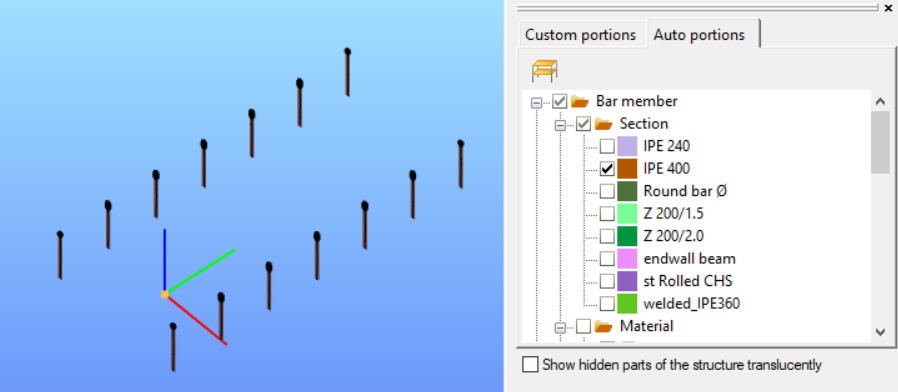
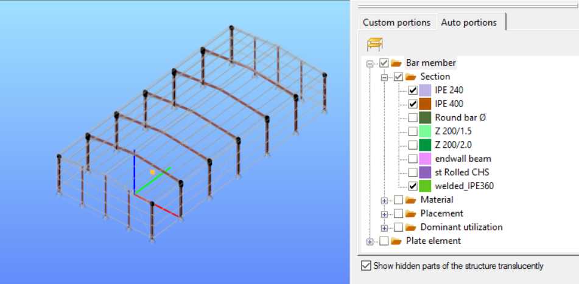
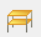
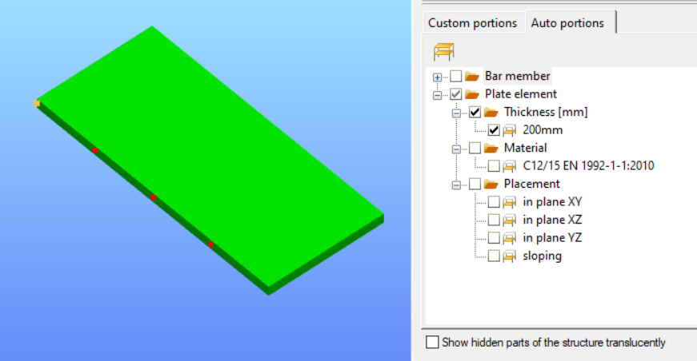

# Portions manager

The Portions Manager is a great tool to manage complicated models. Parts of the model ie. floors, frames, columns, bracings, beams, etc. This function can be achieved on the **Portions Manager** tab (Located on the right **_[Side panel](../1_0_general-description/1_2_the-main-window.md#side-panel)_** as a default.).

<!-- /wp:paragraph -->

<!-- wp:paragraph -->

**Consteel 17**

<!-- /wp:paragraph -->

<!-- wp:paragraph -->

The **Custom portions** tab is used to define manually Portions and Storeys from the existing model. (for more information scroll down to _Consteel 16_ ) For analysis, only custom-created portions can be used.

The **Auto portions** are generated automatically while modelling the structures. These are always updated to the current state of the model. This tab divides the model into portions according to their properties.

- in case of **Bar members,** the automatic separation can be done according to their Section, Material, Placement, and Dominant utilization.

- for the **Plate elements**, Auto portions are created conforming to their Thickness, Material, and Placement.

These functions are located on the **Custom portions** and **Auto portions** tab (Located on the right [**_Side panel_**](../1_0_general-description/1_2_the-main-window.md#side-panel) as a default).

By clicking on the + icon in front of each category of **Auto portions**, the automatically generated portions will appear. They contain only the bar members with their lines or plate elements with their polygon. No support, load, link element, etc. can be part of the auto portions.

The **Placement** of the elements indicates the orientation and plane in which the members are positioned.

The **Dominant utilization** category can only be used after obtaining results from global checks. Elements are included in the auto portions based on their dominant utilization, no matter which result is visualized on them.

To turn on a portion, check the check-box in front of the name of the portion. More **Auto portions** can be turned on at the same time by checking more check-boxes.

**Custom portions** and **Auto portions** can be used at the same time. In this case only those members will appear that match both criteria in the same time.

For example, if in the **Custom portions** the ‘_main structure_’ is turned on, all the members that are included in the portion will be visible.

Maintaining the **Custom portion** criteria while concurrently enabling the **Auto portions** of ‘_Section IPE400’_ only those elements will be shown, that pertain to both the ‘_main structure’_ and satisfy the criteria of Section IPE400. (see picture below)

If the Show hidden parts of the structure translucently check box is clicked at the bottom of the **Auto portions** tab, then the hidden parts of the model are also shown with faint grey lines.

To turn off all portions, click on the **Full view** (Alt+W) icon. (  ) (It is located on the top left side of the **Auto portions** tab).

In addition, **plate elements** are grouped by thickness of the elements, as shown in the figure below:

If modifications are needed to be made on the elements in the selected portions, please note that the portion selection is not identical with the object selection. This tool is only to be used for visual purposes and to facilitate the selection of elements.

**Consteel 16**

A new portion can be added by clicking the **New Portion** icon (#2) and entering the name of it. If part of the model has been previously selected, these objects will be added to the new portion at the same time.

The portions can be arranged into folders. A new folder can be created by clicking the **New folder** icon (#1).

To turn on a portion, check the check-box in front of the name of the portion. More portions can be turned on at the same time by checking more check-boxes or also by checking folders.

If the _Show hidden parts of the structure translucently_ check box (#6) is clicked at the bottom of the **Portions Manager** tab, then the hidden parts of the model are also shown with faint grey lines.

Any objects of the structural model can be part of more portions at the same time.

To modify a previously defined portion, select the relevant parts of the model which will be the subject of the modification, then select the portion you are going to modify, and finally click on the **Modify** icon (#3).

The **Modify portion** window will appear with the following options:

- **Add selected elements to the portion:** by clicking the OK button, the selected members will be added to the active portion. If some members in the selection already belong to the actually modified portion, this operation will have no additional effect.

- **Remove selected elements from the portion:** all those selected elements will be removed from the modified portion.

- **Assign only the selected elements to the portion:** the modified portion will contain only the selected elements.

Renaming the Portion can be done by clicking the name of the portion and clicking on the **Rename** icon (#5).

A portion can be deleted by clicking the name of the portion and clicking the **Delete** button (#4).

