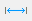
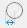
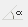

# Dimensions

For the documentation of the calculated structural model, it is very important to be aware of the exact dimensions of the model. The dimensioning tool can be found on the Geometry tab.

<!-- /wp:paragraph -->

<!-- wp:image {"align":"center","id":7844,"sizeSlug":"full","linkDestination":"media"} -->

<!-- /wp:image -->

<!-- wp:paragraph -->

This provides a great number of different dimensioning options:

<!-- /wp:paragraph -->

<!-- wp:list -->

- **Projected dimension of a linear object**: The projected length of the selected linear object onto the global X or Y or Z axis will be dimensioned.

<!-- /wp:list -->

<!-- wp:image {"align":"center","id":7856,"width":408,"height":182,"sizeSlug":"full","linkDestination":"media"} -->

<!-- /wp:image -->

<!-- wp:paragraph {"editorskit":{"indent":40,"devices":false,"desktop":true,"tablet":true,"mobile":true,"loggedin":true,"loggedout":true,"acf_visibility":"","acf_field":"","acf_condition":"","acf_value":"","migrated":false,"unit_test":false}} -->

_Parameters:_

<!-- /wp:paragraph -->

<!-- wp:list {"type":"A","className":"is-style-arrow","editorskit":{"indent":60,"devices":false,"desktop":true,"tablet":true,"mobile":true,"loggedin":true,"loggedout":true,"acf_visibility":"","acf_field":"","acf_condition":"","acf_value":"","migrated":false,"unit_test":false}} -->

- Auto: moving the mouse, the system detects the desired reference axis.
- According to global axis X: the X-axis projection of the length of the linear object.
- According to global axis Y: the Y-axis projection of the length of the linear object.
- According to global axis Z: the Z-axis projection of the length of the linear object.

<!-- /wp:list -->

<!-- wp:image {"align":"center","id":7862,"width":535,"height":417,"sizeSlug":"full","linkDestination":"media"} -->

<!-- /wp:image -->

<!-- wp:list -->

- **Lengthwise dimension of a linear object**: The length of the selected linear object can be placed in one of the planes which is defined by the centerline of the object and the global coordinate system X,Y plane, and a plane perpendicular to this plane and containing the centerline of the object.

<!-- /wp:list -->

<!-- wp:paragraph {"editorskit":{"indent":40,"devices":false,"desktop":true,"tablet":true,"mobile":true,"loggedin":true,"loggedout":true,"acf_visibility":"","acf_field":"","acf_condition":"","acf_value":"","migrated":false,"unit_test":false}} -->

_Parameters:_

<!-- /wp:paragraph -->

<!-- wp:list {"type":"A","className":"is-style-arrow","editorskit":{"indent":60,"devices":false,"desktop":true,"tablet":true,"mobile":true,"loggedin":true,"loggedout":true,"acf_visibility":"","acf_field":"","acf_condition":"","acf_value":"","migrated":false,"unit_test":false}} -->

- Auto: moving the mouse, the system is detects the desired plane.

<!-- /wp:list -->

<!-- wp:image {"align":"center","id":7874,"width":425,"height":350,"sizeSlug":"full","linkDestination":"media"} -->

<!-- /wp:image -->

<!-- wp:list -->

-**Projected dimension of the distance between two selected points**: The length of the distance between two selected points will be projected onto the global X or Y or Z axis.

<!-- /wp:list -->

<!-- wp:paragraph {"editorskit":{"indent":40,"devices":false,"desktop":true,"tablet":true,"mobile":true,"loggedin":true,"loggedout":true,"acf_visibility":"","acf_field":"","acf_condition":"","acf_value":"","migrated":false,"unit_test":false}} -->

_Parameters:_

<!-- /wp:paragraph -->

<!-- wp:list {"type":"A","className":"is-style-arrow","editorskit":{"indent":60,"devices":false,"desktop":true,"tablet":true,"mobile":true,"loggedin":true,"loggedout":true,"acf_visibility":"","acf_field":"","acf_condition":"","acf_value":"","migrated":false,"unit_test":false}} -->

- Auto: moving the mouse, the system detects the desired reference axis.
- According to global axis X: the X axis projection of the distance between two selected points.
- According to global axis Y: the Y axis projection of the distance between two selected points.
- According to global axis Z: the Z axis projection of the distance between two selected points.

<!-- /wp:list -->

<!-- wp:list {"type":"A","className":"is-style-default"} -->

- **Lengthwise dimension between two points :** The distance between the selected two points could be placed in one of the following planes.

<!-- /wp:list -->

<!-- wp:list {"type":"A","className":"is-style-arrow","editorskit":{"indent":60,"devices":false,"desktop":true,"tablet":true,"mobile":true,"loggedin":true,"loggedout":true,"acf_visibility":"","acf_field":"","acf_condition":"","acf_value":"","migrated":false,"unit_test":false}} -->

- Plane defined by the centerline of the object and the X,Y plane global coordinate system
- The plane perpendicular to the above plane and containing the centerline of the object.

<!-- /wp:list -->

<!-- wp:paragraph {"editorskit":{"indent":40,"devices":false,"desktop":true,"tablet":true,"mobile":true,"loggedin":true,"loggedout":true,"acf_visibility":"","acf_field":"","acf_condition":"","acf_value":"","migrated":false,"unit_test":false}} -->

_Parameters:_

<!-- /wp:paragraph -->

<!-- wp:list {"type":"A","className":"is-style-arrow","editorskit":{"indent":60,"devices":false,"desktop":true,"tablet":true,"mobile":true,"loggedin":true,"loggedout":true,"acf_visibility":"","acf_field":"","acf_condition":"","acf_value":"","migrated":false,"unit_test":false}} -->

- Auto: moving the mouse, the system detects the desired reference axis.

<!-- /wp:list -->

<!-- wp:list {"type":"A"} -->

- **Diameter of a circle** 
- **Radius of a circle** 
- **Angle of two lines** : After selecting two lines any of the four angles could be dimensioned.
- **Height dimension** : This function helps for quick dimensioning the height positions of selected points relative to global Z direction related to the given value in _Basic line_ filed.

<!-- /wp:list -->

<!-- wp:paragraph {"editorskit":{"indent":40,"devices":false,"desktop":true,"tablet":true,"mobile":true,"loggedin":true,"loggedout":true,"acf_visibility":"","acf_field":"","acf_condition":"","acf_value":"","migrated":false,"unit_test":false}} -->

The content of the **Basic line** field means the height of the zero level in the global Z-direction. All the picked points will be measured from this value as a 0.

<!-- /wp:paragraph -->

<!-- wp:image {"align":"center","id":7916,"width":767,"height":431,"sizeSlug":"full","linkDestination":"media"} -->

<!-- /wp:image -->

<!-- wp:list -->

- **Textbox to a given line**: The given text (A-2) in the script field can be placed into the model.

<!-- /wp:list -->

<!-- wp:image {"align":"center","id":7838,"width":511,"height":361,"sizeSlug":"full","linkDestination":"media"} -->

<!-- /wp:image -->
