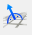

# Coordinate systems

For the appropriate modeling and interpretation of the analysis and design results, it is of high importance to be aware of the applied coordinate systems. This section summarizes in detail all the coordinate systems used in the _ConSteel_.

<!-- /wp:paragraph -->

<!-- wp:media-text {"align":"","mediaId":8108,"linkDestination":"media","mediaType":"image","mediaWidth":18,"mediaSizeSlug":"full","imageFill":false} -->

<!-- wp:paragraph {"placeholder":"Content…"} -->

Two different types of coordinate systems can be used: the rectangular Descartes system (XYZ) and the polar system (abL). In the polar system “a” denotes the angle between the axis “X” and the vertical plane defined by the axis “Z” and the point, “b” denotes the angle between the section line of that plane and the coordinate plane “XY” and the line from the origin to the point, and “L” denotes the distance from the origin. The polar coordinate system is less frequently used so the rest of this section describes the Descartes system.

<!-- /wp:paragraph -->

<!-- /wp:media-text -->

<!-- wp:media-text {"align":"","mediaId":8102,"linkDestination":"media","mediaType":"image","mediaWidth":18,"mediaSizeSlug":"full","imageFill":false} -->

<!-- wp:paragraph {"placeholder":"Content…"} -->

As a general convention, all the Descartes coordinate systems (axes directions and rotation signs) follow the most commonly applied right-hand rule. This rule is valid for the definition of geometry and loads as well. The positive moments and rotations are defined as counterclockwise about the axis if it is viewed in front (towards the origin) in both the global and local system.

<!-- /wp:paragraph -->

<!-- /wp:media-text -->

<!-- wp:paragraph -->

<!-- /wp:paragraph -->

<!-- wp:paragraph -->

In the further text the following denotations are used:

<!-- /wp:paragraph -->

<!-- wp:paragraph -->

In the case of global geometry (3D structural modeling):

<!-- /wp:paragraph -->

<!-- wp:list -->

- X, Y, Z: global coordinate system
- x, y, z: local coordinate system

<!-- /wp:list -->

<!-- wp:paragraph -->

In case of cross-sections (2D modeling of sections):

<!-- /wp:paragraph -->

<!-- wp:list -->

- v, w: section edit coordinate system
- Y, Z: section edit coordinate system with its origin in the centre of gravity of the section
- y, z: section principal coordinate system

<!-- /wp:list -->

<!-- wp:image {"id":8117,"width":345,"height":345,"sizeSlug":"full","linkDestination":"media"} -->

<!-- /wp:image -->

<!-- wp:spacer -->

<!-- /wp:spacer -->

<!-- wp:heading {"level":3} -->

### User coordinate system

<!-- /wp:heading -->

<!-- wp:paragraph -->

The User coordinate system (UCS) is used for making the modeling easier and faster. The UCS is a specially positioned Descartes system (XYZ).

<!-- /wp:paragraph -->

<!-- wp:paragraph -->

The tools for creating and modifying the coordinate systems can be reached by the Set grid and coordinate system button on the sidebar.

<!-- /wp:paragraph -->

<!-- wp:image {"id":8123,"width":289,"height":172,"sizeSlug":"full","linkDestination":"media"} -->

<!-- /wp:image -->

<!-- wp:paragraph -->

The User coordinates system can be switched on (or switched back to the global system) at the bottom status bar

<!-- /wp:paragraph -->

<!-- wp:image {"id":8259,"width":261,"height":50,"sizeSlug":"full","linkDestination":"media"} -->

<!-- /wp:image -->

<!-- wp:paragraph -->

The following creation options are available (from left to right):

<!-- /wp:paragraph -->

<!-- wp:list -->

- Switch to the global system 
- Set new origin for the UCS 
- The “XY” plane of the global system will be the “XY” plane of the UCS 
- The “XZ” plane of the global system will be the “XY” plane of the UCS 
- The “YZ” plane of the global system will be the “XY” plane of the UCS 
- Set the UCS by 3 points: the origin, the direction of ”X” and “Y” axis 
- Set the standing of the UCS identical to the local coordinate system of the selected plane with origin placed into the first node of this plane 
- Set the direction of the axis “X” by two points 
- Set the direction of the axis “Y” by two points 
- Set the direction of the axis “Z” by two points 
- Reverse the direction of the selected axis 

<!-- /wp:list -->

<!-- wp:paragraph -->

On the Structural members tab and in the Set local coordinate systems () function it is possible to modify the alignment of the local coordinate axes of bar members(), surfaces (), or supports().

<!-- /wp:paragraph -->

<!-- wp:paragraph -->

Icons for the modifications on the Set local coordinate systems dialog are the following (from left to right):

<!-- /wp:paragraph -->

<!-- wp:list -->

- Set “X” axis of UCS 
- Set “Y” axis of UCS 
- Set “Z” axis of UCS 
- Set the “Z” axis perpendicular to the surface formed by the connecting beams 

<!-- /wp:list -->

<!-- wp:spacer -->

<!-- /wp:spacer -->

<!-- wp:heading {"level":3} -->

### Local coordinate system of bar elements

<!-- /wp:heading -->

<!-- wp:paragraph -->

The reference line of bar members defines the axis “x” of the local coordinate system of the bars. The direction of the axis “x” is given by the start (**J**) and end (**K**) nodes of the reference line.

<!-- /wp:paragraph -->

<!-- wp:media-text {"align":"","mediaId":8272,"linkDestination":"media","mediaType":"image","mediaWidth":23,"mediaSizeSlug":"full","imageFill":false} -->

<!-- wp:paragraph {"placeholder":"Content…"} -->

In the basic case, the local coordinate system of a bar can be determined considering its reference line (“x”) identical to the global axis “X”. In this case, the direction of local axes “y” and “z” are identical to the global axes “Y” and “Z”. The position of the cross-section on the bar is the following: the reference line goes through its center of gravity, and the section “YZ” system coincides with the local “yz” system of the bar.

<!-- /wp:paragraph -->

<!-- /wp:media-text -->

<!-- wp:media-text {"align":"","mediaId":8278,"linkDestination":"media","mediaType":"image","mediaWidth":23,"mediaSizeSlug":"full","imageFill":false} -->

<!-- wp:paragraph {"placeholder":"Content…"} -->

In the case of a generally positioned beam member (not a column with a vertical reference line), the plane defined by the local “xz” system takes always a vertical position and the axis “z” points towards the positive “Z” direction. For beams with (single) curvature, the axis “x” is always the tangent.

<!-- /wp:paragraph -->

<!-- /wp:media-text -->

<!-- wp:media-text {"align":"","mediaId":8284,"linkDestination":"media","mediaType":"image","mediaWidth":23,"mediaSizeSlug":"full","imageFill":false} -->

<!-- wp:paragraph {"placeholder":"Content…"} -->

In the case of a vertical reference line (column members) the local axis “y” has the same direction as the global axis “Y”, the direction of the local axis “z” depends on the direction of the local "x" axis of the column (local "x" always points from the start to the endpoint).

<!-- /wp:paragraph -->

<!-- /wp:media-text -->

<!-- wp:media-text {"align":"","mediaId":8290,"linkDestination":"media","mediaType":"image","mediaWidth":23,"mediaSizeSlug":"full","imageFill":false} -->

<!-- wp:paragraph {"placeholder":"Content…"} -->

The interpretation and signs of the inner forces on a member is defined by its local coordinate system and the mentioned general sign convention as described in the following figure:

<!-- /wp:paragraph -->

<!-- /wp:media-text -->

<!-- wp:spacer -->

<!-- /wp:spacer -->

<!-- wp:heading {"level":3} -->

### Local coordinate system of surface elements

<!-- /wp:heading -->

<!-- wp:paragraph -->

For surface elements the local plane “xy” is defined in the plane of the surface, the axis “z” is perpendicular to that plane and the direction of “+z” is in accordance with the right-hand role of coordinate systems. The roles of the directions of the local axes of the plane surface elements:

<!-- /wp:paragraph -->

<!-- wp:paragraph -->

By creating a rectangle-shaped plane surface element:

<!-- /wp:paragraph -->

<!-- wp:list -->

- the axis “x” and “y” are parallel with the edges of the rectangle plane element. The “z” direction created in accordance with the right hand role of the coordinate systems.

<!-- /wp:list -->

<!-- wp:paragraph -->

By creating a plane surface element with a polyline border:

<!-- /wp:paragraph -->

<!-- wp:list -->

- the axis “x” is parallel with the line defined by the first and the second picked points. It is the first edge of the plane surface element.
- the axis “y” points accordingly to the direction of the third picked point. It is the second edge of the created plane surface element.
- The “z” direction created in accordance with the right hand role of the coordinate systems.

<!-- /wp:list -->

<!-- wp:image {"align":"center","id":8296,"width":547,"height":433,"sizeSlug":"full","linkDestination":"media"} -->

<!-- /wp:image -->

<!-- wp:paragraph -->

In the case of surface elements, the local coordinate system can be modified using the tools presented in [Chapter 5.2.1.](#user-coord)

<!-- /wp:paragraph -->
