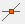

# Modifying

**_The four most used modifying functions are placed on the left sidebar:_**

<!-- /wp:paragraph -->

<!-- wp:paragraph -->

 **Move point and edge.** Select the point and (or) edge to be moved. Set the new position of the point (edge). This function is used to change the position of any of the endpoints of a linear or circular element, or to change the position of an edge or a corner point of a polygon, or of a hole in a polygon.

<!-- /wp:paragraph -->

<!-- wp:image {"align":"right","id":21967,"width":385,"height":212,"sizeSlug":"full","linkDestination":"media"} -->

<!-- /wp:image -->

<!-- wp:paragraph -->

 **Move selected objects.** The selected object(s) can be _**moved **\_or _**copied**\_

<!-- /wp:paragraph -->

<!-- wp:paragraph -->

Select the object(s) you want to copy or move and click on the **Move selected objects** command. Select the desired transformation (Move or Copy) in the upper left corner of the dialogue window. The copy function is the default. The number of copies can be selected below.

<!-- /wp:paragraph -->

<!-- wp:paragraph -->

The function can also be started without any selected object. In this case, the first step is to select one (by left click) or more (by window selection) objects.

<!-- /wp:paragraph -->

<!-- wp:paragraph -->

Next, click on the start point of the vector of moving or copying then set the endpoint with another click.

<!-- /wp:paragraph -->

<!-- wp:paragraph -->

The selected members, loads, and supports will be moved or copied to the position which is defined by the given vector accordingly to the selected options. The Move/Copy function is independent of the actual _UCS_.

<!-- /wp:paragraph -->

<!-- wp:paragraph {"editorskit":{"indent":40,"devices":false,"desktop":true,"tablet":true,"mobile":true,"loggedin":true,"loggedout":true,"acf_visibility":"","acf_field":"","acf_condition":"","acf_value":"","migrated":false,"unit_test":false}} -->

**Effect of the options:**

<!-- /wp:paragraph -->

<!-- wp:paragraph {"editorskit":{"indent":40,"devices":false,"desktop":true,"tablet":true,"mobile":true,"loggedin":true,"loggedout":true,"acf_visibility":"","acf_field":"","acf_condition":"","acf_value":"","migrated":false,"unit_test":false}} -->

There are several options that affect the outcome of the operation. These are as follows:

<!-- /wp:paragraph -->

<!-- wp:list {"className":"is-style-default","editorskit":{"indent":60,"devices":false,"desktop":true,"tablet":true,"mobile":true,"loggedin":true,"loggedout":true,"acf_visibility":"","acf_field":"","acf_condition":"","acf_value":"","migrated":false,"unit_test":false}} -->

- _Copy structural members_

  - Checked (default): structural members will be copied or moved.
  - Unchecked: use when only the loads and/or the supports of the structural member need to be copied or moved.

- _Copy loads_: this options has any effect only if \_Copy \_is the selected operation. If loads are already defined on the selected members they can also be included in the operation. If \_Move \_is the selected operation the loads will be moved anyway.

  - Checked (default): the loads will be copied with the selected structural members. If only loads were selected (without any members or other type of object) the options below become also active:

    - \_Original loadcase: \_the selected load(s) will be copied in the set number of copies within its(their) own loadcase.
    - _New loadcase:_ the selected load(s) will be copied in the set number of copies to new loadcase(s). As many new loadcase will be created as the number of copies specified. The new loadcases will get its original name with an "-x" suffix at the end, where the "x" is the serial number of the copies.

  - Unchecked: the loads will not be copied with the selected structural members.

- _Copy supports_

  - Checked (default): the supports of the selected structural members will be copied. (In case of the selection set does not contain at least one selected member then the selected supports will not be copied.)
  - Unchecked: the supports of the selected structural members will not be copied.

- \_Join point_s

  - Checked: the end points of the copied objects will be connected with lines.
  - Unchecked (default): the end points of the copied objects will not be connected with lines.

<!-- /wp:list -->

<!-- wp:paragraph -->

 **Mirror selected objects. **The two given points represent the mirroring axis that will be projected into the actual _UCS_ system and the mirroring will be performed in the actual _UCS_ symmetrically to the axis of mirroring.

<!-- /wp:paragraph -->

<!-- wp:paragraph -->

As the first step select the UCS for mirroring (if it is needed), select objects to be mirrored, and click on the Mirror selected objects icon.

<!-- /wp:paragraph -->

<!-- wp:image {"align":"center","id":9261,"sizeSlug":"full","linkDestination":"media"} -->

<!-- /wp:image -->

<!-- wp:paragraph -->

Selecting the mirror line by picking two points for the mirror axis, the selected objects will be moved or copied to the mirrored position.

<!-- /wp:paragraph -->

<!-- wp:paragraph -->

The effects of the options are the same as described above.

<!-- /wp:paragraph -->

<!-- wp:paragraph -->

 **Rotate selected objects. **Select the objects for rotation.

<!-- /wp:paragraph -->

<!-- wp:image {"align":"center","id":9273,"sizeSlug":"full","linkDestination":"media"} -->

<!-- /wp:image -->

<!-- wp:paragraph -->

Select the Move or Copy option for the transformation. The number of copies can be selected. Set the center of rotation. Set reference point of rotation. Set the direction point or type in the rotation angle and click on the Apply button.

<!-- /wp:paragraph -->

<!-- wp:paragraph -->

The effects of the options are the same as described above.

<!-- /wp:paragraph -->

<!-- wp:paragraph -->

**_The further modifying functions are on the \_Geometry_ \__tab:_**

<!-- /wp:paragraph -->

<!-- wp:paragraph -->

** Sizing of the selected objects. **Select objects for sizing. Set the sizing center, the sizing reference point, and the sizing multiplier point (the distances of the sizing reference point and the sizing multiplier point to the sizing origin point determines the sizing factor). The sizing will be performed. The length (and depending on the sizing origin maybe the position) of the objects will be changed. The length of the line-loads will be changed proportionally.

<!-- /wp:paragraph -->

<!-- wp:paragraph -->

 **Refract the selected line element.** Select the edge to refract and the insert point along the axis of the selected object. Set the new position of the selected point. The original object will be broken into two parts.

<!-- /wp:paragraph -->

<!-- wp:paragraph -->

The coordinates of the new position of the selected point also can be given manually according to the selected coordinate system.

<!-- /wp:paragraph -->

<!-- wp:paragraph -->

 **Curve selected line element.** Select the edge for bending. Set the insert point.

<!-- /wp:paragraph -->

<!-- wp:paragraph -->

 **Straighten selected arc. **The selected arc segment of a plane element will be deleted and substituted by a straight edge.

<!-- /wp:paragraph -->

<!-- wp:paragraph -->

 **Divide selected objects.** Lines and bars can be divided into equal or unequal parts.

<!-- /wp:paragraph -->

<!-- wp:paragraph -->

By selecting the **To equal parts** option the number of the segments or the length of the segments can be set.

<!-- /wp:paragraph -->

<!-- wp:image {"align":"center","id":9309,"sizeSlug":"full","linkDestination":"media"} -->

<!-- /wp:image -->

<!-- wp:paragraph -->

By selecting the two unequal parts option a series of relative or absolute lengths can be defined, measured from the A or B endpoint of the object.

<!-- /wp:paragraph -->

<!-- wp:image {"align":"center","id":9315,"sizeSlug":"full","linkDestination":"media"} -->

<!-- /wp:image -->

<!-- wp:paragraph -->

 **Break two selected objects.** Select the two intersected objects to break. Both objects will be broken by the intersection point. It works with linear and curved objects, also with plate elements.

<!-- /wp:paragraph -->

<!-- wp:paragraph -->

**Trim selected line or plate element by cutting edge or plate.** Select cutting edge or plate. Select the part to be trimmed. It works both with linear and curved objects, also with plate elements.

<!-- /wp:paragraph -->

<!-- wp:paragraph -->

 **Extend selected line or plate elements to limit line or plate. **Select the limit line or plate and click on the linear or plate object to be extended to the limit line or plate. It works with plate elements only if the edges of the extended plate element do not cross each other.

<!-- /wp:paragraph -->

<!-- wp:paragraph -->

 **Divide by trim.** Cut out a part of the selected element. Select the object for cut-out. Select the start point and the endpoint of the segment of the cut-out.

<!-- /wp:paragraph -->

<!-- wp:paragraph -->

 **Chamfer of two selected linear elements.** Select the first and the second linear element. The chamfer will be applied according to the order of selection.

<!-- /wp:paragraph -->

<!-- wp:image {"align":"center","id":9351,"width":361,"height":165,"sizeSlug":"full","linkDestination":"media"} -->

<!-- /wp:image -->

<!-- wp:paragraph -->

 **Filleting of the edge of the section of two line-element.** Select the first and the second linear element. Chose a fillet radius

<!-- /wp:paragraph -->
