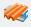

# Shear field

With the new object, the stiffening effect of trapezoid sheeting can be considered in buckling analysis.

<!-- /wp:paragraph -->

<!-- wp:paragraph {"align":"justify"} -->

**It is important to note**, that the trapezoidal decking has to be fixed in an appropriate way to the understructure (all 4 sides on the trapezoidal decking) to be able to calculate proper results.

<!-- /wp:paragraph -->

<!-- wp:heading {"level":3} -->

### Definition of shear stiffness

<!-- /wp:heading -->

<!-- wp:paragraph {"align":"justify"} -->

In the picture below, the interpretation of shear stiffness can be seen, where “e” is the displacement of the shear diaphragm on the effect of a given F \[kN] force. Shear elasticity, by definition, is:

<!-- /wp:paragraph -->

<!-- wp:paragraph -->

$$C=\dfrac{e}{F} \quad  [mm/kN]$$

<!-- /wp:paragraph -->

<!-- wp:paragraph {"align":"justify"} -->

Reciprocal of the shear elasticity gives the shear stiffness, which is denoted by S:

<!-- /wp:paragraph -->

<!-- wp:paragraph -->

$$S=\dfrac{F}{e} \quad [kN/mm]$$

<!-- /wp:paragraph -->

<!-- wp:image {"align":"center","id":9067,"width":466,"height":405,"sizeSlug":"full","linkDestination":"media"} -->

Shear diaphragm deformation to a given force \[1]

<!-- /wp:image -->

<!-- wp:paragraph -->

Shear stiffness of a trapezoidal sheet (C) consists of the following components:

<!-- /wp:paragraph -->

<!-- wp:list -->

- Deformation of the profile:

<!-- /wp:list -->

<!-- wp:image {"align":"center","id":9073,"width":413,"height":110,"sizeSlug":"full","linkDestination":"media"} -->

<!-- /wp:image -->

<!-- wp:list -->

- Shear deformation in the sheet:

<!-- /wp:list -->

<!-- wp:image {"align":"center","id":9079,"sizeSlug":"full","linkDestination":"media"} -->

<!-- /wp:image -->

<!-- wp:list -->

- Slip of the fastening elements:

<!-- /wp:list -->

<!-- wp:columns -->

<!-- wp:column -->

<!-- wp:image {"align":"right","id":9085,"sizeSlug":"full","linkDestination":"media"} -->

<!-- /wp:image -->

<!-- wp:paragraph -->

<!-- /wp:paragraph -->

<!-- /wp:column -->

<!-- wp:column -->

<!-- wp:image {"align":"left","id":9091,"sizeSlug":"full","linkDestination":"media"} -->

<!-- /wp:image -->

<!-- /wp:column -->

<!-- /wp:columns -->

<!-- wp:list -->

- Displacement of the connections

<!-- /wp:list -->

<!-- wp:image {"align":"center","id":9097,"sizeSlug":"full","linkDestination":"media"} -->

<!-- /wp:image -->

<!-- wp:list -->

- Displacement of the beam-purlin connection

<!-- /wp:list -->

<!-- wp:image {"align":"center","id":9103,"sizeSlug":"full","linkDestination":"media"} -->

<!-- /wp:image -->

<!-- wp:list -->

- Axial deformation in the longitudinal edge members:

<!-- /wp:list -->

<!-- wp:image {"align":"center","id":9109,"sizeSlug":"full","linkDestination":"media"} -->

<!-- /wp:image -->

<!-- wp:paragraph {"align":"justify"} -->

The summation of the 6 different components above, gives the value of the shear elasticity (C). Reciprocal of the shear elasticity is the shear stiffness (S), which can be taken into consideration during the buckling analysis.

<!-- /wp:paragraph -->

<!-- wp:heading {"level":3} -->

### Calculation of shear stiffness

<!-- /wp:heading -->

<!-- wp:paragraph {"align":"justify"} -->

To the determination of shear stiffnesses, different German trapezoidal sheet manufacturers developed their own calculation methodologies for their own products. Each method can only be used for the product for which it was developed for.

<!-- /wp:paragraph -->

<!-- wp:paragraph -->

The following methods are implemented in the software:

<!-- /wp:paragraph -->

<!-- wp:list -->

- [Hoesch](#determination-of-shear-stiffness-in-case-of-panels-produced-by-hoesch)
- [Fischer](#determination-of-shear-stiffness-in-case-of-panels-produced-by-fischer)
- [Arcelor](#determination-of-shear-stiffness-in-case-of-panels-produced-by-arcelor)
- [EuroCode](#determination-of-shear-stiffness-according-to-eurocode-3)

<!-- /wp:list -->

<!-- wp:heading {"level":4} -->

#### Determination of shear stiffness in case of panels produced by Hoesch

<!-- /wp:heading -->

<!-- wp:paragraph -->

The recommended method uses the following formula (DIN 18807, Schardt/Strehl method):

<!-- /wp:paragraph -->

$$S=\dfrac{10^{4}}{K_1+\dfrac{K_2}{L}}*a \quad  (1)$$

<!-- /wp:paragraph -->

<!-- wp:paragraph -->

**S**: stiffness of the shear field \[kN]

<!-- /wp:paragraph -->

<!-- wp:paragraph -->

**K1**: parameter specific to the selected panel \[m/kN]

<!-- /wp:paragraph -->

<!-- wp:paragraph -->

**K2**: parameter specific to the selected \[m2/kN]

<!-- /wp:paragraph -->

<!-- wp:paragraph -->

**L**: length of the shear field parallel to the direction of the panel ribs \[m]

<!-- /wp:paragraph -->

<!-- wp:paragraph -->

**a**: applicable effective width \[m]

<!-- /wp:paragraph -->

<!-- wp:columns -->

<!-- wp:column {"width":"50%","editorskit":{"devices":false,"desktop":true,"tablet":true,"mobile":true,"loggedin":true,"loggedout":true,"acf_visibility":"","acf_field":"","acf_condition":"","acf_value":"","migrated":false,"unit_test":false}} -->

<!-- wp:paragraph {"editorskit":{"devices":false,"desktop":true,"tablet":true,"mobile":true,"loggedin":true,"loggedout":true,"acf_visibility":"","acf_field":"","acf_condition":"","acf_value":"","migrated":false,"unit_test":false}} -->

The figure shows the sketch of a general building showing the dimensions used in the previous formula. The method assumes that panels on all 4 edges along the boundary of the considered shear field are fixed to supporting structures with adequate spacing.

<!-- /wp:paragraph -->

<!-- wp:paragraph {"align":"justify"} -->

The values K1 and K2 have been specified by the producer for each panel type in the function of its thickness. These values can be found on the website of the producer or in official application certificates. Important to note, that such certificates have a certain validity of the application, therefore it is always recommended to double-check the validity of the values considered by Consteel.

<!-- /wp:paragraph -->

<!-- wp:paragraph -->

_The S value determined with formula (1) is valid if the trapezoidal sheet is fixed at each rib to the supporting structure. The S value shall be multiplied with 0,2 in case of fixations in every second rib only._

<!-- /wp:paragraph -->

<!-- /wp:column -->

<!-- wp:column {"width":"50%"} -->

<!-- wp:image {"align":"center","id":13640,"width":290,"height":539,"sizeSlug":"full","linkDestination":"media"} -->

<!-- /wp:image -->

<!-- /wp:column -->

<!-- /wp:columns -->

<!-- wp:heading {"level":4} -->

#### Determination of shear stiffness in case of panels produced by Fischer

<!-- /wp:heading -->

<!-- wp:paragraph {"align":"justify"} -->

The recommended method uses the following formula (improved Schradt/Strehl method) (2). The formula contains 3 additional parameters (K1\*, K2\* and eL) in comparison with the classical method, to consider the effect of the fixations of the panels.

<!-- /wp:paragraph -->

<!-- wp:paragraph -->

$$S=\cfrac{1}{(K_1+K_1^{*}e_L)+\cfrac{K_2+K_2^{*}}{L}}*a \quad  (2)$$

<!-- /wp:paragraph -->

<!-- wp:paragraph -->

**S**: stiffness of the shear field \[kN]

<!-- /wp:paragraph -->

<!-- wp:paragraph -->

**K1**: parameter specific to the selected panel \[10-4\*m/kN]

<!-- /wp:paragraph -->

<!-- wp:paragraph -->

**K2**: parameter specific to the selected panel \[10-4\*m2/kN]

<!-- /wp:paragraph -->

<!-- wp:paragraph -->

**K1\***: parameter specific to the selected panel \[10-4\*1/kN]

<!-- /wp:paragraph -->

<!-- wp:paragraph -->

**K2\***: parameter specific to the selected panel \[10-4\*m2/kN]

<!-- /wp:paragraph -->

<!-- wp:paragraph -->

**eL**: distance between fixations lengthwise \[m]

<!-- /wp:paragraph -->

<!-- wp:paragraph -->

**a**: applicable effective width \[m]

<!-- /wp:paragraph -->

<!-- wp:paragraph {"align":"justify"} -->

The method assumes that panels on all 4 edges along the boundary of the considered shear field are fixed to supporting structures with adequate spacing. The S value determined with formula (2) is valid if the trapezoidal sheet is fixed at each rib to the supporting structure. The S value shall be multiplied with 0,2 in case of fixations in every second rib only.

<!-- /wp:paragraph -->

<!-- wp:heading {"level":4} -->

#### Determination of shear stiffness in case of panels produced by Arcelor

<!-- /wp:heading -->

<!-- wp:paragraph -->

The recommended method by Alcerol uses the following formula (3) (Bryan/Davies):

<!-- /wp:paragraph -->

<!-- wp:paragraph -->

$$S=\cfrac{10^{4}}{[(K_1^{'}*a_2+K_1^{*}*e_L)+\cfrac{K_2^{'}a_1a_4+K_2^{*}a_3}{L_S}}a \quad  (3)$$

<!-- /wp:paragraph -->

<!-- wp:paragraph -->

**S**: stiffness of the shear field \[kN]

<!-- /wp:paragraph -->

<!-- wp:paragraph -->

**K1’**: parameter specific to the selected panel \[m/kN]

<!-- /wp:paragraph -->

<!-- wp:paragraph -->

**K2’**: parameter specific to the selected panel \[m2/kN]

<!-- /wp:paragraph -->

<!-- wp:paragraph -->

**K1\***: parameter specific to the selected panel \[1/kN]

<!-- /wp:paragraph -->

<!-- wp:paragraph -->

**K2\***: parameter specific to the selected panel \[m2/kN]

<!-- /wp:paragraph -->

<!-- wp:paragraph -->

**Ls**: length of the shear field parallel to the direction of the panel ribs \[m]

<!-- /wp:paragraph -->

<!-- wp:paragraph -->

**α1, α2, α3**: additional parameters depending on the number of panel spans defined in tables

<!-- /wp:paragraph -->

<!-- wp:paragraph -->

**α4**: additional parameter depending on the number of panel splices lengthwise

<!-- /wp:paragraph -->

<!-- wp:paragraph -->

**a**: applicable effective width \[m]

<!-- /wp:paragraph -->

<!-- wp:paragraph {"align":"justify"} -->

The method assumes that panels on all 4 edges along the boundary of the considered shear field are fixed to supporting structures with adequate spacing.

<!-- /wp:paragraph -->

<!-- wp:paragraph {"align":"justify"} -->

The S value determined with formula (2) is valid if the trapezoidal sheet is fixed at each rib to the supporting structure. The S value shall be multiplied with 0,2 in case of fixations in every second rib only.

<!-- /wp:paragraph -->

<!-- wp:heading {"level":4} -->

#### Determination of shear stiffness according to Eurocode 3

<!-- /wp:heading -->

<!-- wp:paragraph -->

The recommended method uses the following formula (4)

<!-- /wp:paragraph -->

<!-- wp:paragraph -->

$$S=(1000*\sqrt{t^{3}}(50+10\sqrt[3]{b_{roof}})\frac{1}{h_w})a$$

<!-- /wp:paragraph -->

<!-- wp:paragraph -->

**S**: stiffness of the shear field \[kN]

<!-- /wp:paragraph -->

<!-- wp:paragraph -->

**t**: thickness of the panel \[mm]

<!-- /wp:paragraph -->

<!-- wp:paragraph -->

**hw**: depth of the panel \[mm]

<!-- /wp:paragraph -->

<!-- wp:paragraph -->

**a**: applicable effective width \[m]

<!-- /wp:paragraph -->

<!-- wp:paragraph -->

broof: length of the shear field parallel to the direction of the panel ribs (width of the roof) \[mm]

<!-- /wp:paragraph -->

<!-- wp:paragraph {"align":"justify"} -->

The method doesn’t require that panels are fixed on all 4 edges along the boundary of the considered shear field are fixed to supporting structures. As a minimum fixation to directly stabilized structures (2 sides) with adequate spacing is required.

<!-- /wp:paragraph -->

<!-- wp:paragraph {"align":"justify"} -->

The S value determined with formula (4) is valid if the trapezoidal sheet is fixed at each rib to the supporting structure. The S value shall be multiplied with 0,2 in case of fixations in every second rib only.

<!-- /wp:paragraph -->

<!-- wp:heading {"level":3} -->

### Shear field stiffness definition

<!-- /wp:heading -->

<!-- wp:paragraph -->

The dialog of the shear field stiffness definition can be opened with the  button of the Structural members tab.

<!-- /wp:paragraph -->

<!-- wp:image {"id":9118,"sizeSlug":"large","linkDestination":"media"} -->

<!-- /wp:image -->

<!-- wp:paragraph {"align":"justify"} -->

\#1 - Value of shear stiffness can be defined manually, or if the () button is clicked, on the [Shear field stiffness calculation](#shear-field-stiffness-calculation) it can be calculated automatically.

<!-- /wp:paragraph -->

<!-- wp:paragraph -->

\#2 - Definition of effective width parameter

<!-- /wp:paragraph -->

<!-- wp:paragraph -->

\#3 - Local eccentricity of the shear field to the member on which it will be placed:

<!-- /wp:paragraph -->

<!-- wp:paragraph {"editorskit":{"indent":40,"devices":false,"desktop":true,"tablet":true,"mobile":true,"loggedin":true,"loggedout":true,"acf_visibility":"","acf_field":"","acf_condition":"","acf_value":"","migrated":false,"unit_test":false}} -->

0\. Reference line

<!-- /wp:paragraph -->

<!-- wp:paragraph {"editorskit":{"indent":40,"devices":false,"desktop":true,"tablet":true,"mobile":true,"loggedin":true,"loggedout":true,"acf_visibility":"","acf_field":"","acf_condition":"","acf_value":"","migrated":false,"unit_test":false}} -->

2\. Bottom - Middle

<!-- /wp:paragraph -->

<!-- wp:paragraph {"editorskit":{"indent":40,"devices":false,"desktop":true,"tablet":true,"mobile":true,"loggedin":true,"loggedout":true,"acf_visibility":"","acf_field":"","acf_condition":"","acf_value":"","migrated":false,"unit_test":false}} -->

5\. Middle - Middle

<!-- /wp:paragraph -->

<!-- wp:paragraph {"editorskit":{"indent":40,"devices":false,"desktop":true,"tablet":true,"mobile":true,"loggedin":true,"loggedout":true,"acf_visibility":"","acf_field":"","acf_condition":"","acf_value":"","migrated":false,"unit_test":false}} -->

8\. Top - Middle

<!-- /wp:paragraph -->

<!-- wp:paragraph {"editorskit":{"indent":40,"devices":false,"desktop":true,"tablet":true,"mobile":true,"loggedin":true,"loggedout":true,"acf_visibility":"","acf_field":"","acf_condition":"","acf_value":"","migrated":false,"unit_test":false}} -->

By clicking on the I button, action point of eccentricity can be defined graphically on a section illustration.

<!-- /wp:paragraph -->

<!-- wp:image {"align":"center","id":9125,"width":215,"height":268,"sizeSlug":"full","linkDestination":"media"} -->

<!-- /wp:image -->

<!-- wp:paragraph -->

\#4 -Position of the shear field along the bar member on which it will be placed:

<!-- /wp:paragraph -->

<!-- wp:list {"ordered":true,"type":"1","className":"is-style-default","editorskit":{"indent":40,"devices":false,"desktop":true,"tablet":true,"mobile":true,"loggedin":true,"loggedout":true,"acf_visibility":"","acf_field":"","acf_condition":"","acf_value":"","migrated":false,"unit_test":false}} -->

1. X1:

   - From end A of the member: Distance X1 is measured from the start point of the member
   - From end B of the member: Distance X1 is measured from the end point of the member

2. X2:

   - From end A of the member: Distance X1 is measured from the start point of the member
   - From end B of the member: Distance X1 is measured from the end point of the member
   - Relative: Defining X2 according relatively to X1

<!-- /wp:list -->

<!-- wp:paragraph -->

\#5 - With the  button, members can be selected in the model, on which the shear field should be applied.

<!-- /wp:paragraph -->

<!-- wp:image {"align":"center","id":9131,"width":500,"height":404,"sizeSlug":"full","linkDestination":"media"} -->

<!-- /wp:image -->

<!-- wp:heading {"level":4} -->

#### Shear field stiffness calculation

<!-- /wp:heading -->

<!-- wp:image {"align":"center","id":9138,"width":628,"height":426,"sizeSlug":"full","linkDestination":"media"} -->

<!-- /wp:image -->

<!-- wp:paragraph -->

Definition of the parameters of a new shier field object can be started after the New button is clicked.

<!-- /wp:paragraph -->

<!-- wp:paragraph {"align":"justify"} -->

As a first step, a trapeziodal plate profile has to be loaded into the model on the Select trapezoid plate section dialogue by clicking on the three dots button (). The parts of the dialogue are the following:

<!-- /wp:paragraph -->

<!-- wp:image {"align":"center","id":9145,"width":763,"height":398,"sizeSlug":"full","linkDestination":"media"} -->

<!-- /wp:image -->

<!-- wp:paragraph -->

\#1 -Trapezoidal sheet section bank: Sections are collected by manufacturers in the tree structure.

<!-- /wp:paragraph -->

<!-- wp:paragraph -->

\#2 -Section parameters: Properties of the selected trapezoidal sheet in the tree structure (#1) is represented in this table.

<!-- /wp:paragraph -->

<!-- wp:paragraph {"align":"justify"} -->

\#3 -After a section is selected in the section tree (#1), the Load button has to be clicked to load into the Loaded sections table. Loaded sections can be used for the calculation of sshear stiffness on the Shear field stiffness calculation dialogue.

<!-- /wp:paragraph -->

<!-- wp:paragraph -->

With the Delete button, previously loaded trapezoidal sheet cross sections can be deleted.

<!-- /wp:paragraph -->

<!-- wp:paragraph {"align":"justify"} -->

By clicking the New button, manual trapezoidal sheets can be defined. On the Macro section dialogue, geometric parameters can be defined, and the custom sheet can be renamed, and saved.

<!-- /wp:paragraph -->

<!-- wp:image {"align":"center","id":9151,"width":286,"height":409,"sizeSlug":"full","linkDestination":"media"} -->

<!-- /wp:image -->

<!-- wp:paragraph -->

The following parameters has to be defined for the shear stiffness calculation:

<!-- /wp:paragraph -->

<!-- wp:list {"type":"A","className":"is-style-arrow"} -->

- Applied method for the calculation:

  - Schardt/Strehl/DIN 18807 method
  - Schardt/Strehl improved method
  - Bryan/Davies method
  - EC based method

- Fixing:

  - Positive layer
  - Negative layer

- Geometric and section-specific parameters

<!-- /wp:list -->

<!-- wp:paragraph -->

According to the properties of the manually defined or loaded trapezoidal sheet section, the shear field stiffness value will be calculated automatically on the Shear field stiffness calculation dialogue.

<!-- /wp:paragraph -->

<!-- wp:paragraph -->

<!-- /wp:paragraph -->
