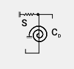
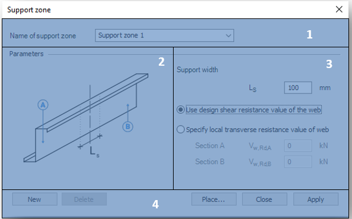

# Purlins

The functions related to the calculation of the purlins are separated into 3 large units

<!-- /wp:paragraph -->

<!-- wp:image {"align":"center","id":9159,"width":837,"height":59,"sizeSlug":"full","linkDestination":"media"} -->

<!-- /wp:image -->

<!-- wp:paragraph -->

\#1 - [Place purlin line](#place-purlin-line): to specify the purlin line object.

<!-- /wp:paragraph -->

<!-- wp:paragraph -->

\#2 - [Place support zone](#support-zone): to specify the geometry of the support zone of the purlins

<!-- /wp:paragraph -->

<!-- wp:paragraph -->

\#3 - [Place purlin overlap](#purlin-overlap-zone): to specify the overlap zone of the purlins

<!-- /wp:paragraph -->

<!-- wp:spacer -->

<!-- /wp:spacer -->

<!-- wp:heading {"level":3} -->

### Place purlin line

<!-- /wp:heading -->

<!-- wp:paragraph -->

Four additional dialog panels are directly linked to the main dialog window of the purlin line object, which will be described later.

<!-- /wp:paragraph -->

<!-- wp:image {"align":"center","id":9165,"width":733,"height":513,"sizeSlug":"full","linkDestination":"media"} -->

<!-- /wp:image -->

<!-- wp:heading {"level":4} -->

#### Functions

<!-- /wp:heading -->

<!-- wp:paragraph -->

\#1 - Specify the name of a purlin line object: The name of the object in the edit box can be specified as text and number characters

<!-- /wp:paragraph -->

<!-- wp:paragraph -->

\#2 - Explanatory drawing: figure for the interpretation of notations and parameters

<!-- /wp:paragraph -->

<!-- wp:paragraph -->

\#3 - Specification of the supports: for providing stiffens of the supporting sheeting

<!-- /wp:paragraph -->

<!-- wp:paragraph -->

\#4 - Command line:

<!-- /wp:paragraph -->

<!-- wp:list {"className":"is-style-arrow","editorskit":{"indent":40,"devices":false,"desktop":true,"tablet":true,"mobile":true,"loggedin":true,"loggedout":true,"acf_visibility":"","acf_field":"","acf_condition":"","acf_value":"","migrated":false,"unit_test":false}} -->

- Create **New** purlin line object
- **Delete** the existing purlin line object
- **Place** the actual purlin line object into the model
- **Apply** the actual settings

<!-- /wp:list -->

<!-- wp:paragraph -->

The Place command opens the following dialog window:

<!-- /wp:paragraph -->

<!-- wp:image {"align":"center","id":9171,"width":491,"height":382,"sizeSlug":"full","linkDestination":"media"} -->

<!-- /wp:image -->

<!-- wp:paragraph -->

\#1 - Choose the type of the placing: select object or draw

<!-- /wp:paragraph -->

<!-- wp:paragraph -->

\#2 - Select the purlin line object from the drop-down list

<!-- /wp:paragraph -->

<!-- wp:paragraph -->

\#3 - Sheeting eccentricity: set the eccentricity in the Z direction manually or automatically:

<!-- /wp:paragraph -->

<!-- wp:list {"className":"is-style-arrow","editorskit":{"indent":40,"devices":false,"desktop":true,"tablet":true,"mobile":true,"loggedin":true,"loggedout":true,"acf_visibility":"","acf_field":"","acf_condition":"","acf_value":"","migrated":false,"unit_test":false}} -->

- By selecting from the drop-down list:

  - Top middle

  - Bottom middle

- Graphically by clicking on () icon

<!-- /wp:list -->

<!-- wp:paragraph -->

Clicking the **End placement** command stops the command and closes the dialog.

<!-- /wp:paragraph -->

<!-- wp:paragraph -->

\#4 - Enter position: at a given distance from endpoint A or B (in mm)

<!-- /wp:paragraph -->

<!-- wp:paragraph -->

\#5 - Info panel: to display instructions

<!-- /wp:paragraph -->

<!-- wp:heading {"level":4} -->

#### The role of the springs

<!-- /wp:heading -->

<!-- wp:columns -->

<!-- wp:column {"width":"65%","editorskit":{"devices":false,"desktop":true,"tablet":true,"mobile":true,"loggedin":true,"loggedout":true,"acf_visibility":"","acf_field":"","acf_condition":"","acf_value":"","migrated":false,"unit_test":false}} -->

<!-- wp:paragraph {"align":"justify","editorskit":{"devices":false,"desktop":true,"tablet":true,"mobile":true,"loggedin":true,"loggedout":true,"acf_visibility":"","acf_field":"","acf_condition":"","acf_value":"","migrated":false,"unit_test":false}} -->

The support effect of the cover can be very significant in the bearing capacity of the purlins. This effect can be derived from the stiffness of the elements attached to the purlins and is modeled in the form of springs. There are two types of springs to consider:

<!-- /wp:paragraph -->

<!-- wp:list {"className":"is-style-arrow"} -->

- Translational (shear) spring: Derived from the shear stiffness of the trapezoidal sheet (S)
- Rotational spring: derived from connection stiffness and distortion of the profile (CD)

<!-- /wp:list -->

<!-- /wp:column -->

<!-- wp:column {"verticalAlignment":"center","width":"35%"} -->

<!-- wp:image {"align":"center","id":13682,"sizeSlug":"large","linkDestination":"none"} -->

<!-- /wp:image -->

<!-- /wp:column -->

<!-- /wp:columns -->

<!-- wp:heading {"level":4} -->

#### Translational spring

<!-- /wp:heading -->

<!-- wp:paragraph -->

The translational spring is optional. Before you enter, you need to choose the type of cover put on the purlins, which can be of two types:

<!-- /wp:paragraph -->

<!-- wp:list {"className":"is-style-arrow"} -->

- Trapezoidal sheeting
- Sandwich panel

<!-- /wp:list -->

<!-- wp:paragraph -->

The contents of the dialog box change according to the selection.

<!-- /wp:paragraph -->

<!-- wp:paragraph {"align":"justify"} -->

If trapezoidal sheeting is selected, the shear stiffness can be entered manually along with the effective width, or automatically by clicking () and using the shear box dialog shown above (see Section [5.11).](./5_12_shear-field.md)

<!-- /wp:paragraph -->

<!-- wp:paragraph -->

For sandwich panel cover, shear stiffness can only be entered manually.

<!-- /wp:paragraph -->

<!-- wp:columns -->

<!-- wp:column -->

<!-- wp:image {"align":"right","id":9179,"width":316,"height":171,"sizeSlug":"full","linkDestination":"media"} -->

<!-- /wp:image -->

<!-- /wp:column -->

<!-- wp:column -->

<!-- wp:image {"align":"left","id":9185,"width":311,"height":171,"sizeSlug":"full","linkDestination":"media"} -->

<!-- /wp:image -->

<!-- /wp:column -->

<!-- /wp:columns -->

<!-- wp:heading {"level":4} -->

#### Rotational spring

<!-- /wp:heading -->

<!-- wp:paragraph -->

As with the translational spring, the rotational spring is also optional. The rotational spring consists of two components (connection stiffness and profile distortion). In the final spring stiffness, the reciprocal of the components is summarized. In the case of zero stiffness or inactive checkboxes, the stiffness of a given component is reset to zero.

<!-- /wp:paragraph -->

<!-- wp:list {"ordered":true,"type":"1"} -->

1. Connection stiffness:

<!-- /wp:list -->

<!-- wp:paragraph -->

In the case of trapezoidal sheeting, and selecting automatic calculation, clicking on (), the connection stiffness is calculated using the simplified method of Eurocode. In the pop-up window, you only need to specify the number of fasteners per meter:

<!-- /wp:paragraph -->

<!-- wp:image {"align":"center","id":9192,"width":362,"height":116,"sizeSlug":"full","linkDestination":"media"} -->

<!-- /wp:image -->

<!-- wp:paragraph -->

When selecting a sandwich panel covering, more data is required to automatically calculate connection stiffness:

<!-- /wp:paragraph -->

<!-- wp:list {"className":"is-style-default"} -->

- External steel shield shape:

  - Plain sheets
  - Trapezoidal sheet

- Type of insulating material:

  - PUR

  - Mineral wool

- Elastic modulus of insulating material in MPa

<!-- /wp:list -->

<!-- wp:image {"align":"center","id":9198,"width":309,"height":162,"sizeSlug":"full","linkDestination":"media"} -->

<!-- /wp:image -->

<!-- wp:paragraph -->

In case of manual input, the spring stiffeners must be entered in the case of the tensile or compressive forces exerted on the connections.

<!-- /wp:paragraph -->

<!-- wp:paragraph -->

2\. Profile distortion

<!-- /wp:paragraph -->

<!-- wp:columns -->

<!-- wp:column {"verticalAlignment":"top","width":"50%","editorskit":{"devices":false,"desktop":true,"tablet":true,"mobile":true,"loggedin":true,"loggedout":true,"acf_visibility":"","acf_field":"","acf_condition":"","acf_value":"","migrated":false,"unit_test":false}} -->

<!-- wp:paragraph {"align":"justify","editorskit":{"devices":false,"desktop":true,"tablet":true,"mobile":true,"loggedin":true,"loggedout":true,"acf_visibility":"","acf_field":"","acf_condition":"","acf_value":"","migrated":false,"unit_test":false}} -->

The stiffness is defined in the same way as connection stiffness. For the automatic calculation, in the pop-up window, one has to only enter the distance between the fastener and the rib-to-belt connection in mm. The calculation is in accordance with EN 1993 - 1- 3 10.1.5, as noted on the panel.

<!-- /wp:paragraph -->

<!-- wp:paragraph -->

For manual input, it is necessary to specify the value of the stiffness component due to distortion in the following two cases:

<!-- /wp:paragraph -->

<!-- /wp:column -->

<!-- wp:column {"width":"40%"} -->

<!-- wp:image {"align":"center","id":13750,"width":254,"height":219,"sizeSlug":"full","linkDestination":"media"} -->

<!-- /wp:image -->

<!-- /wp:column -->

<!-- /wp:columns -->

<!-- wp:list {"type":"A"} -->

- After deformation, the purlin contacts with sheeting at the web
- After the deformation, the purlin contacts with sheeting at the flange edge

<!-- /wp:list -->

<!-- wp:paragraph {"align":"justify"} -->

**Attention!** The purlin design only works with Z and C type profiles. It is not possible to put puline line object to other type of cold-formed factory profiles or not Z or C type user profiles.

<!-- /wp:paragraph -->

<!-- wp:spacer -->

<!-- /wp:spacer -->

<!-- wp:heading {"level":3} -->

### Support zone

<!-- /wp:heading -->

<!-- wp:paragraph -->

The Support zone is a function for specifying geometrical parameters for the support point of a purlin.

<!-- /wp:paragraph -->

<!-- wp:image {"align":"center","id":9205,"width":594,"height":370,"sizeSlug":"full","linkDestination":"none"} -->

<!-- /wp:image -->

<!-- wp:paragraph -->

\#1 - Specify the name of the support zone: the name of the object can be specified as text and number characters

<!-- /wp:paragraph -->

<!-- wp:paragraph -->

\#2 - Explanatory drawing: figure for the interpretation of notations and parameters

<!-- /wp:paragraph -->

<!-- wp:paragraph -->

\#3 - Specify the geometry and bearing capacity of the support zone:

<!-- /wp:paragraph -->

<!-- wp:list {"editorskit":{"indent":40,"devices":false,"desktop":true,"tablet":true,"mobile":true,"loggedin":true,"loggedout":true,"acf_visibility":"","acf_field":"","acf_condition":"","acf_value":"","migrated":false,"unit_test":false}} -->

- Support width in mm

- Selection of load capacity used in the calculation:

  - Use design shear resistance value of the web

  - Specify local transverse resistance value of the web

    - Resistance of profile A \[kN]

    - Resistance of profile B \[kN]

<!-- /wp:list -->

<!-- wp:paragraph {"editorskit":{"indent":60,"devices":false,"desktop":true,"tablet":true,"mobile":true,"loggedin":true,"loggedout":true,"acf_visibility":"","acf_field":"","acf_condition":"","acf_value":"","migrated":false,"unit_test":false}} -->

The local transverse resistance shall be determined manually in accordance with EC 1993 - 1 - 3 Section 6.1.7.

<!-- /wp:paragraph -->

<!-- wp:paragraph -->

\#4 - Command line:

<!-- /wp:paragraph -->

<!-- wp:list {"className":"is-style-arrow","editorskit":{"indent":40,"devices":false,"desktop":true,"tablet":true,"mobile":true,"loggedin":true,"loggedout":true,"acf_visibility":"","acf_field":"","acf_condition":"","acf_value":"","migrated":false,"unit_test":false}} -->

- Create **New** support zone object
- **Delete** the existing support zone object
- **Place** the actual support zone object into the model
- **Apply** the actual settings

<!-- /wp:list -->

<!-- wp:paragraph -->

The **Place** command opens the following dialog window

<!-- /wp:paragraph -->

<!-- wp:image {"align":"center","id":9211,"width":446,"height":164,"sizeSlug":"full","linkDestination":"media"} -->

<!-- /wp:image -->

<!-- wp:paragraph -->

\#1 - Type of placing: selecting object

<!-- /wp:paragraph -->

<!-- wp:paragraph -->

\#2 - Select the support zone object from the drop-down list

<!-- /wp:paragraph -->

<!-- wp:paragraph -->

Clicking the **End placement** command stops the command and closes the dialog

<!-- /wp:paragraph -->

<!-- wp:paragraph -->

\#3 - Info panel: to display instructions

<!-- /wp:paragraph -->

<!-- wp:spacer -->

<!-- /wp:spacer -->

<!-- wp:heading {"level":3} -->

### Purlin overlap zone

<!-- /wp:heading -->

<!-- wp:paragraph {"align":"justify"} -->

The standard distinguishes between two main types of overlap joints. For both types of joints, there are unique formulas for the calculation of load-bearing capacity required for design.

<!-- /wp:paragraph -->

<!-- wp:list {"className":"is-style-arrow"} -->

- Purlin overlap joint
- Joint with coupling element

<!-- /wp:list -->

<!-- wp:paragraph -->

Currently, only overlap joint is available in the program. A dialog is directly connected to the dialog.

<!-- /wp:paragraph -->

<!-- wp:image {"align":"center","id":9218,"width":576,"height":496,"sizeSlug":"full","linkDestination":"media"} -->

<!-- /wp:image -->

<!-- wp:paragraph -->

\#1 - Specify the name of the overlap zone: the name of the object can be specified as text and number characters

<!-- /wp:paragraph -->

<!-- wp:paragraph -->

\#2 - Explanatory drawing: figure for the interpretation of notations and parameters

<!-- /wp:paragraph -->

<!-- wp:paragraph -->

\#3 - Specify the length of the overlap: Specify the length of the overlapping section of each rod element, either as a distance value (in mm) or as a percentage of the rod length (%).

<!-- /wp:paragraph -->

<!-- wp:paragraph -->

\#4 - Distribution of stiffness of the combined gross section between the two members.

<!-- /wp:paragraph -->

<!-- wp:paragraph -->

\#5 - Support zone: it is possible to define a support zone at the same time as the overlap as described above.

<!-- /wp:paragraph -->

<!-- wp:paragraph -->

\#6 - Command line:

<!-- /wp:paragraph -->

<!-- wp:list {"editorskit":{"indent":40,"devices":false,"desktop":true,"tablet":true,"mobile":true,"loggedin":true,"loggedout":true,"acf_visibility":"","acf_field":"","acf_condition":"","acf_value":"","migrated":false,"unit_test":false}} -->

- Create **New** purlin overlap object
- **Delete** the existing purlin overlap object
- **Place** the actual purlin overlap object into the model
- **Apply** the actual settings

<!-- /wp:list -->

<!-- wp:paragraph -->

The **Place** command opens the following dialog window

<!-- /wp:paragraph -->

<!-- wp:image {"align":"center","id":9224,"width":445,"height":163,"sizeSlug":"full","linkDestination":"media"} -->

<!-- /wp:image -->

<!-- wp:list {"editorskit":{"indent":40,"devices":false,"desktop":true,"tablet":true,"mobile":true,"loggedin":true,"loggedout":true,"acf_visibility":"","acf_field":"","acf_condition":"","acf_value":"","migrated":false,"unit_test":false}} -->

- \#1 - Type of placing: selecting object
- \#2 - Select the support zone object from the drop-down list

<!-- /wp:list -->

<!-- wp:paragraph {"editorskit":{"indent":40,"devices":false,"desktop":true,"tablet":true,"mobile":true,"loggedin":true,"loggedout":true,"acf_visibility":"","acf_field":"","acf_condition":"","acf_value":"","migrated":false,"unit_test":false}} -->

Clicking the **End placement** command stops the command and closes the dialog

<!-- /wp:paragraph -->

<!-- wp:list {"editorskit":{"indent":40,"devices":false,"desktop":true,"tablet":true,"mobile":true,"loggedin":true,"loggedout":true,"acf_visibility":"","acf_field":"","acf_condition":"","acf_value":"","migrated":false,"unit_test":false}} -->

- \#3 - Info panel: to display instructions

<!-- /wp:list -->

<!-- wp:paragraph -->

<!-- /wp:paragraph -->
