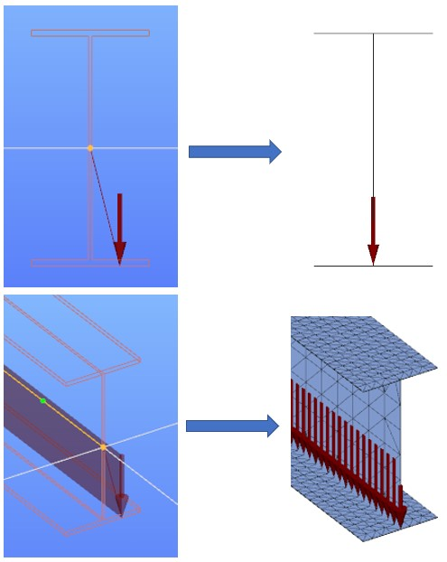
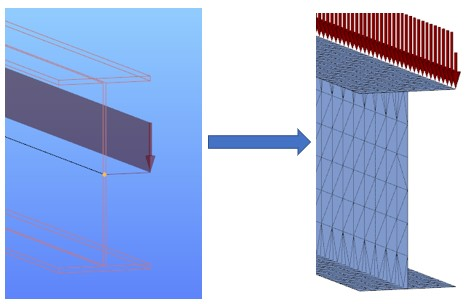
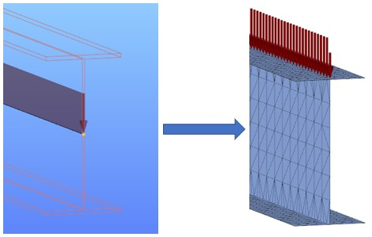
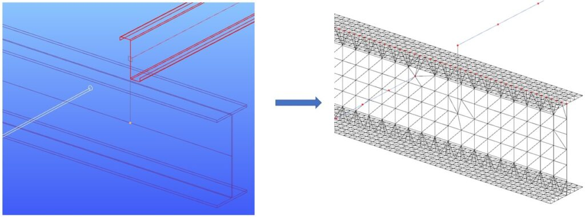

# Superbeam

<!-- /wp:image -->

<!-- wp:heading {"level":3} -->

### Description

<!-- /wp:heading -->

<!-- wp:paragraph {"align":"justify"} -->

Superbeam is a new feature introduced with Consteel 15. It is developed for the dual handling of bar members. Superbeam makes it possible to examine structural parts with the accuracy of shell elements but with the ease of using a beam element concerning definition, modification, and model handling. In practice, it means that the structure can be modeled easily and quickly with the common 7DOF beam elements, while the analysis can be performed on two consistently generated calculation models:

<!-- /wp:paragraph -->

<!-- wp:list -->

- The **beam FE model** (with 7DOF beam finite elements) with well-known analysis and design capabilities
- The **shell FE model** (with shell finite elements) consistently connected into the global beam model and including the additional holes (web cut-outs) and stiffeners in the mesh.

<!-- /wp:list -->

<!-- wp:paragraph -->

If the shell FE model (mesh) is selected for the analysis, it is automatically created during the finite element generation at the beginning of the analysis process. You can easily switch between the analysis options since the whole process is fully adaptive. You model and modify simple bar members and calculate the consistent beam or shell FE model.

<!-- /wp:paragraph -->

<!-- wp:columns -->

<!-- wp:column {"width":"33.34%","editorskit":{"devices":false,"desktop":true,"tablet":true,"mobile":true,"loggedin":true,"loggedout":true,"acf_visibility":"","acf_field":"","acf_condition":"","acf_value":"","migrated":false,"unit_test":false}} -->

<!-- wp:image {"align":"center","id":11619,"width":338,"height":150,"sizeSlug":"full","linkDestination":"media","editorskit":{"devices":false,"desktop":true,"tablet":true,"mobile":true,"loggedin":true,"loggedout":true,"acf_visibility":"","acf_field":"","acf_condition":"","acf_value":"","migrated":false,"unit_test":false}} -->

Bar member model of the beam

<!-- /wp:image -->

<!-- /wp:column -->

<!-- wp:column {"width":"33.34%","editorskit":{"devices":false,"desktop":true,"tablet":true,"mobile":true,"loggedin":true,"loggedout":true,"acf_visibility":"","acf_field":"","acf_condition":"","acf_value":"","migrated":false,"unit_test":false}} -->

<!-- wp:image {"align":"center","id":11625,"width":338,"height":150,"sizeSlug":"full","linkDestination":"media"} -->

7DOF beam model with warping stiffeners

<!-- /wp:image -->

<!-- /wp:column -->

<!-- wp:column {"width":"33.33%","editorskit":{"devices":false,"desktop":true,"tablet":true,"mobile":true,"loggedin":true,"loggedout":true,"acf_visibility":"","acf_field":"","acf_condition":"","acf_value":"","migrated":false,"unit_test":false}} -->

<!-- wp:image {"align":"center","id":11631,"width":338,"height":150,"sizeSlug":"full","linkDestination":"media"} -->

Shell model with holes and stiffeners

<!-- /wp:image -->

<!-- /wp:column -->

<!-- /wp:columns -->

<!-- wp:paragraph {"align":"justify"} -->

Several new adaptive detailing features are also available in addition to the Superbeam function: **stiffeners** and **web cutouts**. These objects are described in the following chapters:

<!-- /wp:paragraph -->

<!-- wp:paragraph -->

**_[Stiffener](../5_0_structural-modeling/5_16_stiffener.md)_**

<!-- /wp:paragraph -->

<!-- wp:paragraph -->

_**[Web cutout](../5_0_structural-modeling/5_15_cutout.md)**_

<!-- /wp:paragraph -->

<!-- wp:paragraph {"align":"justify"} -->

Currently, these objects are only taken into account during analysis and design if the finite element model of the member is shell. Modeled as a 7DOF beam element, stiffeners and cutouts have no effect on analysis and are not taken into account in the design, as well. (See the relevant chapters above for more info.)

<!-- /wp:paragraph -->

<!-- wp:heading {"level":3} -->

### Usage

<!-- /wp:heading -->

<!-- wp:paragraph -->

To use the capabilities of a shell model on a bar member, you have to change the type of the finite element model of a beam. First, you have to select the beam in the model space and then click on the "_Type of finite element_" field on the right _[Objects properties window](../1_0_general-description/1_2_the-main-window.md#object-properties-window)_ (see below).

<!-- /wp:paragraph -->

<!-- wp:columns {"className":"is-style-default"} -->

<!-- wp:column {"width":"25%","editorskit":{"devices":false,"desktop":true,"tablet":true,"mobile":true,"loggedin":true,"loggedout":true,"acf_visibility":"","acf_field":"","acf_condition":"","acf_value":"","migrated":false,"unit_test":false}} -->

<!-- wp:image {"align":"left","id":11647,"width":231,"height":242,"sizeSlug":"full","linkDestination":"media","editorskit":{"devices":false,"desktop":true,"tablet":true,"mobile":true,"loggedin":true,"loggedout":true,"acf_visibility":"","acf_field":"","acf_condition":"","acf_value":"","migrated":false,"unit_test":false}} -->

<!-- /wp:image -->

<!-- /wp:column -->

<!-- wp:column {"width":"75%"} -->

<!-- wp:paragraph -->

The available types of finite elements in the drop-down list depend on the cross-section type (see chapter **_[Line members](../5_0_structural-modeling/5_2_line-members.md#line-members)_** too). Currently, only welded I or H type sections can be changed to **shell element**. Other types of sections will be available later. After changing the FE model to shell element, a small symbol will appear on the member's reference line as a confirmation.

<!-- /wp:paragraph -->

<!-- wp:image {"id":11674,"width":183,"height":111,"sizeSlug":"large","linkDestination":"none"} -->

<!-- /wp:image -->

<!-- /wp:column -->

<!-- /wp:columns -->

<!-- wp:image {"align":"left","id":21879,"width":287,"height":92,"sizeSlug":"full","linkDestination":"media"} -->

<!-- /wp:image -->

<!-- wp:paragraph -->

In the next row, the _Finite element generation_ type determines whether the **size of finite elements** will be _Automatic_ or _Manual_. Finite element size can be specified separately for the web and the flanges. Choosing the automatic mode, the FE generation will follow the rules below:

<!-- /wp:paragraph -->

<!-- wp:paragraph -->

For flanges: the smaller of b/4 or 25mm (where b=the half-width of the flange)  
For the web: the smaller of h/6 or 100mm (where h=height of the web)

<!-- /wp:paragraph -->

<!-- wp:paragraph -->

In the case of manual FE generation type, the size of the finite elements can be set in the next two rows, separately for the web and the flanges in mm.

<!-- /wp:paragraph -->

<!-- wp:separator {"align":"center"} -->

---

<!-- /wp:separator -->

<!-- wp:paragraph {"editorskit":{"indent":40,"devices":false,"desktop":true,"tablet":true,"mobile":true,"loggedin":true,"loggedout":true,"acf_visibility":"","acf_field":"","acf_condition":"","acf_value":"","migrated":false,"unit_test":false}} -->

_Please note, that by choosing a very different finite element size for the flanges and the web, the FE generation may lead to distorted elements, which may make the calculation less accurate._

<!-- /wp:paragraph -->

<!-- wp:separator {"align":"center"} -->

---

<!-- /wp:separator -->

<!-- wp:paragraph -->

In the next row, the type of **constraint elements** can be chosen, that can be

<!-- /wp:paragraph -->

<!-- wp:image {"align":"right","id":21887,"width":340,"height":399,"sizeSlug":"full","linkDestination":"media"} -->

<!-- /wp:image -->

<!-- wp:list -->

- _Translational_ (default value), or
- _Translational and rotational_.

<!-- /wp:list -->

<!-- wp:paragraph -->

The constraint elements are special model elements generated automatically during the member to shell conversion, connecting the FE nodes of the shell model to the other part of the model, e.g. to a continuously connected bar member. Constraints elements are drawn with orange lines in the Finite element view of the model (see picture). See more: [**_Constraints_**](../5_0_structural-modeling/5_11_link-elements.md#constraints)

<!-- /wp:paragraph -->

<!-- wp:paragraph -->

The FE model of a bar member can be changed at any time, as mentioned before.

<!-- /wp:paragraph -->

<!-- wp:paragraph -->

<!-- /wp:paragraph -->

<!-- wp:paragraph -->

In the present version, the shell FE representation Of Superbeam is not compatible with the following Consteel tools or functions

<!-- /wp:paragraph -->

<!-- wp:list -->

- Diaphragm
- Frame corner
- Shearfield
- Member bow imperfection
- Line link element
- Connecting other member using Superbeam shell FE representation
- Placed joint
- Purlin line and Purlin joint
- Influence line

<!-- /wp:list -->

<!-- wp:heading {"level":3} -->

### Conversion logic of connected objects and elements

<!-- /wp:heading -->

<!-- wp:paragraph -->

Consteel uses a well defined logic to handle member to shell conversions automatically. If the automatic conversion results an unexpected or unwanted solution, the user can „explode” the converted member and place the eccentric objects directly on the shell representation, as normal. See **_[Chapter 5.5 Convert members to plates](../5_0_structural-modeling/5_6_convert-members-to-plates.md)_** for how to do this.

<!-- /wp:paragraph -->

<!-- wp:paragraph -->

Automatic conversion logic:

<!-- /wp:paragraph -->

<!-- wp:list -->

- Loads and supports are in general positioned to the nearest line/edge.

<!-- /wp:list -->

<!-- wp:image {"align":"center","id":29602,"width":344,"height":432,"sizeSlug":"full","linkDestination":"none"} -->

<!-- /wp:image -->

<!-- wp:paragraph -->

If the load or support is defined to Middle left/middle/right of a symmetric profile with equal distance from upper and lower flange edges, they will be placed to edges of the top flange.

<!-- /wp:paragraph -->

<!-- wp:image {"align":"center","id":29608,"width":382,"height":247,"sizeSlug":"full","linkDestination":"none"} -->

<!-- /wp:image -->

<!-- wp:paragraph -->

Loads/supports defined on the Reference line will be positioned to the edge where the top flange and the web is connected.

<!-- /wp:paragraph -->

<!-- wp:image {"align":"center","id":29614,"width":379,"height":241,"sizeSlug":"full","linkDestination":"none"} -->

<!-- /wp:image -->

<!-- wp:list -->

- After conversion, connecting bar members, link elements and rigid bodies can connect to the actual FE point where they were defined.

<!-- /wp:list -->

<!-- wp:image {"align":"center","id":29620,"width":695,"height":259,"sizeSlug":"large","linkDestination":"none"} -->

<!-- /wp:image -->

<!-- wp:heading {"level":3} -->

### Analysis

<!-- /wp:heading -->

<!-- wp:paragraph -->

<!-- /wp:paragraph -->

<!-- wp:heading {"level":3} -->

### Feature preview

<!-- /wp:heading -->

<!-- wp:html -->

<YouTubeEmbedded>3eTiNTNFI-g</YouTubeEmbedded>

<!-- /wp:html -->
