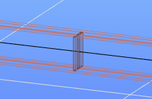

# Stiffener

The modeling of various web stiffeners is currently available for welded I- or H-type cross-sections. Other types of sections will be available later. The effect of the stiffeners is only taken into account during analysis and design if the finite element of the member is shell, where the stiffeners will be automatically included in the mesh during the finite element division. Analyzing with the normal 7DOF beam finite element, these objects are neglected. The only exception is, that the warping stiffness of the perpendicular stiffeners can be considered also in the beam representation of the member if requested.

<!-- /wp:paragraph -->

<!-- wp:columns -->

<!-- wp:column {"width":"50%","editorskit":{"devices":false,"desktop":true,"tablet":true,"mobile":true,"loggedin":true,"loggedout":true,"acf_visibility":"","acf_field":"","acf_condition":"","acf_value":"","migrated":false,"unit_test":false}} -->

<!-- wp:image {"align":"center","id":11456,"width":392,"height":224,"sizeSlug":"full","linkDestination":"media"} -->

<!-- /wp:image -->

<!-- /wp:column -->

<!-- wp:column {"width":"50%","editorskit":{"devices":false,"desktop":true,"tablet":true,"mobile":true,"loggedin":true,"loggedout":true,"acf_visibility":"","acf_field":"","acf_condition":"","acf_value":"","migrated":false,"unit_test":false}} -->

<!-- wp:image {"align":"center","id":11462,"width":389,"height":224,"sizeSlug":"full","linkDestination":"media","editorskit":{"devices":false,"desktop":true,"tablet":true,"mobile":true,"loggedin":true,"loggedout":true,"acf_visibility":"","acf_field":"","acf_condition":"","acf_value":"","migrated":false,"unit_test":false}} -->

<!-- /wp:image -->

<!-- /wp:column -->

<!-- /wp:columns -->

<!-- wp:heading {"level":3} -->

### Creating stiffeners 

<!-- /wp:heading -->

<!-- wp:paragraph {"align":"justify"} -->

Stiffeners can be placed on the webs of welded I or H sections, regardless of the finite element type of the member. The command can be found on the **Structural members** tab. Executing the command, the dialog window shown below will appear where three types of stiffeners can be defined and placed as described below.

<!-- /wp:paragraph -->

<!-- wp:columns -->

<!-- wp:column -->

<!-- wp:image {"align":"right","id":11480,"width":237,"height":260,"sizeSlug":"full","linkDestination":"media"} -->

<!-- /wp:image -->

<!-- /wp:column -->

<!-- wp:column -->

<!-- wp:image {"align":"center","id":11474,"width":237,"height":260,"sizeSlug":"full","linkDestination":"media"} -->

<!-- /wp:image -->

<!-- /wp:column -->

<!-- wp:column -->

<!-- wp:image {"align":"left","id":11468,"width":237,"height":260,"sizeSlug":"full","linkDestination":"media"} -->

<!-- /wp:image -->

<!-- /wp:column -->

<!-- /wp:columns -->

<!-- wp:paragraph -->

The usual placement options are available at the top of the dialog window:

<!-- /wp:paragraph -->

<!-- wp:list -->

-  the stiffeners can be placed **individually** by clicking on the reference line of the member,
-  or by **multiple placement** with relative distances interpreted in the member local coordinate system.
-  The properties of other stiffeners can get and used for new definitions as well.

<!-- /wp:list -->

<!-- wp:paragraph -->

In the _Parameters_ section, the reference object of the stiffener can be defined on the left side of the window (_Fit to_). The figure below the drop-down box shows the chosen selection. The location of the stiffener can be specified relative to the:

- reference line of the member,

- middle line of the web,

- top flange,

- bottom flange.

<!-- /wp:image -->

<!-- /wp:column -->

<!-- /wp:columns -->

<!-- wp:paragraph -->

The selected option not only defines the stiffener reference object but also determines the stiffener axis. It is always placed perpendicular to the selected reference object.

<!-- /wp:paragraph -->

<!-- wp:image {"align":"center","id":11557,"width":380,"height":288,"sizeSlug":"full","linkDestination":"media"} -->

<!-- /wp:image -->

<!-- wp:paragraph -->

On the right side of the dialog window, the parameters can be entered according to the chosen geometry. Some parameters are common in all cases. These are:

<!-- /wp:paragraph -->

<!-- wp:list -->

- **eccentricity** from the given reference object,
- **side** on which the stiffener is placed can be both, left or right side.

<!-- /wp:list -->

<!-- wp:paragraph -->

Other parameters are different for the various stiffener types:

<!-- /wp:paragraph -->

<!-- wp:list -->

- **Perpendicular plate**: a plate stiffener will be placed perpendicular to the flanges. The thickness and the plate size (width and height) can be defined. The geometry can be automatic or manual. Choosing the automatic option the plate will adapt to the geometry of the section fitting between the flanges.
- **Parallel plate**: a plate stiffener will be placed parallel to the flanges. The thickness, the plate size (width and length), and the insertion point (start, middle, or end of the plate) can be defined. The geometry can be automatic or manual. Choosing the automatic option the plate width will adapt to the width of the section.
- **Perpendicular section**: a profile stiffener will be placed perpendicular to the flanges. The section and the height can be defined. L, U, and T type macro or library profiles can be used here. Drawn sections, compound or cold-formed sections, and not steel profiles cannot be used. The geometry can be automatic or manual. Choosing the automatic option the profile stiffener will adapt to the geometry of the section fitting between the flanges.

<!-- /wp:list -->

<!-- wp:paragraph -->

After specifying all the parameters the stiffener can be placed on the members:

<!-- /wp:paragraph -->

<!-- wp:list -->

- one-by-one clicking on the member's reference line, or
- specifying a set of stiffeners at the bottom of the dialog window, all the objects can be placed with one mouse click on the reference line of the member.

<!-- /wp:list -->

<!-- wp:heading {"level":3} -->

### Analysis and design

<!-- /wp:heading -->

<!-- wp:paragraph -->

**Analysis**

<!-- /wp:paragraph -->

<!-- wp:paragraph {"align":"justify"} -->

The effect of the stiffeners is only taken into account during analysis if the finite element model of the member is set to shell, where the stiffeners will be automatically included in the mesh during the finite element division. Analyzing with the normal 7DOF beam finite element, these objects are neglected.

<!-- /wp:paragraph -->

<!-- wp:paragraph {"align":"justify"} -->

If the "Consider warping stiffness in beam representation" option is checked, a warping support with automatically calculated stiffness will be placed on the member during the finite element division, which is considered in the analysis and thus has an indirect effect on LTB resistance.

<!-- /wp:paragraph -->

<!-- wp:paragraph -->

The option can only be checked in case of perpendicular plate or section stiffener with automatic geometry.

<!-- /wp:paragraph -->

<!-- wp:columns -->

<!-- wp:column -->

<!-- wp:image {"align":"right","id":25494,"width":197,"height":130,"sizeSlug":"full","linkDestination":"none","className":"is-style-editorskit-shadow"} -->

stiffener on the beam

<!-- /wp:image -->

<!-- /wp:column -->

<!-- wp:column -->

<!-- wp:image {"align":"left","id":25500,"height":130,"sizeSlug":"full","linkDestination":"none","className":"is-style-editorskit-shadow"} -->

warping support in the FE model

<!-- /wp:image -->

<!-- /wp:column -->

<!-- /wp:columns -->

<!-- wp:paragraph -->

For the calculation method used in Consteel for calculating the warping stiffness of warping supports see the following page: **_[Discrete warping restraint](https://www.Consteelsoftware.com/knowledgebase/discrete-warping-restraint/)_**

<!-- /wp:paragraph -->

<!-- wp:paragraph -->

**Design**

<!-- /wp:paragraph -->

<!-- wp:paragraph -->

Stiffeners are not considered in the design verifications at the moment.

<!-- /wp:paragraph -->

<!-- wp:spacer {"height":11} -->

<!-- /wp:spacer -->

<!-- wp:heading {"level":3} -->

### Feature preview

<!-- /wp:heading -->

<!-- wp:html -->

https://www.youtube.com/watch?v=ClcNpBDFazg

<!-- /wp:html -->
