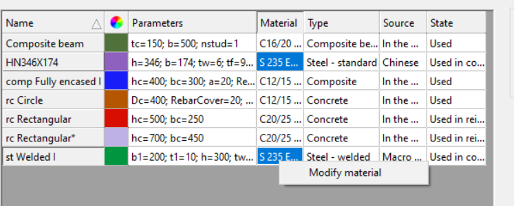

# Section administration

Sections must be loaded into the model database in order to use them in the model. This can be done in the Section administration dialogue. The Section dialogue can be opened by clicking the  command on the **Structural members** tab. The dialogue can also be reached from the member creating dialogues (Beam and Column) with the  command besides the section drop-down menu. In this dialogue window, you can see all the previously loaded sections and new sections can be loaded or created by clicking the appropriate buttons on the right.

<!-- /wp:paragraph -->

<!-- wp:image {"align":"center","id":21905,"sizeSlug":"full","linkDestination":"media"} -->

<!-- /wp:image -->

<!-- wp:paragraph -->

The main part of the window is the table of sections that contains the following columns:

<!-- /wp:paragraph -->

<!-- wp:list -->

- <!-- wp:list-item -->
- Name of the section
- <!-- /wp:list-item -->
-
- <!-- wp:list-item -->
- Color of the section: each section gets a color automatically after creating it which can be changed by clicking on the colored square
- <!-- /wp:list-item -->
-
- <!-- wp:list-item -->
- Parameters: the main dimensions of the section are shown here
- <!-- /wp:list-item -->
-
- <!-- wp:list-item -->
- Material
- <!-- /wp:list-item -->
-
- <!-- wp:list-item -->
- Type
- <!-- /wp:list-item -->
-
- <!-- wp:list-item -->
- Source: it can be some standard section (like e.g. European), manufacturer section, macro or drawn section.
- <!-- /wp:list-item -->
-
- <!-- wp:list-item -->
- State: can be _Used \_or \_Not used_ depending on whether it is used in the model or not.
- <!-- /wp:list-item -->

<!-- /wp:list -->

<!-- wp:paragraph -->

Starting from **Consteel 17,** within the Section Administration panel, the material of the steel sections can be modified by right-clicking on them. This modification can be applied to individual sections or multiple sections at once.

<!-- /wp:paragraph -->

<!-- wp:image {"id":73728,"width":"602px","height":"auto","sizeSlug":"full","linkDestination":"none"} -->

<!-- /wp:image -->

<!-- wp:paragraph -->

The right part of the window contains the command buttons for managing sections. The first three buttons that are grouped under the name "_Load section_" are for creating or loading sections to the section database. These functions are described in **_[Chapter 5.1 Line members](/manual/structural-modelling/line-members/)_**.

<!-- /wp:paragraph -->

<!-- wp:paragraph -->

The next group of commands is for modifying the sections.

<!-- /wp:paragraph -->

<!-- wp:list -->

- <!-- wp:list-item -->
- Modify: section parameters can be changed
- <!-- /wp:list-item -->
-
- <!-- wp:list-item -->
- Remove: only sections that are not used in the model can be removed
- <!-- /wp:list-item -->
-
- <!-- wp:list-item -->
- Copy: the section will be copied with a - Copy suffix added to the name.
- <!-- /wp:list-item -->
-
- <!-- wp:list-item -->
- Export section list: the list will be exported to a .csv file that can be opened by Excel or other editors.
- <!-- /wp:list-item -->

<!-- /wp:list -->

<!-- wp:paragraph -->

Properties...

<!-- /wp:paragraph -->

<!-- wp:paragraph {"editorskit":{"indent":40,"devices":false,"desktop":true,"tablet":true,"mobile":true,"loggedin":true,"loggedout":true,"acf_visibility":"","acf_field":"","acf_condition":"","acf_value":"","migrated":false,"unit_test":false}} -->

The Section module can be opened with this button. See the next chapter (_**10.2 Section modeling**_) for more information.

<!-- /wp:paragraph -->

<!-- wp:paragraph -->

It is very important to know that the material grade is a property of the section, not the member. Therefore, it must be chosen when the section is loaded into the database.

<!-- /wp:paragraph -->

<!-- wp:paragraph -->

See Chapter **_[Line members](/manual/line-members/) _**for details on loading and creating cross-sections.

<!-- /wp:paragraph -->
