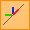
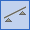

# Supports

There are three types of supports in _ConSteel_: point support, line support, and surface support.

<!-- /wp:paragraph -->

<!-- wp:image {"align":"center","id":8891,"sizeSlug":"full","linkDestination":"media"} -->

<!-- /wp:image -->

<!-- wp:paragraph {"align":"justify"} -->

Supports can be placed according to the Point loads can be placed according to the **Global (****)**, **Local (****),** or the **User coordinate system (****).** Placing supports according to the member local coordinate system is a very useful feature when working with sloping members. The visibility of the local coordinate system can be turned on with the _Visibility of the coordinate systems_ option and also the name of the axes can be shown on the screen using the appropriate options of the _Visibility of labels_ functions.

<!-- /wp:paragraph -->

<!-- wp:image {"align":"center","id":8897,"width":177,"height":264,"sizeSlug":"full","linkDestination":"media"} -->

<!-- /wp:image -->

<!-- wp:heading {"level":3} -->

### Point support ()

<!-- /wp:heading -->

<!-- wp:image {"align":"center","id":13372,"width":360,"height":276,"sizeSlug":"full","linkDestination":"media"} -->

<!-- /wp:image -->

<!-- wp:paragraph -->

Point supports can be placed on any part of a line member or surface member (predefined points are not needed; endpoints or snap points can be used). With the black arrow button () multiple placing is possible with window selection.

<!-- /wp:paragraph -->

<!-- wp:paragraph -->

With the **_Multiple support_** placement function (), more supports can be placed along a bar member at once by defining the relative distances between the support points. Support placement starts from the start point (End A) of the member. If there is an applied frame corner on the member, the first distance will be measured from the edge of the corner zone.

<!-- /wp:paragraph -->

<!-- wp:image {"align":"center","id":8909,"width":693,"height":385,"sizeSlug":"full","linkDestination":"media"} -->

<!-- /wp:image -->

<!-- wp:paragraph {"align":"justify"} -->

Supports placed with multiple support function will act like one object. Relative distances can be edited later at any time at the object properties by selecting the multiple support.

<!-- /wp:paragraph -->

<!-- wp:image {"align":"center","id":13316,"width":307,"height":223,"sizeSlug":"full","linkDestination":"media"} -->

<!-- /wp:image -->

<!-- wp:paragraph {"align":"justify"} -->

After selecting the coordinate system, the type of support has to be selected from the list box. There are several points supports types predefined.

<!-- /wp:paragraph -->

<!-- wp:paragraph -->

By positioning, the used coordinate system determines the orientation of constraints of the support. Using the **Global (****)**, **Local (****),** or the **User coordinate system (**) the orientations of the constraints represented by the support will be different:

<!-- /wp:paragraph -->

<!-- wp:image {"align":"center","id":8923,"width":311,"height":248,"sizeSlug":"full","linkDestination":"media"} -->

<!-- /wp:image -->

<!-- wp:paragraph {"align":"justify"} -->

By changing the eccentricity of the supported object, the support will keep the orientation to the coordinate system which was used by placing the support.

<!-- /wp:paragraph -->

<!-- wp:paragraph {"align":"justify"} -->

If any special supports are needed during the modeling process different from the predefined support types then click on the support definition button (). With the **New** button, a new type of point support can be defined. 7 DOFs (Degrees of Freedom) can be set to free, fix, or semi-rigid. For semi-rigid DOF the stiffness must also be set in kN/mm, or kNm/rad.

<!-- /wp:paragraph -->

<!-- wp:image {"align":"center","id":13381,"width":389,"height":319,"sizeSlug":"full","linkDestination":"media"} -->

<!-- /wp:image -->

<!-- wp:paragraph {"align":"justify"} -->

The support type names can be clearly understood. For instance “x,y,z, xx” means any movement is fixed in x, y, and z-direction, and the rotation around the x axis is also fixed. All the rest DOFs are free.

<!-- /wp:paragraph -->

<!-- wp:paragraph -->

Local eccentricity can also be defined for the supports:

<!-- /wp:paragraph -->

<!-- wp:paragraph {"align":"justify"} -->

(_This feature can be used for example for modeling_ the support effect of the bracing which is not connected to the reference line of the member but supports the flange of the beam.)

<!-- /wp:paragraph -->

<!-- wp:image {"align":"center","id":13409,"width":362,"height":276,"sizeSlug":"full","linkDestination":"media"} -->

<!-- /wp:image -->

<!-- wp:paragraph -->

The eccentricity of the support can be defined **relative to the reference line** of a section, or **relative to the section geometry**. The “0 - Reference line” local eccentricity type can be selected only from this list box.

<!-- /wp:paragraph -->

<!-- wp:paragraph -->

Support eccentricity **relative to the section geometry** can be specified in two ways. The first way is: select one of the typical points of the section geometry (1-9) from the list, the second way is to select one of the typical points (1-9) of the section's relative position of the support by clicking the position on the graphical imitation of a section (click the  button left to the list):

<!-- /wp:paragraph -->

<!-- wp:columns -->

<!-- wp:column -->

<!-- wp:image {"align":"center","id":13400,"width":362,"height":72,"sizeSlug":"full","linkDestination":"media"} -->

<!-- /wp:image -->

<!-- /wp:column -->

<!-- wp:column -->

<!-- wp:image {"align":"center","id":13394,"width":255,"height":330,"sizeSlug":"full","linkDestination":"media"} -->

<!-- /wp:image -->

<!-- /wp:column -->

<!-- /wp:columns -->

<!-- wp:paragraph {"align":"justify"} -->

Giving value for the y or z parameters for local eccentricity these values will be added to the above selected position.

<!-- /wp:paragraph -->

<!-- wp:image {"align":"center","id":8954,"width":631,"height":557,"sizeSlug":"full","linkDestination":"media"} -->

<!-- /wp:image -->

<!-- wp:paragraph -->

Changing the eccentricity of the supported object the new position of the support will be calculated accordingly.

<!-- /wp:paragraph -->

<!-- wp:paragraph -->

Depending on the type of the selected local eccentricity used by placing the support the transformation rules are the following:

<!-- /wp:paragraph -->

<!-- wp:paragraph -->

By selecting the “0 – Reference line” eccentricity type:

<!-- /wp:paragraph -->

<!-- wp:paragraph {"align":"justify","editorskit":{"indent":40,"devices":false,"desktop":true,"tablet":true,"mobile":true,"loggedin":true,"loggedout":true,"acf_visibility":"","acf_field":"","acf_condition":"","acf_value":"","migrated":false,"unit_test":false}} -->

Placing support with this eccentricity type, for example, changing the “y” eccentricity of the supported object, the support will keep its position relative to the reference line, not to the section. By changing the “Rotation angle” attribute of the supported object, the reference line also rotates, and the position of the support will rotate too.

<!-- /wp:paragraph -->

<!-- wp:paragraph -->

By selecting the 1 -9 eccentricity type:

<!-- /wp:paragraph -->

<!-- wp:paragraph {"align":"justify","editorskit":{"indent":40,"devices":false,"desktop":true,"tablet":true,"mobile":true,"loggedin":true,"loggedout":true,"acf_visibility":"","acf_field":"","acf_condition":"","acf_value":"","migrated":false,"unit_test":false}} -->

Placing support with any of these eccentricity types, for example, changing the “y” eccentricity of the supported object, the support will keep its position relative to the section. By changing the “Rotation angle” attribute of the supported object, the position of the support will rotate too.

<!-- /wp:paragraph -->

<!-- wp:paragraph -->

**Example for the different types of eccentricity:**

<!-- /wp:paragraph -->

<!-- wp:paragraph {"align":"justify","editorskit":{"indent":40,"devices":false,"desktop":true,"tablet":true,"mobile":true,"loggedin":true,"loggedout":true,"acf_visibility":"","acf_field":"","acf_condition":"","acf_value":"","migrated":false,"unit_test":false}} -->

_1. Example:_ Both supports were placed with -150mm eccentricity in the y-direction, but the left one was defined relative to the reference line of the section and the right one was defined relative to the middle-middle point of the section geometry.

<!-- /wp:paragraph -->

<!-- wp:image {"align":"center","id":8961,"width":528,"height":417,"sizeSlug":"full","linkDestination":"media"} -->

<!-- /wp:image -->

<!-- wp:paragraph {"editorskit":{"indent":40,"devices":false,"desktop":true,"tablet":true,"mobile":true,"loggedin":true,"loggedout":true,"acf_visibility":"","acf_field":"","acf_condition":"","acf_value":"","migrated":false,"unit_test":false}} -->

If the eccentricity of the columns is changed to y= 100mm, the new position of the supports is as follows:

<!-- /wp:paragraph -->

<!-- wp:image {"align":"center","id":8968,"width":629,"height":470,"sizeSlug":"full","linkDestination":"media"} -->

<!-- /wp:image -->

<!-- wp:paragraph {"align":"justify","editorskit":{"indent":40,"devices":false,"desktop":true,"tablet":true,"mobile":true,"loggedin":true,"loggedout":true,"acf_visibility":"","acf_field":"","acf_condition":"","acf_value":"","migrated":false,"unit_test":false}} -->

In the case of the left column, the position of the support did not change, because the position of the reference line of the column also did not change, but in the case of the right column, the support was moved with the points of the section of the column.

<!-- /wp:paragraph -->

<!-- wp:paragraph {"align":"justify","editorskit":{"indent":40,"devices":false,"desktop":true,"tablet":true,"mobile":true,"loggedin":true,"loggedout":true,"acf_visibility":"","acf_field":"","acf_condition":"","acf_value":"","migrated":false,"unit_test":false}} -->

_2. Example:_ The support is placed according to the global coordinate system; the eccentricity is 300 mm in the z-direction of the local coordinate system of the supported column from the reference line.

<!-- /wp:paragraph -->

<!-- wp:image {"align":"center","id":8975,"width":363,"height":372,"sizeSlug":"full","linkDestination":"media"} -->

<!-- /wp:image -->

<!-- wp:paragraph {"editorskit":{"indent":40,"devices":false,"desktop":true,"tablet":true,"mobile":true,"loggedin":true,"loggedout":true,"acf_visibility":"","acf_field":"","acf_condition":"","acf_value":"","migrated":false,"unit_test":false}} -->

If the column is moved with 300mm in the y direction in the local coordinate system, then the position of the support will no change.

<!-- /wp:paragraph -->

<!-- wp:image {"align":"center","id":8981,"width":407,"height":458,"sizeSlug":"full","linkDestination":"media"} -->

<!-- /wp:image -->

<!-- wp:paragraph {"editorskit":{"indent":40,"devices":false,"desktop":true,"tablet":true,"mobile":true,"loggedin":true,"loggedout":true,"acf_visibility":"","acf_field":"","acf_condition":"","acf_value":"","migrated":false,"unit_test":false}} -->

The support keeps its original relative position to the centerline of the column.

<!-- /wp:paragraph -->

<!-- wp:paragraph {"align":"justify","editorskit":{"indent":40,"devices":false,"desktop":true,"tablet":true,"mobile":true,"loggedin":true,"loggedout":true,"acf_visibility":"","acf_field":"","acf_condition":"","acf_value":"","migrated":false,"unit_test":false}} -->

If the column is rotated with 45 degrees, the support is also rotated accordingly, but it keeps the directions of its local axis parallel to the axis of the global coordinate system, which was selected for positioning the support.

<!-- /wp:paragraph -->

<!-- wp:image {"align":"center","id":8987,"width":394,"height":464,"sizeSlug":"full","linkDestination":"media"} -->

<!-- /wp:image -->

<!-- wp:paragraph {"align":"justify","editorskit":{"indent":40,"devices":false,"desktop":true,"tablet":true,"mobile":true,"loggedin":true,"loggedout":true,"acf_visibility":"","acf_field":"","acf_condition":"","acf_value":"","migrated":false,"unit_test":false}} -->

_3. Example:_ The support is placed according to the global coordinate system, the eccentricity is 300mm in the z-direction of the local coordinate system of the supported column relative to the middle-middle point of the section geometry.

<!-- /wp:paragraph -->

<!-- wp:image {"align":"center","id":8994,"width":377,"height":356,"sizeSlug":"full","linkDestination":"media"} -->

<!-- /wp:image -->

<!-- wp:paragraph {"editorskit":{"indent":40,"devices":false,"desktop":true,"tablet":true,"mobile":true,"loggedin":true,"loggedout":true,"acf_visibility":"","acf_field":"","acf_condition":"","acf_value":"","migrated":false,"unit_test":false}} -->

If the column is moved with 300mm in the y direction in the local coordinate system, then the support moves with the column.

<!-- /wp:paragraph -->

<!-- wp:image {"align":"center","id":9000,"width":403,"height":446,"sizeSlug":"full","linkDestination":"media"} -->

<!-- /wp:image -->

<!-- wp:paragraph {"editorskit":{"indent":40,"devices":false,"desktop":true,"tablet":true,"mobile":true,"loggedin":true,"loggedout":true,"acf_visibility":"","acf_field":"","acf_condition":"","acf_value":"","migrated":false,"unit_test":false}} -->

If the column is rotated with 45 degree, then the support moves together with the column.

<!-- /wp:paragraph -->

<!-- wp:image {"align":"center","id":9006,"width":391,"height":446,"sizeSlug":"full","linkDestination":"media"} -->

<!-- /wp:image -->

<!-- wp:paragraph {"align":"justify"} -->

Selecting any of the above eccentricity types for positioning support, changing the eccentricity of the supported object, the support will keep the originally given relative position from the new position of the supported object, and will keep the orientation defined by the applied coordinate system for placing this support.

<!-- /wp:paragraph -->

<!-- wp:paragraph -->

**Warning!** Be aware that since the finite element for the steel beams and columns has 7 DOFs the point support also has 7 DOFs, the 7th DOF represents the warping of the cross-section. Accordingly, if a cross-section on a certain place is considered to be fixed for warping (for instance in heavily stiffened joints) the 7th DOF should also be fixed. In joints consisting of several members (especially when member eccentricities are present), it is recommended to apply for warping support!

<!-- /wp:paragraph -->

<!-- wp:heading {"level":3} -->

### Line support ()

<!-- /wp:heading -->

<!-- wp:paragraph {"align":"justify"} -->

Line supports can be assigned to existing lines (line members or edge of surface members) or to lines drawn for the support only (for instance on a surface).

<!-- /wp:paragraph -->

<!-- wp:image {"align":"center","id":13454,"width":361,"height":232,"sizeSlug":"full","linkDestination":"media"} -->

<!-- /wp:image -->

<!-- wp:paragraph -->

There are three default types for line supports the Fixed, the Pinned, and y,xx. With the  button, it is also possible to define a new line support by giving the attributes of constrains as it is needed.

<!-- /wp:paragraph -->

<!-- wp:image {"align":"center","id":9019,"width":314,"height":260,"sizeSlug":"full","linkDestination":"media"} -->

<!-- /wp:image -->

<!-- wp:paragraph -->

By positioning a line support the effect of the applied coordinate system and local eccentricity type are the same as for the point support.

<!-- /wp:paragraph -->

<!-- wp:paragraph -->

The select function ():

<!-- /wp:paragraph -->

<!-- wp:paragraph -->

The line support will be placed to the selected edge of a surface (an edge of boundary or an edge of a hole), or to an axis of a beam.

<!-- /wp:paragraph -->

<!-- wp:paragraph -->

The draw function: 

<!-- /wp:paragraph -->

<!-- wp:paragraph {"align":"justify"} -->

The line support will be placed between the first and the second point defined by the draw function on the surface or on an axis of a beam.

<!-- /wp:paragraph -->

<!-- wp:heading {"level":3} -->

### Surface support ()

<!-- /wp:heading -->

<!-- wp:paragraph -->

Surface supports can be assigned to existing surfaces.

<!-- /wp:paragraph -->

<!-- wp:paragraph -->

There are no predefined supports for supporting surfaces. By pressing the  button, the user can create new surface support types for specifying 3 constrains.

<!-- /wp:image -->

<!-- wp:paragraph -->

By clicking on a plate object, the whole surface of this object will be supported.
