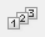

# Load combinations

### **Limit states**

<!-- /wp:heading -->

<!-- wp:paragraph -->

**Consteel 16**

<!-- /wp:paragraph -->

<!-- wp:paragraph -->

According to EN 1990, structural verifications should be executed in either ultimate (ULS) or serviceability limit states (SLS). Limit states shall be related to design situations.

<!-- /wp:paragraph -->

<!-- wp:paragraph -->

Ultimate limit states: EQU (for loss of equilibrium of the foundation), STR (for structural design), GEO (for geotechnical design), etc.

<!-- /wp:paragraph -->

<!-- wp:paragraph -->

Serviceability limit states: characteristic, frequent, quasi-permanent

<!-- /wp:paragraph -->

<!-- wp:paragraph -->

Design situations: persistent and transient (P/T), accidental (Acc), seismic

<!-- /wp:paragraph -->

<!-- wp:paragraph -->

Limit states introduced in Consteel are combination of limit states and design situations defined in the Eurocode.

<!-- /wp:paragraph -->

<!-- wp:image {"align":"center","id":43868,"width":669,"height":326,"sizeSlug":"full","linkDestination":"none","editorskit":{"devices":false,"desktop":true,"tablet":true,"mobile":true,"loggedin":true,"loggedout":true,"acf_visibility":"","acf_field":"","acf_condition":"","acf_value":"","migrated":false,"unit_test":false}} -->

- ULS STR P/T

- ULS GEO P/T

- ULS STR/GEO P/T (this is a combined limit state for cases when STR and GEO combinations would be the same)

- ULS EQU P/T

- ULS Acc

- ULS Seismic

- ULS Other

- SLS Char

- SLS Freq

- SLS Q-p

- SLS Seismic

- SLS Other

In order to cover cases not strictly under EC scope, and make sure of smooth transition of old files, there is an ‘Other’ limit state for ULS and SLS too.

When opening models saved in previous Consteel versions, the limit states will be converted as follows:

- ULS -> ULS Other

- SLS -> SLS Other

- ULS EQ (Seismic generated) -> ULS Seismic

- SLS EQ (Seismic generated) -> SLS Seismic

For manually defined load combinations, the limit states can be selected. Seismic combinations can not be defined manually, they can be created only by automatic generation. Load combinations in ULS GEO P/T and ULS EQU P/T limit states are used only for foundation design. Consequently, global design checks will not be performed in these limit states and analysis results are not transferred for connection design (except for spread footing).

### **Load combinations**

**Consteel 16**

According to the actual _[structural design code](../1_0_general-description/1_2_the-main-window.md)_, load case combinations must be created from the _[load cases](/manual/structural-loads/load-cases-and-load-groups/)_. Load combinations can be created manually by defining the combination factors manually for each load case or can be created automatically by using the **Automatic load combination generation** function of _ConSteel_.

<!-- /wp:paragraph -->

<!-- wp:paragraph -->

The load combinations can be managed in the table of load combinations which can be opened by clicking on the **Load combination** () command on the Loads tab.

<!-- /wp:paragraph -->

<!-- wp:image {"align":"right","id":43854,"sizeSlug":"full","linkDestination":"media","editorskit":{"devices":false,"desktop":true,"tablet":true,"mobile":true,"loggedin":true,"loggedout":true,"acf_visibility":"","acf_field":"","acf_condition":"","acf_value":"","migrated":false,"unit_test":false}} -->

<!-- /wp:image -->

<!-- wp:paragraph -->

At the top of the window there are commands for creating and modifying combinations. Below the commands, the table itself can be found. The first column is the name of the load combination. The name is built up from a default name and an ascending sequence number. This can be changed only one-by-one.

<!-- /wp:paragraph -->

<!-- wp:paragraph -->

The second column defines in which limit state the load combination is working. Design checks are performed only on ultimate limit state (_ULS_) load combinations, while serviceability checks are only performed on serviceability (_SLS_) combinations.

<!-- /wp:paragraph -->

<!-- wp:paragraph -->

In the further columns, there are the combination factors for each load case. It is possible to edit multiple safety factors at the same time: select safety factors and right-click over them, then enter the desired value in the pop-up window. Multiple cells can be selected using Ctrl or Shift buttons or holding down the left mouse button and moving the cursor over the cells. Cell contents can also be copied and pasted. On the table, select the cells that you want to copy and press **Ctrl+C**. Select the upper-left cell of the paste area and press **Ctrl+V**. Cell contents can be copied from MS Excel and other spreadsheet applications also.

<!-- /wp:paragraph -->

<!-- wp:paragraph -->

The yellow rows in the load combination table are the automatically generated combinations. The white ones are the ones created or edited manually.

<!-- /wp:paragraph -->

<!-- wp:paragraph -->

 **Create new load combination** - creates a new line in the table of load combinations. The combination factors have to be filled in manually.

<!-- /wp:paragraph -->

<!-- wp:paragraph -->

 **Copy load combination** - Creates a copy of the previously selected rows. The new load combinations will have sequence numbers and white background.

<!-- /wp:paragraph -->

<!-- wp:paragraph -->

 **Delete load combination** - Deletes the previously selected rows.

<!-- /wp:paragraph -->

<!-- wp:paragraph -->

 **Renumber load combination** - Change the names of all load combinations in the table to the original.

<!-- /wp:paragraph -->

<!-- wp:paragraph -->

**Automatic generation of load combination** - according to the design standard and the _[settings of load groups and load cases](../6_0_structural-loads/6_1_load-cases-and-load-groups.md#load-cases-and-load-groups)_. A new window will appear where the desired combination creating formulas can be selected. The ULS and SLS combinations are placed on two separate tabs. To create combinations according to the desired formula, select the checkbox before it. The load cases to be combined can be selected from the tree structure on the right. Press **Apply **to create the combinations.

<!-- /wp:paragraph -->

<!-- wp:image {"align":"center","id":43861,"sizeSlug":"full","linkDestination":"media","editorskit":{"devices":false,"desktop":true,"tablet":true,"mobile":true,"loggedin":true,"loggedout":true,"acf_visibility":"","acf_field":"","acf_condition":"","acf_value":"","migrated":false,"unit_test":false}} -->

<!-- /wp:image -->

<!-- wp:paragraph -->

<!-- /wp:paragraph -->

<!-- wp:paragraph -->

**Consteel 15**

<!-- /wp:paragraph -->

<!-- wp:paragraph {"align":"justify"} -->

According to the actual _[structural design code](../1_0_general-description/1_2_the-main-window.md)_, load case combinations must be created from the _[load cases](../6_0_structural-loads/6_1_load-cases-and-load-groups.md)_. Load combinations can be created manually by defining the combination factors manually for each load case or can be created automatically by using the **Automatic load combination generation** function of _ConSteel_.

<!-- /wp:paragraph -->

<!-- wp:paragraph -->

The load combinations can be managed in the table of load combinations which can be opened by clicking on the **Load combination** () command on the Loads tab.

<!-- /wp:paragraph -->

<!-- wp:image {"align":"right","id":9943,"width":510,"height":320,"sizeSlug":"full","linkDestination":"media","editorskit":{"devices":false,"desktop":true,"tablet":true,"mobile":true,"loggedin":true,"loggedout":true,"acf_visibility":"","acf_field":"","acf_condition":"","acf_value":"","migrated":false,"unit_test":false}} -->

<!-- /wp:image -->

<!-- wp:paragraph -->

At the top of the window there are commands for creating and modifying combinations. Below the commands, the table itself can be found. The first column is the name of the load combination. The name is built up from a default name and an ascending sequence number. This can be changed only one-by-one.

<!-- /wp:paragraph -->

<!-- wp:paragraph -->

The second column defines in which limit state the load combination is working. It is important to set the limit state correctly because design checks are performed only on ultimate limit state (_ULS_) load combinations, while serviceability checks are only performed on serviceability (_SLS_) combinations.

<!-- /wp:paragraph -->

<!-- wp:paragraph -->

In the further columns, there are the combination factors for each load case. It is possible to edit multiple safety factors at the same time: select safety factors and right-click over them, then enter the desired value in the pop-up window. Multiple cells can be selected using Ctrl or Shift buttons or holding down the left mouse button and moving the cursor over the cells. Cell contents can also be copied and pasted. On the table, select the cells that you want to copy and press **Ctrl+C**. Select the upper-left cell of the paste area and press **Ctrl+V**. Cell contents can be copied from MS Excel and other spreadsheet applications also.

<!-- /wp:paragraph -->

<!-- wp:paragraph -->

The yellow rows in the load combination table are the automatically generated combinations. The white ones are the ones created or edited manually.

<!-- /wp:paragraph -->

<!-- wp:paragraph -->

 **Create new load combination** - creates a new line in the table of load combinations. The combination factors have to be filled in manually.

<!-- /wp:paragraph -->

<!-- wp:paragraph -->

 **Copy load combination** - Creates a copy of the previously selected rows. The new load combinations will have sequence numbers and white background.

<!-- /wp:paragraph -->

<!-- wp:paragraph -->

 **Delete load combination** - Deletes the previously selected rows.

<!-- /wp:paragraph -->

<!-- wp:paragraph -->

 **Renumber load combination** - Change the names of all load combinations in the table to the original.

<!-- /wp:paragraph -->

<!-- wp:image {"align":"right","id":9950,"width":432,"height":326,"sizeSlug":"full","linkDestination":"media","editorskit":{"devices":false,"desktop":true,"tablet":true,"mobile":true,"loggedin":true,"loggedout":true,"acf_visibility":"","acf_field":"","acf_condition":"","acf_value":"","migrated":false,"unit_test":false}} -->

<!-- /wp:image -->

<!-- wp:paragraph -->

**Automatic generation of load combination** - according to the design standard and the _[settings of load groups and load cases](../6_0_structural-loads/6_1_load-cases-and-load-groups.md)_. A new window will appear where the desired combination creating formulas can be selected. The ULS and SLS combinations are placed on two separate tabs. To create combinations according to the desired formula, select the checkbox before it. The load cases to be combined can be selected from the tree structure on the right. Press **Apply **to create the combinations.

<!-- /wp:paragraph -->

<!-- wp:paragraph -->

A huge number of load combinations needs a long period of time to be calculated in the analysis. So it is good to keep the number of the load combinations to the minimum. If the automatic load combination feature is used, it is advisable to filter the unnecessary load cases before the generation. A ticked checkbox means, that the load case will be used for the load combination generation.

<!-- /wp:paragraph -->

<!-- wp:paragraph {"align":"justify"} -->

After the generation of load combinations, deletion of those rows that cannot be relevant is also possible to minimize calculation time.

<!-- /wp:paragraph -->

<!-- wp:paragraph -->

<!-- /wp:paragraph -->

<!-- wp:heading {"level":3,"editorskit":{"devices":false,"desktop":true,"tablet":true,"mobile":true,"loggedin":true,"loggedout":true,"acf_visibility":"","acf_field":"","acf_condition":"","acf_value":"","migrated":false,"unit_test":false}} -->

### Load combination sets

<!-- /wp:heading -->

<!-- wp:paragraph -->

From Consteel 16, it is possible to create load combination sets for different purposes like preliminary design, structural design, connection design etc. A load combination set is a list of load combinations selected in any way. The goal is to reduce the number of load combinations by selecting the most relevant ones for the actual design phase. Calculating only the relevant load combinations will also efficiently reduce calculation time. The **Load combination sets** () function is available either from the main window **Load combination sets** tab or from **Analysis parameters** (…).

<!-- /wp:paragraph -->

<!-- wp:paragraph {"textColor":"consteel-blue"} -->

To use the load combination set for the analysis, select it from the drop-down menu on **Analysis parameters - [Subpage of load combinations](../8_0_structural-analysis/8_3_analysis-settings.md#subpage-of-load-combinations)**.

<!-- /wp:paragraph -->

<!-- wp:image {"align":"center","id":47176,"width":378,"height":76,"sizeSlug":"full","linkDestination":"none","editorskit":{"devices":false,"desktop":true,"tablet":true,"mobile":true,"loggedin":true,"loggedout":true,"acf_visibility":"","acf_field":"","acf_condition":"","acf_value":"","migrated":false,"unit_test":false}} -->

<!-- /wp:image -->

<!-- wp:image {"align":"center","id":47184,"width":583,"height":240,"sizeSlug":"full","linkDestination":"none","editorskit":{"devices":false,"desktop":true,"tablet":true,"mobile":true,"loggedin":true,"loggedout":true,"acf_visibility":"","acf_field":"","acf_condition":"","acf_value":"","migrated":false,"unit_test":false}} -->

<!-- /wp:image -->

<!-- wp:paragraph -->

When starting the function for the first time, an empty table appears.

<!-- /wp:paragraph -->

<!-- wp:image {"align":"center","id":47192,"sizeSlug":"full","linkDestination":"none","editorskit":{"devices":false,"desktop":true,"tablet":true,"mobile":true,"loggedin":true,"loggedout":true,"acf_visibility":"","acf_field":"","acf_condition":"","acf_value":"","migrated":false,"unit_test":false}} -->

<!-- /wp:image -->

<!-- wp:paragraph -->

When there are already sets created, the table summarizes them. Sets are listed with their most relevant information (number of load combinations, applied rules and included limit states). Rows can be edited or deleted one-by-one with the pencil and trash bin icon at the end of the row. Double-clicking on the row will also open the edit dialog.

<!-- /wp:paragraph -->

<!-- wp:image {"align":"center","id":47200,"sizeSlug":"full","linkDestination":"none","editorskit":{"devices":false,"desktop":true,"tablet":true,"mobile":true,"loggedin":true,"loggedout":true,"acf_visibility":"","acf_field":"","acf_condition":"","acf_value":"","migrated":false,"unit_test":false}} -->

<!-- /wp:image -->

<!-- wp:paragraph -->

Click on + Create new to define a new set. It will open the **Load combination set definition** dialog.

<!-- /wp:paragraph -->

<!-- wp:paragraph -->

With Create from selected, a new set can be created based on the selected one. For the new set, a different name must be given.

<!-- /wp:paragraph -->

<!-- wp:paragraph -->

**Load combination set definition**

<!-- /wp:paragraph -->

<!-- wp:paragraph -->

All existing load combinations are listed here. The goal is to create reduced lists aka sets of load combinations for different design purposes. The load combinations which are checked in are selected for the actual set. Selection can be done in several different ways: filter by limit states, filter by load cases, applying predefined rules and by manual selection.

<!-- /wp:paragraph -->

<!-- wp:image {"align":"center","id":47208,"sizeSlug":"full","linkDestination":"none","editorskit":{"devices":false,"desktop":true,"tablet":true,"mobile":true,"loggedin":true,"loggedout":true,"acf_visibility":"","acf_field":"","acf_condition":"","acf_value":"","migrated":false,"unit_test":false}} -->

<!-- /wp:image -->

<!-- wp:paragraph -->

\#1 Set name: name of the set can be defined here. Default name is automatically filled.

<!-- /wp:paragraph -->

<!-- wp:paragraph -->

\#2 Filtering options: by limit states or by load cases. The buttons are also dynamic indicators of the selected load combinations.

<!-- /wp:paragraph -->

<!-- wp:paragraph -->

\#3 Apply rules: Load combination filter rule definition dialog can be opened here by clicking on the Rules button. Previously applied rules are also listed in a non-editable textbox.

<!-- /wp:paragraph -->

<!-- wp:paragraph -->

\#4 Table of load combinations: all the load combinations are listed here with the representation of limit state and the description of the combination. The load combinations cannot be edited here.

<!-- /wp:paragraph -->

<!-- wp:paragraph -->

\-In the first column of the table, the checkboxes show if the load combination is selected.

<!-- /wp:paragraph -->

<!-- wp:paragraph -->

\-The second column contains the name of the load combinations, and the header indicates the number of selected combinations over the number of all.

<!-- /wp:paragraph -->

<!-- wp:paragraph -->

\-Third column contains the limit states of the load combinations, and the header indicates the number of limit states whose combinations are all selected.

<!-- /wp:paragraph -->

<!-- wp:paragraph -->

\-Fourth column shows the description of the load combinations for information. If the description is too long, horizontal scroll bar appears in the row.

<!-- /wp:paragraph -->

<!-- wp:paragraph -->

\-In the upper right corner of the table, the eye-shaped icon regulates the visibility of the load combinations. The two options are: show all and show only selected

<!-- /wp:paragraph -->

<!-- wp:paragraph -->

\#5 Cancel, Save as, Save buttons:

<!-- /wp:paragraph -->

<!-- wp:paragraph -->

\-Save button saves the list of the load combinations which are selected with the name written in the Set name cell. The set will appear in the table on the Load combination sets dialog.

<!-- /wp:paragraph -->

<!-- wp:paragraph -->

\-Save as button is to be used when creating a new set from an existing one. A name which has not been used before is to be given. The set will appear in the table on the **Load combination sets** dialog.

<!-- /wp:paragraph -->

<!-- wp:paragraph -->

\-Cancel closes the dialog without saving.

<!-- /wp:paragraph -->

<!-- wp:paragraph -->

**Filter by limit states**

<!-- /wp:paragraph -->

<!-- wp:paragraph -->

All the limit states, which have any load combinations assigned, are listed here. The checkboxes have 3 states:

<!-- /wp:paragraph -->

<!-- wp:paragraph -->

checked: all load combinations with the given limit state are checked in.

<!-- /wp:paragraph -->

<!-- wp:paragraph -->

middle: at least one of the load combinations with the given limit state are checked in but not all. Not possible to set directly.

<!-- /wp:paragraph -->

<!-- wp:paragraph -->

unchecked: no load combinations with the given limit state are checked in

<!-- /wp:paragraph -->

<!-- wp:paragraph -->

The checkboxes are indicators of the content of the list below and also the tool to edit the content.

<!-- /wp:paragraph -->

<!-- wp:image {"align":"center","id":47240,"width":821,"height":660,"sizeSlug":"full","linkDestination":"none","editorskit":{"devices":false,"desktop":true,"tablet":true,"mobile":true,"loggedin":true,"loggedout":true,"acf_visibility":"","acf_field":"","acf_condition":"","acf_value":"","migrated":false,"unit_test":false}} -->

<!-- /wp:image -->

<!-- wp:paragraph -->

**Filter by load cases**

<!-- /wp:paragraph -->

<!-- wp:paragraph -->

All the load cases, which are used in any load combination, are listed here. The checkboxes have 3 states:

<!-- /wp:paragraph -->

<!-- wp:paragraph -->

checked: all load combinations containing the given load case are checked in

<!-- /wp:paragraph -->

<!-- wp:paragraph -->

middle: at least one of the load combinations containing the given load case are checked in but not all. Not possible to set directly.

<!-- /wp:paragraph -->

<!-- wp:paragraph -->

unchecked: no load combinations containing the given load case are checked in

<!-- /wp:paragraph -->

<!-- wp:paragraph -->

The checkboxes are indicators of the content of the list below and also the tool to edit the content.

<!-- /wp:paragraph -->

<!-- wp:paragraph -->

**Filter by rules**

<!-- /wp:paragraph -->

<!-- wp:paragraph {"textColor":"consteel-blue"} -->

For definition of the rules, see **_Chapter [Rules](#rules)_**.

<!-- /wp:paragraph -->

<!-- wp:paragraph -->

Filter by rules is a selection of the load combinations based on analysis and design results.

<!-- /wp:paragraph -->

<!-- wp:image {"align":"center","id":47248,"sizeSlug":"full","linkDestination":"none","editorskit":{"devices":false,"desktop":true,"tablet":true,"mobile":true,"loggedin":true,"loggedout":true,"acf_visibility":"","acf_field":"","acf_condition":"","acf_value":"","migrated":false,"unit_test":false}} -->

<!-- /wp:image -->

<!-- wp:paragraph -->

Rules can be applied by checking in the checkbox in the first column of the summary table, selecting the model portion to be examined and clicking Apply. The filter will be applied based on the actual results and on the selected load combinations. It is a one-time operation which results a list of load combinations. This list can be saved on the **Load combination set definition** dialog. The list of combinations will not be automatically updated when the calculation results change.

<!-- /wp:paragraph -->

<!-- wp:paragraph -->

**Rules can only be applied on calculation results. If the result necessary for the applied rule is not existent in some load combinations, then those load combinations will be turned off.**

<!-- /wp:paragraph -->

<!-- wp:paragraph {"align":"justify"} -->

When a rule is applied, all the load combinations which are selected on the **Load combination set definition** dialog are examined at every position the rule indicates, then the load combinations which corresponds to the rule are selected (remain checked) and those which do not, become unchecked. Consequently, the number of selected load combinations before filtering by rules is always greater than or equal to the number after filter. Filter by rules will never select a load combination which was not selected on the **Load combination set definition** dialog before the filter.

<!-- /wp:paragraph -->

<!-- wp:paragraph {"align":"justify"} -->

Rules can be applied to model portions. It means that only the results of the nodes which are included in the selected model portion are examined against the rule’s limitations.

<!-- /wp:paragraph -->

<!-- wp:paragraph -->

When applying more than one rules together, the lists of selected combinations is the sum of the lists that would have been created separately.

<!-- /wp:paragraph -->

<!-- wp:image {"align":"left","id":47266,"width":156,"height":166,"sizeSlug":"full","linkDestination":"none","editorskit":{"devices":false,"desktop":true,"tablet":true,"mobile":true,"loggedin":true,"loggedout":true,"acf_visibility":"","acf_field":"","acf_condition":"","acf_value":"","migrated":false,"unit_test":false}} -->

<!-- /wp:image -->

<!-- wp:paragraph -->

The result of filtering by two rules will differ when applying the rules at the same time or one after another because the list of combinations that the filters are applied on are different.

<!-- /wp:paragraph -->

<!-- wp:paragraph -->

If there are more than one load combinations with the exact same calculation result and this result is the basis of the filter, then all load combinations will be selected. Therefore, elements loaded only with self-weight can prevent effective filtering. Using portions excluding these elements for the filter can be a solution for this.

<!-- /wp:paragraph -->

<!-- wp:paragraph -->

<!-- /wp:paragraph -->

<!-- wp:paragraph -->

**Manual selection**

<!-- /wp:paragraph -->

<!-- wp:paragraph -->

Manual selection of the load combinations is possible by clicking on the checkbox of the combination in the first column of the table.

<!-- /wp:paragraph -->

<!-- wp:paragraph -->

**Interaction of the filters**

<!-- /wp:paragraph -->

<!-- wp:paragraph -->

Filtering by limit states and by load cases are handled together. The 3-state checkboxes affect each other as they are not only used for selection but also for indication of the content. They can be manually set only to checked or unchecked. Middle state will only appear when adjusting the other filter.

<!-- /wp:paragraph -->

<!-- wp:paragraph -->

See this example below:

<!-- /wp:paragraph -->

<!-- wp:paragraph -->

First, all combinations are checked in. All checkboxes are set to Checked.

<!-- /wp:paragraph -->

<!-- wp:columns -->

<!-- wp:column -->

<!-- wp:image {"id":47275,"sizeSlug":"full","linkDestination":"none"} -->

<!-- /wp:image -->

<!-- /wp:column -->

<!-- wp:column -->

<!-- wp:image {"id":47283,"sizeSlug":"full","linkDestination":"none"} -->

<!-- /wp:image -->

<!-- /wp:column -->

<!-- /wp:columns -->

<!-- wp:paragraph -->

If ULS Acc limit state is set to Unchecked,

<!-- /wp:paragraph -->

<!-- wp:image {"align":"center","id":47291,"width":500,"height":306,"sizeSlug":"full","linkDestination":"none","editorskit":{"devices":false,"desktop":true,"tablet":true,"mobile":true,"loggedin":true,"loggedout":true,"acf_visibility":"","acf_field":"","acf_condition":"","acf_value":"","migrated":false,"unit_test":false}} -->

<!-- /wp:image -->

<!-- wp:paragraph -->

the AccSnow1 load case gets unchecked. Dead load and Wind1, 2 load cases are changed to middle state as they are present in the accidental load combinations, which are turned off, but other load combinations also contain these load cases.

<!-- /wp:paragraph -->

<!-- wp:image {"align":"center","id":47299,"width":524,"height":317,"sizeSlug":"full","linkDestination":"none","editorskit":{"devices":false,"desktop":true,"tablet":true,"mobile":true,"loggedin":true,"loggedout":true,"acf_visibility":"","acf_field":"","acf_condition":"","acf_value":"","migrated":false,"unit_test":false}} -->

<!-- /wp:image -->

<!-- wp:paragraph -->

Manual selection is possible in addition to the above mentioned and it always affects the 3-state checkboxes:

<!-- /wp:paragraph -->

<!-- wp:paragraph -->

Following the example above, Lc-10 is selected manually, ULS Acc limit state is set to middle state.

<!-- /wp:paragraph -->

<!-- wp:image {"align":"center","id":47307,"width":556,"height":290,"sizeSlug":"full","linkDestination":"none","editorskit":{"devices":false,"desktop":true,"tablet":true,"mobile":true,"loggedin":true,"loggedout":true,"acf_visibility":"","acf_field":"","acf_condition":"","acf_value":"","migrated":false,"unit_test":false}} -->

<!-- /wp:image -->

<!-- wp:paragraph -->

Filtering by limit states, by load cases and manual selection are preselection for filter by rules. Rules will only be applied on load combinations which are checked in and have the necessary calculation results.

<!-- /wp:paragraph -->

<!-- wp:paragraph -->

Manual selection can also be done after the other filters. Selecting and deseclecting items is both possible.

<!-- /wp:paragraph -->

<!-- wp:paragraph -->

<!-- /wp:paragraph -->

<!-- wp:heading {"level":3,"editorskit":{"devices":false,"desktop":true,"tablet":true,"mobile":true,"loggedin":true,"loggedout":true,"acf_visibility":"","acf_field":"","acf_condition":"","acf_value":"","migrated":false,"unit_test":false}} -->

### Rules

<!-- /wp:heading -->

<!-- wp:paragraph -->

Rules can be edited and applied through **Rule definition for load combination filter** dialog. The dialog is available only from the **Load combination set definition** dialog by clicking on the **Rules** button.

<!-- /wp:paragraph -->

<!-- wp:paragraph -->

There are 3 types of rules: analysis, buckling and design rules. They appear different tabs of the dialog.

<!-- /wp:paragraph -->

<!-- wp:image {"align":"center","id":47317,"sizeSlug":"full","linkDestination":"none","editorskit":{"devices":false,"desktop":true,"tablet":true,"mobile":true,"loggedin":true,"loggedout":true,"acf_visibility":"","acf_field":"","acf_condition":"","acf_value":"","migrated":false,"unit_test":false}} -->

<!-- /wp:image -->

<!-- wp:paragraph -->

In new models, there are default rules to help getting started. Models saved in previous versions do not contain the default rules.

<!-- /wp:paragraph -->

<!-- wp:paragraph {"align":"justify"} -->

New rules can be created with the + Create new button or if a rule is selected, with the +Create from selected button. The rule to be created always corresponds to the tab the button was clicked on. E.g. an analysis rule can only be created on the Analysis rules tab of the dialog.

<!-- /wp:paragraph -->

<!-- wp:paragraph {"align":"justify"} -->

Rows can be edited or deleted one-by-one with the pencil and trash bin icon at the end of the row. Double-clicking on the row will also open the rule definition dialog.

<!-- /wp:paragraph -->

<!-- wp:paragraph -->

Common functions for all rule definition dialogs

<!-- /wp:paragraph -->

<!-- wp:paragraph -->

\-Save button saves the rule with the name written in the Rule name cell. The rule will appear in the table on the **Rule definition for load combination filter** dialog.

<!-- /wp:paragraph -->

<!-- wp:paragraph -->

\-Save as button is to be used when creating a new set from an existing one. A name which has not been used before is to be given. The rule will appear in the table on the **Rule definition for load combination filter** dialog.

<!-- /wp:paragraph -->

<!-- wp:paragraph -->

\-Cancel closes the dialog without saving.

<!-- /wp:paragraph -->

<!-- wp:paragraph -->

\-Save location: The rule can be saved either in the model or to the computer. When saved to the computer, it can be used for other models too, but it will not be visible in case the model is opened on another computer.

<!-- /wp:paragraph -->

<!-- wp:paragraph -->

**Analysis rule**

<!-- /wp:paragraph -->

<!-- wp:paragraph -->

With analysis rules, load combinations can be selected based on deformations or internal forces. Deformations are checked in SLS combinations, internal forces are checked in ULS combinations only.

<!-- /wp:paragraph -->

<!-- wp:columns -->

<!-- wp:column {"width":"60%"} -->

<!-- wp:paragraph -->

\-_Position_: defines the position where the analysis results should be considered, every node or only at member ends (typically for connection design)

<!-- /wp:paragraph -->

<!-- wp:paragraph -->

\-_Limitations for analysis rules:_

- **_Maximum:_** to select the combinations which cause the maximum deformation or internal force (whichever is chosen at Result type) at all of the positions.

- **_More than % of maximum:_** to select the combinations as ’Maximum’ plus those which cause deformation or internal force that is more than the given percentage of the maximum. E.g. at a certain point Mymax=50kNm, Limitation= More than 90% of maximum. This rule will select all the load combinations which cause My=45-50kNm.

**Buckling rule**

_-Buckling rules_: It is possible to select those ULS load combinations where the elastic critical load factor (first buckling eigenvalue) is less than the given value.

**Design rule**

With design rules, load combinations can be selected based on utility ratios. Utilizations are available from several design checks: dominant results and detailed verifications for steel elements such as general elastic cross-section check, pure resistances, interactions and global stability. Only ULS combinations can be filtered with design rules.

Design rules are checked for every FE point of the model portion.

\- _Utilization type:_

- **_Maximum of dominant results_: **it contains utility ratios of only one dominant load combination at every point, exactly the same as the dominant result table on Global checks tab. Consequently, there is only one option for limitation, ’More than’ the given utility ratio (%).

* **_Steel – Dominant results_**: it contains utility ratios of the dominant check at every point, in all load combinations. Limitations:

  - **_Maximum_**: to select the combinations which cause the maximum utilization. It can be the same as Maximum of dominant results, except if there are combinations where the utilization is the same and it is maximal.

  - **_More than % of maximum_:** to select the combinations as in ’Maximum’ plus those which cause utilization that is more than the given percentage of the maximum. E.g. at a certain point max utility ratio is 80%, Limitation= More than 90% of maximum. This rule will select all the load combinations which cause utility ratios between 0,9\*80=72% and 80%.

  - **_More than_**: to select the combinations which cause utilization more than the defined value at any point.

- **_Steel – General elastic cross-section resistance, Pure resistances….Global stability resistance: _**they contain the ratios of the concrete checks in every load combination at every point.

**_Steel – Dominant results_** are produced the same way as it is done on **Global checks** tab. Except the handling of the equal maximal ratios. On **Global checks** only one maximal is shown, in the filter all is selected.

The dominant check is not always the check which gives the maximal ratio: e.g. if plastic interaction formulas are valid, those results will be dominant over general elastic cross-section check results, although the latter are higher. If there are only cross-section check results available, the **_Steel – Dominant results_** will consider only those.