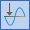
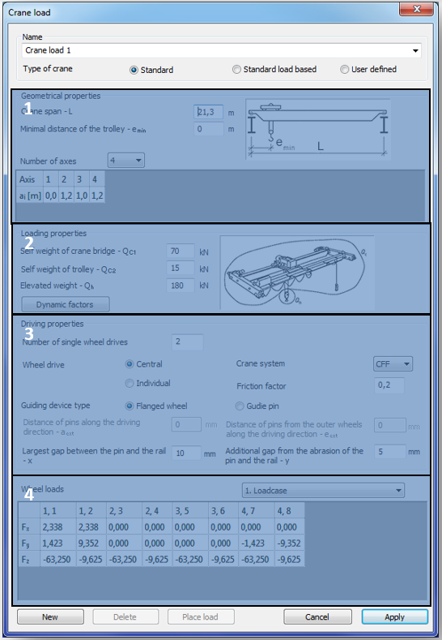
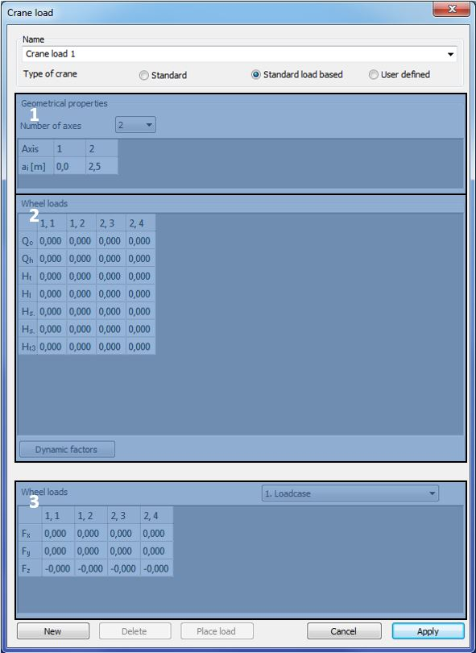
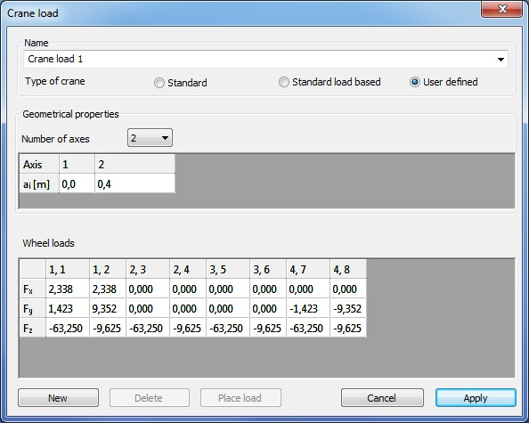
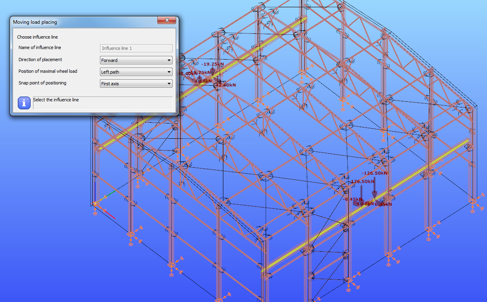
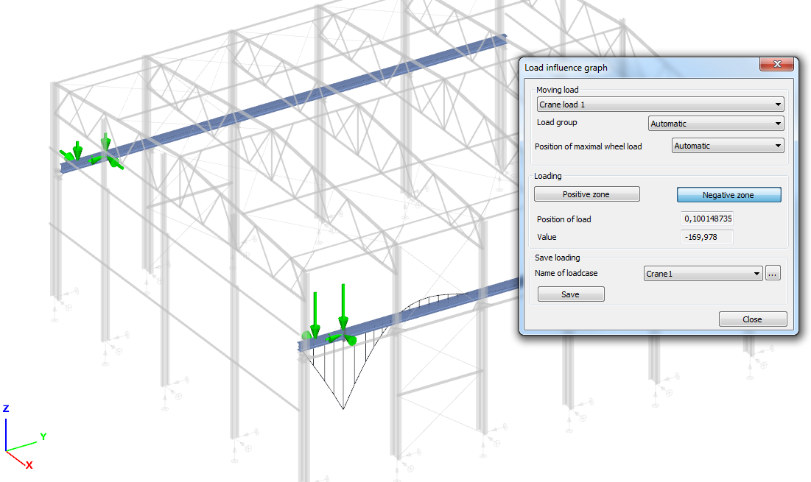
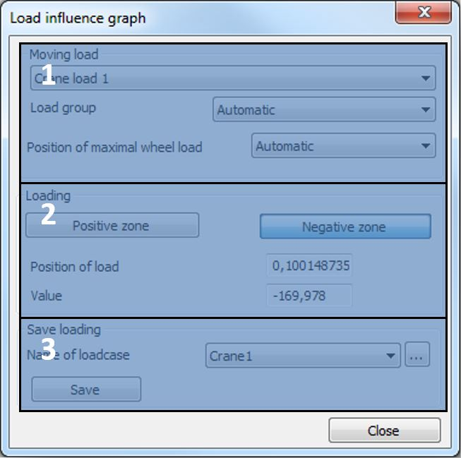
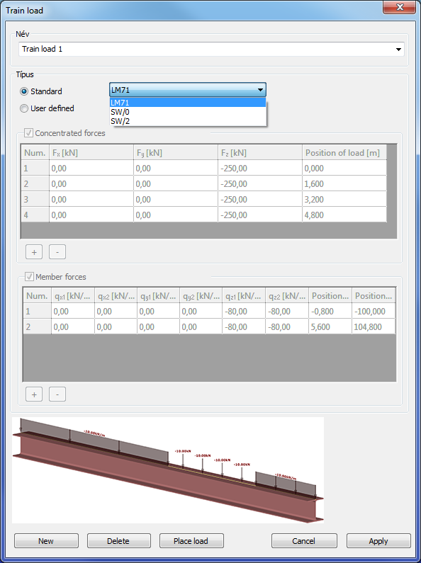

# Moving Load

EuroCode based or user defined crane and train load can be created and placed on the model manually or by the loading of an influence graph.

<!-- /wp:paragraph -->

<!-- wp:image {"align":"center","sizeSlug":"large","linkDestination":"media","className":"caption-align-center","captionAlignment":"center"} -->

<!-- /wp:image -->

<!-- wp:heading {"level":3} -->

### Influence line ()

<!-- /wp:heading -->

<!-- wp:image {"align":"right","id":10270,"width":426,"height":223,"sizeSlug":"full","linkDestination":"media"} -->

<!-- /wp:image -->

<!-- wp:paragraph -->

To place a moving load on the model or to calculate an influence graph, as a first step it is necessary to create **Influence lines** on those members where the load will be placed or moved.

<!-- /wp:paragraph -->

<!-- wp:paragraph -->

Members have to be in one straight line and have to be connected.

<!-- /wp:paragraph -->

<!-- wp:paragraph -->

Influence line can be defined with **selection** () or **drawing** ().

<!-- /wp:paragraph -->

<!-- wp:paragraph -->

In the first case, the **_Influence line_** will be applied onto all of the members selected with the left mouse button. The selection has to be closed with the click of the right mouse button.

<!-- /wp:paragraph -->

<!-- wp:paragraph -->

In the case of drawing, the start and the endpoint of the line must be picked. The **Influence line** will be applied to all of the members which are lying under the drawing line.

<!-- /wp:paragraph -->

<!-- wp:paragraph -->

Double **Influence line** can be created by selecting the check-box in the above dialogue window.

<!-- /wp:paragraph -->

<!-- wp:heading {"level":3} -->

### Influence graph ()

<!-- /wp:heading -->

<!-- wp:image {"align":"right","id":10277,"width":353,"height":588,"sizeSlug":"full","linkDestination":"media"} -->

<!-- /wp:image -->

<!-- wp:paragraph -->

To run _Influence graph_ analysis, it is necessary to set the **Influence graph** parameters.

<!-- /wp:paragraph -->

<!-- wp:paragraph -->

(#1) As the first step, one of the previously created **Influence lines** has to be selected from the dropdown menu. New Influence line can be created also here with the three-dot button ().

<!-- /wp:paragraph -->

<!-- wp:paragraph -->

(#2) The next step is to determine a point as the place of the investigation with the black arrow button (). This point can be anywhere in the model even outside of the influence line. _(In the current version of Consteel, the only possibility is to select any cross-section of the model as a place of the investigation. The other two options shown light grey require further development.)_

<!-- /wp:paragraph -->

<!-- wp:paragraph -->

Three types of influence graph can be analyzed (#3):

<!-- /wp:paragraph -->

<!-- wp:list -->

- Displacement

  - Displacement in local x, y and z axis

  - Rotation around local x, y and z axis

- Internal force

  - Major (My) and minor (Mz) axis bending moment

  - Normal force (N)

  - Major (Vy) and minor (Vz) axis shear

  - Torsion (T)

  - Bimoment (B)

- Reaction force

  - Reaction force in the global X, Y and Z axis

  - Reaction moment around the global X, Y and Z axis

<!-- /wp:list -->

<!-- wp:paragraph -->

As a last step the direction of the unit load has to be chosen. Simultaneously more direction can be chosen, but separate graph will belong to for each directions.

<!-- /wp:paragraph -->

<!-- wp:paragraph -->

By clicking on the **Apply** button, the influence graph setting is created.

<!-- /wp:paragraph -->

<!-- wp:paragraph -->

With the **New** button another influence graph setting can be created.

<!-- /wp:paragraph -->

<!-- wp:heading {"level":4} -->

#### Managing influence graphs

<!-- /wp:heading -->

<!-- wp:paragraph -->

Previously created influence graphs can be managed in the table part of the dialog (#4). All of the previously created influence graphs can be seen and selected.

<!-- /wp:paragraph -->

<!-- wp:paragraph -->

After the selection, all parameters can be modified with the **Apply** button.

<!-- /wp:paragraph -->

<!-- wp:paragraph -->

The selected influence graph(s) can be deleted by pressing **Delete** button.

<!-- /wp:paragraph -->

<!-- wp:paragraph -->

With the checkboxes in the _Calculation_ column, influence graph(s) can be switched on/off for calculation.

<!-- /wp:paragraph -->

<!-- wp:heading {"level":4} -->

#### Analyze influence graph

<!-- /wp:heading -->

<!-- wp:paragraph -->

To run Influence graph analysis see **[Structural analysis](../8_0_structural-analysis/8_4_analysis-types.md)**!

<!-- /wp:paragraph -->

<!-- wp:heading {"level":3} -->

### Crane load ()

<!-- /wp:heading -->

<!-- wp:paragraph -->

Three types of overhead traveling crane load can be defined:

<!-- /wp:paragraph -->

<!-- wp:list -->

- Standard: fully EN 1991-3 based
- Standard load based: EN 1991-3 standard defined wheel loads have to set. Group of loads are created by _ConSteel_
- User defined: direct wheel loads have to be set for each wheel.

<!-- /wp:list -->

<!-- wp:image {"align":"center","id":10289,"sizeSlug":"large","linkDestination":"media"} -->

<!-- /wp:image -->

<!-- wp:heading {"level":4} -->

#### Standard crane load

<!-- /wp:heading -->

<!-- wp:image {"align":"right","id":10295,"width":410,"height":592,"sizeSlug":"full","linkDestination":"none"} -->

<!-- /wp:image -->

<!-- wp:paragraph -->

For the fully EN 1993-3 based standard crane load, the geometrical parameters (#1), loadings (#2), and the driving properties (#3) have to be set. The wheel loads are automatically calculated.

<!-- /wp:paragraph -->

<!-- wp:paragraph -->

The following _geometrical properties_ can be set in the topmost part of the dialogue window (#1):

<!-- /wp:paragraph -->

<!-- wp:list -->

- Crane span – L \[m]: span of the crane bridge
- Minimal distance of the trolley – emin \[m]: minimum distance between the trolley and the crane girder
- Number of axes: Numbers of the axes of the crane bridge have to be set from the dropdown menu. The minimum number of the axis is 2, maximum is 10. Distances between the axes also have to be set.

<!-- /wp:list -->

<!-- wp:paragraph -->

In the part of _loading properties_ (#2), the self-weight of the crane bridge (Qc1) and the trolley (Qc2) and the elevated weight (Qh) have to be set. By pressing the Dynamic factors button, the default value of the factors can be seen. Factors can be modified manually.

<!-- /wp:paragraph -->

<!-- wp:paragraph -->

The _driving properties_ have to be set in the next part(#3) :

<!-- /wp:paragraph -->

<!-- wp:list -->

- Wheel drive: number of the driven wheels and the system of the wheel drive (central or individual)
- Crane system: to select the proper EuroCode care system, please see the definition of the crane systems in the relevant part of the EN 1991-3
- Friction factor: friction factor between the rail and the wheels
- Guiding device: two types of guiding devices can be chosen, flanged wheels and guide pins. According to the selection, the necessary geometrical parameters of the guiding device have to be set

<!-- /wp:list -->

<!-- wp:paragraph -->

The automatically calculated wheel loads for each load case can be seen in the table (#4). The load cases can be changed with the dropdown menu.

<!-- /wp:paragraph -->

<!-- wp:image {"align":"right","id":10301,"width":443,"height":608,"sizeSlug":"full","linkDestination":"none"} -->

<!-- /wp:image -->

<!-- wp:paragraph -->

In the name of the wheels, the first prefix means the number of the axis; the second means the number of the wheel.

<!-- /wp:paragraph -->

<!-- wp:heading {"level":4} -->

#### Standard load based crane load

<!-- /wp:heading -->

<!-- wp:paragraph -->

For the standard load-based crane load, the numbers of the axis and the standard wheel loads have to be set.

<!-- /wp:paragraph -->

<!-- wp:paragraph -->

In the _geometrical properties_ field (#1) the number of the axes of the crane bridge has to be set from the dropdown menu. The minimum number of the axis is 2, maximum is 10. Distances between the axes also have to be set.

<!-- /wp:paragraph -->

<!-- wp:paragraph -->

In the _Wheel loads_ field (#2) the Eurocode-based wheel loads have to be set for each wheel. By pressing the **Dynamic factors** button, the default value of the factors can be seen. Factors can be modified manually.

<!-- /wp:paragraph -->

<!-- wp:paragraph -->

The automatically calculated wheel loads for each load case can be seen in the lowest table (#3). The load cases can be changed with the dropdown menu.

<!-- /wp:paragraph -->

<!-- wp:paragraph -->

In the name of the wheels, the first prefix means the number of the axis; the second means the number of the wheel.

<!-- /wp:paragraph -->

<!-- wp:heading {"level":4} -->

#### User defined crane load

<!-- /wp:heading -->

<!-- wp:paragraph -->

For the user defined crane load the following parameters have to be set:

<!-- /wp:paragraph -->

<!-- wp:image {"align":"right","id":10307,"width":297,"height":238,"sizeSlug":"full","linkDestination":"none"} -->

<!-- /wp:image -->

<!-- wp:list -->

- The numbers of the axes of the crane bridge have to be set from the dropdown menu. The minimum number of the axis is 2, maximum is 10. Distances between the axes also have to be set.
- Three directions (Fx, Fy, and Fz) of the wheel loads have to be set for each wheel

<!-- /wp:list -->

<!-- wp:heading {"level":4} -->

#### Placing the crane load

<!-- /wp:heading -->

<!-- wp:paragraph -->

There is two ways to place crane load on the model, but before placing the defined crane load has to be saved with the **Apply** button.

<!-- /wp:paragraph -->

<!-- wp:paragraph {"style":{"typography":{"fontSize":18}}} -->

**Placing crane load manually**

<!-- /wp:paragraph -->

<!-- wp:paragraph -->

By pressing the **Place load** button on the bottom of the **Crane load** dialog, the selected load case can be placed manually on the model. _(The Crane load dialogue window has to be closed manually after clicking on the Place load button!)_

<!-- /wp:paragraph -->

<!-- wp:image {"align":"center","id":10313,"width":604,"height":376,"sizeSlug":"full","linkDestination":"none"} -->

<!-- /wp:image -->

<!-- wp:paragraph -->

First an influence line need to be chosen with the left mouse button. Then the loads have to be placed along selected influence line by pressing the left mouse button.

<!-- /wp:paragraph -->

<!-- wp:paragraph -->

Direction of the placement, position of the maximal wheel load and the snap point of the positioning can be selected from the dropdown menus.

<!-- /wp:paragraph -->

<!-- wp:image {"align":"right","id":10319,"width":551,"height":328,"sizeSlug":"full","linkDestination":"none"} -->

<!-- /wp:image -->

<!-- wp:paragraph {"style":{"typography":{"fontSize":18}}} -->

**Placing crane load by loading influence graph**

<!-- /wp:paragraph -->

<!-- wp:paragraph -->

Crane load can be placed on the model by loading an influence graph.

<!-- /wp:paragraph -->

<!-- wp:paragraph -->

To analyze an influence graph please see Chapter 6.6.2 and Chapter 8.

<!-- /wp:paragraph -->

<!-- wp:paragraph -->

To place a crane load by loading an influence graph, please select the _Influence graph_ analysis type from the first dropdown menu on the **Analysis** tab and click with the right mouse button on the graphical area and select **Load influence** line from the appeared menu.

<!-- /wp:paragraph -->

<!-- wp:image {"align":"left","id":10325,"width":327,"height":325,"sizeSlug":"full","linkDestination":"none"} -->

<!-- /wp:image -->

<!-- wp:paragraph -->

In the _Moving load_ field (#1) the loading properties can be set:

<!-- /wp:paragraph -->

<!-- wp:list {"editorskit":{"indent":40,"devices":false,"desktop":true,"tablet":true,"mobile":true,"loggedin":true,"loggedout":true,"acf_visibility":"","acf_field":"","acf_condition":"","acf_value":"","migrated":false,"unit_test":false}} -->

- From the first dropdown menu, one of the previously created crane load can be selected to place
- Load group: in the case of standard or standard load base crane, Eurocode load groups are automatically created. Influence graph can be loaded by the selected load groups or by the dominant if the _Automatic_ function is selected from the dropdown menu
- Position of maximal wheel load: vertical wheel loads depend on the position of the trolley. Maximum vertical wheel load could be on the left or the right path, or the dominant position can be automatically detected if the Automatic function is selected from the dropdown menu

<!-- /wp:list -->

<!-- wp:paragraph -->

With the **Positive zone** and **Negative zone** buttons in the _Loading field_ (#2), the influence graph can be loaded. If the **Positive zone** button is used then the loading gives the maximum positive value in the section, if the Negative zone button is used then the loading gives the maximum negative value in the section. The position of the load and the current value in the section appear.

<!-- /wp:paragraph -->

<!-- wp:paragraph -->

The placed load can be saved to a load case by the function of the Save loading field (#3). With the dropdown menu, one of the previously created load cases can be selected to save, or with the three-dot button, a new one can be created. With the Save button, the placed load can be saved to the selected load case.

<!-- /wp:paragraph -->

<!-- wp:image {"align":"right","id":10331,"width":446,"height":596,"sizeSlug":"full","linkDestination":"none"} -->

<!-- /wp:image -->

<!-- wp:heading {"level":3} -->

### Train load ()

<!-- /wp:heading -->

<!-- wp:paragraph -->

Two types of train load can be created and placed on the model.

<!-- /wp:paragraph -->

<!-- wp:paragraph {"style":{"typography":{"fontSize":18}}} -->

**Standard train load**

<!-- /wp:paragraph -->

<!-- wp:paragraph -->

From the dropdown menu, three types of Eurocode-defined train load can be selected. In the tables, the properties of the selected one can be seen.

<!-- /wp:paragraph -->

<!-- wp:paragraph {"style":{"typography":{"fontSize":18}}} -->

**User defined train load**

<!-- /wp:paragraph -->

<!-- wp:paragraph -->

In the case of _User defined_ train load, the tables of concentrated and member forces are editable. With the plus () and minus () buttons a new row can be added to the table and the selected row can be removed from the table.

<!-- /wp:paragraph -->

<!-- wp:paragraph -->

In the case of concentrate load the three directions and the position of the load can be set.

<!-- /wp:paragraph -->

<!-- wp:paragraph -->

In the case of line load, the intensity of load can be set on the start and the endpoint in the three directions, and the position of the endpoints can be set.

<!-- /wp:paragraph -->

<!-- wp:paragraph -->

The placing of the train load is the same as for the crane load. Please see Chapter 6.6.3.4.

<!-- /wp:paragraph -->
