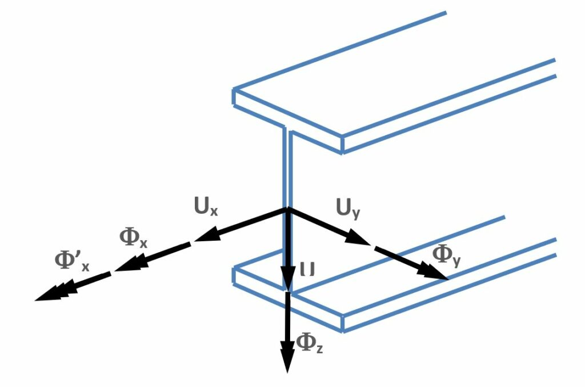
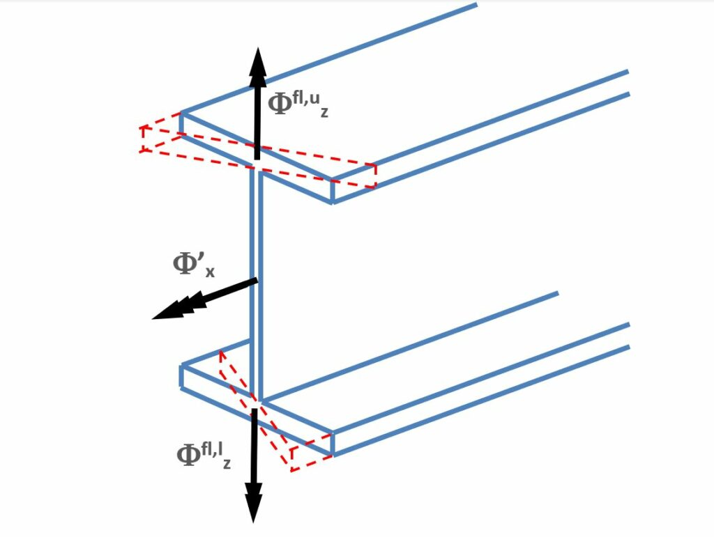

# Finite Elements

### Basics

<!-- /wp:heading -->

<!-- wp:paragraph -->

The mechanical performance of the calculated model is always highly influenced and limited by the applied finite element type. The considered displacements, forces, shape functions, and second-order effects within the finite element model determine the quality of the analysis, the expectable results, and the applicable standard verification methods. On the other hand, the engineer should be aware of the important characteristics of the used finite elements already at the model building phase to avoid the non-expected structural behavior and calculate the mechanical performance of the imagined structure as accurately as possible. In Consteel, the models always have the real 3D behavior; there are no options for special reduced degree-of-freedom calculations (like 2D frames, plate or membrane surfaces, etc.). If this is required appropriate support and/or load system should be applied. All the defined loads and supports are converted to nodal forces and nodal supports; no forces or supports are considered along with the finite elements. This conversation is performed automatically during the FE mesh generation.

<!-- /wp:paragraph -->

<!-- wp:paragraph -->

The subsequent sections do not intend to introduce the deep theory behind the applied finite elements – it can be found in the literature – only the most significant features are presented and explained which are important to know for the appropriate interpretation of the results.

<!-- /wp:paragraph -->

<!-- wp:heading {"level":3} -->

### Line elements

<!-- /wp:heading -->

<!-- wp:paragraph -->

There are three options for line elements:

<!-- /wp:paragraph -->

<!-- wp:list {"ordered":true,"type":"a"} -->

1. a 6 degrees-of-freedom (6DOF) general beam-column element for the bars subjected to axial force, shear force, bending moment, torsion or any interaction of these
2. a 7 degrees-of-freedom (7DOF) beam-column with warping element for the bars subjected same as 6DOF element + warping effect
3. a tension-only (TO) element for bars subjected by tension force

<!-- /wp:list -->

<!-- wp:paragraph -->

The 7DOF element is specially developed for thin-walled members where the warping of the cross-section is of high importance in the behavior, this effect is considered by the 7th DOF. In the following figure the considered nodal displacements are illustrated:

<!-- /wp:paragraph -->

<!-- wp:image {"align":"center","id":10668,"width":700,"height":462,"sizeSlug":"large","linkDestination":"media"} -->

<!-- /wp:image -->

<!-- wp:paragraph -->

The first 6 DOF are the conventional displacements (Ux, Uy, Uz) and rotations (Φx, Φy, Φz) according to the local coordinate system of the member (see chapter **[Coordinate systems](../4_0_drawing-geometry/4_1_coordinate-systems.md)**). What needs more explanation is the 7th DOF which is mathematically the first derivative of the twist about the longitudinal axis (Φ'x); mechanically it represents the warping of the section which is a straight consequence of torsion on thin-walled members. The next figure illustrates the warping effect of I shaped cross-section when the flanges step out of the original plane of the section.

<!-- /wp:paragraph -->

<!-- wp:image {"align":"center","id":10686,"width":700,"height":470,"sizeSlug":"large","linkDestination":"media"} -->

<!-- /wp:image -->

<!-- wp:paragraph -->

In this case the warping DOF can be considered as a dual and opposite rotation of the flanges about the axis perpendicular to their width (in this case the local axis “z”).

<!-- /wp:paragraph -->

<!-- wp:paragraph -->

Since steel members are usually relatively slender, various modes of global stability failure can occur: flexural buckling, torsional buckling, lateral-torsional buckling, and any interactions of these, all modes can be calculated by the 7DOF element. It is a quite important and advantageous feature in the stability design of these members. Since the accurate calculation of all the torsional modes is highly dependent on the 7th warping DOF it is essential to consider this effect already in the modeling phase (see _**[Structural modeling](../../category/structural-modeling)**_ for the modeling warnings).

<!-- /wp:paragraph -->

<!-- wp:paragraph -->

The tension only (TO) elements are only considered in the first- and second-order analysis if they are subjected to tension. Accordingly, the calculation is iterative if TO members are present in the model. In the calculation that takes place as the first step of the iteration, all the TO members are taken into account as a single normal finite element that can withstand both tension and pressure. Next, the axial DOF (Ux) of TO members loaded with compression force will be freed and the calculation runs again with this modified FE model. This iterative procedure runs until the state of any of the TO members no longer changes (it means, it not becomes compressed from tensioned or vice versa). If the iteration does not lead to a result because it does not reach a final model state in certain steps (1000 iterations), the procedure starts all over again with a small modification. In this next round, the TO members become compressed are replaced by a fictitious nominal stiffness (E\*A/L/50) in every iterative step until a stable model state is reached, similar to the first round.

<!-- /wp:paragraph -->

<!-- wp:image {"align":"left","id":6758,"width":122,"height":130,"sizeSlug":"large","linkDestination":"none"} -->

<!-- /wp:image -->

<!-- wp:paragraph -->

Because the eigenvalue calculations cannot be performed iteratively, the above strategy cannot be applied in the buckling and the dynamic calculations. Therefore, in the buckling analysis Consteel considers the stiffness of TO members according to the result of the above procedure but members subjected to compression are considered always with the nominal small fictitious stiffness. In the case of dynamic calculation the strategy used by buckling analysis cannot be used either. Consteel consider all TO members as normal members but with a stiffness reduced to 50%. This value has been assumed on the assumption that tension bar bracings are typically used in pair and only one of them is "working" at a time.

<!-- /wp:paragraph -->
