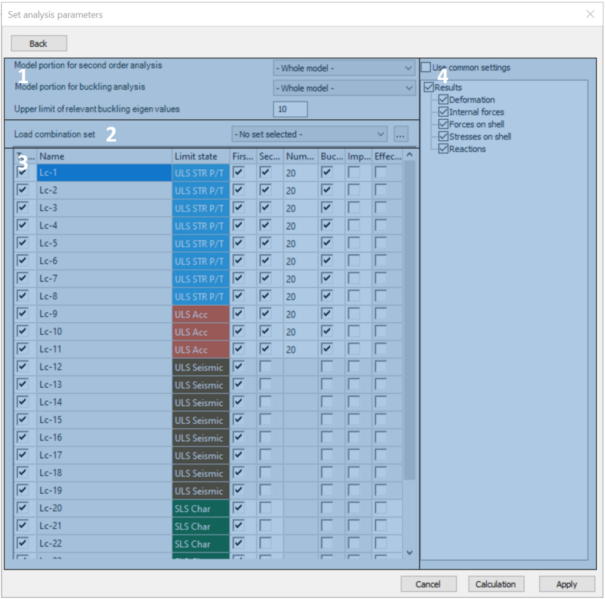

# Analysis Settings

The required analysis types can be chosen and configured on the **Set Analysis parameters** dialogue, which can be open from the **Analysis tab** with the  command. This dialogue window consists of an overview page and four subpages. The three main parts of the **[Overview page](#overview-page)** are:

- Global settings (with the [**Subpage of global settings**](#subpage-of-global-settings))

- Statical Analysis (with the **[Subpage of load cases](#subpage-of-load-cases)**, and the **[Subpage of load combinations](#subpage-of-load-combinations)**.)

- Dynamic analysis (with the **[Subpage of dynamic](#subpage-of-dynamic-analysis)** analysis.)

### Overview page

On the Overview page, the settings of the various analysis types are ordered into three separated groups as shown in the picture below.

Settings of the **Global settings** group (#1) are applied for the whole model:

- With the **Global imperfection** dropdown menu, previously created Global imperfection (see. chapter 6.4) can be set for the model. Only one global imperfection group can be applied at the same time

- **Include connection stiffness**: with this checkbox, the previously created and placed joints’ stiffness can be used during the calculation. By turning on the checkbox, connection stiffnesses will be applied to all of the load combinations in the model, as a default. For further settings, the **[Subpage of global settings](#subpage-of-global-settings)** can be opened with the  button.

- By activating the **Cold formed purlin design mode**, all the purlins related objects can be taken into account, such as **Purlin line**, **Purlin overlap**, and **Purlin support zone**. In this mode, the buckling analysis and the global design will be performed only for a submodel that consists of the members containing Purlin line objects. In case there are purlin related objects in the model but the **Cold formed purlin design mode** is not active, the structural elements to which the purlin line objects are assigned will not be included in the second-order stiffness matrix and so their effect is not considered during linear buckling or second-order analysis.

Settings of the **Statical analysis** group (#2):

- Load cases group

  - **Elastic analysis of load cases**: as a default, Consteel produces results only for the load combinations. With this checkbox selected, the analysis results can be viewed by load cases as well. It is only valid for elastic calculations. By default, the results of all load cases will be calculated, but by opening the **[Subpage of Load cases](#subpage-of-load-cases)** with the  button, load cases can be selected manually.

  - **Second order analysis of buckling mode based imperfection load cases**: the results of the buckling mode based imperfection loads can be viewed separately for each imperfection in the imperfection group if this checkbox is selected. By default, all imperfection load cases will be selected, but by opening the **[Subpage of Load cases](#subpage-of-load-cases)**, the selection can be changed.

  - **Elastic analysis of basic values of reactions for foundation checks**: for the special load combinations necessary for the foundation design in csJoint, the third checkbox should be checked.

* In the Load combination group,

  - the type of analysis can be selected from the dropdown menu. Basically, two types of analysis can be performed:

    - **elastic**: all the elements have linear elastic material following the Hook-law,

    - **plastic**: plastic hinge analysis considering the concentrated plastification of special cross-sections due to bending moment. A detailed description is in chapter 8.4.2.

  * **First- or second-order analysis** types can be selected separately for the ULS and the SLS load combinations.

  - With the **Buckling analysis** checkboxes, the buckling analysis can be selected. By default, 10 eigenshapes will be calculated for each load combination. This number can be modified in the **[Subpage of Load combinations](#subpage-of-load-combinations)**.

  * **Buckling sensitivity** analysis is needed for the automatic selection of buckling shapes used in the global design of steel sections.

  - With the last checkbox, the **Imperfection sensitivity** analysis can be selected that is necessary for the automatic calculation of the amplitude of the buckling shape-based global imperfections.

  * Further options of the above analysis types and individual selection of the load combinations see the **[Subpage of Load combinations](#subpage-of-load-combinations)** with the  button.

- In the **Influence graphs** group, the calculation of the defined influence graphs can be selected.

Settings of the **Dynamic analysis** group (#3:)

In the Dynamic analysis group, the parameters of the dynamic analysis can be set. Free vibration analysis and Modal Response Spectrum Analysis _(Seismic MRSA)_ can be calculated.

For further settings, the **[Subpage of Dynamic analysis](#subpage-of-dynamic-analysis)** can be opened with the  button.

### Subpage of global settings

On this subpage, previously created and placed joints’ stiffnesses can be applied in the calculation in the selected load combinations. With the checkboxes in the second column, secant stiffness can be used instead of initial stiffness.

### Subpage of load cases

This subpage has three main parts:

The load cases table (#1)

In this table, all of the loadcases are listed. With the checkboxes, it can be decided which of them should be calculated during the analysis. Results for load cases will be calculated according to the settings in the result tree (#2)

The result tree (#2)

In the result tree, it can be decided which result type should be calculated for the load cases. Calculated results can be a common setting for all of the load cases if the Use common settings checkbox is clicked. If it is unclicked, calculated results can be set differently for each loadcases by clicking on the name of a loadcase, and selecting the proper result types.

The imperfection load cases table (#3)

Imperfection load cases can be selected for the second order analysis results of buckling mode based imperfection load cases.

### Subpage of load combinations

**Consteel 16**

This subpage has four main parts:

Portion and relevant buckling eigenvalues settings (#1)

In the dropdown menu, the previously created model portions or the whole model can be selected for the second-order and the buckling analysis. The analysis will be performed just for the selected portion. Here can be set also the upper limit of the relevant buckling eigenvalues. The first eigenvalue which is greater than the limit will be shown for information among the analysis results. All other eigenvalues which are higher than the limit will be skipped.

The load combinations sets (#2)

The previously defined load combination sets can be selected for analysis from the drop-down menu. When **_No set selected_** is shown, all the combinations existent in the current model are visible.

To see how to create load combination sets, see **[Load combination sets.](../6_0_structural-loads/6_2_load-combinations.md#load-combination-sets)**

<!-- /wp:paragraph -->

<!-- /wp:column -->

<!-- wp:column -->

<!-- wp:image {"id":47510,"sizeSlug":"large","linkDestination":"none"} -->

<!-- /wp:image -->

<!-- /wp:column -->

<!-- /wp:columns -->

<!-- wp:paragraph -->

The load combinations table (#3)

<!-- /wp:paragraph -->

<!-- wp:paragraph -->

In this table, all of the load combinations which are included the selected load combination set are listed. With the checkboxes in the columns, the analysis types and parameters can be set for each combination separately. The columns are as follows:

- To calculate: it can be decided which of the load combinations should be included in the analysis.

- Name of the load combination.

- Limit state of the load combination.

- First-order analysis and

- second-order analysis can be turned on or off.

- The number of buckling eigenshapes can be given for each combination individually.

- Buckling sensitivity calculation and

- Imperfection sensitivity calculation can be turned on or off.

- Effective section property: using only the reduced effective cross-sectional properties for the selected SLS combinations

To see how to edit multiple rows of the table at a time go to **_[General functions of tables](../1_0_general-description/1_4_general-functions-for-tables.md)_**.

<!-- /wp:paragraph -->

<!-- wp:paragraph -->

The result tree (#4)

<!-- /wp:paragraph -->

<!-- wp:paragraph -->

Result types to be calculated can be selected for the load combinations. Calculated results can be a general setting for all of the load combinations if the _Use common settings_ checkbox is clicked. If it is unclicked, calculated results can be set differently for each load combination by clicking on the name of a load combination, and by selecting the proper result types.

**Consteel 15**

<!-- /wp:image -->

<!-- wp:paragraph -->

This subpage has three main parts:

<!-- /wp:paragraph -->

<!-- wp:paragraph -->

Portion and relevant buckling eigenvalues settings (#1)

<!-- /wp:paragraph -->

<!-- wp:paragraph -->

In the dropdown menu, the previously created model portions or the whole model can be selected for the second-order and the buckling analysis. The analysis will be performed just for the selected portion. Here can be set also the upper limit of the relevant buckling eigenvalues. All the eigenvalues which are higher than the limit will be skipped. As a result, the final number of the calculated eigenshapes could be less than required.

<!-- /wp:paragraph -->

<!-- wp:paragraph -->

The load combinations table (#2)

<!-- /wp:paragraph -->

<!-- wp:paragraph -->

In this table, all of the load combinations are listed. With the checkboxes in the columns, the analysis types and parameters can be set for each combination separately. The columns are as follows:

- To calculate: it can be decided which of the load combinations should be included in the analysis.

- Name of the load combination.

- First-order analysis and

- second-order analysis can be turned on or off.

- The number of buckling eigenshapes can be given for each combination individually.

- Buckling sensitivity calculation and

- Imperfection sensitivity calculation can be turned on or off.

- Effective section property: using only the reduced effective cross-sectional properties for the selected SLS combinations

To see how to edit multiple rows of the table at a time go to **_[General functions of tables](../1_0_general-description/1_4_general-functions-for-tables.md)_**.

The result tree (#3)

Result types to be calculated can be selected for the load combinations. Calculated results can be a general setting for all of the load combinations if the _Use common settings_ checkbox is clicked. If it is unclicked, calculated results can be set differently for each load combination by clicking on the name of a load combination, and by selecting the proper result types.

### Subpage of dynamic analysis

This subpage has three main parts:

The dynamic calculation settings table (#1)

At the top of the table, it can be decided, if the first, or the second-order stiffness matrix should be used for the dynamic calculations. In case if the second-order stiffness checkbox is checked, an additional Load combination column will appear in the table below, where it has to be decided which load combination’s second-order stiffness should be used for each seismic or dynamic calculation.

In the table, the previously defined seismic effect, and all of the mass combinations are being listed as individual rows. Number of dynamic eigenshapes can be defined for each effect and mass combination, the default value is 10.

The rows of the table can be separated into two groups:

- A, Row for Modal Response Spectrum Analysis (MRSA)

For seismic MRSA calculation, it is necessary to have at least one **Seismic effect** defined and assigned to the seismic load group in the model. For the definition of seismic effects, please see **[Earthquake analysis](../12_0_earthquake-analysis/12_0_earthquake-analysis.md)**.

- B, Rows for dynamic and response spectrum analysis

Each defined **mass combination** is listed as an individual row in the table.

According to the settings on the analysis Overview page in chapter **8.4.1**, free vibration and response spectrum analysis can be performed.

<!-- /wp:paragraph -->

<!-- wp:paragraph -->

In the case if the check box of “To calculate” is turned on, and “Response spectrum analysis” is turned off for a mass combination, only a **free vibration analysis** will be performed.

<!-- /wp:paragraph -->

<!-- wp:paragraph -->

In the case if both the “To calculate” and “Response spectrum analysis” checkboxes are turned on for a mass combination, **response spectrum analysis** will be added to the free vibration calculation. This requires a predefined response spectrum in the model.

<!-- /wp:paragraph -->

<!-- wp:paragraph -->

The Response spectrum analysis settings (#2)

<!-- /wp:paragraph -->

<!-- wp:paragraph -->

Two parameters can be defined here:

- Relative modal damping factor

- Consideration of modal shapes in the analysis. By default, all of the modal shapes will be considered. That can be changed using the dropdown menu and setting the minimum value of effective modal masses in each directions. In this case, shapes that do not contain the set minimal modal mass will not be considered in the calculation.

The result tree (#3)

In the result tree, it can be decided, which result type should be calculated for the mass combinations. Calculated results can be a general setting for all of the mass combinations if the **Use common settings** checkbox is clicked. If it is unclicked, calculated results can be set differently for each mass combinations by clicking on the name of a mass combination, and by selecting the proper result types.