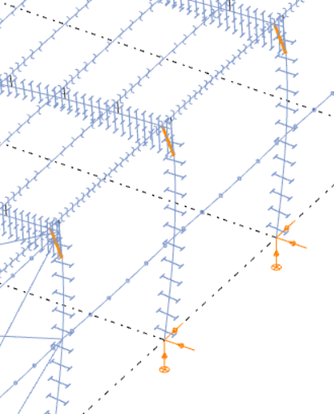
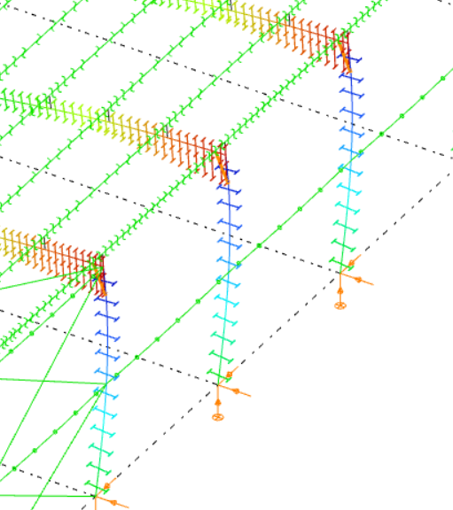

# Analysis results

### Result types

<!-- /wp:heading -->

<!-- wp:paragraph -->

For the two types of finite elements (line and surface elements) the following analysis results are available:

<!-- /wp:paragraph -->

<!-- wp:list {"ordered":true,"type":"1"} -->

1. **Line elements**

<!-- /wp:list -->

<!-- wp:paragraph {"editorskit":{"indent":40,"devices":false,"desktop":true,"tablet":true,"mobile":true,"loggedin":true,"loggedout":true,"acf_visibility":"","acf_field":"","acf_condition":"","acf_value":"","migrated":false,"unit_test":false}} -->

**Elastic and plastic analysis**

<!-- /wp:paragraph -->

<!-- wp:list {"editorskit":{"indent":60,"devices":false,"desktop":true,"tablet":true,"mobile":true,"loggedin":true,"loggedout":true,"acf_visibility":"","acf_field":"","acf_condition":"","acf_value":"","migrated":false,"unit_test":false}} -->

- First and second-order calculations:

  - Deformations – on the finite element nodes in the global coordinate system

    - XYZ – all components

    - X –displacements in the "X” direction

    - Y –displacements in the "Y” direction

    - Z –displacements in the "Z” direction

    - Rx –rotation around “X” axis

    - Ry –rotation around “Y” axis

    - Rz –rotation around “Z” axis

    - W–warping of the member \[1/rad]

    - Rxx –rotation around the local “x” axis of the member \[degree]

  - Internal forces – on the end nodes of each finite element in the local coordinate system

    - N – axial force

    - Vy – shear force in the local “y” direction

    - Vz – shear force in the local “z” direction

    - T – torsional moment

    - My – bending moment about the local “y” axis

    - Mz – bending moment about the local “z” axis

    - B – bimoment

  - Reactions – on the support nodes in the local coordinate system of the support

    - R – all the reaction forces and moments

    - RR – all the reaction forces

    - RRR – all the reaction moments

    - Rx – reaction force in the global “X” direction

    - Ry – reaction force in the global “Y” direction

    - Rz – reaction force in the global “Z” direction

    - Rxx – reaction moment about the global “X” direction

    - Ryy – reaction moment about the global “Y” direction

    - Rzz – reaction moment about the global “Z” direction

- Static eigenvalues and corresponding eigenshapes – on the finite element nodes in the global coordinate system. **Only elastic analysis**

- Dynamic eigenvalues and corresponding eigenshapes – on the finite element nodes in the global coordinate system. **Only elastic analysis**

- Plastic hinges – plastic hinge history with the positions of the plastic hinges on the proper finite element ends and the corresponding stages by load factors

<!-- /wp:list -->

<!-- wp:list {"ordered":true,"start":2,"editorskit":{"devices":false,"desktop":true,"tablet":true,"mobile":true,"loggedin":true,"loggedout":true,"acf_visibility":"","acf_field":"","acf_condition":"","acf_value":"","migrated":false,"unit_test":false}} -->

2. **Surface elements**

<!-- /wp:list -->

<!-- wp:list {"editorskit":{"indent":60,"devices":false,"desktop":true,"tablet":true,"mobile":true,"loggedin":true,"loggedout":true,"acf_visibility":"","acf_field":"","acf_condition":"","acf_value":"","migrated":false,"unit_test":false}} -->

- First- and second-order calculations:

  - Deformations – on the finite element nodes in the global coordinate system

    - XYZ – all components

    - X – only displacements in the "X” direction

    - Y – only displacements in the "Y” direction

    - Z – only displacements in the "Z” direction

    - Rx – only rotation around the local “x” axis of the member

    - Ry – only rotation around the local “x” axis of the member

    - Rz – only rotation around the local “x” axis of the member

    - W– only warping of the member \[1/rad]

    - Rxx – only rotation of the member \[degree]

  - Equilibrium – signed summation of the internal nodal force components and the appropriate external force and reaction components, all the values should be zero which means the model is in equilibrium in the calculated deformed state

  - Internal forces of the surface – edge forces and moments per unit length on the end nodes of each finite element in the local coordinate system

    - mx – bending moment on the section perpendicular to the local “x” axis

    - my – bending moment on the section perpendicular to the local “y” axis

    - mxy – torsional moment

    - nx – normal force in the local “x” direction

    - ny – normal force in the local “y” direction

    - nxy – membrane shear force

    - vxz – plate shear force on the section perpendicular to the local “x” axis

    - vyz – plate shear force on the section perpendicular to the local “y” axis

    - vRz – resultant plate shear force

    - Ɑn – principal directions of the membrane forces  
     $\alpha_n=\frac{1}{2}arctan\left [ \frac{2n_{xy}}{n_x-n_y} \right ]\; \; -90^{\circ}< \alpha_n\leq +90^{\circ}$
    - Ɑm – principal directions of the plate moments  
      $\alpha_m=\frac{1}{2}arctan\left [ \frac{2m_{xy}}{m_x-m_y} \right ]\; \; -90^{\circ}< \alpha_m\leq +90^{\circ}$

  - Stresses on the surface – on the upper, middle and lower plane of the surface on the end nodes of each finite element in the local coordinate system

    - $\sigma_x$ – normal stress in the local “x” direction
    - $\sigma_y$ – normal stress in the local “y” direction
    - $\sigma\_{xy}$ – shear stress
    - $\sigma_1$ – maximum principal stress  
      $\sigma_1= \frac{\sigma_x+\sigma_y}{2}+\sqrt{{\left [ \frac{\sigma_x-\sigma_y}{2} \right ]}^2+\sigma_{xy}^2}$

    - $\sigma_2$ – minimum principal stress  
     $\sigma_= \frac{\sigma_x+\sigma_y}{2}-\sqrt{{\left [ \frac{\sigma_x-\sigma_y}{2} \right ]}^2+\sigma_{xy}^2}$

    - $\sigma_{HMH}$ – Huber-Mises-Hencky stress  
      $\sigma_{HMH}=\sqrt{\sigma_x^2+\sigma_y^2-\sigma_x\sigma_y+3\sigma_{xy}^2}$

    - $\alpha_{\sigma}$ – principal directions of the stresses  
      $\alpha_{\sigma}=\frac{1}{2}arctan\left [ \frac{2\sigma_{xy}}{\sigma_x-\sigma_y} \right ]\; \; -90^{\circ}< \alpha_{\sigma}\leq +90^{\circ}$

  - Reactions – on the support nodes in the global coordinate system

    - R – all the reaction forces and moments
    - RR – all the reaction forces
    - RRR – all the reaction moments
    - Rx – reaction force in the global “X” direction
    - Ry – reaction force in the global “Y” direction
    - Rz – reaction force in the global “Z” direction
    - Rxx – reaction moment about the global “X” direction
    - Ryy – reaction moment about the global “Y” direction
    - Rzz – reaction moment about the global “Z” direction

- Static eigenvalues and corresponding eigenshapes – on the finite element nodes in the global coordinate system

- Dynamic eigenvalues and corresponding eigenshapes – on the finite element nodes in the global coordinate system

<!-- /wp:list -->

<!-- wp:heading {"level":3} -->

### Visualization options

<!-- /wp:heading -->

<!-- wp:paragraph -->

Effective management of the huge amount of data generated during the analysis is of great importance. It should be possible to review both general and accurate, detailed data for a given type of result. There are two main options for reviewing the analysis results: the graphical view and the result tables (for the general functionality of tables used in _ConSteel_ see section **_[1.4 General functions for tables](../1_0_general-description/1_4_general-functions-for-tables.md)_**).

<!-- /wp:paragraph -->

<!-- wp:paragraph -->

The results of the performed analysis are usually a huge amount of data so the efficient handling of it has great importance. There should be opportunities for a global overview and for obtaining accurate, detailed information about a certain part or problem. There are two main possibilities for the demonstration of the analysis results:

<!-- /wp:paragraph -->

<!-- wp:list -->

- **graphical visualization**
- **result tables** _(for the general functionality of tables used in ConSteel_ see section **_[1.4 General functions for tables](../1_0_general-description/1_4_general-functions-for-tables.md)_**).

<!-- /wp:list -->

<!-- wp:paragraph -->

The two visualization options are obviously in strong connection and can be manipulated by the functions placed on the upper part of the Analysis tab. The four combos contain the following selection options (from left to right):

<!-- /wp:paragraph -->

<!-- wp:image {"align":"center","id":22265,"width":938,"height":147,"sizeSlug":"full","linkDestination":"media"} -->

<!-- /wp:image -->

<!-- wp:list -->

- selection of analysis type (first order, second order, buckling, etc. described in section _[ Analysis types](./8_4_analysis-types.md)_)
- selection of load combination, load case, or envelope figures
- selection of result type (described in section _[ Result types](#result-types)_)
- selection of display mode (finite element/diagram/colored diagram/deformation/contour surface)

<!-- /wp:list -->

<!-- wp:paragraph -->

The available options for visualization modes depend on the result type. The following options are available:

<!-- /wp:paragraph -->

<!-- wp:columns -->

<!-- wp:column {"width":"25%","editorskit":{"devices":false,"desktop":true,"tablet":true,"mobile":true,"loggedin":true,"loggedout":true,"acf_visibility":"","acf_field":"","acf_condition":"","acf_value":"","migrated":false,"unit_test":false}} -->

<!-- wp:image {"id":22621,"width":198,"height":246,"sizeSlug":"large","linkDestination":"none"} -->

Finite element

<!-- /wp:image -->

<!-- /wp:column -->

<!-- wp:column {"width":"25%","editorskit":{"devices":false,"desktop":true,"tablet":true,"mobile":true,"loggedin":true,"loggedout":true,"acf_visibility":"","acf_field":"","acf_condition":"","acf_value":"","migrated":false,"unit_test":false}} -->

<!-- wp:image {"id":22615,"width":220,"height":248,"sizeSlug":"large","linkDestination":"none"} -->

Diagram

<!-- /wp:image -->

<!-- /wp:column -->

<!-- wp:column {"width":"25%","editorskit":{"devices":false,"desktop":true,"tablet":true,"mobile":true,"loggedin":true,"loggedout":true,"acf_visibility":"","acf_field":"","acf_condition":"","acf_value":"","migrated":false,"unit_test":false}} -->

<!-- wp:image {"id":22603,"sizeSlug":"large","linkDestination":"none"} -->

Colored diagram

<!-- /wp:image -->

<!-- /wp:column -->

<!-- wp:column {"width":"25%","editorskit":{"devices":false,"desktop":true,"tablet":true,"mobile":true,"loggedin":true,"loggedout":true,"acf_visibility":"","acf_field":"","acf_condition":"","acf_value":"","migrated":false,"unit_test":false}} -->

<!-- wp:image {"id":22639,"width":200,"height":248,"sizeSlug":"large","linkDestination":"none"} -->

Deformation

<!-- /wp:image -->

<!-- /wp:column -->

<!-- /wp:columns -->

<!-- wp:list -->

- Finite element: only the finite element model is shown without any results
- Diagram: the results are shown with single line diagram
- Colored diagram: the color of the diagram lines depend on the sign of the value. Negative values are shown in blue and positive values in red.
- Deformation: (only for deformation results) the deformed structure is shown
- Contour surface: the results are displayed by coloring of the structural members according to the color palette shown in the top right corner of the window. The palette can be customized on the **Transient palette settings** dialog opens by right-clicking on it.

<!-- /wp:list -->

<!-- wp:columns -->

<!-- wp:column {"width":"50%"} -->

<!-- wp:image {"align":"center","id":22609,"width":310,"height":348,"sizeSlug":"large","linkDestination":"none"} -->

Contour surface

<!-- /wp:image -->

<!-- /wp:column -->

<!-- wp:column {"width":"50%"} -->

<!-- wp:image {"align":"center","id":22645,"width":299,"height":341,"sizeSlug":"full","linkDestination":"none"} -->

Palette settings

<!-- /wp:image -->

<!-- /wp:column -->

<!-- /wp:columns -->

<!-- wp:paragraph -->

All the model view options discussed in section _[**Model views**](../3_0_model-view/3_1_model-views.md)_ are applicable to the result graphics. Moving the slider  beside the combos the scaling of the results can be adjusted on the graphics. In the case of partial or submodel view the graphics and the tables show only the results of the actual model part.

<!-- /wp:paragraph -->

<!-- wp:paragraph -->

The analysis results are displayed in table format below the graphical view. (The table can also be moved by clicking and holding on the left-side border of the table with the left mouse button.) Three types of result tables can be viewed:

<!-- /wp:paragraph -->

<!-- wp:paragraph -->

 Extreme values by members: select the maximum and minimum values for each structural member

<!-- /wp:paragraph -->

<!-- wp:paragraph -->

 User defined values: show the values belonging to the markers defined by the user (discussed more deeply in section _[**Result markers**](#result-markers)_, see below)

<!-- /wp:paragraph -->

<!-- wp:paragraph -->

 All values.

<!-- /wp:paragraph -->

<!-- wp:paragraph -->

The result tables arrange the values according to the current result type:

<!-- /wp:paragraph -->

<!-- wp:list -->

- displacement type results (first or second order deformations, static or dynamic eigenshapes): finite element node number, displacement components
- force type results (internal forces, forces or stresses on surface): finite element node number, finite element number, force components
- reaction type results (reactions, equilibrium): finite element node number, reaction components.

<!-- /wp:list -->

<!-- wp:heading {"level":3} -->

### Result markers

<!-- /wp:heading -->

<!-- wp:paragraph -->

On the graphical interpretation of the results markers can be placed in order to show certain significant values. When moving the mouse along the structural elements (or more correctly the finite elements) the result markers continuously appear showing the actual values. These markers can be fixed by clicking on the right mouse button and choosing the ‘Marker’ option.

<!-- /wp:paragraph -->

<!-- wp:paragraph -->

The fixed markers will appear on every result views where it has interpretable value:

<!-- /wp:paragraph -->

<!-- wp:list -->

- Deformation

<!-- /wp:list -->

<!-- wp:image {"align":"center","id":10782,"sizeSlug":"large","linkDestination":"media"} -->

<!-- /wp:image -->

<!-- wp:paragraph -->

Normal force

<!-- /wp:paragraph -->

<!-- wp:image {"align":"center","id":10788,"sizeSlug":"large","linkDestination":"media"} -->

<!-- /wp:image -->

<!-- wp:paragraph -->

Bending moment

<!-- /wp:paragraph -->

<!-- wp:image {"align":"center","id":10794,"sizeSlug":"large","linkDestination":"media"} -->

<!-- /wp:image -->

<!-- wp:image {"align":"center","id":10800,"sizeSlug":"large","linkDestination":"media"} -->

<!-- /wp:image -->

<!-- wp:paragraph -->

When there are fixed markers on the model the ‘User defined values’ table contains the appropriate (view dependent) values of the marked points. In this table the markers can be switched to disabled by uncheck the proper row.

<!-- /wp:paragraph -->

<!-- wp:image {"align":"center","id":10806,"sizeSlug":"large","linkDestination":"media"} -->

<!-- /wp:image -->

<!-- wp:paragraph -->

The markers can be deleted by:

<!-- /wp:paragraph -->

<!-- wp:list -->

- click on the proper row in the table by the right mouse button
- click on the marked point on the graphics by the right mouse button and chose ‘Remove marker’

<!-- /wp:list -->

<!-- wp:paragraph -->

Extreme values can automatically marked by the check boxes on the ‘Extreme values’ table rows.

<!-- /wp:paragraph -->

<!-- wp:heading {"level":3} -->

### Envelope figures

<!-- /wp:heading -->

<!-- wp:paragraph -->

In ConSteel, _min. max and min-max_ envelope figures are available both for _bar members_, and _shell models_ too. Envelope visualization of results can be accessed through the **load combination** dropdown menu of the **Analysis** tab, after a successful calculation. Envelope figures are available both for first, and second order results. By default, there are two envelope figures to choose from, one for all of the calculated ULS and one for all of the calculated SLS combinations. It is possible to create custom envelope figures, which are explained in detail in the chapter _[**User defined envelope figures**](#user-defined-envelope-figures)_.

<!-- /wp:paragraph -->

<!-- wp:image {"align":"center","id":10812,"sizeSlug":"large","linkDestination":"media"} -->

<!-- /wp:image -->

<!-- wp:paragraph -->

The following result types can be displayed through envelope figures (detailed explanation on Result types can be found in Chapter 8.6.1):

<!-- /wp:paragraph -->

<!-- wp:list {"ordered":true,"type":"I"} -->

1. Internal forces for bar members
2. Forces on shell
3. Stresses on shell

<!-- /wp:list -->

<!-- wp:paragraph -->

There is a colour scheme for the envelope figures. Minimal values represented with blue, while maximal values with a red diagram. When hovering the cursor above a point of an envelope, (either min or max), the value, and the load combination from which it is coming from, is displayed in a flag.

<!-- /wp:paragraph -->

<!-- wp:image {"align":"center","id":10818,"sizeSlug":"large","linkDestination":"media"} -->

<!-- /wp:image -->

<!-- wp:paragraph -->

Placing flags on the envelope figures values is also possible. In this case, the table on the bottom of the main window will contain every envelope information about the flagged point.

<!-- /wp:paragraph -->

<!-- wp:image {"align":"center","id":10824,"sizeSlug":"large","linkDestination":"media"} -->

<!-- /wp:image -->

<!-- wp:heading {"level":4} -->

#### User defined envelope figures

<!-- /wp:heading -->

<!-- wp:paragraph -->

Besides the default, built-in envelope options (all ULS and SLS combinations), it is possible to create user-defined envelope figures. This means, that the results, from which the envelope function can build up the figure, can be specified, and saved as a new **User-defined envelope figure**. A definition can be initiated from the **Load combination** dropdown menu’s **Define envelope figure…** option, after a successful first and/or second-order analysis calculation.

<!-- /wp:paragraph -->

<!-- wp:image {"align":"center","id":10830,"sizeSlug":"large","linkDestination":"media"} -->

<!-- /wp:image -->

<!-- wp:paragraph -->

After clicking on the function, the **User-defined envelope** dialogue will appear. On this dialogue, any number of custom envelope figures can be created, using the **New** button.

<!-- /wp:paragraph -->

<!-- wp:image {"align":"center","id":10836,"width":700,"height":702,"sizeSlug":"large","linkDestination":"media"} -->

<!-- /wp:image -->

<!-- wp:paragraph -->

If the Load combinations is selected at the **Parameters** part of the dialogue, the elements of the dropdown menu below **Load combinations or Load cases**, and the table below will be different.

<!-- /wp:paragraph -->

<!-- wp:paragraph -->

If the Load combinations is selected at the parameters, the options of the dropdown menu (#1) are:

<!-- /wp:paragraph -->

<!-- wp:list {"type":"A"} -->

- All load combinations: All of the calculated load combinations will be used for the envelope figure
- Selected load combinations: Calculated load combinations can be selected with checkboxes to be taken into account for the envelope figure
- Load combinations based on selected load cases: Only those load combinations will be taken into account, which are generated based on the selected loadcases, using the checkboxes

<!-- /wp:list -->

<!-- wp:image {"align":"center","id":10842,"sizeSlug":"large","linkDestination":"media"} -->

<!-- /wp:image -->

<!-- wp:paragraph -->

If the Load case is selected at the parameters, the options of the dropdown menu (#1) are:

<!-- /wp:paragraph -->

<!-- wp:list {"ordered":true,"type":"A"} -->

1. All loadcases: All of the loadcases will be used for the envelope figure
2. Selected loadcases: Only the selected loadcases will be used for the envelope figures

<!-- /wp:list -->

<!-- wp:paragraph -->

After the user-defined envelopes are created, they will be listed at the load combinations dropdown menu of the analysis tab, and will be listed at the **User-defined** envelope part:

<!-- /wp:paragraph -->

<!-- wp:image {"align":"center","id":10848,"sizeSlug":"large","linkDestination":"media"} -->

<!-- /wp:image -->

<!-- wp:heading {"level":3} -->

### Show original shape of structure

<!-- /wp:heading -->

<!-- wp:paragraph -->

The show original shape of structure function  will show the original and the deformed shape of the structure at the same time:

<!-- /wp:paragraph -->

<!-- wp:image {"align":"center","id":10854,"width":700,"height":481,"sizeSlug":"large","linkDestination":"media"} -->

<!-- /wp:image -->

<!-- wp:heading {"level":3} -->

### Table of dominant values

<!-- /wp:heading -->

<!-- wp:paragraph -->

 The last icon on the Analysis tab activates the table of dominant values. The table is view sensitive which means that the dominant values are always selected from the current result type. Only the values at the ends of structural members are displayed. The functionality of the table is as follows:

<!-- /wp:paragraph -->

<!-- wp:image {"align":"center","id":10860,"width":700,"sizeSlug":"large","linkDestination":"media"} -->

<!-- /wp:image -->

<!-- wp:paragraph -->

**Limit state**: selection of appropriate load combinations belonging to resistance or serviceability limit states (the deformations are automatically appear for the serviceability limit state, while the internal forces and reactions for the resistance limit state)

<!-- /wp:paragraph -->

<!-- wp:paragraph -->

**Extreme values:** setting the type of extreme values

<!-- /wp:paragraph -->

<!-- wp:paragraph -->

**Sort:** sorting the values for bars (structural members), bar groups or cross sections

<!-- /wp:paragraph -->

<!-- wp:paragraph -->

**Bar end:** handle the ends of the members separately (A, B ends) or together (Both ends)

<!-- /wp:paragraph -->

<!-- wp:paragraph -->

Single or multiple component selection is possible, the dominant values are always highlighted by colored cells, the ‘Dominant’ column contains the dominant components.

### Animation of dynamic shapes

In the case of vibration analysis, the animation of the dynamic shapes can be reached to click on the  icon. Animation speed can be increased and decreased with the slide bar.

