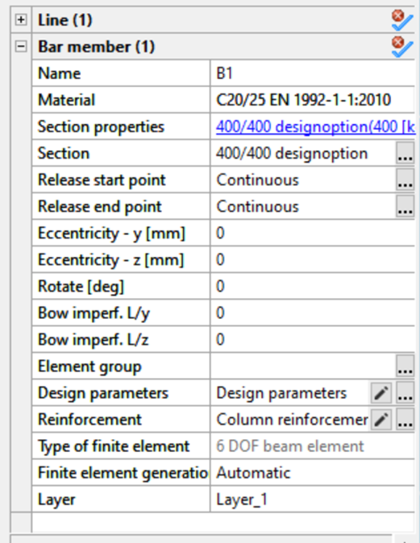
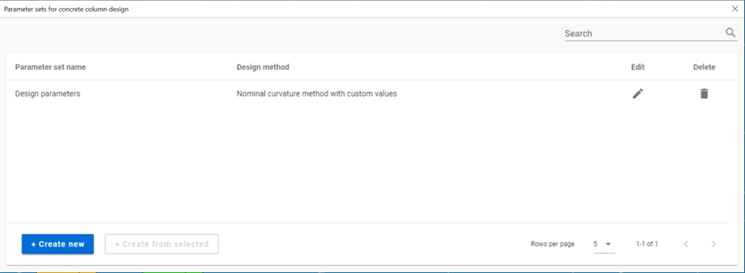
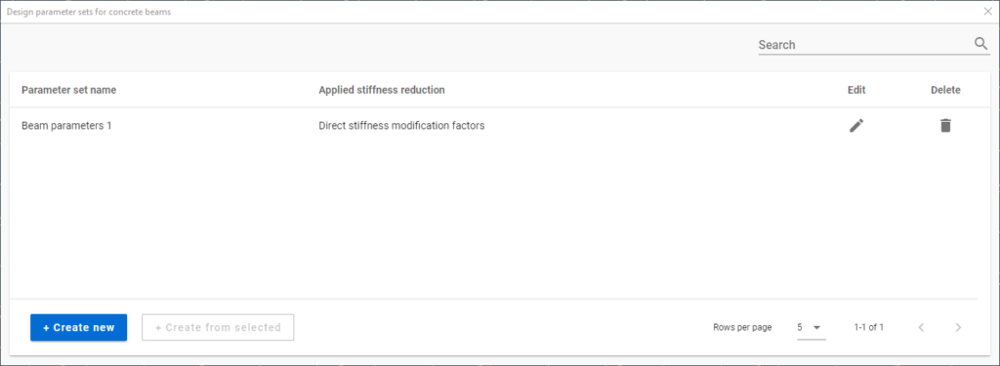

# Reinforced concrete design

**Consteel 16**

<!-- /wp:paragraph -->

<!-- wp:paragraph {"align":"justify"} -->

Design of concrete members are available at the Global checks tab. By clicking on the  button, the Design… dialog will appear, where below the _Steel_ and _Composite design_, the Concrete design EN 1992-1-1 panel can be found. On the panel, Beam, Column design and slab reinforcement calculations are available. If the necessary input parameters for these calculations are available _(cross sections, reinforcement data, design parameters and analysis results)_, the checkboxes for the different design options are active, and choosing the desired item, Calculation can be initiated to obtain utilizations.

<!-- /wp:paragraph -->

<!-- wp:image {"align":"center","id":44239,"width":441,"height":424,"sizeSlug":"full","linkDestination":"none","editorskit":{"devices":false,"desktop":true,"tablet":true,"mobile":true,"loggedin":true,"loggedout":true,"acf_visibility":"","acf_field":"","acf_condition":"","acf_value":"","migrated":false,"unit_test":false}} -->

<!-- /wp:image -->

<!-- wp:paragraph -->

Required input parameters for reinforced concrete design are the following (see Chapter 5.2.2 Concrete Reinforced members for details):

<!-- /wp:paragraph -->

<!-- wp:list {"ordered":true,"type":"I"} -->

1. <!-- wp:list-item -->

2. In case of reinforced concrete beam

   <!-- wp:list -->

   - <!-- wp:list-item -->
   - Reinforced concrete cross sections with design option (see Chapter 5.2.2.1)
   - <!-- /wp:list-item -->
   -
   - <!-- wp:list-item -->
   - Beam reinforcement object assigned to the concrete member (see Chapter 5.2.2.2.)
   - <!-- /wp:list-item -->
   -
   - <!-- wp:list-item -->
   - First or second order analysis results (see Chapter 8.5.1.1 and 8.5.1.2)
   - <!-- /wp:list-item -->

   <!-- /wp:list -->

3. <!-- /wp:list-item -->

4.

5) <!-- wp:list-item -->

6) In case of reinforced concrete columns

   <!-- wp:list -->

   - <!-- wp:list-item -->
   - Reinforced concrete cross sections with design option (see Chapter 5.2.2.1)
   - <!-- /wp:list-item -->
   -
   - <!-- wp:list-item -->
   - Column reinforcements set assigned to the concrete member (see Chapter 5.2.2.3.)
   - <!-- /wp:list-item -->
   -
   - <!-- wp:list-item -->
   - Design parameter to control design settings assigned to the concrete member (see below)
   - <!-- /wp:list-item -->
   -
   - <!-- wp:list-item -->
   - Appropriate global imperfections if required
   - <!-- /wp:list-item -->
   -
   - <!-- wp:list-item -->
   - First or second order analysis results (see Chapter 8.5.1.1 and 8.5.1.2)
   - <!-- /wp:list-item -->

   <!-- /wp:list -->

7) <!-- /wp:list-item -->

8)

9. <!-- wp:list-item -->

10. In case of reinforced concrete slabs

    <!-- wp:list -->

    - <!-- wp:list-item -->
    - Defined reinforcement schemes in the main directions (see Chapter 5.3.1)
    - <!-- /wp:list-item -->
    -
    - <!-- wp:list-item -->
    - First or second order shell results (see Chapter 8.6.1)
    - <!-- /wp:list-item -->

    <!-- /wp:list -->

11. <!-- /wp:list-item -->

<!-- /wp:list -->

<!-- wp:paragraph -->

During the design, Consteel will perform the available standard checks according to EN1992-1-1 for all of the cross sections automatically. Cross sections with their dominant utilizations will be collected into the results grid, and will be shown using the color-coded visualization in the modeling area.

<!-- /wp:paragraph -->

<!-- wp:image {"align":"center","id":10921,"width":770,"height":417,"sizeSlug":"full","linkDestination":"media","editorskit":{"devices":false,"desktop":true,"tablet":true,"mobile":true,"loggedin":true,"loggedout":true,"acf_visibility":"","acf_field":"","acf_condition":"","acf_value":"","migrated":false,"unit_test":false}} -->

<!-- /wp:image -->

<!-- wp:paragraph -->

<!-- /wp:paragraph -->

<!-- wp:paragraph -->

Results of the individual standard checks can also be obtained using the dropdown menu in the upper left corner of the design tab.

<!-- /wp:paragraph -->

<!-- wp:paragraph {"fontSize":"medium"} -->

**Consteel 15**

<!-- /wp:paragraph -->

<!-- wp:paragraph {"align":"justify"} -->

Design of concrete members are available at the Global checks tab. By clicking on the  button, the Design… dialog will appear, where below the _Steel_ and _Composite design_, the Concrete design EN 1992-1-1 panel can be found. On the panel, Beam reinforcement, Column reinforcement and slab reinforcement calculations are available. If the necessary input parameters for these calculations are available _(cross sections, reinforcement data, design parameters and analysis results)_, the checkboxes are active, and choosing the desired item, Calculation can be initiated to obtain utilizations.

<!-- /wp:paragraph -->

<!-- wp:image {"align":"center","id":10915,"width":442,"height":482,"sizeSlug":"full","linkDestination":"media","editorskit":{"devices":false,"desktop":true,"tablet":true,"mobile":true,"loggedin":true,"loggedout":true,"acf_visibility":"","acf_field":"","acf_condition":"","acf_value":"","migrated":false,"unit_test":false}} -->

<!-- /wp:image -->

<!-- wp:paragraph -->

Required input parameters for concrete design are the following (see Chapter 5.2.2. Reinforced concrete members for details):

<!-- /wp:paragraph -->

<!-- wp:list {"type":"I"} -->

- <!-- wp:list-item -->

- In case of concrete beams and columns

  <!-- wp:list -->

  - <!-- wp:list-item -->
  - Reinforced concrete cross sections with design option (see Chapter 5.2.2.1)
  - <!-- /wp:list-item -->
  -
  - <!-- wp:list-item -->
  - Beam/column reinforcement object assigned to the concrete member (see Chapter 5.2.2.2. and 5.2.2.3.)
  - <!-- /wp:list-item -->
  -
  - <!-- wp:list-item -->
  - First or second order analysis results (see Chapter 8.5.1.1 and 8.5.1.2)
  - <!-- /wp:list-item -->

  <!-- /wp:list -->

- <!-- /wp:list-item -->

-

* <!-- wp:list-item -->

* In case of reinforced concrete slabs

  <!-- wp:list -->

  - <!-- wp:list-item -->
  - Defined reinforcement schemes in the main directions (see Chapter 5.3.1)
  - <!-- /wp:list-item -->
  -
  - <!-- wp:list-item -->
  - First or second order shell results (see Chapter 8.6.1)
  - <!-- /wp:list-item -->

  <!-- /wp:list -->

* <!-- /wp:list-item -->

<!-- /wp:list -->

<!-- wp:paragraph -->

During the design, Consteel will perform the available standard checks according to EN1992-1-1 for all of the cross sections automatically. Cross sections with their dominant utilizations will be collected into the results grid, and will be shown using the color-coded visualization in the modeling area.

<!-- /wp:paragraph -->

<!-- wp:image {"align":"center","id":10921,"width":770,"height":417,"sizeSlug":"full","linkDestination":"media","editorskit":{"devices":false,"desktop":true,"tablet":true,"mobile":true,"loggedin":true,"loggedout":true,"acf_visibility":"","acf_field":"","acf_condition":"","acf_value":"","migrated":false,"unit_test":false}} -->

<!-- /wp:image -->

<!-- wp:paragraph -->

Results of the individual standard checks can also be obtained using the dropdown menu in the upper left corner of the design tab.

<!-- /wp:paragraph -->

<!-- wp:heading {"level":3,"editorskit":{"devices":false,"desktop":true,"tablet":true,"mobile":true,"loggedin":true,"loggedout":true,"acf_visibility":"","acf_field":"","acf_condition":"","acf_value":"","migrated":false,"unit_test":false}} -->

### Reinforced concrete beam design

<!-- /wp:heading -->

<!-- wp:paragraph -->

In case of concrete beam design, the following checks of EN1992-1-1 will be performed:

<!-- /wp:paragraph -->

<!-- wp:list -->

- <!-- wp:list-item -->

- Longitudinal reinforcement

  <!-- wp:list -->

  - <!-- wp:list-item -->
  - EN1992-1-1 9.2.1.1 (1) (9.1.n) formula - Minimum longitudinal reinforcement
  - <!-- /wp:list-item -->
  -
  - <!-- wp:list-item -->
  - EN1992-1-1 9.2.1.1 (3) formula - Maximum longitudinal reinforcement
  - <!-- /wp:list-item -->
  -
  - <!-- wp:list-item -->
  - EN1992-1-1 6.1 – Major axis bending
  - <!-- /wp:list-item -->

  <!-- /wp:list -->

- <!-- /wp:list-item -->

-

* <!-- wp:list-item -->

* Shear reinforcement

  <!-- wp:list -->

  - <!-- wp:list-item -->
  - EN1992-1-1 9.2.2. (6) (9.6.N) formula – Maximim stirrup distance
  - <!-- /wp:list-item -->
  -
  - <!-- wp:list-item -->
  - EN1992-1-1 9.2.2 (5) (9.5.n) formula – Minimum percentage of reinforcement
  - <!-- /wp:list-item -->
  -
  - <!-- wp:list-item -->
  - EN1992-1-1 6.2.2. (1) (6.2.a) and (6.2.b) formula – Shear resistance without shear reinforcement
  - <!-- /wp:list-item -->
  -
  - <!-- wp:list-item -->
  - EN1992-1-1 6.2.3. (3) (6.8) and (6.9) formula – Shear resistance with shear reinforcement
  - <!-- /wp:list-item -->

  <!-- /wp:list -->

* <!-- /wp:list-item -->

*

- <!-- wp:list-item -->

- Interaction of shear and torsion

  <!-- wp:list -->

  - <!-- wp:list-item -->
  - EN1992-1-1 6.3.2. (4) (6.29) formula – Resistance of inclined compression concrete bars
  - <!-- /wp:list-item -->
  -
  - <!-- wp:list-item -->
  - EN1992-1-1 6.3.2. (5) (6.31) formula – Required longitudinal torsion reinforcement
  - <!-- /wp:list-item -->
  -
  - <!-- wp:list-item -->
  - EN 1992-1-1 6.3.2. (3) (6.28) formula – Applied longitudinal torsion reinforcement
  - <!-- /wp:list-item -->

  <!-- /wp:list -->

- <!-- /wp:list-item -->

<!-- /wp:list -->

<!-- wp:heading {"level":3,"editorskit":{"devices":false,"desktop":true,"tablet":true,"mobile":true,"loggedin":true,"loggedout":true,"acf_visibility":"","acf_field":"","acf_condition":"","acf_value":"","migrated":false,"unit_test":false}} -->

### Reinforced concrete column design

<!-- /wp:heading -->

<!-- wp:paragraph {"fontSize":"medium"} -->

**Consteel 16**

<!-- /wp:paragraph -->

<!-- wp:image {"align":"right","id":44255,"width":299,"height":386,"sizeSlug":"full","linkDestination":"none","editorskit":{"devices":false,"desktop":true,"tablet":true,"mobile":true,"loggedin":true,"loggedout":true,"acf_visibility":"","acf_field":"","acf_condition":"","acf_value":"","migrated":false,"unit_test":false}} -->

<!-- /wp:image -->

<!-- wp:paragraph -->

Consteel supports different design methods defined by EN 1992-1-1, including

<!-- /wp:paragraph -->

<!-- wp:list -->

- <!-- wp:list-item -->

- Method based on nominal stiffness (EN 1992-1-1 5.8.7)

- <!-- /wp:list-item -->

-

* <!-- wp:list-item -->

* Method based on nominal curvature (EN 1992-1-1 5.8.8)

  <!-- wp:list -->

  - <!-- wp:list-item -->
  - design with manually controlled parameters
  - <!-- /wp:list-item -->
  -
  - <!-- wp:list-item -->
  - design with automatically set parameters
  - <!-- /wp:list-item -->

  <!-- /wp:list -->

* <!-- /wp:list-item -->

<!-- /wp:list -->

<!-- wp:paragraph -->

The type of method and additionally required or optional parameters can be specified as a property of a member assigned with a reinforced concrete column type cross-section.

<!-- /wp:paragraph -->

<!-- wp:image {"align":"left","id":44262,"width":118,"height":126,"sizeSlug":"full","linkDestination":"none","editorskit":{"devices":false,"desktop":true,"tablet":true,"mobile":true,"loggedin":true,"loggedout":true,"acf_visibility":"","acf_field":"","acf_condition":"","acf_value":"","migrated":false,"unit_test":false}} -->

<!-- /wp:image -->

<!-- wp:paragraph -->

For the use of method based on nominal stiffness and for the automatic option of the method based on nominal curvature the definition of appropriate global imperfections might be required. (see 6.4 Global imperfections)

<!-- /wp:paragraph -->

<!-- wp:paragraph -->

<!-- /wp:paragraph -->

<!-- wp:paragraph -->

<!-- /wp:paragraph -->

<!-- wp:paragraph -->

<!-- /wp:paragraph -->

<!-- wp:paragraph -->

<!-- /wp:paragraph -->

<!-- wp:paragraph -->

<!-- /wp:paragraph -->

<!-- wp:paragraph -->

<!-- /wp:paragraph -->

<!-- wp:heading {"level":4,"editorskit":{"devices":false,"desktop":true,"tablet":true,"mobile":true,"loggedin":true,"loggedout":true,"acf_visibility":"","acf_field":"","acf_condition":"","acf_value":"","migrated":false,"unit_test":false}} -->

#### **Design parameters for reinforced concrete columns**

<!-- /wp:heading -->

<!-- wp:paragraph -->

A Consteel model may contain several column design parameter sets, which can be assigned to concrete column members. All the actually defined sets are shown in a Summary screen. **_Parameter sets for concrete column design_** dialog can be opened by clicking on the ... in the _Design parameters_ row in the property tree of a bar member with reinforced concrete column cross section.

<!-- /wp:paragraph -->

<!-- wp:image {"align":"center","id":44341,"width":843,"height":310,"sizeSlug":"full","linkDestination":"none","editorskit":{"devices":false,"desktop":true,"tablet":true,"mobile":true,"loggedin":true,"loggedout":true,"acf_visibility":"","acf_field":"","acf_condition":"","acf_value":"","migrated":false,"unit_test":false}} -->

<!-- /wp:image -->

<!-- wp:paragraph -->

The definition of a new design parameter set can be initiated with the **_+ Create new_** button. A new set can also be defined starting from an already existing set using the **_+ Create from selected_** button.

<!-- /wp:paragraph -->

<!-- wp:paragraph -->

First the applied design method is set

<!-- /wp:paragraph -->

<!-- wp:image {"align":"center","id":44269,"width":403,"height":217,"sizeSlug":"full","linkDestination":"none","editorskit":{"devices":false,"desktop":true,"tablet":true,"mobile":true,"loggedin":true,"loggedout":true,"acf_visibility":"","acf_field":"","acf_condition":"","acf_value":"","migrated":false,"unit_test":false}} -->

<!-- /wp:image -->

<!-- wp:paragraph -->

Depending on this selection, the dialog will ask for additional information

<!-- /wp:paragraph -->

<!-- wp:paragraph -->

**Method based on nominal curvature**

<!-- /wp:paragraph -->

<!-- wp:image {"align":"center","id":44276,"width":412,"height":132,"sizeSlug":"full","linkDestination":"none","editorskit":{"devices":false,"desktop":true,"tablet":true,"mobile":true,"loggedin":true,"loggedout":true,"acf_visibility":"","acf_field":"","acf_condition":"","acf_value":"","migrated":false,"unit_test":false}} -->

<!-- /wp:image -->

<!-- wp:paragraph -->

The automatic option is based on additional analysis results, such as Buckling analysis and Buckling sensitivity analysis.

<!-- /wp:paragraph -->

<!-- wp:paragraph -->

The selection of custom value is recommended when the designer wants to manually control important design input parameters such as buckling lengths

<!-- /wp:paragraph -->

<!-- wp:image {"align":"center","id":44283,"width":396,"height":212,"sizeSlug":"full","linkDestination":"none","editorskit":{"devices":false,"desktop":true,"tablet":true,"mobile":true,"loggedin":true,"loggedout":true,"acf_visibility":"","acf_field":"","acf_condition":"","acf_value":"","migrated":false,"unit_test":false}} -->

<!-- /wp:image -->

<!-- wp:paragraph -->

or directly modify the parameters responsible to calculate the considered maximum curvature value:

<!-- /wp:paragraph -->

<!-- wp:image {"align":"center","id":44290,"width":415,"height":288,"sizeSlug":"full","linkDestination":"none","editorskit":{"devices":false,"desktop":true,"tablet":true,"mobile":true,"loggedin":true,"loggedout":true,"acf_visibility":"","acf_field":"","acf_condition":"","acf_value":"","migrated":false,"unit_test":false}} -->

<!-- /wp:image -->

<!-- wp:paragraph -->

The automatic option does not require such definitions.

<!-- /wp:paragraph -->

<!-- wp:paragraph -->

In addition, optional stiffness reduction values can be specified

<!-- /wp:paragraph -->

<!-- wp:image {"align":"center","id":44297,"width":414,"height":194,"sizeSlug":"full","linkDestination":"none","editorskit":{"devices":false,"desktop":true,"tablet":true,"mobile":true,"loggedin":true,"loggedout":true,"acf_visibility":"","acf_field":"","acf_condition":"","acf_value":"","migrated":false,"unit_test":false}} -->

<!-- /wp:image -->

<!-- wp:paragraph -->

**Method based on nominal stiffness**

<!-- /wp:paragraph -->

<!-- wp:paragraph -->

Using this method, it is compulsory to define the applicable stiffness values, not only to column, but also to connected beam elements. There are 2 options available.

<!-- /wp:paragraph -->

<!-- wp:paragraph -->

Through the definition of _Ks_ and _Kc_ factors (see EN 1992-1-1 5.8.7.2)

<!-- /wp:paragraph -->

<!-- wp:image {"align":"center","id":44304,"width":429,"height":284,"sizeSlug":"full","linkDestination":"none","editorskit":{"devices":false,"desktop":true,"tablet":true,"mobile":true,"loggedin":true,"loggedout":true,"acf_visibility":"","acf_field":"","acf_condition":"","acf_value":"","migrated":false,"unit_test":false}} -->

<!-- /wp:image -->

<!-- wp:paragraph -->

or through the definition of direct stiffness reduction factors to be applied to _EIy_ and _EIz_ bending stiffness quantities of the member.

<!-- /wp:paragraph -->

<!-- wp:image {"align":"center","id":52150,"width":425,"height":293,"sizeSlug":"full","linkDestination":"none","editorskit":{"devices":false,"desktop":true,"tablet":true,"mobile":true,"loggedin":true,"loggedout":true,"acf_visibility":"","acf_field":"","acf_condition":"","acf_value":"","migrated":false,"unit_test":false}} -->

<!-- /wp:image -->

<!-- wp:paragraph -->

The values to be introduced shall be defined by the user. In case of using direct stiffness modification factors, the introduced values will be automatically reduced to contain the effect of creep.

<!-- /wp:paragraph -->

<!-- wp:heading {"level":4,"editorskit":{"devices":false,"desktop":true,"tablet":true,"mobile":true,"loggedin":true,"loggedout":true,"acf_visibility":"","acf_field":"","acf_condition":"","acf_value":"","migrated":false,"unit_test":false}} -->

#### **Design parameters for reinforced concrete beams**

<!-- /wp:heading -->

<!-- wp:paragraph -->

Similarly to column design parameters, several concrete beam parameter sets can be present in a Consteel model and they can be assigned to concrete beam members at the Property tree. All the actually defined sets are shown in a Summary screen. **_Parameter sets for concrete beams_** dialog can be opened by clicking on the ... in the _Design parameters_ row in the property tree of a bar member with reinforced concrete beam cross section.

<!-- /wp:paragraph -->

<!-- wp:image {"align":"center","id":44350,"width":854,"height":313,"sizeSlug":"large","linkDestination":"none","editorskit":{"devices":false,"desktop":true,"tablet":true,"mobile":true,"loggedin":true,"loggedout":true,"acf_visibility":"","acf_field":"","acf_condition":"","acf_value":"","migrated":false,"unit_test":false}} -->

<!-- /wp:image -->

<!-- wp:paragraph -->

The definition of a new design parameter set can be initiated with the **_+ Create new_** button. A new set can also be defined starting from an already existing set using the **_+ Create from selected_** button.

<!-- /wp:paragraph -->

<!-- wp:paragraph -->

<!-- /wp:paragraph -->

<!-- wp:paragraph -->

**When the method based on nominal stiffness is used for the design of reinforced concrete columns, an appropriate stiffness reduction must be assigned also to every reinforced concrete beam contributing to the stiffness of the structure.**

<!-- /wp:paragraph -->

<!-- wp:paragraph -->

The dialog is similar to that of the columns', but contains only the part related to the definition of the stiffness reduction parameters.

<!-- /wp:paragraph -->

<!-- wp:image {"align":"center","id":44327,"width":433,"height":478,"sizeSlug":"large","linkDestination":"none","editorskit":{"devices":false,"desktop":true,"tablet":true,"mobile":true,"loggedin":true,"loggedout":true,"acf_visibility":"","acf_field":"","acf_condition":"","acf_value":"","migrated":false,"unit_test":false}} -->

<!-- /wp:image -->

<!-- wp:paragraph -->

No design parameter is required to be assigned to beams when columns are designed with the method based on nominal curvature.

<!-- /wp:paragraph -->

<!-- wp:image {"align":"left","id":44334,"width":155,"height":165,"sizeSlug":"full","linkDestination":"none","editorskit":{"devices":false,"desktop":true,"tablet":true,"mobile":true,"loggedin":true,"loggedout":true,"acf_visibility":"","acf_field":"","acf_condition":"","acf_value":"","migrated":false,"unit_test":false}} -->

<!-- /wp:image -->

<!-- wp:paragraph -->

Although for each member a design parameter specifying different design methods can be assigned, mixing of these design methods must be done carefully. The method based on nominal stiffness assumes that every member contributing to the stiffness of the structure has been assigned with adequate stiffness reduction values.

<!-- /wp:paragraph -->

<!-- wp:paragraph -->

<!-- /wp:paragraph -->

<!-- wp:paragraph -->

<!-- /wp:paragraph -->

<!-- wp:paragraph -->

<!-- /wp:paragraph -->

<!-- wp:paragraph -->

<!-- /wp:paragraph -->

<!-- wp:paragraph -->

<!-- /wp:paragraph -->

<!-- wp:paragraph -->

In case of concrete column design, the following checks of EN1992-1-1 will be performed:

<!-- /wp:paragraph -->

<!-- wp:list -->

- <!-- wp:list-item -->

- Longitudinal reinforcement

  <!-- wp:list -->

  - <!-- wp:list-item -->
  - EN1992-1-1 9.5.2 (1) formula – Minimum diameter of longitudinal reinforcement
  - <!-- /wp:list-item -->
  -
  - <!-- wp:list-item -->
  - EN1992-1-1 9.5.2 (2) formula – Minimum longitudinal reinforcement
  - <!-- /wp:list-item -->
  -
  - <!-- wp:list-item -->
  - EN1992-1-1 9.5.2 (3) formula – Maximum longitudinal reinforcement
  - <!-- /wp:list-item -->
  -
  - <!-- wp:list-item -->
  - EN1992-1-1 5.8.3 and 5.8.8 – Biaxial bending
  - <!-- /wp:list-item -->

  <!-- /wp:list -->

- <!-- /wp:list-item -->

-

* <!-- wp:list-item -->

* Shear reinforcement

  <!-- wp:list -->

  - <!-- wp:list-item -->
  - EN1992-1-1 9.5.3 (1) formula – Minimum diameter of stirrup
  - <!-- /wp:list-item -->
  -
  - <!-- wp:list-item -->
  - EN1992-1-1 9.5.3 (2) formula - Maximum distance of stirrups
  - <!-- /wp:list-item -->
  -
  - <!-- wp:list-item -->
  - EN1992-1-1 6.2.2 (1) (6.2.a) and (6.2.b) formula – Shear resistance without shear reinforcement
  - <!-- /wp:list-item -->
  -
  - <!-- wp:list-item -->
  - EN1992-1-1 6.2.3 (3) (6.8) and (6.9) formula – Shear resistance with shear reinforcement
  - <!-- /wp:list-item -->

  <!-- /wp:list -->

* <!-- /wp:list-item -->

<!-- /wp:list -->

<!-- wp:paragraph -->

<!-- /wp:paragraph -->

<!-- wp:paragraph {"fontSize":"medium"} -->

**Consteel 15**

<!-- /wp:paragraph -->

<!-- wp:paragraph -->

In case of concrete column design, the following checks of EN1992-1-1 will be performed:

<!-- /wp:paragraph -->

<!-- wp:list -->

- <!-- wp:list-item -->

- Longitudinal reinforcement

  <!-- wp:list -->

  - <!-- wp:list-item -->
  - EN1992-1-1 9.5.2 (1) formula – Minimum diameter of longitudinal reinforcement
  - <!-- /wp:list-item -->
  -
  - <!-- wp:list-item -->
  - EN1992-1-1 9.5.2 (2) formula – Minimum longitudinal reinforcement
  - <!-- /wp:list-item -->
  -
  - <!-- wp:list-item -->
  - EN1992-1-1 9.5.2 (3) formula – Maximum longitudinal reinforcement
  - <!-- /wp:list-item -->
  -
  - <!-- wp:list-item -->
  - EN1992-1-1 5.8.3 and 5.8.8 – Biaxial bending
  - <!-- /wp:list-item -->

  <!-- /wp:list -->

- <!-- /wp:list-item -->

-

* <!-- wp:list-item -->

* Shear reinforcement

  <!-- wp:list -->

  - <!-- wp:list-item -->
  - EN1992-1-1 9.5.3 (1) formula – Minimum diameter of stirrup
  - <!-- /wp:list-item -->
  -
  - <!-- wp:list-item -->
  - EN1992-1-1 9.5.3 (2) formula - Maximum distance of stirrups
  - <!-- /wp:list-item -->
  -
  - <!-- wp:list-item -->
  - EN1992-1-1 6.2.2 (1) (6.2.a) and (6.2.b) formula – Shear resistance without shear reinforcement
  - <!-- /wp:list-item -->
  -
  - <!-- wp:list-item -->
  - EN1992-1-1 6.2.3 (3) (6.8) and (6.9) formula – Shear resistance with shear reinforcement
  - <!-- /wp:list-item -->

  <!-- /wp:list -->

* <!-- /wp:list-item -->

<!-- /wp:list -->

<!-- wp:heading {"level":3,"editorskit":{"devices":false,"desktop":true,"tablet":true,"mobile":true,"loggedin":true,"loggedout":true,"acf_visibility":"","acf_field":"","acf_condition":"","acf_value":"","migrated":false,"unit_test":false}} -->

### Reinforced concrete slab design

<!-- /wp:heading -->

<!-- wp:paragraph -->

If there is a concrete slab placed in the model, with applied reinforcement in the main directions (see chapter 5.3), the slab reinforcement calculation option will be available in the Design… dialogue.

<!-- /wp:paragraph -->

<!-- wp:paragraph -->

Result of the calculation is the required area of reinforcement \[mm2/m] in each of the main directions, both in upper and lower positions. Change between the visualization of the directions is possible with the dropdown menu in the upper left corner. Results are represented with contour surface visualization:

<!-- /wp:paragraph -->

<!-- wp:image {"align":"center","id":10933,"width":935,"height":498,"sizeSlug":"full","linkDestination":"media","editorskit":{"devices":false,"desktop":true,"tablet":true,"mobile":true,"loggedin":true,"loggedout":true,"acf_visibility":"","acf_field":"","acf_condition":"","acf_value":"","migrated":false,"unit_test":false}} -->

<!-- /wp:image -->

<!-- wp:paragraph -->

By clicking ont he colour palette with the right mouse button, properties (such as scale division, values of divisions) can be modified:

<!-- /wp:paragraph -->

<!-- wp:image {"align":"center","id":10909,"width":354,"height":400,"sizeSlug":"full","linkDestination":"media","editorskit":{"devices":false,"desktop":true,"tablet":true,"mobile":true,"loggedin":true,"loggedout":true,"acf_visibility":"","acf_field":"","acf_condition":"","acf_value":"","migrated":false,"unit_test":false}} -->

<!-- /wp:image -->

<!-- wp:paragraph -->

The result of the calculation, the contour surface with the colour palette itself can be exported into dxf form from File/Export menu (see Chapter 2.6).

<!-- /wp:paragraph -->
