# Serviceability checks

**Consteel 17**

<!-- /wp:paragraph -->

<!-- wp:paragraph -->

Starting from Consteel 17 all standard-based verifications are collected in the **Global checks** tab including the **serviceability limit state checks**.

<!-- /wp:paragraph -->

<!-- wp:image {"id":72338,"width":"388px","height":"auto","sizeSlug":"full","linkDestination":"none"} -->

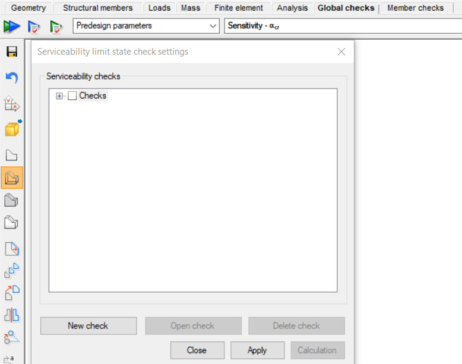

<!-- /wp:image -->

<!-- wp:paragraph -->

By clicking on the green arrow icon , a new dialog appears. The previously defined serviceability checks can be found, and it is also possible to open or delete the selected checks.

In order to create a new serviceability check, the **New check** button is to be clicked. The following checks can be performed:

- Horizontal displacement check

- Global vertical displacement check

- Vertical displacement check between member ends

- Relative displacement check for 2 points

- Seismic interstorey drift verification

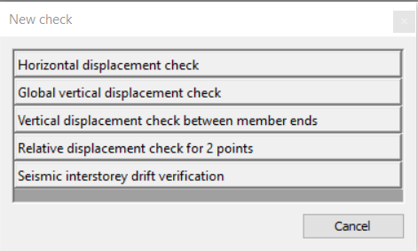

Each serviceability check dialog box begins with selecting the **load combinations** intended for examination. All the relevant load combinations are automatically listed. Users have the option to choose between calculation with first order or the highest available order analysis results.

<!-- /wp:paragraph -->

<!-- wp:image {"id":72378,"width":"584px","height":"auto","sizeSlug":"full","linkDestination":"none"} -->

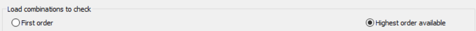

<!-- /wp:image -->

<!-- wp:paragraph -->

In the case of the first three checks, the dialog box has a common bottom section.

<!-- /wp:paragraph -->

<!-- wp:paragraph -->

In the **parameters** box, users can set the displacement limits for both total and live loads. These limits are expressed as a fraction of the reference length or height (for horizontal displacement checks). The denominator is user-defined.

<!-- /wp:paragraph -->

<!-- wp:image {"id":72398,"width":"584px","height":"auto","sizeSlug":"full","linkDestination":"none"} -->

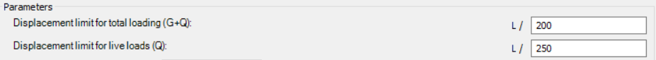

<!-- /wp:image -->

<!-- wp:paragraph -->

In the **Model portion** button, the user can specify whether the calculation should cover the entire model or only custom-defined sections. It is recommended to opt for calculations exclusively on custom components, as it minimizes calculation time and allows for obtaining desired results for each element type individually.

<!-- /wp:paragraph -->

<!-- wp:paragraph -->

The **Check** button facilitates a swift calculation, enabling users to confirm dominant results such as the dominant load combination, bar name, finite element point, dominant displacement, displacement limit, and utilization. The calculation can be performed even without using this quick check.

<!-- /wp:paragraph -->

<!-- wp:paragraph -->

To save the settings of the serviceability check, it is essential to click the **OK** button.

<!-- /wp:paragraph -->

<!-- wp:image {"id":72308,"width":"525px","height":"auto","sizeSlug":"full","linkDestination":"none"} -->

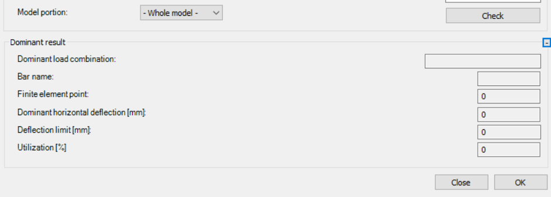

<!-- /wp:image -->

<!-- wp:paragraph -->

After selecting and checking all the checkboxes for the verifications that the user chooses to perform, by pressing the **Calculation** button, the checks can be executed.

<!-- /wp:paragraph -->

<!-- wp:image {"id":72328,"width":"343px","height":"auto","sizeSlug":"full","linkDestination":"none"} -->

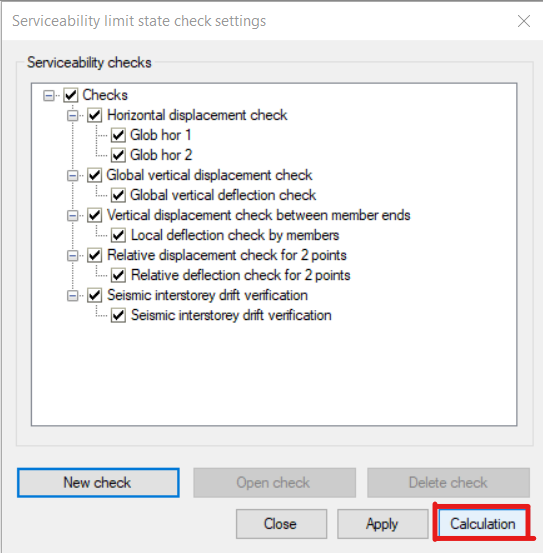

<!-- /wp:image -->

<!-- wp:paragraph -->

The results from the serviceability limit state checks, aligned with their dominant utilization and combinations, will be showcased in the lower section of the global checks window. Furthermore, the ultimate limit state check results will be visible if the verification was conducted.

<!-- /wp:paragraph -->

<!-- wp:image {"id":72318,"width":"627px","height":"auto","sizeSlug":"large","linkDestination":"none"} -->

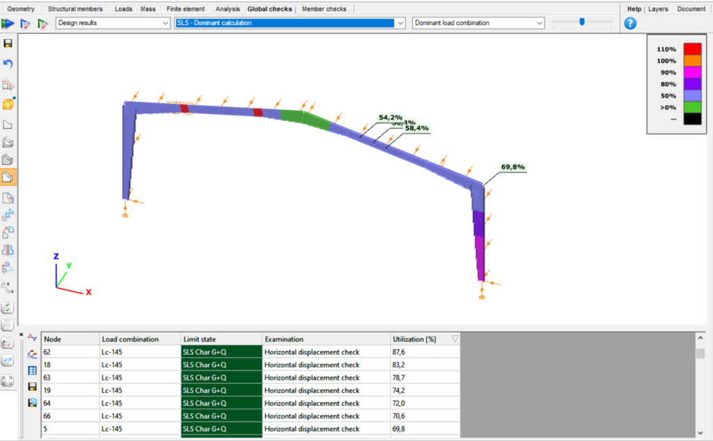

<!-- /wp:image -->

<!-- wp:paragraph -->

**Horizontal displacement check**

<!-- /wp:paragraph -->

<!-- wp:paragraph -->

The horizontal displacement check assesses the horizontal displacement of each node, comparing it against the specified limit based on the node's actual height.

<!-- /wp:paragraph -->

<!-- wp:paragraph -->

Users can choose to calculate every combination with first order results or with the highest order available.

<!-- /wp:paragraph -->

<!-- wp:paragraph -->

To enable the software to calculate the height (H) of every node, it's necessary to define the global Z coordinate of the reference level. Nodes with a global Z coordinate below the specified reference level are excluded from consideration.

<!-- /wp:paragraph -->

<!-- wp:paragraph -->

Displacement limits are applied to the load combinations based on their limit state.

<!-- /wp:paragraph -->

<!-- wp:paragraph -->

The verification process can be conducted either for the entire model or for a specified custom portion that has been predefined.

<!-- /wp:paragraph -->

<!-- wp:image {"id":72358,"width":"582px","height":"auto","sizeSlug":"full","linkDestination":"none"} -->

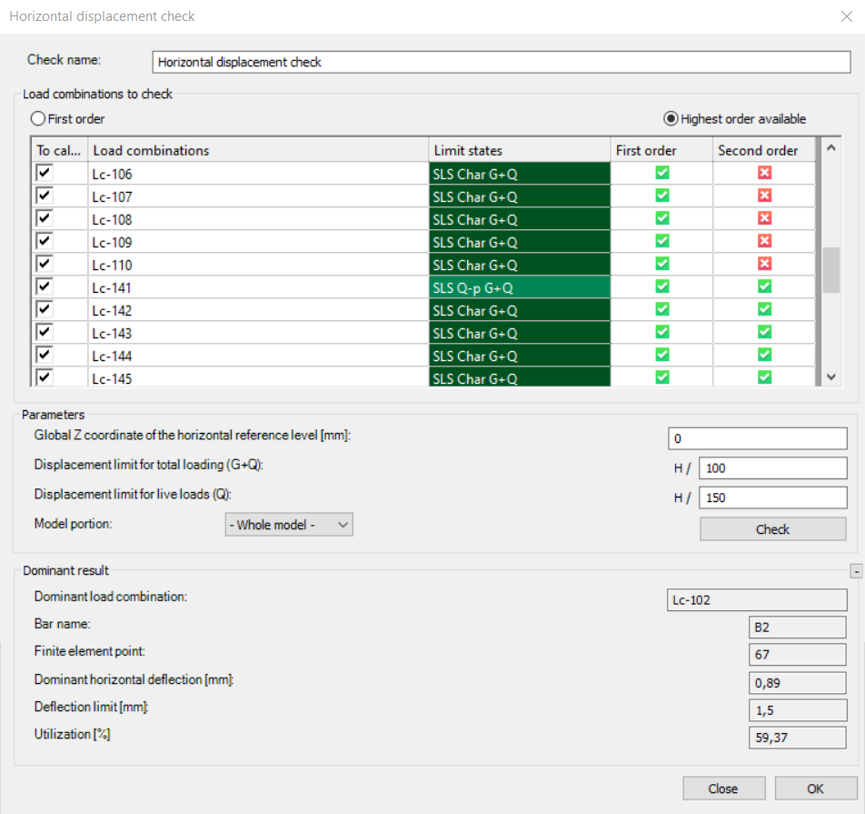

<!-- /wp:image -->

<!-- wp:paragraph -->

**Global vertical displacement check**

<!-- /wp:paragraph -->

<!-- wp:paragraph -->

The global vertical displacement check calculates the dominant vertical displacement and compares it to the displacement limit based on the provided reference length. The reference length needs to be established, which can be done either manually or by selecting two points in the model.

<!-- /wp:paragraph -->

<!-- wp:image {"id":72348,"width":"603px","height":"auto","sizeSlug":"full","linkDestination":"none"} -->

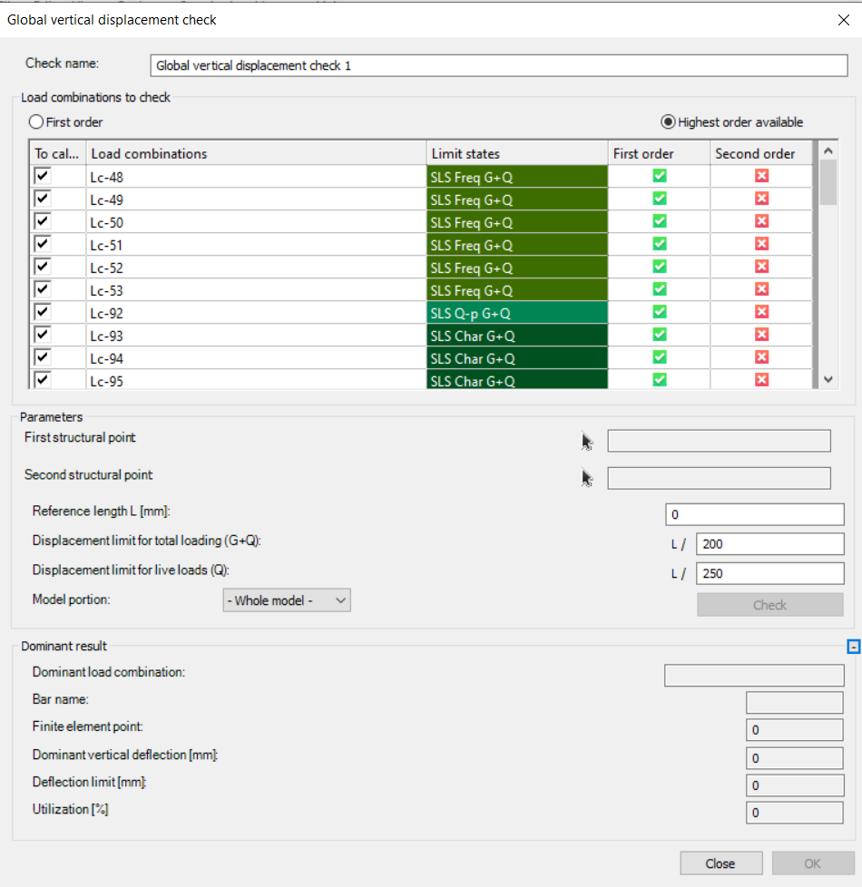

<!-- /wp:image -->

<!-- wp:paragraph -->

**Vertical displacement check between member ends**

<!-- /wp:paragraph -->

<!-- wp:paragraph -->

The vertical displacement check between member ends involves evaluating the local displacement across all beams in the model. This check calculates all nodes in the portion, but it has more practical significance for horizontal beams, meaning members situated in the XY plane.

<!-- /wp:paragraph -->

<!-- wp:paragraph -->

Local displacement check between member ends may not be sufficient for cantilever beams; it's more appropriate for beams supported by two other beams or supports on both ends.

<!-- /wp:paragraph -->

<!-- wp:image {"id":72438,"width":"608px","height":"auto","sizeSlug":"full","linkDestination":"none"} -->

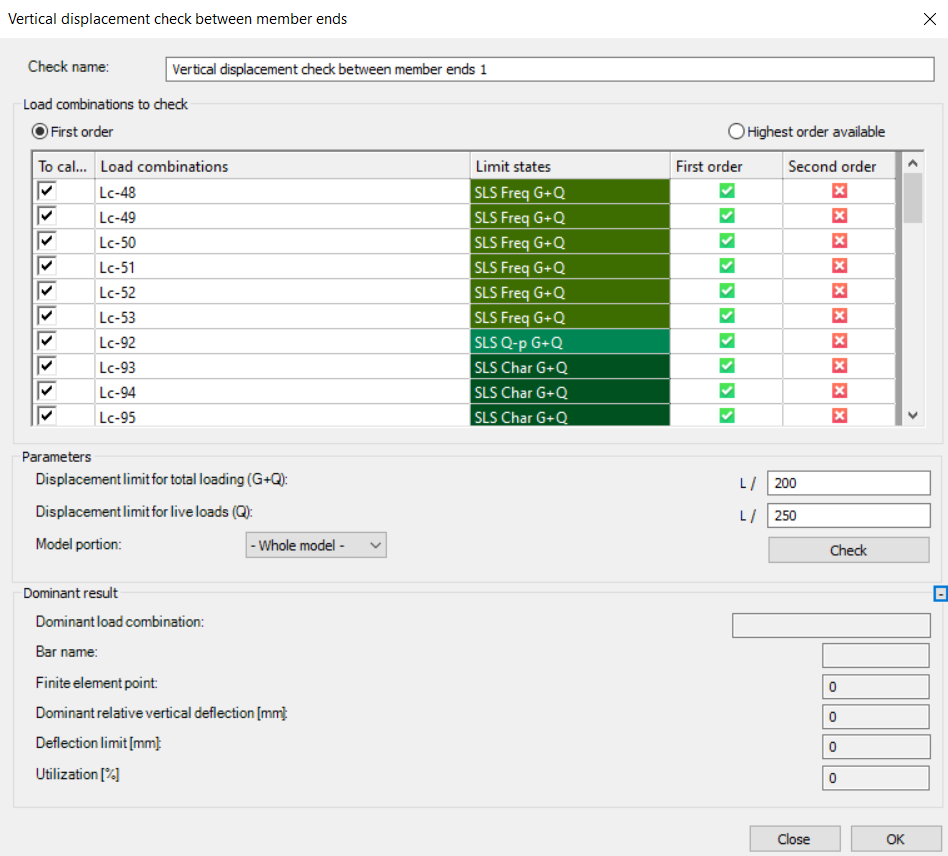

<!-- /wp:image -->

<!-- wp:paragraph -->

**Relative displacement check for 2 points**

<!-- /wp:paragraph -->

<!-- wp:paragraph -->

A relative displacement check for two points can be initiated by clicking on those two points. Users have the option to choose between relative horizontal or vertical deflection checks, and these checks can be executed after setting the deflection limits for each direction.

<!-- /wp:paragraph -->

<!-- wp:image {"id":72408,"sizeSlug":"full","linkDestination":"none"} -->

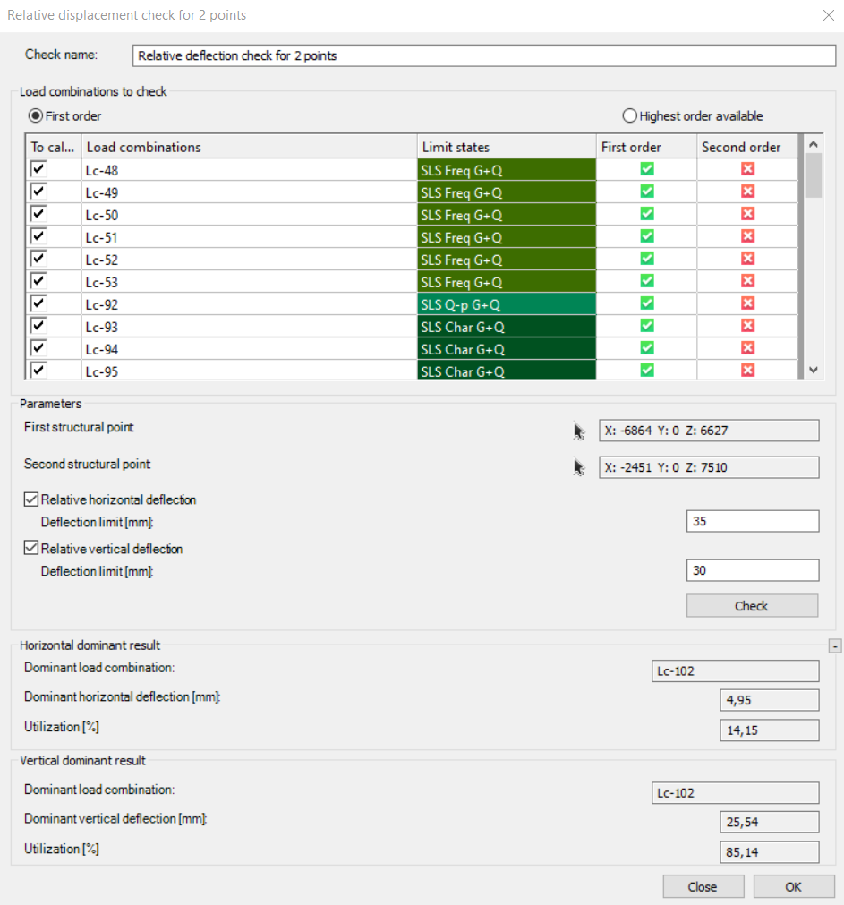

<!-- /wp:image -->

<!-- wp:paragraph -->

**Seismic interstorey drift verification**

<!-- /wp:paragraph -->

<!-- wp:paragraph -->

The prerequisite for performing the check is the existence of the storeys defined in the model and the completion of the seismic analysis. The reduction factor must be given, and the displacement limit selected according to the structure by the users.

<!-- /wp:paragraph -->

<!-- wp:image {"id":72418,"width":"370px","height":"auto","sizeSlug":"full","linkDestination":"none"} -->

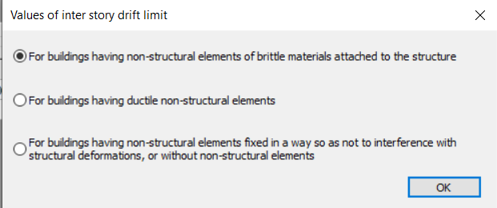

<!-- /wp:image -->

<!-- wp:paragraph -->

After the check is performed, it calculates horizontal displacements in both directions among all adjacent levels and showcases the maximum displacement. Furthermore, it provides information on the dominant load combination and utilization.

<!-- /wp:paragraph -->

<!-- wp:paragraph -->

This check button operates similarly to the previous ones. While the quick check is optional, to capture and store the results for each investigated point, we must save the settings using the **OK** button. Then, we need to calculate along with all the selected checks.

<!-- /wp:paragraph -->

<!-- wp:image {"id":72428,"width":"575px","height":"auto","sizeSlug":"large","linkDestination":"none"} -->

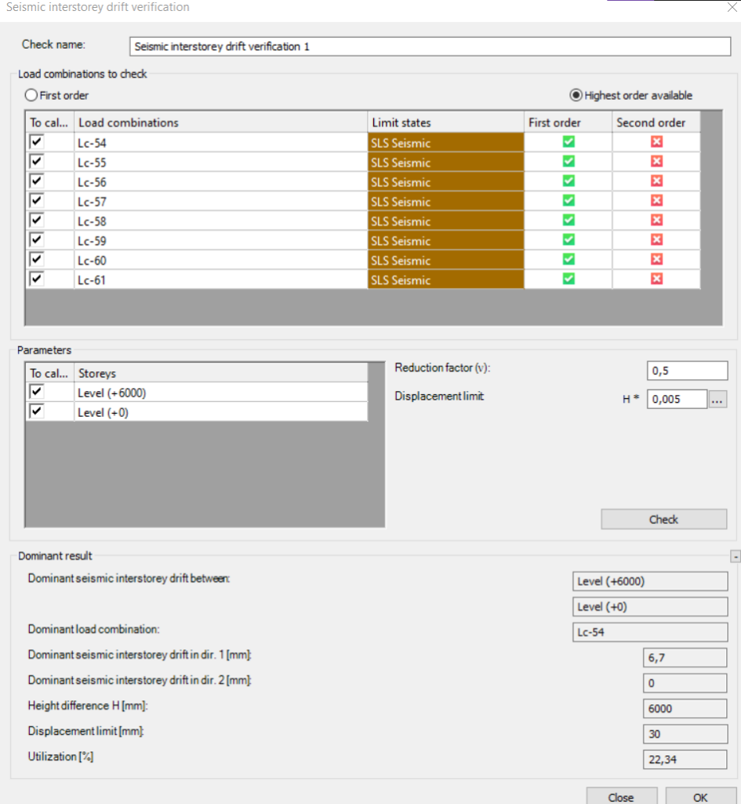

<!-- /wp:image -->

<!-- wp:paragraph -->

**Consteel 16**

<!-- /wp:paragraph -->

<!-- wp:heading {"level":3} -->

### Basics

<!-- /wp:heading -->

<!-- wp:paragraph -->

All serviceability-related functions can be found on the **Serviceability tab**. By clicking on the blue arrow icon a new dialog appears. The previously defined serviceability checks can be found and it is also possible to open or delete the selected checks.

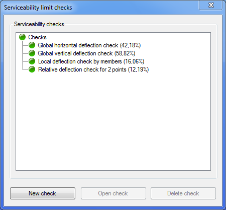

In order to create a new serviceability check, the **New check** button is clicked. The following checks can be performed:

- Global horizontal deflection check

- Global vertical deflection check

- Local deflection check by members

- Relative deflection check for 2 points

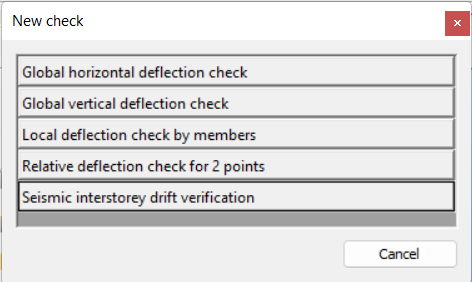

### Global horizontal deflection check

A global horizontal deflection check can be used to check the biggest horizontal deflection in the model. First- or Second-order analysis can be selected just like the serviceability load combinations that need to be considered.

Reference height can be typed in or two points can be selected, and the program calculates the height distance between them. Check is done after clicking the **Calculation** button. The dominant member is automatically selected in the model space to make the interpretation easier.

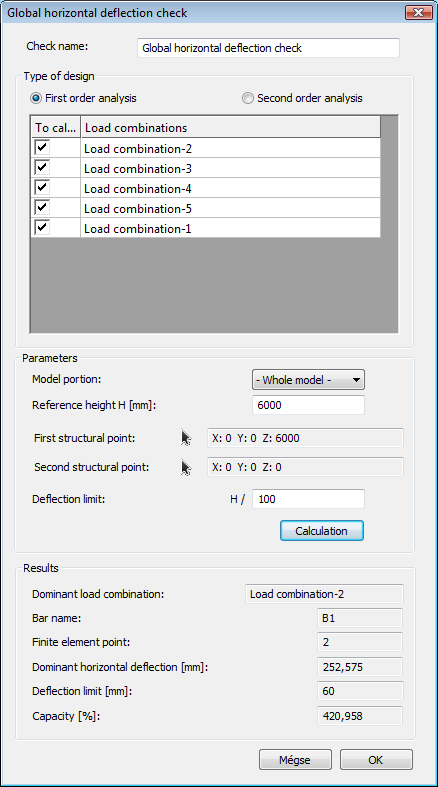

### Global vertical deflection check

The global vertical deflection check works similarly to the global horizontal deflection check. There is just a minor difference which is the following: reference length has to be set instead of reference height. This can be set manually or by clicking two points on the model.

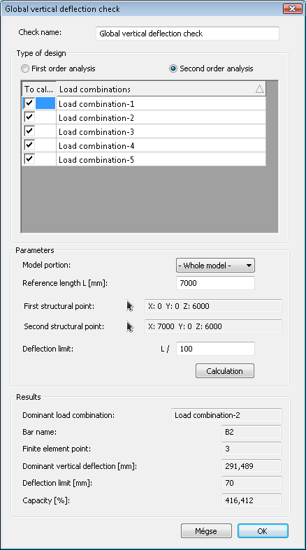

### Local deflection check by members

Local deflection check by members goes through all the beams in the model, checks the local deflection, and then selects the maximum. This check is suitable only for horizontal beams i.e. members in the XY plane.

Local deflection check by members is not adequate for cantilever beams just for beams supported by two other beams or supports on both ends.

## Relative deflection check for 2 points

A relative deflection check for 2 points can be used for two clicked points. The relative horizontal or vertical check can be selected and performed.

## Seismic interstorey drift verification

The prerequisite for performing the check is the existence of the levels defined in the model and the completion of the seismic analysis. The check calculates the horizontal displacements in both directions between all the established adjacent levels and displays the maximum of these displacements, together with the dominant load combination and the names of the levels.

