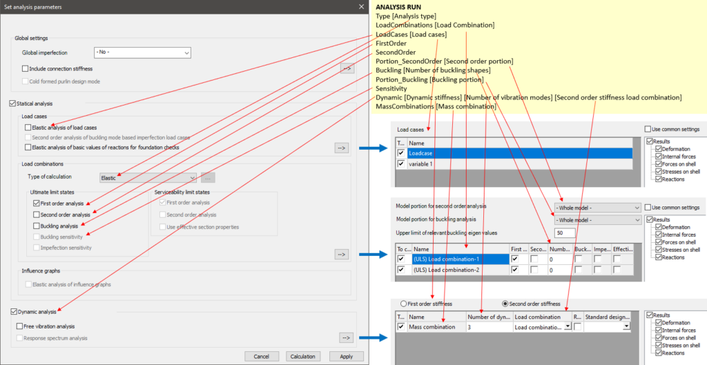

<!-- wp:paragraph -->

Starts an analysis run.

<!-- /wp:paragraph -->

<!-- wp:heading {"level":3} -->

### Syntax

<!-- /wp:heading -->

<!-- wp:paragraph -->

**ANALYSIS RUN**  
Type  
LoadCombinations  
LoadCases  
FirstOrder  
SecondOrder  
Portion_SecondOrder  
Buckling  
Portion_Buckling  
Sensitivity  
Dynamic  
MassCombinations

<!-- /wp:paragraph -->

<!-- wp:heading {"level":3} -->

### Command attributes

<!-- /wp:heading -->

<!-- wp:paragraph -->

Code lines directly after the ANALYSIS RUN command can set certain attributes of the analysis. The "Type" and "LoadCombinations" lines are always necessary, while the other ones are optional.

<!-- /wp:paragraph -->

<!-- wp:paragraph -->

Available command attributes:

<!-- /wp:paragraph -->

<!-- wp:table {"className":"is-style-stripes"} -->

|                       |               |                                                                |
| --------------------- | ------------- | -------------------------------------------------------------- |
| **Command attribute** | **Inclusion** | **Description**                                                |
| Type                  | Required      | Controls the static analysis type                              |
| LoadCombinations      | Required      | Controls the considered load combinations                      |
| LoadCases             | Optional      | Requests the separate analysis of load cases                   |
| FirstOrder            | Optional      | Requests first order analysis                                  |
| SecondOrder           | Optional      | Requests second order analysis                                 |
| Portion_SecondOrder   | Optional      | Sets portion used for second order analysis                    |
| Buckling              | Optional      | Requests buckling analysis                                     |
| Portion_Buckling      | Optional      | Sets portion used for buckling analysis                        |
| Sensitivity           | Optional      | Requests buckling sensitivity analysis                         |
| Dynamic               | Optional      | Requests dynamic analysis                                      |
| MassCombinations      | Optional      | Controls the considered mass combinations for dynamic analysis |

<!-- /wp:table -->

<!-- wp:heading {"level":3} -->

### Command parameters

<!-- /wp:heading -->

<!-- wp:table {"className":"is-style-stripes"} -->

|                                                                                     |                |                                                    |                   |
| ----------------------------------------------------------------------------------- | -------------- | -------------------------------------------------- | ----------------- |
| **Command parameter**                                                               | **Assignment** | **Value format**                                   | **Input options** |
| [Analysis type](#Analysis-type)                                                     | Required       | [Predefined strings](#Available-analysis-types)    | Local, variable   |
| [Load Combination](#Load-combination)                                               | Required       | Load combination name or ID(s)                     | Local, variable   |
| [Load cases](#Load-cases)                                                           | Optional       | Load case name or ID(s)                            | Local, variable   |
| [Second order portion](#Second-order-portion)                                       | Optional       | Portion ID                                         | Local, variable   |
| [Number of buckling shapes](#Number-of-buckling-shapes)                             | Optional       | Integer                                            | Local, variable   |
| [Buckling portion](#Buckling-portion)                                               | Optional       | Portion ID                                         | Local, variable   |
| [Dynamic stiffness](#Dynamic-stiffness)                                             | Optional       | [Predefined strings](#Available-stiffness-options) | Local, variable   |
| [Number of vibration modes](#Number-of-vibration-modes)                             | Optional       | Integer                                            | Local, variable   |
| [Second order stiffness load combination](#Second-order-stiffness-load-combination) | Optional       | Load combination name or ID                        | Local, variable   |
| [Mass combination](#Mass-combination)                                               | Optional       | Mass case name or ID(s)                            | Local, variable   |

<!-- /wp:table -->

<!-- wp:heading {"level":4} -->

#### Analysis type:

<!-- /wp:heading -->

<!-- wp:paragraph -->

Type of the analysis.

<!-- /wp:paragraph -->

<!-- wp:paragraph -->

Available analysis types:

<!-- /wp:paragraph -->

<!-- wp:list -->

- Elastic
- Plastic

<!-- /wp:list -->

<!-- wp:heading {"level":4} -->

#### Load combination:

<!-- /wp:heading -->

<!-- wp:paragraph -->

Load combinations considered during the analysis run. The accepted input is either a single load combination ID or an array containing multiple load combination IDs. The name of the load combination is also an accepted input with this syntax: "NAME: "

<!-- /wp:paragraph -->

<!-- wp:heading {"level":4} -->

#### Load cases:

<!-- /wp:heading -->

<!-- wp:paragraph -->

If the "LoadCases" line is included after the ANALYSIS RUN command, then the elastic calculation of certain load cases can be requested as a part of the analysis run.

<!-- /wp:paragraph -->

<!-- wp:paragraph -->

The accepted input after the "LoadCases" is either a single load case ID or an array containing multiple load case IDs. The name of the load case is also an accepted input with this syntax: "NAME: "

<!-- /wp:paragraph -->

<!-- wp:heading {"level":4} -->

#### Second order portion:

<!-- /wp:heading -->

<!-- wp:paragraph -->

Sets the portion used for the second order analysis.

<!-- /wp:paragraph -->

<!-- wp:heading {"level":4} -->

#### Number of buckling shapes:

<!-- /wp:heading -->

<!-- wp:paragraph -->

The number of buckling shapes to be calculated.

<!-- /wp:paragraph -->

<!-- wp:heading {"level":4} -->

#### Buckling portion:

<!-- /wp:heading -->

<!-- wp:paragraph -->

Sets the portion used for the buckling analysis.

<!-- /wp:paragraph -->

<!-- wp:heading {"level":4} -->

#### Dynamic stiffness:

<!-- /wp:heading -->

<!-- wp:paragraph -->

Controls the stiffness options used for dynamic analysis.

<!-- /wp:paragraph -->

<!-- wp:paragraph -->

Available stiffness options:

<!-- /wp:paragraph -->

<!-- wp:list -->

- FirstOrderStiffness
- SecondOrderStiffness

<!-- /wp:list -->

<!-- wp:heading {"level":4} -->

#### Number of vibration modes:

<!-- /wp:heading -->

<!-- wp:paragraph -->

Controls the number of vibration modes calculated for dynamic analysis.

<!-- /wp:paragraph -->

<!-- wp:heading {"level":4} -->

#### Second order stiffness load combination:

<!-- /wp:heading -->

<!-- wp:paragraph -->

This parameter is only required if the "Stiffness" parameter is set to "SecondOrderStiffness". In this case the stiffnesses considered in the dynamic analysis are going to be influenced by the loading, therefore a load combination has to be chosen, from which the loading is taken into account.

<!-- /wp:paragraph -->

<!-- wp:paragraph -->

The accepted input is a single load combination ID or the name of the load combination with this syntax: "NAME: "

<!-- /wp:paragraph -->

<!-- wp:heading {"level":4} -->

#### Mass combination:

<!-- /wp:heading -->

<!-- wp:paragraph -->

This is only used if dynamic analysis is requested with the line starting with "Dynamic". In that case it has to be specified which mass combinations are to be used for the dynamic analysis.

<!-- /wp:paragraph -->

<!-- wp:paragraph -->

The accepted input after the "MassCombinations" is either a single mass combination ID or an array containing multiple mass combination IDs. The name of the mass combination is also an accepted input with this syntax: "NAME: "

<!-- /wp:paragraph -->

<!-- wp:heading {"level":3} -->

### Description

<!-- /wp:heading -->

<!-- wp:paragraph -->

Starts an analysis run.

<!-- /wp:paragraph -->

<!-- wp:paragraph -->

Several options of an anlysis can be controlled by command attributes and parameters. The analogous counterparts of these in the Consteel user interface are the following:

<!-- /wp:paragraph -->

<!-- wp:image {"id":29654,"sizeSlug":"large","linkDestination":"media"} -->

[](https://consteelsoftware.com/wp-content/uploads/2021/12/image.png)

<!-- /wp:image -->

<!-- wp:heading {"level":3} -->

### Sample code:

<!-- /wp:heading -->

<!-- wp:heading {"level":4} -->

#### Example 1 (Simplest form):

<!-- /wp:heading -->

<!-- wp:loos-hcb/code-block -->

```
ANALYSIS RUN
Type Elastic
LoadCombinations "NAME: Load Combination-1"
FirstOrder
```

<!-- /wp:loos-hcb/code-block -->

<!-- wp:heading {"level":4} -->

#### Example 2 (With getting load combination and load case IDs):

<!-- /wp:heading -->

<!-- wp:loos-hcb/code-block -->

```
FILTER LoadCombinationIDs
objecttypes Loadcombination

ARRAY_GET LoadCombinationIDs 0 LComb_ID0

FILTER LoadCaseIDs
objecttypes Loadcase

ANALYSIS RUN
Type Elastic
LoadCombinations $LComb_ID0
LoadCases LoadCaseIDs
FirstOrder
```

<!-- /wp:loos-hcb/code-block -->

<!-- wp:heading {"level":4} -->

#### Example 3 (Plastic):

<!-- /wp:heading -->

<!-- wp:loos-hcb/code-block -->

```
ANALYSIS RUN
Type Plastic
LoadCombinations "NAME: Load Combination-1"
SecondOrder
Buckling 5
Sensitivity
```

<!-- /wp:loos-hcb/code-block -->

<!-- wp:heading {"level":4} -->

#### Example 4 (With buckling and dynamic analysis):

<!-- /wp:heading -->

<!-- wp:loos-hcb/code-block -->

```
ANALYSIS RUN
Type Elastic
LoadCombinations "NAME: Load Combination-1"
MassCombinations "NAME: Mass combination"
FirstOrder
SecondOrder
Buckling 3
Dynamic FirstOrderStiffness 4
```

<!-- /wp:loos-hcb/code-block -->

<!-- wp:heading {"level":4} -->

#### Example 5 (Dynamic analysis second order stiffness):

<!-- /wp:heading -->

<!-- wp:loos-hcb/code-block -->

```
ANALYSIS RUN
Type Elastic
LoadCombinations "NAME: Load Combination-1"
MassCombinations "NAME: Mass combination"
FirstOrder
SecondOrder
Dynamic SecondOrderStiffness 3 "NAME: Load Combination-1"
```

<!-- /wp:loos-hcb/code-block -->
