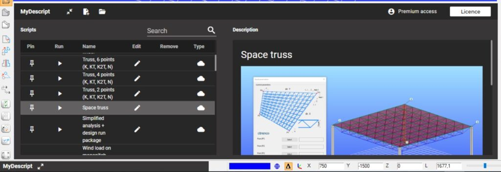
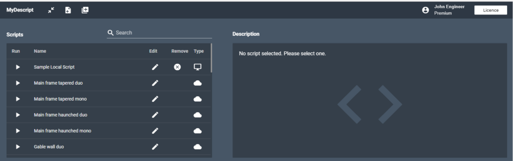
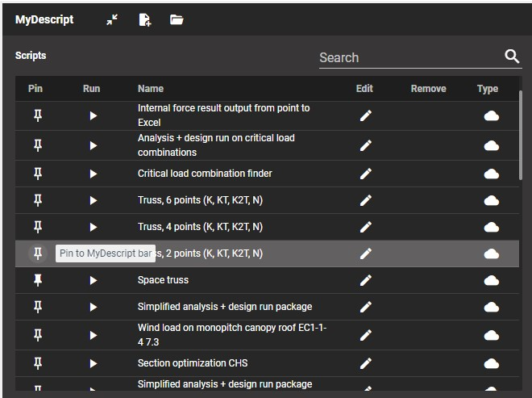
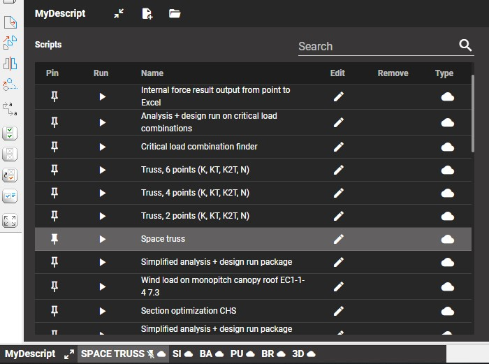
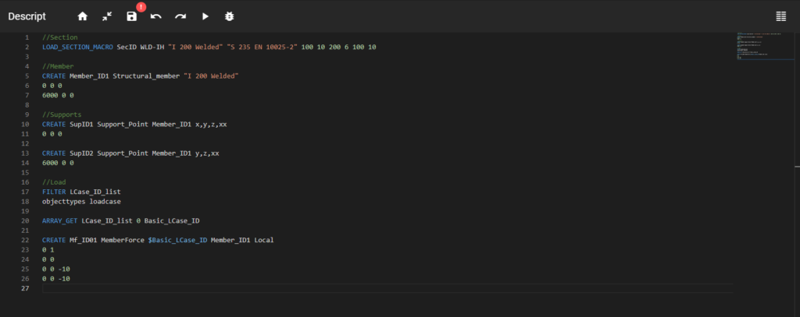
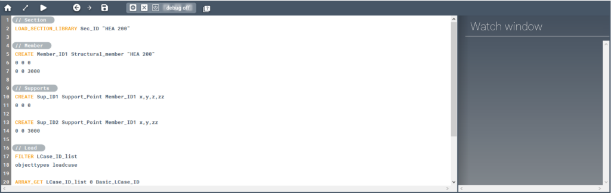
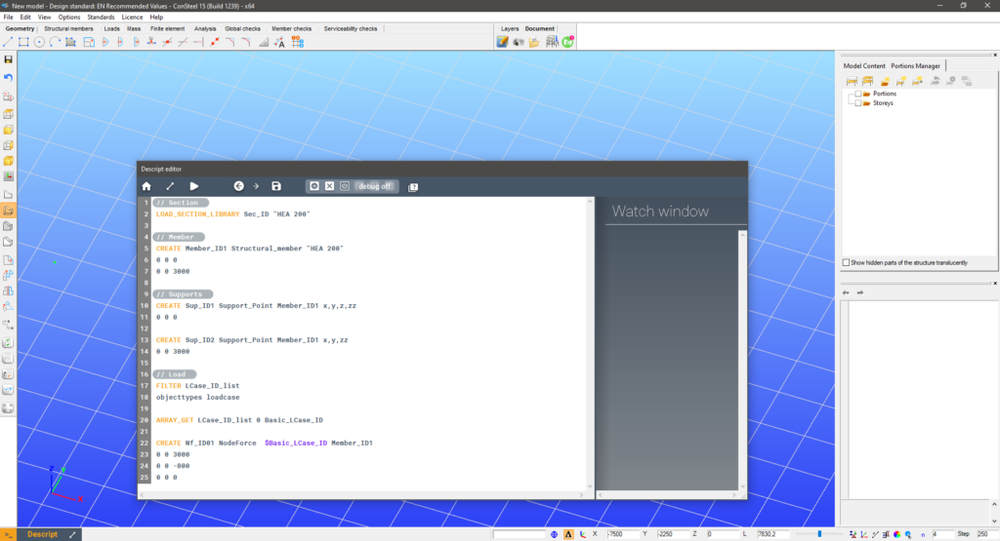

# Maximized size

<!-- /wp:heading -->

<!-- wp:paragraph -->

After opening up the Descript panel to its maximized state, further functionalities become available. There are 2 parts of the Descript module. First, we are greeted by the MyDescript interface.

<!-- /wp:paragraph -->

<!-- wp:heading {"level":4} -->

## MyDescript

<!-- /wp:heading -->

<!-- wp:image {"id":44223,"sizeSlug":"large","linkDestination":"media"} -->

MyDescript interface in Consteel 16

<!-- /wp:image -->

<!-- wp:image {"id":28419,"sizeSlug":"large","linkDestination":"media"} -->

MyDescript interface in Consteel 15

<!-- /wp:image -->

<!-- wp:paragraph -->

This interface is designed to manage your own scripts stored on your computer and to access online scripts provided by Consteel.

<!-- /wp:paragraph -->

<!-- wp:paragraph -->

In the header to the left there are 3 buttons with the following functions:

<!-- /wp:paragraph -->

<!-- wp:paragraph -->

 Close the Descript panel to its minimized state

<!-- /wp:paragraph -->

<!-- wp:paragraph -->

 Open the code editor and start a new script

<!-- /wp:paragraph -->

<!-- wp:paragraph -->

 Add an existing script file from the computer to the script list below

<!-- /wp:paragraph -->

<!-- wp:paragraph -->

In the header to the right, the user name and membership level are displayed. Also, there is the Licence button.

<!-- /wp:paragraph -->

<!-- wp:paragraph -->

 Open the licence settings window.

<!-- /wp:paragraph -->

<!-- wp:paragraph -->

In the main body to the left, there is the **Script list**, where all the local and online scripts are listed. The different types are shown with different icons in the Type column. Here you can run, edit or remove scripts by clicking the respective buttons in the rows of the individual scripts.

<!-- /wp:paragraph -->

<!-- wp:paragraph -->

 Run the script

<!-- /wp:paragraph -->

<!-- wp:paragraph -->

 Edit the script

<!-- /wp:paragraph -->

<!-- wp:paragraph -->

 Remove the script from the list (this does not delete the script file from the computer)

<!-- /wp:paragraph -->

<!-- wp:paragraph -->

Scripts can also be searched with the **search bar **above the script list.

<!-- /wp:paragraph -->

<!-- wp:paragraph -->

In the main body to the right there is the **Description area**. Here a picture and a description is displayed for the selected script.

<!-- /wp:paragraph -->

<!-- wp:paragraph -->

After either starting a new script or editing one from the list the Descript panel switches to the code editor view.

<!-- /wp:paragraph -->

<!-- wp:heading {"level":4} -->

## Quick launch toolbar (Consteel 16 and up)

<!-- /wp:heading -->

<!-- wp:paragraph -->

In Consteel 16, you can select your favorite Descript scripts and pin them to the bottom bar to make them instantly available and ready for your work.

<!-- /wp:paragraph -->

<!-- wp:paragraph -->

**Creating a quick launch option for script**s

<!-- /wp:paragraph -->

<!-- wp:paragraph -->

Open the MyDescript screen and click on the Pin icon next to the chosen script and the script will be available to start instantly for the Descript bar at the left bottom. Click on the Pin icon again to unpin the script.

<!-- /wp:paragraph -->

<!-- wp:image {"align":"center","id":44186,"sizeSlug":"full","linkDestination":"none"} -->

_Click on the Pin icon to pin a script to the quick launch bar_

<!-- /wp:image -->

<!-- wp:paragraph -->

Pinned scripts will have a two letter mosaic word from their names and a cloud or computer icon which indicates if they are cloud or local scripts. Hovering with the mouse cursor over the pinned scripts will show their full name. You can also unpin scripts while hovering as an “unpin” icon will appear next to the script’s name.

<!-- /wp:paragraph -->

<!-- wp:image {"align":"center","id":44193,"sizeSlug":"full","linkDestination":"none"} -->

_Hover with your mouse cursor over the pinned script to reveal it’s full name_

<!-- /wp:image -->

<!-- wp:heading {"level":4} -->

## Code editor (new, Consteel 15 build 1484 and up)

<!-- /wp:heading -->

<!-- wp:paragraph -->

The code editor is designed to write, modify and debug Descript codes.

<!-- /wp:paragraph -->

<!-- wp:image {"id":34144,"sizeSlug":"large","linkDestination":"media"} -->

<!-- /wp:image -->

<!-- wp:paragraph -->

In the header on the left there are several buttons with the following functions:

<!-- /wp:paragraph -->

<!-- wp:paragraph -->

 Switch back to the MyDescript view

<!-- /wp:paragraph -->

<!-- wp:paragraph -->

 Close the Descript panel to its minimized state

<!-- /wp:paragraph -->

<!-- wp:paragraph -->

 Save

<!-- /wp:paragraph -->

<!-- wp:paragraph -->

 Undo/redo last edit

<!-- /wp:paragraph -->

<!-- wp:paragraph -->

 Run the script

<!-- /wp:paragraph -->

<!-- wp:paragraph -->

 Start debugging. More on that at the [Debugging](https://consteelsoftware.com/manual/descript-cspi/debugging/) page

<!-- /wp:paragraph -->

<!-- wp:paragraph -->

 In the header on the right there is the button for the watch window. More on that at the [Debugging](https://consteelsoftware.com/manual/descript-cspi/debugging/) page

<!-- /wp:paragraph -->

<!-- wp:paragraph -->

Below the header there is the **code input area**. This is where variables, cycles, commands can be defined, and will be executed line-by-line after the Run button is clicked. On the left, code lines are numbered. To the right of the code input area, there is a miniaturized view of the code currently in the editor, which acts as a second scrollbar for easier navigation within the code.

<!-- /wp:paragraph -->

<!-- wp:paragraph -->

The editor applies different colors for commands, variables etc.. The color coding scheme is the following:

<!-- /wp:paragraph -->

<!-- wp:image {"id":34224,"sizeSlug":"full","linkDestination":"media"} -->

<!-- /wp:image -->

<!-- wp:paragraph -->

**Code editor features**

<!-- /wp:paragraph -->

<!-- wp:paragraph -->

Command info box

<!-- /wp:paragraph -->

<!-- wp:paragraph -->

If the mouse pointer is placed over a command, a box will appear with basic information about the command. The info box contains the following data:

<!-- /wp:paragraph -->

<!-- wp:list -->

- Short description of the command
- Syntax of the command (optional parameters are not shown here)
- Link to the user manual page of the command

<!-- /wp:list -->

<!-- wp:image {"id":34503,"sizeSlug":"full","linkDestination":"media"} -->

<!-- /wp:image -->

<!-- wp:paragraph -->

Auto search

<!-- /wp:paragraph -->

<!-- wp:paragraph -->

The editor automatically searches within all the already used variable names and all commands for the text already typed. The search results appear in a box around the cursor. The list of results can be navigated with the arrow buttons and an item can be selected with an Enter.

<!-- /wp:paragraph -->

<!-- wp:image {"id":34495,"sizeSlug":"full","linkDestination":"media"} -->

<!-- /wp:image -->

<!-- wp:paragraph -->

Autocomplete + insert

<!-- /wp:paragraph -->

<!-- wp:paragraph -->

After an item is selected from the search results, the selected item gets inserted into the editor. There are 3 different type of inserts:

<!-- /wp:paragraph -->

<!-- wp:list -->

- **Variable name  
  **Completes the variable name
- **Field insert (for, if)**  
  Inserts a multi-line code segment with the empty structure of the selected item
- **Command**  
  Completes the command, and if there are required parameters for the command then inserts some text for the parameters and enters the parameter definition mode. In this mode parameters can be easily defined. Just type the desired parameter value then switch between parameters with Tab (forward) and Shift+Tab (backward). Exit parameter definition mode with Esc.

<!-- /wp:list -->

<!-- wp:paragraph -->

Additional code editing features

<!-- /wp:paragraph -->

<!-- wp:paragraph -->

The code editor provides a lot of additional code editing features to make coding more efficient. To view the full list of code editing features, click with the right mouse button and select Command palette.

<!-- /wp:paragraph -->

<!-- wp:image {"id":34511,"sizeSlug":"full","linkDestination":"media"} -->

<!-- /wp:image -->

<!-- wp:paragraph -->

Here is a selection with the most useful ones of these features.

<!-- /wp:paragraph -->

<!-- wp:paragraph -->

Additional code editing features highlight:

<!-- /wp:paragraph -->

<!-- wp:table {"className":"is-style-stripes"} -->

|                        |                       |                                                                |
| ---------------------- | --------------------- | -------------------------------------------------------------- |
| **Feature**            | **Keyboard shortcut** | **Description**                                                |
| Command palette        | F1                    | Lists all code editing features                                |
| List inserts           | Ctrl+Space            | Lists all variable names in the code and commands              |
| Find                   | Ctrl+F                | Searches the code for a given text                             |
| Replace                | Ctrl+H                | Replaces given text strings with different text                |
| Move line up           | Alt+↑                 | Moves selected code line up                                    |
| Move line down         | Alt+↓                 | Moves selected code line down                                  |
| Change all occurrences | Ctrl+F2               | Changes all occurrences of selected text                       |
| Add line comment       | -                     | Adds "//" in front of all selected lines to make them comments |
| Remove line comment    | -                     | Removes "//" from the front of all selected lines              |

<!-- /wp:table -->

<!-- wp:heading {"level":4} -->

### Code editor (in Consteel 14 and earlier versions)

<!-- /wp:heading -->

<!-- wp:paragraph -->

The code editor is designed to write, modify and debug Descript codes.

<!-- /wp:paragraph -->

<!-- wp:image {"id":28425,"sizeSlug":"large","linkDestination":"media"} -->

<!-- /wp:image -->

<!-- wp:paragraph -->

In the header on the left there are several buttons with the following functions:

<!-- /wp:paragraph -->

<!-- wp:paragraph -->

 Switch back to the MyDescript view

<!-- /wp:paragraph -->

<!-- wp:paragraph -->

 Close the Descript panel to its minimized state

<!-- /wp:paragraph -->

<!-- wp:paragraph -->

 Run the script

<!-- /wp:paragraph -->

<!-- wp:paragraph -->

 Undo/redo last edit

<!-- /wp:paragraph -->

<!-- wp:paragraph -->

 Save the script

<!-- /wp:paragraph -->

<!-- wp:paragraph -->

 Debugging controls. More on that at the [Debugging](https://consteelsoftware.com/manual/descript-cspi/debugging/) page

<!-- /wp:paragraph -->

<!-- wp:paragraph -->

 Open the Descript manual in a web browser

<!-- /wp:paragraph -->

<!-- wp:paragraph -->

Below the header on the left there is the **code input area**. This is where variables, cycles, commands can be defined, and will be executed line-by-line after the Run button is clicked.

<!-- /wp:paragraph -->

<!-- wp:paragraph -->

In the editor, lines are numbered on the left for easier navigation within the code.

<!-- /wp:paragraph -->

<!-- wp:paragraph -->

The editor applies different colors for commands, variables, cycles etc.. The color coding scheme is the following:

<!-- /wp:paragraph -->

<!-- wp:image {"id":23471,"sizeSlug":"full","linkDestination":"media"} -->

<!-- /wp:image -->

<!-- wp:paragraph -->

In the main body to the right there is the watch window. More on that at the [Debugging](https://consteelsoftware.com/manual/descript-cspi/debugging/) page.

<!-- /wp:paragraph -->

<!-- wp:paragraph -->

The code editor can also be separated from the main Consteel window and docked back with a double click on the header.

<!-- /wp:paragraph -->

<!-- wp:image {"id":28490,"sizeSlug":"large","linkDestination":"media"} -->

<!-- /wp:image -->
