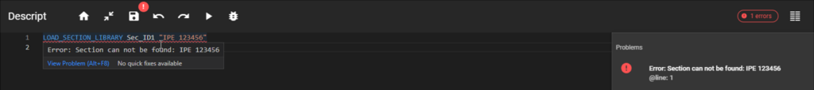

# Code check

<!-- /wp:heading -->

<!-- wp:paragraph -->

Code check results are displayed after a script run is attempted and warnings or errors are found.

<!-- /wp:paragraph -->

<!-- wp:paragraph -->

The code check differentiates 2 types of (potential) issues found in the code:

<!-- /wp:paragraph -->

<!-- wp:paragraph {"align":"justify"} -->

**Warning**: The code line that produces the warning is underlined with yellow. The warning message states the reason for the warning. Warnings do not prevent the code from running properly.

<!-- /wp:paragraph -->

<!-- wp:paragraph -->

Warning messages are displayed if the "warnings" text is clicked on the right side, or if the mouse pointer is placed over the underlined row.

<!-- /wp:paragraph -->

<!-- wp:image {"id":34424,"sizeSlug":"large","linkDestination":"media"} -->

<!-- /wp:image -->

<!-- wp:paragraph -->

**Error**: The code line that produces the error is underlined with red. The error message states the reason for the error. Errors prevent the code from running properly.

<!-- /wp:paragraph -->

<!-- wp:paragraph -->

Error messages are displayed if the "errors" text is clicked on the right side, or if the mouse pointer is placed over the underlined row.

<!-- /wp:paragraph -->

<!-- wp:image {"id":34440,"sizeSlug":"large","linkDestination":"media"} -->

<!-- /wp:image -->

<!-- wp:heading {"level":3} -->