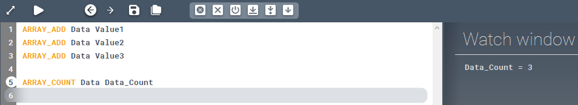

<!-- wp:paragraph -->

Counts the items in an array.

<!-- /wp:paragraph -->

<!-- wp:heading {"level":3} -->

### Syntax

<!-- /wp:heading -->

<!-- wp:paragraph -->

**ARRAY_COUNT **

<!-- /wp:paragraph -->

<!-- wp:heading {"level":3} -->

### Command parameters

<!-- /wp:heading -->

<!-- wp:table {"className":"is-style-stripes"} -->

|                                     |                |                  |                   |
| ----------------------------------- | -------------- | ---------------- | ----------------- |
| **Command parameter**               | **Assignment** | **Value format** | **Input options** |
| [Array name](#Array-name)           | Required       | String           | Local, variable   |
| [Result variable](#Result-variable) | Required       | String           | Local, variable   |

<!-- /wp:table -->

<!-- wp:heading {"level":4} -->

#### Array name:

<!-- /wp:heading -->

<!-- wp:paragraph -->

Name of the array.

<!-- /wp:paragraph -->

<!-- wp:heading {"level":4} -->

#### Result variable:

<!-- /wp:heading -->

<!-- wp:paragraph -->

Name of the variable that will store the result of the counting.

<!-- /wp:paragraph -->

<!-- wp:heading {"level":3} -->

### Description

<!-- /wp:heading -->

<!-- wp:paragraph -->

Counts how many items are stored in an array. The result of the counting will be saved in a variable.

<!-- /wp:paragraph -->

<!-- wp:heading {"level":3} -->

### Sample code:

<!-- /wp:heading -->

<!-- wp:heading {"level":4} -->

#### Command only:

<!-- /wp:heading -->

<!-- wp:loos-hcb/code-block -->

```
ARRAY_COUNT Data Data_Count
```

<!-- /wp:loos-hcb/code-block -->

<!-- wp:heading {"level":4} -->

#### With added prerequisites (array fill):

<!-- /wp:heading -->

<!-- wp:loos-hcb/code-block -->

```
ARRAY_ADD Data Value1
ARRAY_ADD Data Value2
ARRAY_ADD Data Value3

ARRAY_COUNT Data Data_Count
```

<!-- /wp:loos-hcb/code-block -->

<!-- wp:image {"id":23437,"sizeSlug":"full","linkDestination":"none"} -->



<!-- /wp:image -->

<!-- wp:paragraph -->

<!-- /wp:paragraph -->
